# Guide for fastest Canvas 2D rendering

**Version 2.02 · circa September 2026**

> ### About this document, and how much to trust it
>
> **This guide is LLM-assisted. Expect some errors.** It was written, measured
> and revised with a large language model in the loop throughout — designing
> benchmarks, running them, reading engine source, and drafting the prose. That
> is a real provenance caveat, not a disclaimer: a model will mis-transcribe a
> number, recompute a ratio wrongly, leave a cross-reference pointing at a
> section that moved, or state a conclusion more confidently than its fixture
> licenses. Some of that has certainly survived review.
>
> **What grounds it is real code, not a thought experiment.** The renderer the
> guide is written against exists — a canvas2d software 3D renderer,
> [github.com/nrshvch/sub3d](https://github.com/nrshvch/sub3d) — and most of the
> approaches here were tried in it before they were written down. The benchmark
> harness in `bench/` reproduces the measurements independently of that
> renderer, and §8 specifies the apparatus as algorithms so a table can be
> re-derived from this document alone.
>
> **Trust it in this order.**
>
> 1. **A number with a T-entry in §10.5.** It names its fixture, its axis and
>    the scope of what it licenses, and it is re-runnable from `bench/`. This
>    is the load-bearing content.
> 2. **An engine claim that quotes source** — a file, a function, a pref name.
>    Verifiable against the engine, and dated by the versions below.
> 3. **Everything else**, and in particular anything the text itself marks as
>    unmeasured, inferred, field-reported or extrapolated. Treat those as
>    hypotheses with an argument attached. §4.10's early-out #3 is the cautionary
>    case: it read as obvious, sat here unmeasured, and when it was finally
>    measured the direction turned out to be **backwards** (§4.11).
>
> **Where errors are most likely,** in decreasing order: prose summaries of
> tables; ratios and percentages recomputed by hand rather than by the harness;
> cross-references after a renumbering; and any sentence that generalises a
> single-fixture result to "content like yours". The raw tables and the registry
> are the most reliable layer; the further from them a claim sits, the more
> weight it is carrying on its own.
>
> **The fixture.** Chromium 152 (Microsoft Edge — Blink and Skia; *not* WebKit)
> and Firefox 155, on Windows 11, 8 cores, discrete GPU, plus Node with no
> browser for counts-only and software-reference work. §3.5, §4.12 and §4.13 add a
> second machine with **no GPU at all** — Chromium 141 and Firefox 156 in a
> Linux container — and Firefox 156's own path tessellators compiled to run
> in Node; and a third, **M6**, an Apple M4 MacBook Air with a real GPU —
> Chrome 153, whose canvas backend there is **Skia Graphite** rather than
> Ganesh, and Firefox 156.0.1 — which re-measured what the container could
> not. Every entry says which machine it used. Full detail in §10.1.
> **WebKit / Safari is measured on one machine only** — M6's Safari 26.6.2,
> for the path-shape results of §4.12 (T72) and the sprite, texture and image
> results of §4.13 and §4.14 (T75–T79) — so §3 is Blink plus Gecko, and §3.4's mechanism
> is source-read, with §4.13 measuring its consequence.
> Browser internals move: a §3 claim is pinned to those two versions and to the
> date above, and the pref names in §1.11 and §3.2 are the first thing that will
> go stale.
>
> **Versioning.** The version and circa date at the top of this file are the
> canonical ones: a claim belongs to the version it appears in, and a changed
> number or recommendation changes the version. Superseded measurements are
> recorded inside their own registry entry rather than in a changelog, so a
> number that was corrected says so where it lives (T29 is the worked example).

### The repository

This document *is* the repository's README. Everything alongside it exists to
make its claims re-runnable:

| | |
|---|---|
| **[src/painter2d.js](src/painter2d.js)** | the batcher — occupancy-grid reordering, edge cancellation, boundary extraction, seam stroking. Zero allocation per frame, no strings built in the loop, typed arrays throughout. |
| **[src/occluder.js](src/occluder.js)** | the culler (§4.9) — a coverage bitmask walked near → far, no depth buffer anywhere. Same conventions. |
| **[bench/](bench/)** | the measurement harness: node scripts for counts and CPU, browser pages driven by `bench/run.js`, and the figure generators. **§8.8 lists what to run.** |
| **[bench/wgr/](bench/wgr/)** | Firefox 156's own path tessellators — WGR for fills, aa-stroke for strokes — built from Firefox's source into a 60 KB wasm module that `bench/wgr.mjs` loads in plain Node, so what a path costs Firefox's accelerated backend is a count, not a guess (§3.5). `build.mjs` refetches and rebuilds it. |
| **[assets/](assets/)** | the figures, all generated by a script in `bench/` rather than drawn. |

Working notes for driving `CanvasRenderingContext2D` at maximum throughput,
written against a concrete problem: a software 3D renderer drawing a
depth-sorted triangle soup with an 8-bit colour palette, painter's algorithm,
back-to-front, one flat colour per triangle, ~35–45k visible triangles at
1280×720.

Every number here was measured on the fixture above; every engine claim is
quoted from the engine source. Where something is an inference rather than a
measurement, it says so. §8 specifies the measurement apparatus as algorithms,
so every table can be reproduced from this document alone.

On the one engine that is missing: Safari's canvas2d is CoreGraphics, a
different rasteriser from both Skia and WGR, so nothing in §3 transfers to it.
§3.4 is the exception that proves it — what WebKit's *source* says about the two
places a Safari surprise is most likely, marked as read rather than measured.
**The algorithm in §4 is engine-neutral; the tuning constants are not.**

**If you only read one section, read §1** — the workflow: the mental model, the
one configuration that is fastest on every engine measured, the per-frame
skeleton, and the rules with their costs. §2–§6 are the evidence for it, §7 is a
checklist, §8 is how to measure it yourself and §9 is where the ideas come from.

If you are here for **overdraw**, the path is §1.9 (the rules) → §4.9 (the
algorithm: a coverage bitmask walked near → far, no depth buffer anywhere) →
§5.5 (the numbers) → §6.10–§6.11 (the two ways to get it wrong) → §9 (the prior
art, which is older and better than you would guess). If you are building a
**multi-pass** renderer — a fill pass, a shading pass, a fog pass — read §1.10
first; it contains the one rule with the largest coefficient in the guide. For
**fog** specifically go straight to §4.10, and for what composite operations
and extra canvases actually cost, §5.6.

**§10 is the test registry.** Every measurement in the guide is indexed there
by *what was actually tested* — the fixture it ran on, the axis it was taken
on, and the scope of what it licenses you to conclude. Read it before
extrapolating a number to your own content, and before running a benchmark
that may already exist.

## Contents

- [**0. The short version**](#0-the-short-version) — every rule, with its measurement
- [**1. The workflow**](#1-the-workflow) — the part you can work from
  - [1.1 The mental model: three cost centres, not one](#11-the-mental-model-three-cost-centres-not-one)
  - [1.2 One configuration, every engine](#12-one-configuration-every-engine)
  - [1.3 The per-frame skeleton](#13-the-per-frame-skeleton)
  - [1.4 Rules for paths](#14-rules-for-paths)
  - [1.5 Rules for colour and state](#15-rules-for-colour-and-state)
  - [1.6 Rules for the canvas itself](#16-rules-for-the-canvas-itself)
  - [1.7 What decides whether to batch: the content, not the browser](#17-what-decides-whether-to-batch-the-content-not-the-browser)
  - [1.8 Why one configuration can be right everywhere](#18-why-one-configuration-can-be-right-everywhere)
  - [1.9 Rules for overdraw](#19-rules-for-overdraw)
  - [1.10 Rules for a multi-pass 3D pipeline](#110-rules-for-a-multi-pass-3d-pipeline)
  - [1.11 Rules for the acceleration cliff](#111-rules-for-the-acceleration-cliff)
  - [1.12 Rules for textures and images](#112-rules-for-textures-and-images)
  - [1.13 Per-browser tuning, only after the all-rounder](#113-per-browser-tuning-only-after-the-all-rounder)
- [**2. Measuring canvas2d without lying to yourself**](#2-measuring-canvas2d-without-lying-to-yourself) — why one timer is not enough, and what lies
- [**3. What the engines actually do**](#3-what-the-engines-actually-do) — Skia, Gecko and Graphite, from their own source
  - [3.1 Chromium / Skia (Ganesh)](#31-chromium--skia-ganesh)
  - [3.2 Firefox / Gecko — the demotion cliff](#32-firefox--gecko--the-demotion-cliff)
  - [3.3 Chromium / Skia Graphite — the GPU depth buffer arrives](#33-chromium--skia-graphite--the-gpu-depth-buffer-arrives)
  - [3.4 WebKit / Safari — read from the source, measured on one machine](#34-webkit--safari--read-from-the-source-measured-on-one-machine)
  - [3.5 Three tessellators: what the backend does with your path](#35-three-tessellators-what-the-backend-does-with-your-path)
- [**4. The algorithm**](#4-the-algorithm) — batching, seams, textures, gaps, overdraw
  - [4.1 Reordering under an occupancy grid](#41-reordering-under-an-occupancy-grid)
  - [4.2 Why "tiles covered" must mean *interiors*](#42-why-tiles-covered-must-mean-interiors)
  - [4.3 Edge cancellation and boundary extraction](#43-edge-cancellation-and-boundary-extraction)
  - [4.4 Conflation seams: the constraint, and the three levers](#44-conflation-seams-the-constraint-and-the-three-levers)
  - [4.5 Where the batcher stops being optimal](#45-where-the-batcher-stops-being-optimal)
  - [4.6 Cheap pre-ordering, as an alternative to the grid](#46-cheap-pre-ordering-as-an-alternative-to-the-grid)
  - [4.7 Textured triangles: the pattern recipe, and merging coplanar ones](#47-textured-triangles-the-pattern-recipe-and-merging-coplanar-ones)
  - [4.8 Killing gaps by outset, not by stroke](#48-killing-gaps-by-outset-not-by-stroke)
  - [4.9 Overdraw: occlusion culling without a depth buffer](#49-overdraw-occlusion-culling-without-a-depth-buffer)
  - [4.10 Fog](#410-fog)
  - [4.11 Colour redundancy: the prep step](#411-colour-redundancy-the-prep-step)
  - [4.12 Feeding the tessellator: path shape at batcher scale](#412-feeding-the-tessellator-path-shape-at-batcher-scale)
  - [4.13 Sprites and image sources](#413-sprites-and-image-sources)
  - [4.14 Textured 3D faces: tiled materials](#414-textured-3d-faces-tiled-materials)
- [**5. Measurements**](#5-measurements) — the numbers, GPU time included
  - [5.1 End-to-end, GPU included (the number that counts)](#51-end-to-end-gpu-included-the-number-that-counts)
  - [5.1b Edge cancellation, isolated](#51b-edge-cancellation-isolated)
  - [5.2 Where the vertex count gets to](#52-where-the-vertex-count-gets-to)
  - [5.3 Micro-benchmarks](#53-micro-benchmarks)
  - [5.4 State-machine costs (raw)](#54-state-machine-costs-raw)
  - [5.5 Occlusion culling, measured](#55-occlusion-culling-measured)
  - [5.6 Composite operations, and writing more than one canvas](#56-composite-operations-and-writing-more-than-one-canvas)
  - [5.7 Open batch slots, and where the CPU timer ranks backwards](#57-open-batch-slots-and-where-the-cpu-timer-ranks-backwards)
- [**6. Traps and non-obvious results**](#6-traps-and-non-obvious-results) — the things that looked obvious and were not
  - [6.1 `closePath()` is quadratic — in Blink only](#61-closepath-is-quadratic--in-blink-only)
  - [6.2 Batching without edge cancellation can be a net loss](#62-batching-without-edge-cancellation-can-be-a-net-loss)
  - [6.3 Self-intersection: free on the GPU, brutal on the CPU](#63-self-intersection-free-on-the-gpu-brutal-on-the-cpu)
  - [6.4 Locality: large in synthetic tests, small in practice](#64-locality-large-in-synthetic-tests-small-in-practice)
  - [6.5 Know when not to batch](#65-know-when-not-to-batch)
  - [6.6 Smaller ones](#66-smaller-ones)
  - [6.7 Un-indexed geometry: weld it, do not stop stroking](#67-un-indexed-geometry-weld-it-do-not-stop-stroking)
  - [6.8 Pre-ordering is an alternative to the grid, not an addition](#68-pre-ordering-is-an-alternative-to-the-grid-not-an-addition)
  - [6.9 destination-over is not a z-buffer](#69-destination-over-is-not-a-z-buffer)
  - [6.10 Conservative occluders destroy occluder fusion](#610-conservative-occluders-destroy-occluder-fusion)
  - [6.11 A sub-pixel face is not a hidden face](#611-a-sub-pixel-face-is-not-a-hidden-face)
  - [6.12 "Fewer canvas calls" is not the objective function](#612-fewer-canvas-calls-is-not-the-objective-function)
  - [6.13 `difference` and `ctx.filter` are the two ops you cannot afford](#613-difference-and-ctxfilter-are-the-two-ops-you-cannot-afford)
  - [6.14 Dropping half the redundant faces is worse than dropping none](#614-dropping-half-the-redundant-faces-is-worse-than-dropping-none)
  - [6.15 A band fix that trusts the polygon behind the corner](#615-a-band-fix-that-trusts-the-polygon-behind-the-corner)
  - [6.16 On Firefox, the seam stroke costs a second tessellation](#616-on-firefox-the-seam-stroke-costs-a-second-tessellation)
  - [6.17 On Firefox, staying accelerated can be the slow path](#617-on-firefox-staying-accelerated-can-be-the-slow-path)
  - [6.18 A raw `` decodes inside the first frame that draws it](#618-a-raw-img-decodes-inside-the-first-frame-that-draws-it)
  - [6.19 Two texture recipes that look harmless and cost 8–170×](#619-two-texture-recipes-that-look-harmless-and-cost-8170)
- [**7. Checklist**](#7-checklist) — setup, every frame, never, verify
- [**8. The measurement apparatus**](#8-the-measurement-apparatus) — how to measure this yourself, in algorithms
  - [8.1 The three axes, and how to force each one](#81-the-three-axes-and-how-to-force-each-one)
  - [8.2 Counting, with no browser at all](#82-counting-with-no-browser-at-all)
  - [8.3 The two invariants that catch algorithm bugs](#83-the-two-invariants-that-catch-algorithm-bugs)
  - [8.4 Visibility ground truth: two references, two questions](#84-visibility-ground-truth-two-references-two-questions)
  - [8.5 The fidelity reference](#85-the-fidelity-reference)
  - [8.5b Pricing a composite operation, and a second canvas](#85b-pricing-a-composite-operation-and-a-second-canvas)
  - [8.6 Checks that catch harness bugs rather than renderer bugs](#86-checks-that-catch-harness-bugs-rather-than-renderer-bugs)
  - [8.7 Knowing when to stop](#87-knowing-when-to-stop)
  - [8.8 The shipped harness: what to run](#88-the-shipped-harness-what-to-run)
- [**9. Prior art, and what to subtract when you read it**](#9-prior-art-and-what-to-subtract-when-you-read-it) — the older literature, and what to subtract from it
  - [9.1 The closest prior art](#91-the-closest-prior-art)
  - [9.2 The 1D ancestors](#92-the-1d-ancestors)
  - [9.3 Where this sits, and the vocabulary to say so](#93-where-this-sits-and-the-vocabulary-to-say-so)
  - [9.4 The adjacent pieces already in use here](#94-the-adjacent-pieces-already-in-use-here)
  - [9.5 Terms that will waste your time](#95-terms-that-will-waste-your-time)
  - [9.6 Books](#96-books)
  - [9.7 If you only take two search strings](#97-if-you-only-take-two-search-strings)
  - [9.8 How the z-bufferless era did fog](#98-how-the-z-bufferless-era-did-fog)
- [**10. Test registry**](#10-test-registry)
  - [10.1 Fixture: the machine and the engines](#101-fixture-the-machine-and-the-engines)
  - [10.2 Fixture: the scenes](#102-fixture-the-scenes)
  - [10.3 Fixture: the configurations](#103-fixture-the-configurations)
  - [10.4 Fixture: the measurement axis](#104-fixture-the-measurement-axis)
  - [10.5 The registry](#105-the-registry)
  - [10.6 Extrapolating without re-running](#106-extrapolating-without-re-running)

---

## 0. The short version

1. **Merge triangles into as few `fill()` calls as the depth order allows.**
   Two triangles only need to keep their relative order if their *interiors*
   overlap on screen. Track that with an occupancy grid and you can reorder
   hard. Measured: 42 016 fills → **191** on a sphere, 35 723 → **940** on a
   self-overlapping torus knot, with the depth order still respected.

2. **Cancel shared edges.** Triangles that end up in the same batch and share a
   mesh edge contribute that edge twice, in opposite directions. Delete both
   and emit only the boundary of the merged region. Worth up to **2.3× of
   software rasterisation on its own**, at identical fill count. Without it,
   merging is often a *net loss*.

   This is also the single biggest reason batching pays, because of rule 3.

3. **Seam repair is a constraint to optimise under, not a cost to remove.**
   Canvas2D composites each fill's coverage separately, so every shared edge
   shows a background seam, and it has to be closed — by growing the fill
   drawn first over it (the band, rule 12, the default since v1.30), or by a
   stroke in the fill colour where there is no adjacency. So every number in
   this guide is measured with a repair on both sides. For the stroke there
   are exactly three levers, and batching gives you all three (§4.4):
   - **fewer strokes** — edge cancellation deletes precisely the edges that
     needed stroking, so the stroke count falls at the same 38–220× rate as the
     fill count, and a `stroke()` is per *path*, not per edge;
   - **thinner strokes** — `lineWidth: 1` is the convention and it
     **over-corrects**; 0.5 is measurably closer to truth and costs nothing;
   - **fewer stroked edges** — a silhouette edge has nothing behind it to
     conflate with, so stroking it only inflates the object. Skipping those
     costs +3–5 % and cuts RMSE ~20 %.

   And if your geometry arrives un-indexed, **weld it at load**. On Firefox an
   unwelded mesh makes batching a *net loss*; welded, it is 1.6×.

4. **On Chromium, you must cross the valley.** A single triangle is convex, and
   Skia merges convex fills into one GPU draw for you. A merged multi-subpath
   path is not convex and costs ~26× more GPU time per fill. So *partial*
   batching is worse than none: on the sphere, 42 016 fills → 69 ms, 6 031
   fills → **129 ms**, 191 fills → **8.5 ms**. Batch all the way or don't batch.

5. **Never call `closePath()` while building a multi-subpath path in Chromium.**
   It is O(N²) in the number of subpaths — 460× measured at 8 000 subpaths.
   `fill()` closes subpaths implicitly. (Firefox is unaffected.)

6. **Pre-generate the palette as `'#rrggbb'` strings.** Changing `fillStyle`
   costs ~0.16 µs/fill on Chromium, ~0.23 µs on Firefox — about half the cost of
   the fill itself. `rgb()` is slower than hex; building the string in the loop
   is slower still.

7. **Drop collinear boundary vertices**, with a small ε (0.05 px) to avoid
   T-junction cracks.

8. `Path2D` per shape costs ~1.6× the context path. `willReadFrequently: true`
   forces the CPU backend (4× slower) — never on a canvas you display. On
   Firefox `alpha: false` is a **3.6× win** and `desynchronized: true` is a
   **3.7× loss**.

8c. **Kill gaps by outset, not by stroke** (§4.8). Merge the coplanar
   triangles of a face so the shared diagonal is never rasterised, then grow
   the polygon drawn *first* by 1 px along edges shared with a later-drawn
   neighbour. Measured on a textured cube: gap area **exactly zero**, for +9 %
   frame time — while the stroke alternative does not reach zero and costs
   1.8× more. Needs a padded texture, since the grown ring samples outside the
   face's UV rect.

8d. **Band the seam; do not grow the polygon** (§4.8). Eight forms of gap
   repair were priced against each other. The four that treat the **whole
   boundary** — stroke or expand, every polygon or only the farther one — all
   close the gap and all pay **1 000–3 900 px² of moved outline** and a seam
   RMSE of 16–40, against 2.3 for the rest: they bury the seam by inflating the
   object. Restricting to the *farther* polygon is worth only ~1.5×;
   restricting to the **shared edge** is worth **56–84×** (expand) or
   **498–911×** (stroke), and that is the condition that needs per-edge
   adjacency. Of the four single-edge forms, all
   close the gap equally and to the same colour, so pick on what they disturb:
   **add two vertices to the polygon's own path, placed along the neighbour's
   adjacent edge at a run's free ends and mitred to each other in between**
   (option 8b) — no extra operation, *k*+1 vertices per *k*-edge run, and 2.4–27×
   less outline moved than moving the polygon's vertices. If you can afford one
   extra `fill()` per polygon, the band in its **own** fill, centred and
   trimmed, is the only form measuring **zero** disturbance off the seam. Either
   way emit a `fill()`, never a pattern `stroke()` — 7–9× on Firefox for the
   same picture. **Scope:** face-granularity geometry; a batched frame's band
   subset fragments into single edges (0.48–0.90 free ends per band edge,
   counted) and is not measured end to end.

8b. **Textured? Use the pattern recipe.** Replace `clip` + `drawImage` with a
   `CanvasPattern` fill whose path is in texture space. It is 4–8× cheaper,
   and it makes texturing an ordinary `fill()`, so every rule above still
   applies. Then merge coplanar triangles under one affine map, but only while
   an ε-pixel fit test allows it: `setTransform` is affine and a perspective
   plane is a homography (§4.7). Merging a quad's two triangles is strictly
   better, 2.8–4.1× faster *and* more accurate, because it removes the
   diagonal crease. For images, sprites and tiled materials, see rule 13.

9. **Cull the faces that own no pixel.** A painter's-algorithm renderer already
   owns a total depth order, so occlusion needs no depth *values*: walk the
   sorted list near → far and ask the 2D question "is this footprint already
   claimed?" against a coverage bitmask (§4.9). Measured, **28–74 % of the
   faces you submit own no pixel of the final image**, and dropping them takes
   path vertices down 28–75 % — at **net −1.6 ms of CPU** on the torus knot,
   because the batcher and the emitter shrink by more than the culler costs.
   On Firefox, purely vertex-bound after demotion, this is the largest lever
   left.

   Two things not to get wrong: a face that covers no *sample* is small, not
   hidden, and dropping it *raises* the vertex count (§6.11); and a **convex**
   closed mesh has one sheet after backface culling and nothing to cull at all,
   so the culler needs a guard that notices and stops paying (§4.9).

10. **Fog: fold it into the palette if your albedo is flat, and onto WebGL if
   it is not.** For a textured deferred pipeline the measured answer is a
   **WebGL fog pass** — canvas2d keeps the fill and shade passes untouched,
   WebGL rasterises the fog term from your geometry behind a real depth buffer:
   **3.7× on the fog stage, 1.18× on the frame**, and the fog becomes per-pixel
   exact with no bands (§4.10). Compositing canvas2d textures in WebGL instead
   buys *nothing* — the composites were never the cost.

   **And if your albedo is flat, keep it in canvas2d:** Quantise depth
   into 8–16 bands per face, index `palette[material][shade][band]`, and fog
   costs **zero canvas operations** while collapsing the albedo and shade
   passes into one. Measured **2.02× faster than a composite chain on Firefox**
   and faster than having no fog at all, because it deletes two geometry passes
   (§4.10). At 8 bands the banding is already below this renderer's own error
   floor. Doom, Build, Quake and the PS1 GTE all did exactly this (§9.8).

   **The precondition is load-bearing:** the fogged colour has to *be* a
   colour, so a face filled with a `CanvasPattern` (§4.7) cannot fold. A
   deferred engine that textures anything keeps a composite chain for the
   textured part — and there the measured ranking is not the obvious one:
   `multiply` the keep map and derive the additive term by **inverting it in
   place** beats every rearrangement that avoids the invert, because a fog pass
   keyed by band alone is 8 colours and a second geometry pass costs more than
   an unaccelerated full-canvas blend (§4.10). And before optimising the
   compositing at all, note that fog is 15 % of the frame and its composites
   are **1.2 %** of it — the rest is the extra geometry pass.

**And the thing nobody tells you:** on Firefox, a canvas that draws *novel*
paths every frame is **permanently demoted to software rendering after ~10–20
frames**, by design (§3.2). For a canvas2d 3D renderer the software rasteriser
is your real target on Firefox, and rule 2 is the one that matters most there.
One `getImageData` per frame is enough to guarantee that demotion on its own,
whatever your paths look like — which for a multi-pass pipeline is the very
first thing to check (§1.10).

**And the thing that turned out to be underneath it:** novel paths are not the
main way you lose acceleration — **path vertices are**. Measured with Firefox's
own indicator (`gfx.canvas.accelerated.debug`, a green square on every canvas
that is still accelerated), a canvas holding *completely still*, whose paths
therefore hit the cache perfectly, is still demoted above ~10 000 path vertices
a frame: 9 192 stays accelerated, 12 761 does not. The cause bisects with
`about:config` to a single pref — the 4 MB path *vertex buffer*, which is a
bump allocator that **unlinks every cached tessellation when it wraps**, and
which is shared by all your canvases while the verdict that demotes them is
per-canvas (§3.2). Three consequences worth carrying: occlusion culling (rule
9) is worth more on Firefox than its CPU saving suggests, seam stroking doubles
the vertex count so it is what pushes you over the edge, and the one thing that
demotes a canvas *without* costing vertices — an unsupported composite op —
poisons only the canvas it runs on, so a scratch canvas contains it entirely
(§6.13).

**And underneath that:** the 4 MB is not counted in path vertices either. It
holds what Firefox's tessellator *makes* of your paths, and that runs from 1
to 32 tessellated vertices per path vertex depending on how the faces are cut
(§3.5). Run the tessellator itself — `bench/wgr.mjs` is Firefox 156's own,
compiled for Node — count each distinct shape once, because Gecko's cache
keys a path relative to its own origin and a repeat is free, and the verdict
of a still frame is predicted exactly: **147 of 147** cases on two machines,
one of them a real GPU (T68). ~10 000 path vertices was one scene's exchange
rate, which is why it never ported.

**And the last layer: accelerated is not the same as faster.** On a real GPU
the demotion heuristic is mostly right — a still batched frame that fits the
buffer runs 3.3–6.1× faster accelerated — but thousands of small separate
fills fit the buffer, stay accelerated, and run **3.3–4.4× slower than the
software rasteriser** that demotion would have given them (§6.17).

11. **Drop the faces whose colour is already on the screen.** Occlusion
   culling drops a face because something covers it; this drops one because the
   value it would write is the value already there — a band-0 fog fill over a
   region that is already band 0. Those faces are the *frontmost* ones, so no
   coverage buffer can see them. The predicate is not "is this tile covered"
   (that needs triangle interiors and is defeated by a mesh tessellated below
   tile size) but **"is a face of a foreign class present in these tiles"**,
   from screen bboxes, one `Int32` per tile. Make the dominant class the
   canvas's backdrop and the drop is **exact at any sample rate**. Measured on
   an isometric terrain-plus-props scene, at a fog plateau covering 99 % of the
   screen: **94.3 % of faces dropped, fog-pass vertices 10 402 → 884, and the
   batcher's own CPU 7.3 ms → 0.4 ms for 0.9 ms of prep** (§4.11).

   The trap is the one thing to get right: **a drop costs the perimeter of the
   dropped set** inside its batch, because edge cancellation stops at a missing
   neighbour. Dropping half of the same redundant faces at random cost
   **1.7–4.3× more vertices than dropping none** (§4.11). Drop whole classes and
   whole components, never scattered faces.

12. **Feed the tessellator, not the draw-call counter** (§3.5, §4.12). A
   `fill()` costs your main thread; the frame is what each backend's
   tessellator makes of the path — per *row*, not per pixel. Its slow paths
   are local and nameable: edges closer than a pixel, crossings, two
   same-winding edges in one row (Firefox's WGR), and any multi-subpath path
   (Skia's general tier). So:

   - **Keep welding.** With the seams repaired on both sides, welded frames
     raster **1.5–6.5× faster** than per-face ones on Skia's CPU path and
     **tie on the most fragmented scene**; they always cost 2–7.6× less main
     thread, and on a hardware GPU they win every scene, 2.0–6.0× (T69). Unrepaired, per face *can* win (1.5× on S3) — the mask tier is
     cheap — and stops winning the moment it repairs its own seams.
   - **Repair the seam in the path.** The in-line band closes **98.6–99.8 %**
     of the seam gap where the 0.5 px stroke closes 64–73 %, at the same CPU
     raster cost within ~10 %, and adds 4–13 % to Firefox's tessellation where
     the stroke adds an estimated 60–440 %. Put a run's free ends on the
     neighbour's own edge and the frame's total coverage error is **1.6–4×
     below the stroke's** (`seamBand: 1`, the default since v1.30). On a
     hardware GPU it costs the canvas **0.80–0.81× what the stroke does**
     on Chromium (T69) — and 1.4–1.7× on Safari's, where the whole frame
     still ties (T72).
   - **Fix the band's corners only where the polygon continues behind them.**
     The mitre at a reflex corner and the clip at a single band's end are
     exact there — 0 of 41 million sampled points change — and cut the
     band's ink at a pinch or a sliver (§6.15). The default takes the exact
     cases and skips pinches.

13. **Images and textures, the all-rounder** (§1.12, §4.13, §4.14):
   - `await createImageBitmap(blob)` at load. A raw `` stalls its first
     frame 16.6–137 ms, and `img.decode()` does not prevent that on Chromium.
   - Draw each bitmap once into a canvas, and use that canvas as the source of
     every pattern.
   - Texture 3D faces with a `'repeat'` pattern. It ties on Chrome, wins by
     ≥ 39× on Firefox and loses 1.1–1.8× on Safari.
   - Draw sprites with `drawImage` and a source rect, never a pattern: a
     pattern sprite costs 5.9–6.9× on Chrome and 108–169× on Safari.
   - Never tile with one `drawImage` per repetition (7.8–17×).
   - Pad atlases drawn rotated or scaled.

**Per-browser tuning is a separate, later step** (§1.13). Rules 1–13 are one
configuration for every engine. A handful of overrides win on one engine only,
such as a pre-tiled clip on Safari (1.11–1.80×). Take them after the
all-rounder, and choose them by timing at startup, not by user-agent.

Headline end-to-end results, GPU included, **stroke against stroke** — both
sides hide their seams — and the batched side is also the more accurate one:

| scene | | Chromium 152 | Firefox 155 |
|---|---|--:|--:|
| sphere, 43 472 tris | per-triangle fill+stroke | 156.1 ms | 44.6 ms |
| | batched + cancel + stroke | **9.5 ms** | **7.1 ms** |
| | **speed-up** | **16.5×** | **6.3×** |
| torus knot, 35 544 tris | per-triangle fill+stroke | 143.2 ms | 57.1 ms |
| | batched + cancel + stroke | **53.8 ms** | **35.0 ms** |
| | **speed-up** | **2.7×** | **1.6×** |

RMSE against a supersampled reference, same runs: 7.36 → **4.48** on the torus
knot, 3.99 → **2.15** on the sphere. Fewer strokes, and a better picture.

**One configuration does this on both**, and it is never slower than the
baseline on either (§1.2). The engines differ enormously in *why* they are slow,
but they reward the same extreme, so the all-rounder has no browser branch.
The only runtime decision it makes is about your mesh, not the user's browser
(§1.7). The per-browser overrides of §1.13 are optional, and measured at
runtime when taken.

---

## 1. The workflow

This section is the part you can work from. Everything in it is a rule with a
measurement behind it. §1.1–§1.12 are **the all-rounder**: one configuration
with no browser check, the fastest measured setting on every engine tested, or
within 1.8× of it on the one engine where it is not first, and never slower
than the naive baseline on any of them. §1.13 is the separate set of
per-browser overrides, to apply only on top of the all-rounder and only by
measurement.

### 1.1 The mental model: three cost centres, not one

*Registry: T01 — fixture and extrapolation scope in §10.5.*

A canvas2d frame passes through three stages, and they respond to completely
different things:

| stage | what happens | what it scales with | how to see it |
|---|---|---|---|
| **record** | `beginPath`/`moveTo`/`lineTo`/`fill` append to a display list | **number of `fill()` calls**, and state changes; vertices are nearly free | `performance.now()` around the calls |
| **raster** | the display list is turned into pixels, on the GPU or a raster thread | **number of vertices**, path complexity, path bbox area — precisely, what the backend's *tessellator* makes of each path, row by row (§3.5) | sustained frame time; or force it with a `willReadFrequently` canvas; on Firefox's accelerated path, count it (A9) |
| **composite** | the finished surface is put on screen | canvas size, `alpha` | frame pacing |

Measured on Chromium, the recording stage obeys

```
record ≈ 0.26 µs × fills + 9 ns × vertices          (Firefox: 0.65 µs and 7 ns)
```

so **a `fill()` costs about as much to record as 30 vertices**. Rasterisation
runs the other way: vertices and area dominate, and the fill count barely
matters. Those two facts pull in opposite directions, which is why you cannot
optimise a canvas2d renderer against a single number. Optimise fills for the
record stage, vertices for the raster stage, and measure the sum.

### 1.2 One configuration, every engine

*Registry: T02, T69 — fixture and extrapolation scope in §10.5.*

The question that actually matters for portable code: is there a single setting
that is good everywhere, or do you have to branch? Measured end-to-end
(GPU included), all four engine × scene combinations:

| scene | engine | production baseline | **2 px + cancel + stroke** | speed-up | RMSE |
|---|---|--:|--:|--:|---|
| sphere | Chromium 152 | 156.1 ms | **9.5 ms** | **16.5×** | 3.99 → **2.15** |
| sphere | Firefox 155 | 44.6 ms | **7.1 ms** | **6.3×** | same |
| torus knot | Chromium 152 | 143.2 ms | **53.8 ms** | **2.7×** | 7.36 → **4.48** |
| torus knot | Firefox 155 | 57.1 ms | **35.0 ms** | **1.6×** | same |

The same setting is the best measured on every combination, and never worse than
the baseline on any of them. **So there is no engine branch to write.** Ship
this:

```js
const batcher = new PainterBatcher({
  width, height, triangleCount, vertexCount,
  indices,
  adjacency: buildAdjacency(indices, vertexCount),  // once, at load
  palette,                                          // 256 '#rrggbb' strings, once
  tile: 'auto',            // occupancy grid; tracks mean triangle size (4.5)
  coverage: COVERAGE_INTERIOR,
  collinearEpsPx: 0.05,
  maxVerbsPerFill: 4000,   // no-op in practice; insurance for Firefox
  localityTile: 0,         // off: measured 0-5% on real meshes
  seamBand: 1,             // repair the seam INSIDE the fill (4.12); needs adjacency
  strokeSeams: true,       // some seam repair is mandatory (4.4): the stroke is the
  strokeWidth: 0.5,        //   fallback when there is no adjacency. NOT 1 -- see below
  seamStrokeOnly: true,    // skip silhouette edges: nothing behind them to conflate
  autoFallback: true       // content guard, see 1.7
});

const ctx = canvas.getContext('2d', { alpha: false });
```

Every non-obvious value there is defended by a measurement:

- `tile: 'auto'` — a *fixed* tile is wrong: quality depends on the ratio of
  triangle size to tile size, and a fixed 2 px grid is 2.3–2.7× off the optimum
  at the ends of a six-point size sweep. Deriving it from the mean triangle area
  hit the measured optimum at all six points and cost less (§4.6). The scene
  tables below were taken at a fixed 2 px, which is the right value for their
  ~6 px² triangles.
- `coverage: COVERAGE_INTERIOR` — bounding-box coverage makes every
  edge-adjacent pair look like a conflict and costs **7–10×** the batch count
  (§4.2). Use `COVERAGE_BBOX` only if you need a provable ordering guarantee
  rather than a measured one.
- `collinearEpsPx: 0.05` — larger values open T-junction cracks (§4.3).
- `maxVerbsPerFill: 4000` — Firefox stops GPU-tessellating above
  `gfx.canvas.accelerated.gpu-path-complexity` (§3.2). After edge cancellation
  real paths average well under 100 verbs, so the cap essentially never fires;
  it costs nothing to leave on and it is not worth branching for.
- `strokeSeams: true` — not optional. Skipping it looks broken (RMSE 13.99 vs
  4.48 on the torus knot). Batched, it costs only +10 % of the frame, against
  +125 % per triangle, because the stroke count fell with the fill count.
- `strokeWidth: 0.5` — the conventional 1 **over-corrects**. An opaque 1 px
  stroke centred on a colour boundary spills half a pixel into the neighbour,
  shifting the boundary toward whichever region strokes last. Measured RMSE
  across all three scenes: 7.20 / 7.65 / 2.81 at width 1, and
  **5.57 / 6.00 / 2.26** at width 0.5 — for free (§4.4).
- `seamBand: 1` — the seam repair lives inside the fill path (§4.12): 98.6–99.8 %
  of the seam gap closed against the stroke's 64–73 %, total coverage error
  1.6–4× lower, the same software raster cost within ~10 %, 4–13 % of Firefox's
  tessellated output where the stroke costs an estimated 60–440 % (§6.16),
  and on a hardware GPU **0.80–0.81× the stroke's canvas cost** (T69). It was 0
  until v1.30, because the band's GPU cost was unmeasured and §3.1's fit
  predicted it could exceed the stroke's; measured on M6 — Chromium's Graphite
  backend — it does not. Four honest caveats. The measurement is Graphite's:
  Ganesh, which §3.1's fit describes and which Chromium uses where Graphite is
  not enabled, is unmeasured for the band. On Safari (M6, T72) the band costs
  the canvas 1.4–1.7× the stroke, +0.6–3.5 ms, off the main thread — the
  whole frame ties there, but a Safari frame bound by WebKit's GPU process
  would pay it. The table above was taken with the stroke on M1, so what
  this configuration does end to end on M1 is unmeasured — on M6 it ties the
  stroke within 8 % (T69). And the band needs `adjacency`: without it there
  is no way to tell a seam from a silhouette, and the batcher falls back to
  the stroke settings below. Set 0 to get the stroke everywhere. Its
  junction fixes are `seamBandFixes`: the default is every exact fix plus
  the free ends; `BAND_EXACT` keeps the band's filled region exactly option
  7's; `BAND_TIGHT` and `BAND_SKIP_SHORT` are optional and change pixels
  (§4.12).
- `seamStrokeOnly: true` — stroke only edges shared with another *visible*
  triangle in a different batch. A silhouette edge composites correctly on its
  own, so stroking it just inflates the object. +3–5 % time, ~20 % lower RMSE.
  Falls back to stroking the whole boundary when there is no adjacency, so it
  can never silently leave seams unstroked.
- `alpha: false` — the micro-benchmark in §5.3 shows a 3.6× record-cost gap on
  Firefox, but the scene-level forced-completion measurement in §6.9 shows
  none (54 ms either way), so treat the micro figure as unconfirmed. Keep
  `alpha: false` regardless: it is never slower, and it makes
  `destination-over` a visible no-op rather than a silent one. Never
  `desynchronized: true` (3.7× slower on Firefox in the micro, also
  unconfirmed at scene scale, and no upside measured). Never
  `willReadFrequently` on a canvas you display: it forces the CPU backend,
  4× slower, and that one *is* confirmed at both scales.

### 1.3 The per-frame skeleton

```js
function frame() {
  // 1. geometry -- yours. Transform, backface + frustum cull, flat shade to a
  //    palette index, depth sort. Use a 16-bit counting sort on quantised
  //    centroid depth: 65k triangles in well under 1 ms, zero allocation.
  //    Never Array.prototype.sort with a comparator in a render loop.
  scene.build(...);

  // 1b. occlusion cull. Walks the SAME sorted list near->far against a
  //    coverage bitmask; no depth buffer, because the sort is the depth test
  //    (4.9). Measured: 28-74% of the faces you just sorted own no pixel of
  //    the final image, and removing them removes their vertices and their
  //    share of a fill() and a stroke() too.  Must come BEFORE the batcher --
  //    afterwards they are already tessellated into a merged boundary.
  //    Guards itself on content with no occlusion, so it is safe to leave in.
  occluder.cull(scene);
  scene.order = occluder.list;      // survivors, far -> near
  scene.nVis  = occluder.count;

  // 2. clear. One fillRect of the whole canvas, ~95 us at 1024².
  //    (clearRect is ~190x cheaper than fillRect on Chromium but exactly the
  //    same cost on Firefox, so it is only worth using if your background is
  //    actually transparent or black.)
  ctx.fillStyle = BACKGROUND;
  ctx.fillRect(0, 0, W, H);

  // 3. batch + emit. One call. Per batch: one fillStyle and one fill(), with
  //    the seam repair INSIDE that fill -- a 1 px band on each edge shared
  //    with a batch drawn later (seamBand: 1, the default; recipe in 1.4).
  //    Only without adjacency, or with seamBand: 0, does each batch add a
  //    strokeStyle and a stroke() -- the repair the per-triangle renderer
  //    was doing 36 000 times.
  batcher.draw(ctx, scene);

  // 4. do NOT read back. No getImageData, no toDataURL, no drawImage(canvas)
  //    into itself. On Firefox a readback is the ONE thing that increments
  //    mFallbacks, and one fallback fails the frame outright -- 30% of failed
  //    frames demotes the canvas to software permanently (§3.2). This is not
  //    a tax, it is a cliff. Multi-pass renderers: see §1.10.
  requestAnimationFrame(frame);
}
```

The only per-frame allocation should be zero. `PainterBatcher` and `Occluder`
both allocate nothing after construction; make sure your geometry stage does
the same.

### 1.4 Rules for paths

1. **One `beginPath()` per `fill()`, many subpaths inside it.** A `fill()` is
   ~30 vertices' worth of recording cost; a `moveTo` is 9 ns.
2. **Never `closePath()`.** `fill()` closes every subpath implicitly. In Blink,
   `closePath()` re-derives the whole path's bounding box, so N of them on one
   path is **O(N²)** — 460× measured at 8000 subpaths (§6.1). If you want the
   closure explicit in your data, an extra `lineTo` back to the start is free.
3. **Emit boundaries, not triangles.** Where two triangles in the same fill
   share a mesh edge, drop that edge from both. Worth up to 2.3× of
   rasterisation on its own, and it removes the antialiasing seam between them
   (§4.3, §4.4).
4. **Fewer vertices always helps rasterisation.** Collinear-run removal is free
   on tessellated surfaces.
5. **Avoid self-intersecting outlines where you can.** Free on Chromium's GPU
   stencil path, but **~29× a convex path** in any software rasteriser, and
   ~6.5× for merely concave (§6.3). This is a reason to let the occupancy grid
   split overlapping regions rather than forcing them into one path.
6. **`fill()` beats `fill('nonzero')`** by ~35 ns/call in Chromium — the default
   is nonzero anyway. And always nonzero, never evenodd: edge cancellation is
   only correct under the nonzero winding rule (§4.3).
7. **Don't allocate a `Path2D` per shape** — ~1.6× the context path, plus GC
   pressure. A long-lived `Path2D` reused across frames is fine and costs the
   same as the context path.
8. **Stroke fallback** (rules 8–11 apply only with `seamBand: 0` or no
   adjacency — rule 14 is the default). **Stroke seams once per batch, never
   once per triangle.** A `stroke()` covers the whole current path, so batching collapses 36 180 stroke calls
   into 859 — and edge cancellation has already deleted the interior edges they
   would have covered. Per triangle the seam repair costs +125 % of the frame;
   per batch it costs +10 % (§5.1).
9. **Use `lineWidth` 0.5, not 1.** When each seam is stroked from *one* side —
   which is what batching produces — a 1 px stroke shifts the colour boundary
   half a pixel. Measured better at 0.5 on every scene, at zero cost. (In the
   per-triangle baseline both sides stroke the same edge and the shifts cancel,
   which is why the convention grew up around 1.)
10. **Stroke seams, not silhouettes.** An edge whose neighbouring triangle is
    backfacing or culled has nothing behind it to conflate with: whatever is
    under it already covers the pixel fully, so the composite is already right
    and the stroke only inflates the object. Restricting the stroke pass to
    edges shared with a *visible* triangle in another batch costs +3–5 % and
    cuts RMSE ~20 %.
11. **A stroked subpath needs its closing edge spelled out.** `fill()` closes
    subpaths implicitly; `stroke()` does not, so an unclosed loop strokes as an
    open polyline and leaves one edge bare. Append an explicit
    `lineTo(firstX, firstY)` — never `closePath()`, see rule 2. Measured cost:
    0.48 ms vs 0.40 ms for 8000 subpaths.
12. **Weld un-indexed geometry at load.** Edge cancellation cannot see a shared
    edge until the two triangles share a vertex id. Unwelded you keep the
    stroke-call win but lose the vertex win, and on Firefox that makes batching
    a net loss (§6.7).
13. **Keep neighbouring edges of one path apart, uncrossed and oppositely
    wound.** Both CPU tessellators go slow per *row*: Firefox's WGR drops from
    trapezoids to per-scanline complex scans wherever two edges in a row are
    within about a pixel, cross, or wind the same way, and pays for the whole
    row of the whole path; Skia takes its general tier for any multi-subpath
    path. A shared edge left in a path twice is the worst case — one square as
    two triangles in one path is **16.7×** the WGR output of the square (§3.5).
14. **Repair seams inside the fill, not with a second path** — the in-line band
    on every boundary edge shared with a batch drawn *later*, free ends on the
    neighbour's own edge (`seamBand: 1`, §4.12). 98.6–99.8 % of the gap closed
    against the 0.5 px stroke's 64–73 %, at equal CPU raster cost, and at
    0.80–0.81× the stroke's canvas cost on Chromium's GPU (T69) — 1.4–1.7× on
    Safari's, where the frame still ties (T72). It is the default since
    v1.30.
15. **Fix a band's corner only where the polygon continues behind it.** Two
    bands crossing at a reflex corner: mitre them to one point (−2 points)
    when the turn is ≤ 90° and each band reaches the other's corner. One band
    whose cap crosses a plain edge at a reflex corner: clip it there (−1
    point). Skip both at a pinch vertex. That is exact and the default; past
    90° the mitre is exact only where the polygon behind is ≥ w thick
    (`BAND_TIGHT`, optional). A convex corner keeps its notch — a bevel paints
    over the third polygon at the tip (§4.12, §6.15).
16. **Convexity pays per `fill()`, not per subpath.** A multi-subpath path is
    never convex, so the convex fast paths (Skia's convex walker, Ganesh's
    convex op) only ever see single-contour fills. Splitting a batch's convex
    loops into their own fills bought nothing measurable on the CPU (§4.12),
    and on a GPU it loses: 16 hexagons cost 4.01 µs as one path and 5.50 as
    16 fills on Chromium's Graphite, 2.33 against 18.97 on accelerated
    Firefox (T60). Convexity is worth designing for only where a shape is a
    fill of its own anyway.
17. **Merge polygons into one fill when they touch or are many; keep small
    scattered shapes and a lone overlapping pair apart.** Touching: one path
    is 1.6–1.8× cheaper than separate fills and has no seams, and cancelling
    the shared edges is 3.3× more. Sixteen shapes, spread or overlapping:
    1.3–1.5× cheaper merged. Sixteen small scattered triangles: 1.3–1.5×
    *slower* merged — each alone is in Skia's mask tier. Two overlapping
    polygons with no shared edge: a CPU tie or 1.28× loss merged, and 6–8×
    the tessellated output (§1.7, T74).

#### The path recipe, in order

*Registry: T57, T63, T64, T68, T69 — fixture and extrapolation scope in §10.5.*

Rules 1–16 are the constraints; this is the order they are applied in, which
is what `src/painter2d.js` does per frame. Every step either removes vertices
or keeps the tessellator on its fast path — and none of them changes a pixel
except step 6, which is the seam repair itself.

| step | what | why it pays | where |
|---|---|---|---|
| 0, at load | **Weld** un-indexed geometry; build adjacency | cancellation cannot see an edge the two faces do not share by vertex id | rule 12, §6.7 |
| 1 | **Cull** hidden faces near → far; drop faces the palette makes redundant | 28–74 % of sorted faces own no pixel | §4.9, §4.11 |
| 2 | **Batch** under the occupancy grid: merge what the draw order allows, where it pays | fills fall 38–220×; touching and many-shape merges pay 1.3–1.8×, small scattered shapes and a lone overlapping pair do not | §4.1, §1.7, rule 17 |
| 3 | **Cancel** every edge shared inside a batch; walk the survivors into boundary loops | halves path vertices; a shared edge left in is 16.7× the WGR output | rule 3, §4.3, §3.5 |
| 4 | **Collinear pass**, ε = 0.05 px | free vertices; larger ε cracks T-junctions | rule 4, §4.3 |
| 5 | **Flag** each boundary edge: silhouette, seam to a batch drawn earlier, seam to a batch drawn *later* (and that neighbour's third vertex) | only the last kind needs repair, and only from this side | §4.8, §4.12 |
| 6 | **Band** the later-seam edges in place — out by w = 1 px and back; mitre reflex junctions ≤ 90° that reach each other's corners, clip a single band whose cap crosses a plain edge, drop collinear spikes — all exact, none at a pinch; put a run's free ends on the neighbour's own edge | closes 98.6–99.8 % of the gap with no second path; the band doubles the path and makes it non-convex, the exact fixes take back 6–20 % of its vertices and 41–46 % of its crossings for +0.0–0.7 ms of JS | rules 14–15, §4.12, §6.15 |
| 7 | **One `moveTo`/`lineTo` path per batch, one `fill()`**, no `closePath()`, nonzero, verb cap 4 000 | the record stage prices fills; nonzero makes the band's crossings harmless | rules 1–2, 6 |
| 8 | **Count** what you emit per distinct shape against `gpu-path-size` (`bench/wgr.mjs`, `bench/ffcache.mjs`) — and time Firefox with acceleration off before believing the green square | the Firefox budget is tessellated output per distinct shape, not fills or path vertices | §1.11, §3.5, §6.17 |

Step 6, as code. This is `bandLoop()` from `src/painter2d.js` with the
typed-array plumbing taken out — it allocates, so use it to read, and use the
shipped one to run. `src/painter2d.test.mjs` extracts this block from the
guide and checks it against the shipped function on 3 000 random loops, so the
two cannot drift apart silently.

<!-- bandLoop-snippet -->
```js
// P: one boundary loop [[x, y], ...], region on the LEFT of every edge.
// seam[i]: edge P[i] -> P[i+1] is shared with a visible batch drawn LATER.
// apex[i]: that later neighbour's third vertex [x, y] (or null).
// pinch[i]: the batch's boundary passes through P[i] twice (optional).
// w: band width in px (1). Returns the loop to moveTo/lineTo into the fill.
function bandLoop(P, seam, apex, w, pinch) {
  const k = P.length, out = [];
  const sub = (a, b) => [a[0] - b[0], a[1] - b[1]], add = (a, b) => [a[0] + b[0], a[1] + b[1]];
  const out1 = (a, b) => { const [dx, dy] = sub(b, a), l = Math.hypot(dx, dy) || 1; return [dy / l * w, -dx / l * w]; };
  const dot = (a, b) => a[0] * b[0] + a[1] * b[1], cross = (a, b) => a[0] * b[1] - a[1] * b[0];
  const hit = (p0, p1, q0, q1) => {                               // proper crossing, or null
    const r = sub(p1, p0), u = sub(q1, q0), den = cross(r, u);
    if (den * den < 1e-24) return null;
    const q = sub(q0, p0), t = cross(q, u) / den, s = cross(q, r) / den;
    return t > 1e-9 && t < 1 - 1e-9 && s > 1e-9 && s < 1 - 1e-9 ? add(p0, [t * r[0], t * r[1]]) : null;
  };
  // a run's free end: the corner goes on the neighbour's own edge v -> q, w out
  const freeEnd = (v, d, q) => {
    const l = Math.hypot(d[0], d[1]), dq = l && cross(sub(q, v), d) / l;   // how far q lies outward
    if (!(dq > 1e-6)) return null;
    const t = Math.min(1, w / dq);
    return [v[0] + t * (q[0] - v[0]), v[1] + t * (q[1] - v[1])];
  };
  let r = seam.findIndex((_, i) => !seam[(i + k - 1) % k]);   // start after a non-band edge
  if (r < 0) r = 0;                                             // one closed run
  for (let st = 0; st < k; st++) {
    const i = (r + st) % k, j = (i + 1) % k, h = (i + k - 1) % k;
    const here = seam[i], before = seam[h];
    const d1 = sub(P[i], P[h]), d2 = sub(P[j], P[i]), reflex = cross(d1, d2) < 0;
    if (st > 0 && here && before) {                              // band meets band at P[i]
      const l1 = Math.hypot(...d1) || 1, l2 = Math.hypot(...d2) || 1;
      const n1 = out1(P[h], P[i]), n2 = out1(P[i], P[j]);
      const e = add(P[i], n2), c = add(P[j], n2), last = out[out.length - 1];
      if (dot(sub(last, e), sub(last, e)) < 1e-8) { out.push(c); continue; }  // collinear: drop the spike
      if (reflex && dot(n1, n2) >= 0 &&                         // reflex, turn <= 90 deg,
          dot(n1, d2) / l2 <= l2 && -dot(n2, d1) / l1 <= l1) {  // each band reaches the other's corner
        const H = hit(out[out.length - 2], last, e, c);
        if (H) { out[out.length - 1] = H; out.push(c); continue; }  // mitre: exact
      }
    }
    if (st > 0 && before !== here && reflex && !(pinch && pinch[i])) {  // one band meets a plain edge
      if (before) {                                              // the cap crosses P[i]->P[j]: clip it
        const H = hit(out[out.length - 2], out[out.length - 1], P[i], P[j]);
        if (H) { out[out.length - 1] = H; continue; }
      } else {                                                   // the band's start crosses P[h]->P[i]
        const n = out1(P[i], P[j]), H = hit(add(P[i], n), add(P[j], n), P[h], P[i]);
        if (H) { out.push(H, add(P[j], n)); continue; }
      }
    }
    if (st > 0 && before && !here && apex[h]) {                 // a run ENDS at P[i]
      const f = freeEnd(P[i], sub(P[i], P[h]), apex[h]);
      if (f) out[out.length - 1] = f;
    }
    out.push(P[i]);
    if (here) {                                                  // option 7: out by w and back
      const n = out1(P[i], P[j]);
      const f = !before && apex[i] ? freeEnd(P[i], sub(P[j], P[i]), apex[i]) : null;  // a run STARTS
      out.push(f || add(P[i], n), add(P[j], n));
    }
  }
  return out;
}
```

What the band deliberately does *not* do by default, each measured (§4.12):
bevel convex junctions (14–38 % fewer vertices, but paints over the third
polygon at the tip: 1 775–2 312 pixels), drop the band on edges shorter than w
(S2's gap ×3.1, `BAND_SKIP_SHORT`), or mitre past 90° (exact only where the
polygon behind is ≥ w thick, `BAND_TIGHT`, §6.15). The crossings it leaves are
resolved by the nonzero rule, and a CPU tessellator was already paying for
that row.

### 1.5 Rules for colour and state

Measured cost of touching the state machine, per call, over 8000 fills. Values
under ~20 ns are at this harness's noise floor.

| call | Chromium | Firefox | verdict |
|---|--:|--:|---|
| `fillStyle =` same string object | ~0 | ~62 ns | free-ish |
| `fillStyle =` new string, same value | ~15 ns | ~42 ns | engines cache by value, not identity |
| `fillStyle =` a **different** colour | **~159 ns** | **~229 ns** | the real cost; ~60 % of a fill |
| `globalAlpha =` (same or changing) | ~0–23 ns | ~0 | free |
| `globalCompositeOperation =` same value | ~15 ns | ~0 | free |
| `shadowBlur = 0` | ~0 | ~21 ns | free |
| `setTransform()` | ~58 ns | ~42 ns | cheap |
| `translate()` | ~76 ns | ~0 | cheap |
| **`save()` + `restore()`** | **~237 ns** | ~62 ns | as expensive as a fill on Chromium |
| a static full-canvas rect `clip()` | ~0 | ~0 | free |
| `shadowBlur > 0` (active) | **6.9× total** | **28× total** | never in a hot loop |

Rules that follow:

1. **Pre-generate the palette once** as `'#rrggbb'` strings in an array indexed
   by palette byte. Hex parses faster than `rgb(...)`, and building the string
   in the loop is slower than both.
2. **The cost is in the colour *change*, not the assignment.** Assigning the
   same value repeatedly is free. A second, independent reason to batch by
   colour: at 159–229 ns per change, 40 000 colour changes is 6–9 ms of pure
   state churn.
3. **Don't `save()`/`restore()` around draws on Chromium** — it costs about as
   much as the fill it wraps. Set the state you need and leave it.
4. **Set the transform once per frame, not per draw.** Baking a viewport
   transform into your vertex loop and letting `ctx.setTransform` do it measure
   identically, so use whichever is clearer — e.g.
   `setTransform(dpr, 0, 0, dpr, 0, 0)` once for device-pixel-ratio scaling.
5. **Shadows are not a hot-loop feature.** 6.9× on Chromium, 28× on Firefox.

### 1.6 Rules for the canvas itself

1. `getContext('2d', { alpha: false })`. Never slower, and it makes an
   accidental `destination-over` obviously broken instead of subtly wrong.
2. Never `desynchronized: true` unless you have measured it on your content.
3. `source-over`, back to front. `destination-over` front-to-back is 1.75–2.1×
   slower with no early-out (§6.9).
4. Never `willReadFrequently: true` on a canvas you display.
5. **Never read back in the render loop.** `getImageData`, `toDataURL`, and
   `drawImage(canvas, …)` from the canvas into itself all force a flush, and on
   Firefox they are counted as failures against the acceleration usage profile.
6. Size the canvas in device pixels once (`canvas.width = cssW * dpr`) and scale
   with one `setTransform`. Resizing the backing store clears it and resets all
   context state — a legitimate and free way to clear, but not free of surprises.
   **It does not un-demote a Firefox canvas**: the pixels and the buffer
   provider are replaced, the `mAllowAcceleration` verdict is not, because it
   lives on the context object (§3.2). Only a new `<canvas>` element resets that.
7. **Open the frame with a full-canvas opaque `fillRect` (or `clearRect`), with
   no clip active.** On Firefox that is what tells Gecko it may discard the
   previous frame rather than preserve it — `PatternIsOpaque` and `source-over`
   or `copy`, and the transformed rect must contain the whole canvas (§3.2). A
   clip left set from the previous pass silently costs you a whole-canvas
   preserve every frame.
8. **Images: decode them before the frame, and keep them as canvases.** The
   full rules are §1.12.

### 1.7 What decides whether to batch: the content, not the browser

Batching loses on content with no colour coherence, no shared edges and heavy
mutual overlap — genuine random triangle soup. Measured on Firefox, 19 799
triangles: baseline 36 ms, batched 47–71 ms (§6.5).

That is a property of the *mesh*, not the engine, so it is checkable at runtime
in one cheap pass. After batching, the number of directed edges that will cancel
is known from the adjacency table, so the emitted vertex count can be predicted
exactly before emitting anything:

```
predictedVerts = 3 × nVisible − (interior edges that cancel)
```

`PainterBatcher` does this in `predictVerts()` (one O(n) pass of array reads)
and falls back to per-triangle emission when

```
fills > 0.25 × nVisible   AND   predictedVerts > 0.85 × 3 × nVisible
```

Both conditions are needed. A mesh whose fill count collapses 10× but whose
vertex count does not (an indexed mesh drawn without an adjacency table) is
still a clear win — measured 69.2 ms → 36.2 ms on Chromium — and must not
trigger the fallback. On the measured scenes the guard separates cleanly:

| content | fills / nVis | verts / 3n | guard |
|---|--:|--:|---|
| sphere, 2 px | 0.004 | 0.09 | batch |
| torus knot, 2 px | 0.026 | 0.47 | batch |
| coherent mesh, adjacency disabled | 0.05 | 0.99 | batch |
| random soup, 2 px | 0.51 | 1.00 | **fall back** |

This is on by default (`autoFallback: true`). It is the only conditional in the
whole design, and it is about your data, not the user's browser.

Note what this guard is **not** for. It is not a reason to stop stroking: an
un-indexed mesh looks like it has "no shared edges" to the adjacency table, but
its seams are entirely real and must still be hidden. The answer there is
`weldSoup()` at load, which restores cancellation exactly (§6.7). The guard
only catches genuinely degenerate content — independent, randomly-coloured,
mutually overlapping triangles — which a 3D renderer does not produce.

#### Which polygons belong in one `fill()`

*Registry: T60, T74 — fixture and extrapolation scope in §10.5.*

A merged path is drawn at one moment, so every polygon in it must be allowed
to move to that moment in the draw order — which is what the occupancy grid
tracks (§4.1). Inside that constraint the question is cost, and it has a
measured answer (S18, `tesspage.html` part `O`, CPU raster):

| same-colour shapes | one path, µs | separate fills, µs | WGR output, one path / separate | pixels the cuts disagree on |
|---|--:|--:|--:|---|
| 16 touching squares, shared edges left in | **9.2 · 8** | 16.9 · 13 | 1 089 / 576 | 953, ≤ 58/255 — the separate fills' seams |
| the same, shared edges cancelled | **2.8 · 1** | — | 36 | 0 against the uncancelled path |
| 16 disjoint hexagons, close | 27.6 · 21 | 28.5 · 22 | 672 / 672 | 960, ≤ 5/255 — two Skia tiers antialiasing differently |
| 16 disjoint hexagons, spread over the canvas | **23.5 · 21** | 34.1 · 27 | 672 / 672 | 960, ≤ 5/255 |
| 16 small triangles (r 4 px), spread | 17.9 · 15 | **13.5 · 10** | 1 368 / 1 032 | 168, ≤ 7/255 |
| 16 hexagons, light overlap | **23.2 · 20** | 35.5 · 27 | 1 800 / 672 | 672, ≤ 5/255 |
| 16 hexagons, heavy overlap | **20.5 · 18** | 28.7 · 26 | 837 / 672 | 148, ≤ 12/255 |
| **2** hexagons overlapping, no shared edge (r 60) | 8.1 · 6 | 8.5 · 6 | **1 026 / 126** | 206, ≤ 10/255 |
| **2** rectangles overlapping, no shared edge | 5.5 · 4 | **4.3 · 3** | **435 / 72** | 0 |
| the 2 rectangles as their union outline | 5.1 · 4 | — | 102 | 0 against the two-subpath path |

*M4, A3, µs per unit (all its shapes, calls + raster), Chromium `--disable-gpu` · Firefox software, min of 2 runs, spread ≤ 33 % (Firefox's 1 ms timer over 1 000 units resolves 1 µs, so its small cells are coarse); WGR is A9.*

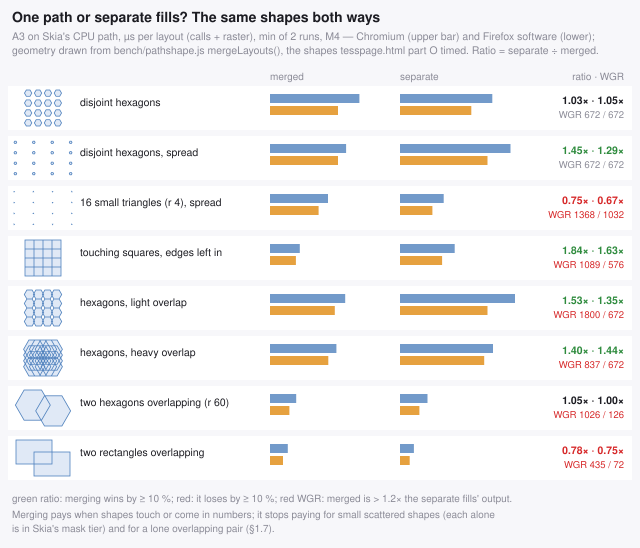

*The layouts drawn from the geometry part `O` timed, with the ratio of
separate fills to one path on each engine (green: merging wins by ≥ 10 %,
red: it loses) and WGR's output for both cuts (T74).*

**Where merging pays:**

- **Touching — polygons that share edges: always one fill, and cancel the
  shared edges.** One path is 1.6–1.8× cheaper than separate fills even with
  the shared edges left in, and separate fills show the conflation seam
  (§4.4) on every shared edge. Cancelled, another 3.3–8×. This is a mesh, and
  it is the batcher's whole reason to exist.
- **Many shapes, overlapping or not.** Sixteen hexagons merged are 1.3–1.5×
  cheaper spread over the whole canvas and 1.35–1.5× cheaper overlapping —
  merged, a covered pixel is painted once, and a large bounding box costs
  nothing by itself (Skia walks the rows edges occupy). Close together and
  disjoint it is a tie on the CPU; on a GPU the merged path wins (4.01 against
  5.50 µs on Graphite, 2.33 against 18.97 on accelerated Firefox, T60).

**Where it stops paying:**

- **Small scattered shapes.** Sixteen triangles of r 4 px spread over the
  canvas are **1.3–1.5× slower merged**: each alone fits Skia's mask tier (a
  bbox ≤ 32 px wide), merged they are one general-tier path, and that costs
  more than the fifteen `fill()` calls saved. It is the same effect that lets
  per-face beat welded on S3's CPU raster at high fragmentation (§4.12, T62).
- **A lone overlapping pair, no shared edge — keep two fills.** On the CPU it
  is a tie (hexagons 8.1 against 8.5 µs) or a loss (rectangles 5.5 against
  4.3, 1.28×): one saved call is too little to pay for the rows where the two
  outlines overlap. And WGR tessellates the pair **6–8×** larger merged (1 026
  against 126, 435 against 72), because every row of the overlap has two
  same-winding edges — so on accelerated Firefox it spends buffer too. The
  pair's *union outline* is the only join that does not cost: identical
  pixels, WGR 102, CPU equal to the merged path — but it needs a polygon
  boolean operation, whose cost is not measured here, and a 3D frame's
  overlaps change every frame. For static shapes compute it once; otherwise
  draw two fills.
- **Overlap on accelerated Firefox**, at any count: merged overlapping
  subpaths tessellate to 1.25–8× the separate fills' output. That matters only
  for a frame near its buffer (§1.11); a batcher's own batches almost never
  overlap themselves (T66).
- **Soup** — independent triangles with no shared edges: nothing merges but
  by accident, and batching loses outright, 36 ms per face against 47–71 ms
  batched (§6.5). `autoFallback` detects it from the frame's own counts
  (above).

What is not measured: part `O` on a GPU (M4 has none; its A2 column there is
the CPU again).

### 1.8 Why one configuration can be right everywhere

The two engines fail in opposite directions, and the same setting satisfies both
for the same underlying reason:

- **Firefox** ends up on a software scanline rasteriser for any animated canvas
  (§3.2), where cost is dominated by vertex count and by how far each path's
  edges spread across scanlines. Fewer vertices is monotonically better, so the
  most aggressive batching wins.
- **Chromium** keeps per-triangle fills on Skia's *convex* path renderer, which
  merges them into single GPU draws by itself. Merged multi-subpath paths are
  not convex and cost ~26× more GPU time per fill, so the cost curve is U-shaped:
  partial batching is worse than none, and only very aggressive batching wins.

Both therefore reward the *same* extreme — the fewest possible fills with the
fewest possible vertices — and punish the middle. A 2 px interior grid with edge
cancellation is the setting that reaches that extreme. The intermediate
configurations (bounding-box coverage, 8 px tiles, batching without edge
cancellation) are the ones that differ between engines, and they are exactly the
ones nobody should ship.

The general lesson, beyond this workload: **canvas2d engines all have a "simple
primitive" fast path and a "general path" slow path.** Stay entirely on one side
or the other. Straddling them is where the portability problems live.

---

### 1.9 Rules for overdraw

Overdraw is a fourth cost centre, and it does not behave like the three in
§1.1. What a hidden face costs you is **not its pixels** — an opaque
`source-over` fill is the cheapest blend that exists, which is exactly why
§6.9's front-to-back experiment failed. What it costs is **its vertices and its
fill call**, because it goes through the batcher like any other face. So
"reduce overdraw" in canvas2d means *submit fewer faces*, and the payoff lands
in the record and raster stages, not in fill rate.

- **Backface cull first, and check the sign.** It is the only overdraw lever
  that is exactly 50 % on a closed mesh and costs one cross product. Then
  verify you kept the sheet you meant to (§2): a sign error here is invisible
  in a still frame of a convex object and silently invalidates every
  hidden-surface measurement you make afterwards.
- **Then occlusion-cull with a coverage bitmask, near → far** (§4.9). No depth
  buffer and no depth values — the sort you already have *is* the depth test.
- **Cull once, spend it on every pass.** All passes of a multi-pass pipeline
  consume the same geometry, so one cull serves the fill pass, the shading pass
  and the fog pass alike.
- **Cull before you batch.** Afterwards there is nothing left to remove: the
  hidden faces have already been tessellated into a merged boundary.
- **Never cull a sub-pixel face.** A face that covers no sample point is small,
  not hidden. Dropping it punches a hole in a mergeable region and the boundary
  grows to go round it — measured on the sphere, dropping the 15.8 % of faces
  that own no pixel centre cut the face count 16 % and *raised* the emitted
  vertex count **16 %** (§6.11).
- **Know when it cannot pay.** A convex closed mesh has a single sheet and
  1.00× overdraw; the culler is pure loss there (1.57 ms for zero faces on a
  19 596-face sphere). Measure the cull rate and back off when it is low
  (§4.9) — the same self-tuning principle as `autoFallback` in §1.7.
- **Do not reach for a conservative occluder.** Eroding what you mark is the
  textbook rule and on a tessellated surface it destroys occluder fusion: the
  cull rate collapses from 73.6 % to 3.7 % (§6.10). Spend the fidelity budget
  on the adjacency skirt instead, which is both cheaper and better.

Then there is a **second, disjoint reason to drop a face**, and the coverage
buffer cannot see it: the value it writes is already there (§4.11). These rules
are for that, and they do not follow from the ones above.

- **Ask about foreign-class *presence*, not about coverage.** Coverage needs
  interiors (§4.2) and an order; presence needs a screen bbox and nothing else,
  so a mesh tessellated below tile size stops being a problem. One `Int32` per
  tile: `-1` empty, `c` uniform, `-2` mixed.
- **Make the dominant class the backdrop, and the drop becomes exact** — at any
  sample rate, not just the grid's. Pick it per frame by *area*, not by face
  count. It costs the two clears T42 saved you, which is nothing against
  thousands of vertices.
- **Only for a canvas whose background is yours.** The fill canvas's is pinned
  to fog colour by the halo fix (§4.10), so this is a fog-pass tool; a pass
  that owns no backdrop has to prove coverage instead, and that costs a
  rasterisation pass.
- **Drop whole classes and whole components — never scattered faces.** A drop
  costs the perimeter of the dropped set inside its batch (§4.3), so a whole
  class is free (its border was already a batch boundary), a whole mesh is free,
  and a scattered half of the same set measured **1.7–4.3× worse than dropping
  nothing**. If a predicate yields a scattered set, flood it over the adjacency
  array and keep the small components. Eroding the *drop* set is correct and is
  not §6.10's mistake, which eroded the *claim*.
- **Guard on two metrics, because there are two savings.** Faces dropped
  predicts the batcher's own walk; vertex reduction predicts the record and
  raster stages. On the sphere they disagree completely — 84.8 % of faces
  dropped for 0.97× vertices and a 22× cheaper batching — so a single
  `minRate` gets one of them wrong.
- **This is per pass, and that is the one place "cull once" stops applying.**
  Each pass keys on a different thing, so each gets its own survivor list. The
  occlusion cull is still shared.
- **It pays where the culler cannot.** A convex closed mesh has 1.00× overdraw
  and nothing to occlusion-cull, but a saturated fog band over it is wholly
  redundant: P1 returns **−11.2 ms** of CPU on the sphere, the scene §4.9 has
  to back away from.

### 1.10 Rules for a multi-pass 3D pipeline

A deferred canvas2d renderer — a fill pass, a shading pass multiplied over it,
a depth/fog pass composited on top — multiplies everything in §1.1 by the
number of passes, and adds one failure mode that dwarfs all of them.

- **Never read pixels back, in any pass.** This is the rule with the largest
  coefficient in the guide. On Firefox, `OnFallback()` has exactly one call
  site — a read of the canvas into Skia — and a single fallback fails the
  frame outright, before the cache-miss ratio is even consulted. Thirty per
  cent of failed frames demotes the canvas to software **permanently**, and
  §3.2 measures that as 6 ms accelerated against 18 ms software for the same
  batched workload. One `getImageData` a frame is enough to trigger it.
- **So fold post-processing into the palette, not into pixels.** If the fog
  pass wants its depth map inverted and tinted, do not draw a grey map and then
  invert and tint it — **choose the inverted, tinted shade when you emit the
  face.** It is a palette lookup, it costs nothing, and it deletes two
  full-canvas operations *and* whatever readback or exotic composite they
  needed. Generalise the move: anything you were going to do to a whole canvas
  afterwards, try to do to the 256-entry palette beforehand.
- **Check every composite op against the accelerated set.** Firefox's
  `DrawTargetWebgl::SupportsDrawOptions` accepts exactly `OP_OVER`,
  `OP_DEST_OVER`, `OP_ADD`, `OP_DEST_OUT`, `OP_ATOP`, `OP_SOURCE`, `OP_CLEAR`,
  `OP_MULTIPLY` and `OP_SCREEN`. So `multiply` and `screen` are safe and the
  usual shading composite is fine. `OP_IN`, `OP_OUT`, `OP_DEST_IN` and
  `OP_DEST_ATOP` come back as `UnboundedBlend`, and **everything else comes
  back `No`** — which takes `difference`, `overlay`, `hue`, `color-dodge` and
  the rest off the accelerated path. That includes anything you might reach for
  to invert a canvas, which is the second reason to invert in the palette.
- **`SupportsLayering` is `OP_OVER` only.** Do not wrap a `multiply` in a
  layer or a `globalAlpha` group: `mLayers` counts toward the same failure
  ratio that demotes the canvas.
- **One `drawImage` of a whole canvas per pass.** A full-canvas composite is a
  single draw and it is not where your time goes — measured, every op in the
  accepted set is at or below 0.073 ms full-canvas, and most are below the
  measurement floor (§5.6). Resist compositing per region; you would be
  trading one cheap draw for many.
- **Write one canvas at a time.** The MRT shape — one walk over the geometry
  that writes every target as it goes — is the intuitive one and it is a 1.23×
  loss on Chromium, because writing a *different* style to each target per draw
  stops the backend batching (§5.6). It wins 1.18× on a demoted Firefox canvas,
  which is the only genuine engine disagreement in this guide besides §4.5;
  ship sequential, because Chromium's penalty is unconditional and Firefox's
  gain only exists in the software regime. And keep the real lever in view:
  two canvases cost 1.8–1.9× one canvas whatever the ordering, so the question
  worth asking is whether you need the second one.
- **Fog is not a pass — where the albedo is flat.** Fold it into the palette
  and it costs zero canvas operations, collapses the albedo and shade passes
  into one, and comes out 2.02× faster than a composite chain on Firefox
  (§4.10). This is what every z-bufferless engine did (§9.8). A pattern-filled
  face cannot fold, so a textured pipeline keeps the chain for that part.
- **If you keep a fog chain, keep its invert.** Every arrangement that avoids
  it measured slower: 1.20× for two independent fog passes, 1.07× once they
  share a batching, 0.99× for the two-op minimum (§4.10). A full-canvas blend
  costs ~1 ms and a geometry pass ~13.6 ms, so trading one for the other is a
  hundred-to-one loss however unaccelerated the blend is. This is the one place
  in the guide where an op off Firefox's accepted list is the right choice.
- **Give each pass its own survivor list, and filter it before batching.** The
  occlusion cull is shared, but colour redundancy is not: each pass keys on a
  different thing, so each has a different set of faces that write a value
  already on the screen. One extra `Int32Array` and one linear pass per pass
  (§4.11). The passes are then allowed to disagree about which faces exist —
  the invariant is per-pass pixel identity, not agreement.
- **Budget the stage upstream of `record`.** §1.1's model starts at the first
  canvas call, and on a batched renderer the walk *before* it is bigger than
  everything the model prices: 7.3 ms of batching and boundary extraction
  against 0.075 ms of predicted record time, on the same 20 701 faces (§4.11).
  Anything that shortens the face list is worth more than the vertex arithmetic
  suggests, and you cannot see it without a timer of its own (A8).
- **Know what fraction you are optimising.** Fog is 15 % of the frame and its
  *composites* are 1.2 % (§4.10). Decompose before reaching for CSS blend
  modes, a WebGL composite, or a chroma-key trick — all three are bounded by
  that 1.2 %.
- **Keep the geometry fills opaque.** Beyond §1.6's reasons, an opaque draw is
  the only kind Graphite can reorder against its depth buffer (§3.3).
- **Budget per pass, and measure the whole chain.** A single-pass benchmark
  will rank the engines differently from your real frame, because the passes
  are the part that multiplies — and on a demoted Firefox canvas they multiply
  on the CPU, competing with your JS inside the same 16.7 ms. "CPU is cheap" is
  a Chromium-shaped belief: there, 8.9 ms of a 53.8 ms torus-knot frame is
  yours to spend (§5.1), whereas on Firefox after demotion `cpu == perDraw`
  and there is no hidden budget at all.

### 1.11 Rules for the acceleration cliff

Firefox's accelerated canvas2d backend is not a smooth gradient you optimise
along. It is a **cliff with a budget on one side of it**, and which side you are
on decides what every other measurement means. §3.2 has the source and the
numbers; these are the operating rules.

1. **Read the verdict, do not infer it.** `gfx.canvas.accelerated.debug = true`
   in `about:config` puts a 16×16 green square in the top-right corner of every
   canvas that is still accelerated. Keep a Firefox profile with that pref on
   and look at it before believing anything else in this list. Inferring
   acceleration from a step in a time series is how this guide got §3.2 partly
   wrong for a while.

2. **Budget tessellated output per frame, not fills — path vertices are only
   its proxy.** Measured on Firefox 155: a canvas stays accelerated at 9 192
   path vertices per frame and is demoted at 12 761, and the same threshold
   catches 5 000 three-vertex triangles (15 000 verts, demoted) while letting
   3 000 through (9 000 verts). Fill count is not the variable. But neither,
   exactly, are path vertices: what fills `gpu-path-size` is Firefox's
   tessellated output, at 1–32 tessellated vertices per path vertex depending
   on the cut, and counting *that* — once per distinct shape, because Gecko's
   cache keys a path relative to its own origin (`bench/wgr.mjs`'s
   `uniqBufferVerts`, A9) — predicts the verdict of a still frame 147 times
   out of 147 on two machines; `bench/ffcache.mjs` runs Gecko's cache and
   usage profile frame by frame and extends it to moving frames, 98 of 99
   (§3.5, T68).

3. **The budget is shared across all your canvases; the verdict is not.** The
   path vertex buffer and the path cache live on the one global
   `SharedContextWebgl`; the usage profile lives on `DrawTargetWebgl`. So a
   deferred pipeline's fill, shade and fog passes spend one budget between
   them, and splitting a pass across canvases buys nothing: measured, 21 024
   vertices spread over four canvases demotes all four, each drawing half of
   what a single canvas sustains (§3.2). **Budget the frame, not the canvas.**

4. **Seam stroking doubles the vertex count** (35 096 → 71 622 on S1), and in
   tessellated output it costs **0.6–4.4× the fills' own** (§6.16). Repairing
   the seam is a fidelity constraint, not an optimisation — but it does not
   have to be a stroke: the in-line band adds 4–13 % instead (§4.12). Near the
   cliff, move the repair into the fill before you cut anything else.

5. **Occlusion culling is the lever that moves this number.** §4.9 removes
   28–75 % of path vertices, which is the difference between the two sides of
   the cliff for a scene of this size. On Firefox it is worth more than its
   −1.6 ms of CPU suggests.

6. **Keep everything off the accepted composite list on its own canvas.**
   `difference`, `ctx.filter`, `getImageData` and any readback set
   `mFallbacks`, which fails a frame outright. That poisons **only** the canvas
   it happens on (measured, §3.2), so a scratch canvas keeps the poison local.
   The geometry canvas stays accelerated; the scratch canvas does not, and does
   not need to.

7. **Assume demotion is permanent.** Stopping the offending operation does not
   restore acceleration, and neither does `canvas.width = canvas.width` —
   `mAllowAcceleration` lives on the context and survives a resize. A **new
   `<canvas>` element** is the only reset.

8. **Open every frame with a full-canvas opaque `fillRect` or a
   `clearRect`.** It is not only a clear: it is the signal that lets Gecko
   discard the previous frame instead of preserving it. It only counts when the
   pattern is opaque, the op is `source-over` or `copy`, the transformed rect
   covers the whole canvas, and **no clip is active** — a clip left over from
   the previous pass is enough to lose it (§3.2).

9. **Do not "fix" the cliff by turning the heuristic off.** Measured with
   `profile-frames = 0`, a canvas held past the cliff can be *worse* than the
   demoted one: 5 000 small triangles cost 5.8 ms demoted and **17.2 ms**
   accelerated-but-thrashing, because every frame re-tessellates and re-uploads
   a cache that is wiped every frame. On the batched scene the same pref goes
   the other way (21.1 ms against 30.0 ms). M6 reproduces both signs on a
   different GPU (T70): forced past the buffer, every large frame loses —
   1.2–1.4× welded, 3.8–4.8× per face — while a frame only 1.85× over it
   still wins by 1.4×. And what the heuristic *keeps* accelerated — a still
   frame that fits — beats software there by 3.3–6.1× on the canvas side. The
   pref is an instrument for finding out which of the two you are in, not a
   setting to ship — and your users do not have it set anyway.

10. **None of this exists on Chromium.** The same scenes show no step, no
    cliff and no demotion there (§3.2's controls). Do not write a browser
    branch for it: everything in this list is either free on Chromium (rules 6,
    8), or something Chromium also rewards (rules 2, 4, 5).

11. **The green square answers "accelerated?", not "faster?".** The budget
    counts distinct shapes (rule 2), so thousands of small or repeated fills
    fit it and stay accelerated — and Gecko's accelerated path costs ~1.2 µs of
    main thread per `fill()` on M6 against software's ~0.3. Measured, 20 000
    small separate triangles run **3.3–4.4× slower accelerated than demoted**,
    and raising `gpu-path-size` to 8 made a load that had demoted stay
    accelerated at 3.7× the software cost (T68, §6.17). Batching is the fix —
    a batch is one `fill()` — and timing the software profile
    (`gfx.canvas.accelerated = false`) is the check.

#### The audit, when a Firefox frame is slower than it should be

Twenty minutes, four Firefox profiles, and it terminates in a decision rather
than a hypothesis. Each step says what its answer rules out.

1. **Are you accelerated at all?** Run with
   `gfx.canvas.accelerated.debug = true` and look for the green square on each
   of your canvases. If they are all green under your real workload, stop —
   the acceleration story is not your problem and the rest of this audit is
   noise.
2. **When did you lose it?** Watch the square over the first thirty frames. The
   frame it disappears on tells you which pass to look at: `RequiresRefresh()`
   is evaluated cumulatively from frame 10, so a disappearance at ~10 means the
   very first frames failed and a later one means something drifted.
3. **Would it have been faster accelerated?** Re-run with
   `gfx.canvas.accelerated.profile-frames = 0`. You now have both numbers for
   the same frame on the same machine — and note that the answer is genuinely
   sometimes *no* (§1.11 rule 9). If accelerated is not faster, you are done:
   optimise the software path (§1.1's raster coefficients) and stop trying to
   stay accelerated.
4. **Which limit is binding?** Re-run with
   `profile-cache-miss-ratio = 1.1`. Still demoted ⇒ your frames contain a real
   software fallback; go to step 5. Now accelerated ⇒ it is the miss ratio, so
   your paths are novel every frame and the lever is making them repeat (a
   static camera, a cached background layer) or reducing their number.
5. **Is it the vertex buffer?** Re-run with `gpu-path-size = 64`. Accelerated
   now ⇒ you are over the per-frame tessellation budget; count your frame's
   tessellated output per distinct shape with `bench/wgr.mjs`, and feed a few
   consecutive frames to `bench/ffcache.mjs` to see whether the motion itself
   demotes it (§3.5, T68), then cut — §4.9's culler first (28–75 % of vertices), the
   seam stroke second (§6.16) — and re-check. Still demoted ⇒ you have
   an op or a readback that falls back every frame: grep your pipeline for
   `getImageData`, `toDataURL`, `ctx.filter`, self-`drawImage`, and any
   composite op outside the accepted list, and move each one to a scratch
   canvas (rule 6).
6. **Fix it, then re-run step 1** — on a *fresh* canvas. A canvas that was
   demoted during the debugging session stays demoted (rule 7), so a fix
   verified on the same page load will look like it did not work.

The one thing not to do with these prefs is ship advice about them. They are
diagnostic instruments; your users have the defaults.

### 1.12 Rules for textures and images

These are all-rounder rules. Each is the best measured choice with no browser
check, or within 1.8× of the best on the one engine where it is not first
(§4.13, §4.14).

1. **Decode before the frame.** `await createImageBitmap(blob)` at load, for
   every image. A raw `` decodes inside its first draw, 16.6–137 ms of
   main thread on every engine measured. `img.decode()` does not prevent that
   on Chromium (§6.18).
2. **Then draw each bitmap once into a canvas** (`alpha: false` if the art is
   opaque) and keep the canvas as the source. For patterns a canvas is never
   the slower source, and on Chrome's GPU canvas a 512² pattern from an
   `` or bitmap ran at CPU raster cost, 4.4–67× the canvas's. For
   `drawImage` it avoids Chrome's 2.8–4.1× whole-`` cost. It is 1.37–1.46×
   dearer than an `` only for Safari's sprites (§1.13).
3. **Textured 3D faces: a `'repeat'` pattern, the UV → screen map on the
   context, the path in texel space** (§4.7, §4.14). It ties with the best
   recipe on Chrome, wins by ≥ 39× on Firefox's accelerated profile and
   1.39–1.60× in software, and costs 1.11–1.40× on Safari (1.23–1.80× at one
   texture per face). It is also an
   ordinary `fill()`, so batching, edge cancellation and seam repair apply to
   textured faces unchanged.
4. **Merge coplanar faces under one affine map while an ε-pixel fit allows**
   (§4.7). A quad's two triangles as one fill is 2.8–4.1× faster and more
   accurate.
5. **Sprites: `drawImage(src, sx,sy,w,h, dx,dy,w,h)`, never a pattern.** A
   sprite has no clip for a pattern to remove, and the pattern costs 5.9–6.9×
   on Chrome's GPU canvas and 108–169× on Safari (§4.13, §6.19).
6. **Never tile with one `drawImage` per repetition**: 7.8–17.0× at 4 × 4
   (§6.19).
7. **Pad every atlas** whose cells are drawn rotated or scaled: extrude each
   cell's border texels into a gutter of at least 1 px at the largest scale.
   Most samplers bleed the neighbouring cell with either recipe (§4.13).
8. **Keep sources and targets on the same side.** Never use a GPU canvas as
   the source of a pattern drawn into a `willReadFrequently` one: that is a
   readback per draw, 725–934 ms a frame measured on M6 (§4.13).

### 1.13 Per-browser tuning, only after the all-rounder

Everything in §1.1–§1.12 is one configuration for every engine. This section
is the other set. Each item wins on one engine, and costs nothing or loses
elsewhere. Take one only when that engine matters to you, and **choose it at
runtime by timing both paths on a few real frames at startup** (§1.7), never
from the user-agent string. A measured switch stays right when an engine
changes. A UA branch goes stale silently.

| engine | override | what it buys there | what it costs elsewhere |
|---|---|---|---|
| **Safari** | tiled materials as `clip` + a canvas pre-tiled at load instead of a `'repeat'` pattern | 1.11–1.80× (§4.14); the two draw measurably different pictures there (RMSE 11) | a tie on Chrome, ≥ 39× on accelerated Firefox |
| **Safari** | `drawImage` sprites from the decoded `` instead of its canvas | 1.37–1.46× (§4.13) | 2.8–4.1× for scaled whole-image draws on Chrome |
| **Safari** | triangles: nothing to switch; `clip` + `drawImage` and the pattern tie (§4.7) | — | — |
| **Firefox** | keep a canvas under the tessellated-output budget, or accept software on purpose: the rules of §1.11 | the accelerated backend at all (§3.2) | nothing: they are true reductions of work |
| **Firefox** | many small separate fills: let the canvas demote rather than fight it | 3.3–4.4× on a real GPU (§6.17) | n/a, Firefox-only behaviour |
| **Firefox** | opaque sources (JPEG, or an `alpha: false` canvas) | 1.5–1.6× on the software path (§4.13) | nothing: rule 1.12.2 already gives this |
| **Chromium** | none beyond the all-rounder: `closePath()` omission and all-the-way batching (§0 rules 4–5) are already in it, and cost nothing elsewhere | — | — |

Two things this table does not do. It never tells you to drop an all-rounder
rule for a per-engine one: every override above replaces one choice *inside*
a rule and keeps the rest. And it covers the engines measured here, Blink
(Ganesh on M1, Graphite on M6), Gecko and WebKit on one machine each. Any
override comes from fewer runs than the rule it replaces, and §10.5 says how
many.

---

## 2. Measuring canvas2d without lying to yourself

*Registry: T03, T33 — fixture and extrapolation scope in §10.5.*

`ctx.fill()` does not rasterise. It appends to a display list.

```js
const t0 = performance.now();
for (...) { ctx.beginPath(); ...; ctx.fill(); }
const cost = performance.now() - t0;   // <-- NOT the drawing cost
```

That measures *recording*: IDL glue, path building, display-list append.
Rasterisation happens later, on the GPU or a raster thread, and never appears.
How wrong can it be? Chromium, sphere scene:

| strategy | `performance.now()` says | actually costs | invisible |
|---|--:|--:|--:|
| per-triangle baseline | 45.7 ms | 69.2 ms | 23.5 ms |
| gridBBox t8 + edge-cancel | 9.0 ms | **129.2 ms** | **120.2 ms** |
| gridExact t2 + edge-cancel | 4.2 ms | 8.5 ms | 4.3 ms |

The middle row records 5× faster than the baseline and runs 1.9× **slower**.
Optimising against `performance.now()` alone leads straight to it.

So `bench/` measures three axes:

| axis | how | what it tells you |
|---|---|---|
| **record** | tight loop, GPU canvas, no flush | JS + engine API overhead; what you control directly |
| **sustained** | rAF, N draws per callback, total wall time ÷ (frames × N) | end-to-end including GPU — the honest number |
| **raster** | `willReadFrequently` canvas (forces Skia CPU) + 1 px `getImageData` | pure software rasterisation; also the proxy for Firefox after demotion |

Traps in the sustained measurement, all of which bit during this work:

- **rAF is vsync-locked.** A strategy cheaper than a frame just measures
  16.7 ms. Issue N draws per callback, N sized so the callback is far above one
  vsync (the harness targets ≥ 50 ms of CPU per callback).
- **Chromium pipelines deeply.** Intervals alternate one vsync / several
  (measured: `17 150 17 17 284 150 17 17 233 …`). The *median* interval is
  meaningless — use total elapsed ÷ frame count.
- **An occluded or hidden window throttles rAF to nothing** and will hang the
  run. Watchdog it.
- **Two page instances.** Chromium opened the start URL twice at one point and
  silently halved every number. The fix is a heart-beating single-instance
  lease from the local server (§8.6).
- **Orphaned browsers.** A killed runner leaves detached browsers still
  benchmarking in the background, stealing CPU from the next run.
- **`perDraw − cpu ≈ 0` is a red flag, not a result.** If a case with hundreds
  of non-convex fills reports no hidden GPU time, the harness has stopped
  capturing the GPU. That reading made `destination-over` look 1.6× faster than
  `source-over` on Chromium; forcing completion showed it 1.75× slower (§6.9).
  Always cross-check a surprising win against a canvas that must finish.

#### Stop guessing which regime you are in: Firefox will tell you

Half the confusing measurements in this guide came from not knowing whether a
Firefox canvas was accelerated at the time. Two `about:config` prefs remove the
guesswork, and they are the highest-value tools in this section.

| pref | set it to | what you get |
|---|---|---|
| `gfx.canvas.accelerated.debug` | `true` | a 16×16 **green square** in the top-right corner of every canvas that is still accelerated, redrawn every frame (§3.2) |
| `gfx.canvas.accelerated.profile-frames` | `0` | `RequiresRefresh()` always returns false, so **no canvas is ever demoted** |

Use them as a pair. The first says *which side of the cliff you are on*; the
second says *what the frame would have cost on the other side*, on the same
build, the same scene and the same machine — which is a comparison you cannot
otherwise make, because you cannot ask a demoted canvas to come back (§3.2).

Two more, for bisecting *why* a canvas demoted rather than *whether*:

| pref | set it to | isolates |
|---|---|---|
| `gfx.canvas.accelerated.profile-cache-miss-ratio` | `1.1` | the ratio test can never fail, so anything that still demotes is a **software fallback** (`mFallbacks`) |
| `gfx.canvas.accelerated.gpu-path-size` | `64` | 16× the path vertex buffer, so anything that stops demoting was **vertex-buffer pressure** |

`bench/run.js` ships these as profiles — `firefox-dbg`, `firefox-nodemote`,
`firefox-noratio`, `firefox-bigbuf`, `firefox-nocap`, `firefox-fastdemote` —
because a Firefox pref experiment needs a throwaway profile directory anyway,
and running the same page under four of them is how §3.2's cause was found.

**And a warning that follows from the same place:** a demoted canvas is not
just slower, it changes what your other measurements mean. Any Firefox number
taken on a canvas that draws animated geometry is a *software rasteriser*
number (§10.1), and a change that looks like a 1.3× win there may be a 1.3×
loss on the accelerated path — or may only be a win because it pushed you back
over the cliff. State which regime a number came from, every time.

And one trap in the correctness measurement: **do not validate against the
per-triangle baseline** — the baseline is itself wrong at every shared edge
(§4.4). Validate against a supersampled render.

And one trap in the geometry underneath all of it, which produced every scene
in this guide before it was caught: **check which sheet of the mesh you are
actually drawing.** The harness here kept `area > 0` in screen space, and with
the winding its mesh generators emit, that is the **far** sheet of every closed
mesh. Two independent checks agree: a 64×32 sphere keeps 2 753
faces of mean view-z 3.376 and drops 1 343 of mean 2.535 — and under
perspective you see *less* than a hemisphere, so 1 343 is the front-facing
count.

A sphere looks identical either way, which is exactly why it survived so long,
and fill/vertex/timing conclusions are unaffected — it is the same size and
topology of triangle soup, sorted correctly. What it changes is anything to do
with **self-occlusion**: on the corrected sheet the torus knot's occlusion
headroom is 73.1 % of submitted faces, not 55.3 % (§5.5). The lesson
generalises past this particular bug. If you are measuring hidden-surface
anything, assert that the surviving set is the near one, because no still frame
of a convex object will ever tell you.

---

## 3. What the engines actually do

### 3.1 Chromium / Skia (Ganesh)

*Registry: T04 — fixture and extrapolation scope in §10.5.*

A filled path is offered to a chain of renderers in order
(`src/gpu/ganesh/PathRendererChain.cpp`):

```
DashLine → AAConvex → AAHairline → AALinearizingConvex → Atlas
         → Small → Triangulating → Tessellation → Default
```

- **A single triangle is convex**, so per-triangle fills land on
  `AAConvexPathRenderer` / `AALinearizingConvexPathRenderer`. Both ops merge:

  ```cpp
  // AAConvexPathOp::onCombineIfPossible / AAFlatteningConvexPathOp::onCombineIfPossible
  fPaths.push_back_n(that->fPaths.size(), that->fPaths.begin());
  fWideColor |= that->fWideColor;
  return CombineResult::kMerged;
  ```

  Colour is per-path and rides along as a vertex attribute
  (`VertexColor(args.fColor, fWideColor)`). **Skia already batches your
  per-triangle fills into single GPU draws, across different colours.** That is
  why the naive baseline is not catastrophic on Chromium, and why merging in JS
  can lose: you take the paths off that fast path.

  Measured GPU cost per fill: **~0.56 µs** for convex triangle fills versus
  **~14.5 µs + 0.45 µs/vertex** for merged non-convex paths (fitted from the
  sphere series in §5.1). Roughly 26× per fill.

- Skia's merging is bounded: `src/gpu/ganesh/ops/OpsTask.cpp` has
  `kMaxOpMergeDistance = 10` and `kMaxOpChainDistance = 10` — look back at most
  10 ops, stop at the first whose bounds intersect. That is exactly the
  algorithm in §4.1, with a fixed tiny window. Godot's 2D batcher does the same
  with a default lookahead of 4. The occupancy grid is that idea with an
  unbounded window and an O(1) test.

- **A merged multi-subpath path is not convex.** It needs `AtlasPathRenderer`
  (only if bbox height ≤ 256, width ≤ 1024, area ≤ 256² —
  `AtlasPathRenderer.cpp`) or `TessellationPathRenderer`.
  `TriangulatingPathRenderer` is unavailable for canvas2d's coverage AA above
  **10 verbs** (`GR_AA_TESSELLATOR_MAX_VERB_COUNT = 10`) and never above
  `PathRenderer::kMaxGPUPathRendererVerbs = 1 << 14`.

- `TessellationPathRenderer` is stencil-then-cover, so **self-intersection is
  free on the GPU** — winding resolved in the stencil buffer. "Tangled paths are
  slow" is false on Chromium's GPU path and very true on any software path
  (§6.3).

### 3.2 Firefox / Gecko — the demotion cliff

*Registry: T05 — fixture and extrapolation scope in §10.5.*

Firefox 155 ships `gfx.canvas.accelerated = true`. The accelerated backend is
`DrawTargetWebgl` (`dom/canvas/DrawTargetWebgl.cpp`), which tessellates paths
with **WGR** (`wpf-gpu-raster`, a Rust port of WPF's GPU rasteriser) into a
vertex buffer and caches the result keyed on a quantised copy of the path:

```cpp
// DrawPathAccel: quantise the path origin to 1/4 px to increase cache reuse
bounds.Scale(4.0f); bounds.Round(); bounds.Scale(0.25f);
...
entry = mPathCache->FindOrInsertEntry(std::move(*qp), ...);
```

Hard limits, from `modules/libpref/init/StaticPrefList.yaml`:

| pref | default | meaning |
|---|--:|---|
| `gfx.canvas.accelerated.gpu-path-complexity` | 4000 | max path verbs (`num_types`) for WGR GPU tessellation |
| `gfx.canvas.accelerated.gpu-path-size` | 4 (MB) | WGR output vertex buffer; overflow orphans it |
| `gfx.canvas.accelerated.cache-items` | 8192 | path cache entries |
| `gfx.canvas.accelerated.cache-size` | 256 (MB) | path cache bytes |
| `gfx.canvas.accelerated.profile-frames` | 10 | frames before the usage verdict |
| `gfx.canvas.accelerated.profile-cache-miss-ratio` | 0.66 | miss ratio that marks a frame "failed" |
| `gfx.canvas.accelerated.profile-fallback-ratio` | 0.3 | failed-frame ratio that gives up |

A triangle subpath is 4 verbs, so **~1000 triangles per `fill()`** is the
ceiling before the accelerated path declines the work.

Now the part that dominates everything else:

```cpp
void DrawTargetWebgl::UsageProfile::EndFrame() {
  bool failed = false;
  float cacheRatio = StaticPrefs::gfx_canvas_accelerated_profile_cache_miss_ratio(); // 0.66
  if (mFallbacks > 0 ||
      float(mCacheMisses + mReadbacks + mLayers) >
          cacheRatio * float(mCacheMisses + mCacheHits + mUncachedDraws +
                             mReadbacks + mLayers)) {
    failed = true;
  }
  if (failed) ++mFailedFrames;
  ++mFrameCount;
}

bool DrawTargetWebgl::UsageProfile::RequiresRefresh() const {
  uint32_t profileFrames = StaticPrefs::gfx_canvas_accelerated_profile_frames();   // 10
  if (!profileFrames || mFrameCount < profileFrames) return false;
  float failRatio = StaticPrefs::gfx_canvas_accelerated_profile_fallback_ratio();  // 0.3
  return mFailedFrames > failRatio * mFrameCount;
}
```

and `CanvasRenderingContext2D.cpp` acts on it, permanently:

```cpp
if (mBufferProvider && mBufferProvider->IsAccelerated() &&
    mBufferProvider->RequiresRefresh()) {
  // If there is already a provider and we got here, then the provider needs
  // to be refreshed and we should avoid using acceleration in the future.
  mAllowAcceleration = false;
}
```

The load-bearing detail: **a successful WGR tessellation still counts as a cache
miss.** In `DrawWGRPath`, the branch that uploads fresh vertex data calls
`mCurrentTarget->mProfile.OnCacheMiss()`. `OnCacheHit()` fires only when the
entry already had a valid vertex range; `OnUncachedDraw()` only for solid-colour
draws that use no vertex range at all (`fillRect`).

For animated 3D geometry every path is new every frame, so the miss ratio is
≈ 1.0, every frame "fails", and after 10 frames acceleration is switched off for
that canvas for good. This is not a bug — it is Firefox concluding your workload
is not worth accelerating.

*That is true, and it turns out not to be the binding constraint.* A scene held
completely still — every path identical every frame, so the cache hits perfectly
— is demoted too, and for a different reason. "What actually demoted it,
bisected with `about:config`" below has it; read this paragraph as one of two
mechanisms rather than as the mechanism.

#### The demotion, measured

90 frames into a **fresh** canvas, JS ms per frame, Firefox 155, sphere scene.

Per-triangle baseline (41 218 fills/frame):

```
frame:   1   2   3    4    5    6    7    8    9   10   11   12   13   14   15 ...
cpu ms: 20  20  92  128  123  120  121  124  117  125  124  124  123   35   30 ...
```

Batched, `gridExact t4 + edge-cancel` (940 fills/frame):

```
frame:   1   2   3   4   5   6 ... 17  18  19  20  21  22  23  24  25 ...
cpu ms:  7   7   7   6  11   7 ...  5   6   6  19  19  18  19  18  17 ...
```

Three things are visible:

1. The step at frame ~13 / ~20 is `RequiresRefresh()` firing. After it the
   canvas is on Skia software and stays there.
2. While accelerated, the **baseline is 4× slower than software** (123 ms vs
   ~30 ms). 41 218 novel paths per frame against an 8192-entry cache is pure
   thrash: quantise, hash, insert, tessellate, upload, evict.
3. While accelerated, the **batched version is 3× faster than software**
   (6 ms vs 18 ms). At ~1000 paths per frame the machinery works.

So batching is not just a throughput optimisation on Firefox — it decides
whether the accelerated backend can serve the workload at all.

**Caveat on the 4000-verb rule:** I could not observe that cliff in a sustained
benchmark (the `batch: 12000 tris, N/fill` sweep shows no discontinuity around
N = 1000), *because the canvas had already been demoted to software, where the
limit is irrelevant*. Keep the cap anyway: it is nearly free, and it matters for
canvases redrawn occasionally rather than every frame, which stay accelerated.
Just don't expect a benchmark to show it.

#### One fallback outranks the miss ratio

`mFallbacks > 0` short-circuits the entire test:

```cpp
if (mFallbacks > 0 ||
    float(mCacheMisses + mReadbacks + mLayers) > cacheRatio * float(...)) {
  failed = true;
}
```

and in `DrawTargetWebgl.cpp` there is exactly **one** place that increments it:

```cpp
void DrawTargetWebgl::MarkSkiaChanged(...) {
  if (!mSkiaValid) {
    if (ReadIntoSkia()) {
      mProfile.OnFallback();
    }
  }
  ...
}
```

So anything that pulls the canvas back into Skia — a `getImageData`, a
`toDataURL`, a self-`drawImage`, an unsupported composite op or filter — fails
**every frame it happens in**, no matter how good your paths are, and thirty per
cent of those is permanent demotion. That promotes §1.3's "do not read back"
from hygiene to the single highest-leverage rule for a multi-pass renderer
(§1.10). It is also the mechanism by which a well-batched engine can still end
up on the software rasteriser and leave you concluding that Firefox is simply
slow.

#### The arithmetic of the ratio, for the case with no fallbacks

With no readbacks and no layers the test reduces to
`misses > 0.66 × (misses + hits + uncachedDraws)`, so the frame **passes** when

```
hits + uncachedDraws  >  0.515 × misses
```

`OnUncachedDraw()` fires for solid-colour draws that use no vertex range —
`fillRect`. So on paper, roughly **one `fillRect` per two novel paths keeps the
canvas accelerated**, and the trace above puts accelerated batched at 6 ms
against 18 ms software. At ~250 fills a frame that is ~130 one-pixel rects.

Say plainly what that is: gaming a heuristic whose job is to detect workloads
acceleration cannot serve — in a case where the measurement says acceleration
serves this one 3× *better*, so the heuristic is misfiring rather than being
wrong. It is arithmetic from the source, **not measured**, and it is precisely
the kind of thing that changes between versions. Treat it as an experiment
worth running, not a rule to ship.

**And it does not work on a batched canvas, for a reason discovered after this
paragraph was written.** T39 below shows that a batched canvas fails its frames
on `mFallbacks`, which short-circuits the ratio before any amount of
`fillRect` dilution is consulted. Diluting the ratio can only help a canvas
whose frames are failing *on the ratio* — which, on the evidence below, is
mostly canvases drawing many small novel paths rather than batched geometry.

#### Stop inferring the verdict from a timing step: read it

*Registry: T38 — fixture and extrapolation scope in §10.5.*

Everything above was inferred from a step in a time series, which is a weak
instrument: a step can be thermal, a GC, or the scene. Gecko will just tell
you. `DrawTargetWebgl::EndFrame`:

```cpp
void DrawTargetWebgl::EndFrame() {
  if (StaticPrefs::gfx_canvas_accelerated_debug()) {
    // Draw a green rectangle in the upper right corner to indicate
    // acceleration.
    IntRect corner = IntRect(mSize.width - 16, 0, 16, 16).Intersect(GetRect());
    DrawRect(Rect(corner), ColorPattern(DeviceColor(0.0f, 1.0f, 0.0f, 1.0f)), ...);
  }
  mProfile.EndFrame();
  ...
```

Set `gfx.canvas.accelerated.debug` to `true` in `about:config` and **every
canvas that is still accelerated wears a 16×16 green square in its top-right
corner**, redrawn every frame, per canvas. It disappears on the frame the
canvas is demoted.

It is machine-readable too, which is what `bench/isopage.html` does: `drawImage`
that corner into a small `willReadFrequently` canvas and look at the pixels.
Do it *after* the case you are measuring, never during — reading a canvas is
itself a fallback (§6.13) — and check it against a control canvas that only
`fillRect`s, so "no green" cannot silently mean "the pref is off".

Everything below this line is read from that square rather than inferred from a
step, and two of the results contradict what the step-based reasoning above
would have predicted.

#### Demotion is per canvas, and it is permanent

`UsageProfile mProfile` is a member of **`DrawTargetWebgl`** — one profile per
canvas. The verdict is recorded on the *context*:

```cpp
// CanvasRenderingContext2D.cpp
if (mBufferProvider && mBufferProvider->IsAccelerated() &&
    mBufferProvider->RequiresRefresh()) {
  // If there is already a provider and we got here, then the provider needs
  // to be refreshed and we should avoid using acceleration in the future.
  mAllowAcceleration = false;
}
```

`mAllowAcceleration` is a member of `CanvasRenderingContext2D`. Search the tree
for writes to it: there is **one**, and it writes `false`. Nothing ever writes
`true`.

Measured with the indicator — a scene small enough to stay accelerated on its
own (S13, ~800 visible faces), held still so every path hits the path cache,
90 frames, one `difference` + white `fillRect` per frame where the arrangement
calls for it:

| arrangement | geometry canvas | scratch canvas |
|---|---|---|
| geometry only | **ACCEL** | — |
| geometry **and** the `difference`, same canvas | **soft** | — |
| geometry; the `difference` on a **scratch** canvas | **ACCEL** | soft |
| `difference` for the first 20 frames only, then stop | **soft** | — |
| `difference`, then `canvas.width = canvas.width` at frame 30 | **soft** | — |

Row by row:

- **It does not spread.** The op poisons the canvas it runs on and no other.
  Moving the unsupported op to a scratch canvas leaves the geometry canvas
  accelerated. §6.13 arrived at that rule from a cost argument; this is the
  same rule read directly off the indicator, and it is the stronger reason.
- **It does not lift.** Stopping the op does not bring acceleration back, and
  neither does reallocating the backing store. §1.6's "resizing the canvas is a
  free way to clear it" stays true about *pixels* and is false about
  *acceleration*: `canvas.width = w` reallocates the buffer provider, but
  `mAllowAcceleration` lives on the context object, which survives the resize.
- So the only way back is **a new `<canvas>` element**. That is a usable
  recovery strategy, and a standing argument for keeping the canvas that must
  stay fast free of everything that could poison it.

#### What actually demoted it, bisected with `about:config`

*Registry: T39 — fixture and extrapolation scope in §10.5.*

Now the result that reorders this section. Take a scene that **cannot** be
failing on novel paths — S1 held completely still, so every path is identical
every frame and the path cache must hit — batch it normally, and watch the
indicator.

It demotes anyway.

The prefs in the table at the top of §3.2 are the instrument for finding out
why. Each row is a throwaway Firefox profile running the same page, geometry
held still, 80 frames:

| profile | what it changes | 400 small triangles | batched, 244 fills / 35 096 verts |
|---|---|---|---|
| default | — | ACCEL | **soft** |
| `profile-frames = 0` | `RequiresRefresh()` always false | ACCEL | ACCEL *(by construction)* |
| `profile-cache-miss-ratio = 1.1` | the ratio test can never fail; only `mFallbacks > 0` can | ACCEL | **soft** |
| `gpu-path-complexity = 1000000` | no per-path verb ceiling | ACCEL | **soft** |
| `gpu-path-size = 64` (MB) | 16× the path **vertex buffer** | ACCEL | **ACCEL** |

Two readings, both against expectation:

1. **It is not the cache-miss ratio.** With the ratio test made unsatisfiable
   the canvas still demotes, so its frames are failing on `mFallbacks > 0` — a
   *complete software fallback*, the same short-circuit a `getImageData` takes.
2. **It is not the 4000-verb complexity cap either.** Removing it changes
   nothing — unsurprising once you look, since the largest path in this
   configuration is 307 verbs, a thirteenth of the cap.

**It is `gfx.canvas.accelerated.gpu-path-size`: the path vertex buffer.** And
it behaves like a cliff rather than a slope because that buffer is a bump
allocator whose overflow *wipes the cache*:

```cpp
// SharedContextWebgl::DrawWGRPath
if (vertexBytes > mPathVertexCapacity - mPathVertexOffset &&
    vertexBytes <= mPathVertexCapacity - sizeof(kRectVertexData)) {
  // If the vertex data is too large to fit in the remaining path vertex
  // buffer, then orphan the contents of the vertex buffer to make room for it.
  if (mPathCache) {
    mPathCache->ClearVertexRanges();
  }
  ResetPathVertexBuffer();
}
```

```cpp
// Search the path cache for any entries stored in the path vertex buffer and
// remove them.
void PathCache::ClearVertexRanges() {
  ... if (entry->GetVertexRange().IsValid()) entry->Unlink(); ...
}
```

The moment one frame's tessellated output does not fit in what is left of the
4 MB, **every cached tessellation is unlinked** and the buffer restarts. Next
frame everything misses, re-tessellates, wraps again, and the canvas never
leaves that state. The path cache is not degraded gradually; it is switched off.

**And the buffer is shared, while the verdict is not.** `mPathVertexBuffer`,
`mPathVertexCapacity`, `mPathVertexOffset` and `mPathCache` are members of
`SharedContextWebgl`; `mProfile` is a member of `DrawTargetWebgl`. And there is
exactly one `SharedContextWebgl`:

```cpp
// CanvasTranslator.cpp
StaticRefPtr<gfx::SharedContextWebgl> CanvasTranslator::sSharedContext;
...
    // Check if the global shared context is still valid. If not, instantiate
    // a new one before we try to use it.
    if (!sSharedContext || sSharedContext->IsContextLost()) {
      sSharedContext = gfx::SharedContextWebgl::Create();
    }
```

So the budget is spent by **all of your canvases together** — a deferred
pipeline's fill, shade and fog passes compete for one 4 MB buffer — and when it
wraps, every canvas loses its cached tessellations, then each fails its own
frames and demotes on its own schedule. Demotion does not spread; its *cause*
does.

**Measured, because it decides how you architect a multi-pass pipeline.** Take
21 024 path vertices — comfortably over the single-canvas cliff below — and
split them into contiguous slices of the batch list, one slice per canvas, so no
two canvases draw the same path and none can borrow another's cache entry:

| canvases | path verts each | path verts total | accelerated? |
|--:|--:|--:|---|
| 1 | 21 024 | 21 024 | soft |
| 2 | 10 512 | 21 024 | soft, soft |
| 3 | 7 058 | 21 173 | soft, soft, soft |
| 4 | **5 332** | 21 326 | soft, soft, soft, soft |

At K = 4 every canvas is drawing **half** the vertices that a lone canvas
sustains happily, and all four are demoted. **The budget is your frame's, not
your canvas's**, so splitting a pass in two does not buy you a second
allowance — and adding a pass can demote a canvas you did not touch.

#### The vertex budget, measured

*Registry: T40 — fixture and extrapolation scope in §10.5.*

That makes the interesting quantity **path vertices emitted per frame**, and it
has a threshold you can measure. S1, held still, emitting only the first N of
its 231 batches so that nothing varies but the amount:

| fills | path verts | early ms | late ms | accelerated? |
|--:|--:|--:|--:|---|
| 23 | 3 001 | 15.9 | 14.6 | **ACCEL** |
| 46 | 6 216 | 13.6 | 14.4 | **ACCEL** |
| 69 | 9 192 | 13.9 | 13.8 | **ACCEL** |
| 92 | 12 761 | 14.0 | 18.8 | soft |
| 116 | 16 618 | 15.9 | 20.9 | soft |
| 139 | 20 157 | 14.9 | 22.3 | soft |
| 185 | 28 140 | 16.4 | 26.5 | soft |
| 231 | 34 799 | 16.9 | 28.7 | soft |

**The cliff is between 9 192 and 12 761 path vertices per frame**, and it is
sharp: one step either side is 13.8 ms against 18.8 ms for the same *kind* of
work, and the ratio keeps widening after it because software cost scales with
vertices while the accelerated path did not. Both instruments agree — every
`soft` row also shows §3.2's step from early to late.

Three controls say the budget is counted in **vertices**, not in fills:

| case | fills | verts | accelerated? |
|---|--:|--:|---|
| 400 small triangles | 400 | 1 200 | ACCEL |
| 3 000 small triangles | 3 000 | 9 000 | **ACCEL** |
| 5 000 small triangles | 5 000 | 15 000 | **soft** |
| batched, fills only | 244 | 35 096 | soft |
| batched, fills + seam strokes | 244 | 71 622 | soft |

5 000 tiny paths and 244 large ones land on the same side of it. Twelve times
the fill count and a twentieth of the path size change nothing; the vertex
total decides. The stroke row is worth its own line: **seam stroking doubles
the vertex count** (35 096 → 71 622), so on a canvas near the budget the seam
pass is not a 10 % cost, it is the thing that pushes you over.

**Do not port the constant, port the method.** 4 MB is a pref, the bytes per
tessellated vertex are WGR's business, and both will move. What transfers:
there is a per-frame path-vertex budget on Firefox, it is shared across your
canvases, it is a cliff and not a slope, `gfx.canvas.accelerated.debug` tells
you which side of it you are on, and `gfx.canvas.accelerated.gpu-path-size`
moves it.

#### What this changes about the advice

- **§4.9's occlusion culling is not only a speed optimisation on Firefox.** It
  cuts path vertices 28–75 %, and the table above says a cut of that size is
  the difference between accelerated and demoted for a scene of this shape.
  That is a much bigger lever than the −1.6 ms of CPU it was sold on.
- **Batching still wins, but not by staying accelerated.** 244 large fills
  demote exactly like 5 000 small ones. What batching buys on Firefox is the
  *software* cost, which is what §5.1 measures — which is why the guide's
  Firefox numbers stand even though its explanation has now changed.
- **A canvas that receives only `drawImage` is on the right side of every one
  of these limits** — no paths, so no tessellation, no vertex buffer, no
  misses. Better: it accumulates *hits*.

  ```cpp
  // Count reusing a snapshot texture (no readback) as a cache hit.
  mCurrentTarget->mProfile.OnCacheHit();
  ```

  That is the source-level reason a composite target in a multi-pass pipeline
  stays accelerated indefinitely while the geometry canvases do not, and the
  reason §1.10's "one `drawImage` of a whole canvas per pass" is cheap in a
  second, non-obvious way.
- **Non-rectangular `clip()` costs a cache miss per frame**, from the clip-mask
  upload path (`mProfile.OnCacheMiss()` after the mask is uploaded) — on top of
  what §4.7 already says about `clip` + `drawImage` being the slow way to
  texture a face.

#### The full-canvas clear is load-bearing, and not for the reason you think

*Registry: T41 — fixture and extrapolation scope in §10.5.*

One more thing the source explains, because it makes a "free" optimisation
expensive. `CanvasRenderingContext2D::FillRect`:

```cpp
bool discardContent = PatternIsOpaque(Style::FILL, &isColor) &&
                      (CurrentState().op == CompositionOp::OP_OVER ||
                       CurrentState().op == CompositionOp::OP_SOURCE);
const gfx::Rect fillRect(aX, aY, aW, aH);
EnsureTarget(discardContent ? &fillRect : nullptr, discardContent && isColor);
```

and in `EnsureTarget`:

```cpp
// If the next drawing command covers the entire canvas, we can skip copying
// from the previous frame and/or clearing the canvas.
// If a clip is active we don't know for sure that the next drawing command
// will really cover the entire canvas.
bool canDiscardContent = aCoveredRect && (...).Contains(canvasRect) && !HasAnyClips();
IntRect persistedRect = canDiscardContent || mBufferNeedsClear
                            ? IntRect() : IntRect(0, 0, mWidth, mHeight);
```

So the opening `fillRect(0, 0, W, H)` of your frame is not just a cheap draw —
it is **the signal that lets Gecko throw the previous frame away instead of
preserving it**. Drop it and every frame persists the whole canvas.

The conditions are exact, and each one is a way to lose it by accident:

- the fill pattern must be **opaque** — `globalAlpha < 1` or an `rgba()` with
  `a < 1` loses it;
- the composite op must be `source-over` or `copy`;
- the rect, *after* the current transform, must **contain** the whole canvas;
- **no clip may be active** — this one is easy to trip over, because a clip you
  set for the previous pass and did not reset is enough.

`clearRect` takes the same path unconditionally (`EnsureTarget(&clearRect,
true)`), which is a second reason to prefer it when your background is
genuinely transparent or black (§1.3).

---

### 3.3 Chromium / Skia Graphite — the GPU depth buffer arrives

Everything in §3.1 is Ganesh. Chrome's newer backend, **Graphite**, changes the
one thing this guide keeps saying canvas2d does not have: it assigns every draw
a z value as its **painter's-ordering index** and resolves order with a real
**GPU depth buffer**, which lets it reorder opaque draws to cut state changes,
and treat clip shapes as depth-only draws instead of maintaining a clip stack.
Canvas2D goes through it. As of the announcement it is default-enabled on Apple
Silicon Macs.

Two consequences, and neither is a new API to call:

- **Keep every fill opaque.** `globalAlpha < 1`, or any `rgba()` with `a < 1`,
  moves a draw into the class that must stay in strict painter order and cannot
  be reordered. The palette is already `'#rrggbb'` (§1.5) — keep it that way,
  and keep `alpha: false` on the context.
- **It does not replace §4.9.** What a depth buffer removes is *pixel* cost,
  and §5.5 shows pixel cost is not where a canvas2d 3D frame goes: the win is
  65 % fewer fills and 75 % fewer vertices, and no amount of backend
  reordering hands you those. If anything Graphite makes CPU-side culling
  *more* attractive, by lowering the price of the pixels you kept and leaving
  the path work you removed as the dominant term.

**Provenance, since this section breaks the guide's rule.** Everywhere else in
§3 the engine claims are quoted from the engine source. These are from
Chromium's Graphite announcement (`blog.chromium.org`, July 2025) — the
painter's-depth scheme, the opaque-draw reordering, clips as depth-only draws,
and Canvas2D going through the same recorder. Unmeasured here: no Apple
hardware, as the header says, and the reordering's effect on a canvas2d 3D
workload is exactly the kind of thing §2 says not to believe without forcing a
frame to completion.

**What M6 measured, since (T60, T69).** On an Apple M4 MacBook Air, Chrome
153's `chrome://gpu` reports *Skia Backend: GraphiteDawnMetal* — the default
the announcement describes, confirmed on one machine — so every Chromium GPU
number from M6 is Graphite's, and none of §3.1's Ganesh mechanisms is what
those numbers exercised. What they show: one convex path costs 5–6× less than
a concave or self-crossing one of similar area (sustained, A2), and
self-crossing costs no more than concave — the stencil-style "crossings are
free on the GPU" of §3.1 holds here too; welded batches beat per-face fills on
every scene; and the in-line seam band costs the canvas 0.80–0.81× the seam
stroke. The depth-buffer reordering itself — the claim above — is still not
isolated by any measurement here.

It is in the guide anyway, because it is the only place in any of these engines
where the GPU's depth buffer is doing painter's work — the thing §6.9 went
looking for and could not find from the API side — and because the "keep it
opaque" consequence costs nothing to act on and is already what §1.5 tells you
to do.

---

### 3.4 WebKit / Safari — read from the source, measured on one machine

**The mechanisms below are read from the source, and one consequence is now
measured.** M6 measured Safari 26.6.2 for the path-shape results of §3.5 and
§4.12 (T72), and for patterns, sprites and tiled textures in §4.13 and §4.14
(T75–T79). Those runs confirm the first mechanism's consequence. The
mechanisms themselves are still what WebKit's source *says*, offered
because two of the guide's recommendations are load-bearing enough that
"unknown on Safari" is a worse answer than "here is the mechanism, go and
measure it".

Read it as: these are the two places where a Safari-shaped surprise is most
likely, and here is what to try first if you meet one.

#### A `CanvasPattern` fill builds a new `CGPattern` every time

This is the one that matters, because §4.7 tells you to replace `clip` +
`drawImage` with a pattern fill and measures that as 4–8× cheaper — on Blink
and Gecko. **Its consequence is now measured** (§4.13, M6's Safari, one run).
On textured triangles the two recipes tie, so the pattern loses its advantage
without inverting. On sprites, where `drawImage` needs no clip, a pattern
`fillRect` costs at least 16× a `drawImage`.

In WebKit's CoreGraphics backend, filling a path with a pattern goes:

```cpp
// GraphicsContextCG.cpp
void GraphicsContextCG::fillPath(const Path& path)
{
    ...
    if (fillPattern())
        applyFillPattern();
    drawPathWithCGContext(context, ... kCGPathFill, path);
}

void GraphicsContextCG::applyFillPattern()
{
    ...
    auto platformPattern = fillPattern->createPlatformPattern(userToBaseCTM);
    RetainPtr<CGColorSpaceRef> patternSpace = adoptCF(CGColorSpaceCreatePattern(nullptr));
    CGContextSetFillColorSpace(cgContext, patternSpace.get());
    CGContextSetFillPattern(cgContext, platformPattern.get(), &patternAlpha);
}
```

and `createPlatformPattern` (`PatternCG.cpp`) constructs a **fresh**
`CGPattern` — `CGPatternCreateWithImage2` when the pattern repeats in both
directions, otherwise `CGPatternCreate` with a callback that does one
`CGContextDrawImage` per tile. `Pattern` itself (`Pattern.cpp`) caches nothing:
it holds the tile image and the transform, and that is all.

So on the CG backend, **the per-fill cost of a pattern includes creating a
pattern object and a pattern colour space**, where the per-call cost of
`drawImage` is a `CGContextDrawImage` on an image the backend already has. That
is a plausible mechanism for the field report this section exists to record:
*Safari is markedly slower with pattern fills than with `drawImage`, on content
where Chrome and Firefox do not care.*

What to do with that, in order of preference:

1. **Merge coplanar faces harder.** §4.7's merge already exists and it reduces
   the number of pattern fills, which is exactly the quantity this cost is
   proportional to. It is the fix that helps every engine, so do it first and
   see whether the gap closes on its own.
2. **Keep the alternative behind a runtime switch**, not a `#ifdef`. The two
   texturing paths — pattern fill, and `clip` + `drawImage` — draw the same
   picture; §4.7 has both. If you keep the second one alive as a switch, a
   platform where patterns are slow becomes a configuration change rather than
   a rewrite.
3. **Choose the switch by measurement, not by user-agent.** §1.7's argument
   applies unchanged: time both paths on a few frames of the real scene at
   startup and pick the winner. That survives the day WebKit caches its
   patterns and this section goes stale.

#### There is no `DrawTargetWebgl` here, so §3.2 does not transfer

Everything in §3.2 — the usage profile, the miss ratio, the path vertex buffer,
permanent demotion — is Gecko's `DrawTargetWebgl` and has no counterpart in
WebKit, whose canvas is CoreGraphics into an IOSurface. So do **not** carry
over "an unsupported composite op poisons the canvas": the specific failure
mode does not exist there.

The rule it produced still transfers, for a different reason. `difference` and
`ctx.filter` are off Firefox's accelerated list *and* they are the two most
expensive operations in §5.6 on Chromium, so a composite chain built from
`multiply`, `screen`, `lighter` and `source-over` is the portable choice
regardless of which engine's reason you find persuasive.

---

### 3.5 Three tessellators: what the backend does with your path

*Registry: T57, T58, T59, T60, T67, T68, T70 — fixture and extrapolation scope in §10.5.*

**Draw calls load your main thread. The frame is decided by what the backend's
tessellator makes of each path, and that depends on the path's *shape*.**
§1.1's `record` stage prices the calls; everything after it prices geometry.
There are three tessellators in play, one per regime. Each has a fast path and
a slow path, and the shape of the path picks between them:

| regime | who turns the path into pixels | fast path | slow path | what selects it |
|---|---|---|---|---|
| Chromium, GPU (Ganesh) | a path renderer, then the GPU | `AAConvexPathRenderer` — one convex contour, merged across `fill()` calls | atlas or tessellation (stencil-then-cover) | one contour, and convex (§3.1) |
| Chromium software; Firefox **demoted** | Skia's CPU scan converter, `SkScan_AAAPath.cpp` | the mask blitter (small bbox), or the convex walker | `aaa_walk_edges` + a clamping blitter | bbox size; one convex contour |
| Firefox **accelerated** | WGR on the CPU → a triangle list → the shared 4 MB buffer → the GPU | simple trapezoids | per-scanline *complex scans* | edge spacing, crossings and winding, per row |

Two consequences run through the rest of this section, and they answer the
most common misreading of the whole problem. **A path's cost is not its pixel
count.** An opaque solid fill is the cheapest blend there is; what differs
between a cheap and an expensive path is the per-row work. **And a merged
path does not "max out" the rasteriser the way the fill count suggests**,
because the per-row work of every shape in one path is paid for the whole
path's rows.

#### Firefox, accelerated: WGR, and what actually fills the 4 MB

`DrawTargetWebgl` does not rasterise a path. `DrawWGRPath` hands it to WGR
(`third_party/rust/wpf-gpu-raster`, a Rust port of WPF's hardware rasteriser),
which sweeps it top to bottom on the CPU and emits an **antialiased triangle
list** — 12-byte `OutputVertex` records of `x, y, coverage` — and that list is
what gets uploaded into the path vertex buffer §3.2 is about. Per active-edge
list, `CHwRasterizer::ComputeTrapezoidsEndScan` decides between two outputs:

- **simple trapezoids** — two edges and the band of rows between them, with the
  antialiasing folded into the two sloped sides. A lone square is one
  trapezoid: **18 output vertices**, whatever its size.
- **complex scans** — WGR supersamples the row 8×8 into a coverage buffer and
  emits one piece per *change of coverage along the row*. For the **whole row
  of the whole path**, not just the part that forced it.

And it gives up on trapezoids, for that row, whenever:

```rust
// hwrasterizer.rs, ComputeTrapezoidsEndScan -- abridged
if pEdge.WindingDirection == pEdge.Next.WindingDirection {
    // Give up until we handle winding mode
    return nSubpixelYCurrent;                    // -> complex scan
}
// adjacent edges must be at least 1 px + 0.5 * (|1/m1| + |1/m2|) apart, top
// and bottom of the band, or their antialiasing expansions overlap:
if nSubpixelXTopDistanceLowerBound < 0 {
    // The top edges have crossed, so we are out of luck.
    return nSubpixelYCurrent;                    // -> complex scan
}
```

So a row goes slow when two neighbouring edges in it are **closer than about a
pixel** (more, if they are near-horizontal), when they **cross**, or when two
of them **wind the same way** — overlapping subpaths, or a shared edge left in
the path twice. That last one is visible from a single pair of triangles,
measured through Firefox 156's own tessellator (A9):

| the same 100 × 100 square, as… | output verts | trapezoids | complex scans |
|---|--:|--:|--:|
| one 4-vertex path | **18** | 1 | 0 |
| two triangles sharing the diagonal, **one** path | **300** | 0 | 100 |

The diagonal is two coincident edges; every one of the square's 100 rows goes
slow. The same square is 16.7× more expensive for WGR as two triangles in one
path, which is edge cancellation (§4.3) seen from the tessellator's side.

At scene scale complex scans produce **65–100 % of the output** in every cut
measured (§4.12) — trapezoids are the exception, not the rule — and a complex
scan's cost is the number of coverage *changes* along its row, not the row's
width: on S2, triangles left un-cancelled in one path tile the interior into
full-coverage runs and cost WGR **1 output vertex per path vertex**, while the
same frame's welded boundary costs 13. Across three scenes and seventeen cuts
the exchange rate runs from **1 to 32 tessellated vertices per path vertex**
(T57).

**That exchange rate is why the budget is not a path-vertex count.** §3.2
measured the Firefox cliff in path vertices (T40) and noted the constant would
not port. The quantity it was standing in for is the tessellated output, and
with the tessellator in hand the cliff can be predicted instead of bisected.
`tesspage.html` part `C` rebuilds isopage P7's sweep — the same mesh, keys and
batcher, the first N batches, held still — computes WGR's output for the very
paths it draws, and reads Gecko's indicator (A7) after each case. (Its rebuild
draws 182 batches where isopage's own run of the same code draws 244, in the
same browser: a different visible set that was not tracked down. The rule
below does not care which.)

| batches | path verts | WGR output | × 4 MB | accel @ 4 MB | × 8 MB | accel @ 8 MB |
|--:|--:|--:|--:|---|--:|---|
| 55 | 9 595 | 233 643 | 0.67 | ACCEL | 0.33 | ACCEL |
| 73 | 11 902 | 283 602 | 0.81 | ACCEL | 0.41 | ACCEL |
| 91 | 14 126 | 340 701 | **0.97** | **ACCEL** | 0.49 | ACCEL |
| 109 | 15 984 | 392 385 | **1.12** | **soft** | 0.56 | ACCEL |
| 127 | 18 417 | 470 031 | 1.34 | soft | 0.67 | ACCEL |
| 146 | 21 139 | 557 220 | 1.59 | soft | **0.80** | **ACCEL** |
| 182 | 27 891 | 765 582 | 2.19 | soft | **1.10** | **soft** |

Twenty-two verdicts over both buffer sizes (eleven sizes each, seven shown),
and every one of them is predicted by one comparison: **tessellated output per
frame against `gpu-path-size`.** Doubling the pref moves the cliff from
between 0.97 and 1.12 buffers to between 0.80 and 1.10 — the same side of 1.0
both times, at twice the path vertices. The path-vertex threshold on this
scene is 14 126–15 984; on isopage's own scene, in the same browser, it is
9 518–13 517 (reproducing T40's 9 192–12 761 on a different machine). Same
rule, a different exchange rate. And it is not llvmpipe's: on M6, Firefox
156.0.1 accelerated on a real GPU, all 22 verdicts come back identical, case
for case, at both buffer sizes (T58).

The same rule holds for any fill, one path at a time: a still load of small
separate triangles, sized by the model, stays accelerated at 0.81× the buffer
and demotes at 1.08× (T67), on M4 and M6 alike. With the cliff above that is
**27 of 27 verdicts** predicted by the fill model on M4 — and, once a repeated
shape is counted once (below), **147 of 147** still-frame fill verdicts across
M4 and M6 (T68). **Strokes spend the same buffer, at roughly aa-stroke's
modelled output**: a still load of 10-segment polylines demotes between 0.9×
and 1.2× the model on M6 (four runs), putting Firefox's real stroke output at
0.83–1.11× `bench/wgr.mjs`'s count there — where M4 kept 1.2× accelerated and
read it as ≤ 0.83×. The machines disagree on that one case; treat the stroke
count as good to about ±20 % (T67).

What this does to the field report that prompted this section — *"20 000 small
fills and 60 000 vertices stay accelerated; 6 000 fills of bigger welded chunks
demote; raising `gpu-path-size` from 4 to 8 keeps it accelerated, but slower
than software"* — is reproduce every clause of it, on M6 (T68, T70):

- **fills are not in the budget** and path vertices enter it at a
  shape-dependent rate, so "more fills, more vertices, still accelerated" is
  not a contradiction in itself;
- **the first half is reproduced, and this section's earlier model was what
  was wrong.** It said 20 000 separate triangles fit 4 MB only below 17
  output vertices each, and that a triangle cannot get there. Two corrections.
  Small ones can — a 1 px triangle is 8.3, a 2 px one 17.1. And the buffer
  does not hold one tessellation per `fill()`: Gecko's path cache keys a path
  **relative to its own integer origin, at 1/16 px** (`DrawPathAccel` →
  `GenerateQuantizedPath`), and a hit draws the vertices already uploaded. So
  it holds one tessellation per *distinct shape*. 20 000 scattered 4 px
  triangles are 2.54 buffers counted per fill and 0.91 counted per shape, and
  stay accelerated — held still, moved, and even with every triangle turned by
  a fresh angle every frame, because a small triangle has few distinct shapes
  at 1/16 px and the cache has seen most of them. A regular mesh of any cell
  size is two shapes. `bench/wgr.mjs` now counts per shape
  (`uniqBufferVerts`), and `bench/ffcache.mjs` runs Gecko's cache, buffer and
  usage profile frame by frame: all 27 of these verdicts are its predictions;
- **the chunk half is the rule itself** — welded chunks are unique shapes
  tessellating at 13–30 vertices per path vertex, and T58's cliff is exact for
  them on M6 as on M4;
- **the 8 MB half is reproduced exactly:** the 8 px load, 1.84 buffers of
  distinct shapes, demotes at 4 MB and stays accelerated at 8;
- **and "slower than software" is the price of all of it.** Every one of those
  accelerated small-fill loads runs 3.3–4.4× slower than the software
  rasteriser on the same machine (24.5–33.7 ms against 5.8–8.6; the 8 px load
  at 8 MB 30.5 against 8.3). It is per-fill overhead, not tessellation: the
  mesh load hits the cache on every fill and still costs 24.7 ms. The heuristic
  keeps these canvases accelerated because their miss ratio is fine, and the
  miss ratio is not what they are paying for. On batched frames the opposite
  holds — what stays accelerated held still beats software 3.3–6.1× (T70).

**Two things it does not change.** An **animated** 3D frame demotes whatever it
draws: every path is novel, so every draw is a cache miss and §3.2's ratio
test fails every frame — measured, every cut on every scene came back `soft`
animated, including the ones that stay accelerated held still (T59, on M4 and
again on M6). "Novel" means a new *shape*: a path that only moved is the same
cache key, and so is a small face whose rotated shape has been drawn before
(T68). A batched 3D frame's paths are large and unique, so for it the rule
stands.
The budget decides what a *still* frame costs, and the steady state of a
moving camera on Firefox is Skia on the CPU, below. And **the verb cap is not
the budget**: no path in any cut here comes near `gpu-path-complexity`'s 4 000
verbs — the largest is 1 305, a banded S3 batch (T57).

#### Skia on the CPU: three tiers

Chromium's software raster and every demoted Firefox canvas go through the
same scan converter, and `SkScan::AAAFillPath` picks one of three routes:

```cpp
// SkScan_AAAPath.cpp -- abridged
if (MaskAdditiveBlitter::CanHandleRect(ir) && !isInverse && !forceRLE) {
    // bbox <= 32 px wide and align4(width) * height <= 1024: accumulate
    // coverage in a small mask, blit it once
} else if (!isInverse && path.isKnownToBeConvex()) {
    // aaa_walk_convex_edges + RunBasedAdditiveBlitter
} else {
    // aaa_walk_edges + SafeRLEAdditiveBlitter, "which is slow due to clamping"
}
```

**A multi-subpath path is never convex**, however convex each subpath is, so
every batched fill lands in the third tier, and every per-face triangle small
enough lands in the first. One path, the same area (~25 000 px²), drawn 200
times, A3:

| shape | Chromium µs / fill | Firefox µs / fill | WGR output | WGR complex scans |
|---|--:|--:|--:|--:|
| convex 48-gon | **15.5** | **10** | 759 | 18 |
| concave 48-point star | 56 | 50 | 4 866 | 73 |
| self-crossing {48/17} star | **132** | **125** | 4 605 | 178 |
| 16 disjoint hexagons, one path | 32 | 25 | 672 | 4 |

Concave is **3.6× / 5×** convex and self-crossing **8.5× / 12.5×**, the same
shape as §6.3's older table on the same two engines. So the field report that
"Chromium is ~2× faster on convex polygons while Firefox does not care" is not
what these tiers show on the CPU: both engines run the *same* Skia here and
both care, by similar factors — Firefox's somewhat more.

On a GPU the picture is the field report's, half of it (M6, T60): the same
shapes drawn to a displayed canvas, sustained, µs per path —

| shape | Chromium, Graphite | Firefox accelerated, shapes repeat | Firefox, every shape new | Safari |
|---|--:|--:|--:|--:|
| convex 48-gon | **0.76** | 2.09 | 9.17 | 8.27 |
| concave 48-point star | 4.63 | 7.30 | 42.2 | 11.72 |
| self-crossing {48/17} star | 4.56 | 6.17 | 83.3 | 34.38 |
| 16 disjoint hexagons, one path | 4.01 | 2.33 | 41.2 | 8.23 |
| the same 16, as 16 fills | 5.50 | 18.97 | 26.5 | 8.04 |

*M6, A2, part `G`. Chromium 5 runs (shapes shifted a fraction of a pixel per path; rotating each shape instead gives 1.00 / 4.70 / 4.62 / 4.08 / 5.73, 2 runs); Firefox 1 run repeating, 2 runs new — the "new" column equals Firefox's software profile to within 5 %; Safari 2 runs, shapes shifted (T72).*

Chromium is 2.7× faster than Firefox on a convex polygon when Firefox's cache
hits and 9× when it cannot (11× Safari), which is the report's first half. The second
half does not hold: Firefox cares about convexity too, 3.5–4.6×. And
Graphite's own shape costs are the stencil-style ones §3.1 describes for
Ganesh — **convex 4.6–6.1× cheaper, a crossing no dearer than a concavity** —
where Skia on the CPU charges a crossing 8–12×. The last row of the CPU
table is the useful one: 16 disjoint convex subpaths in one path cost **2–2.5×** the single convex polygon of similar
area where concavity costs 3.6–5× and crossings 8.5–12.5×, and WGR tessellates them
*smaller* than the polygon. It is crossings and near-touching edges that cost,
not the number of subpaths.

#### What the tessellators want from a path

*Registry: T57, T60, T68, T74 — fixture and extrapolation scope in §10.5.*

Everything above, reduced to the properties of a path that decide its cost.
Each row is a thing *your* path does; the columns are what each backend
charges for it. None of them charges for pixels: an opaque solid fill is the
cheapest blend there is, and every cost below is per row, per edge or per
vertex.

| your path has… | Skia on the CPU (Chromium without a GPU, demoted Firefox) | Chromium on a GPU (Graphite, M6) | Firefox accelerated (WGR) | so |
|---|---|---|---|---|
| more vertices | more edges per row | ~0.01 µs per added vertex (T69) | 1–32 output vertices per path vertex (T57) | cancel, collinear pass, exact band fixes |
| a shared edge left in, twice, opposite ways | 16 touching squares **3.8–4×** their cancelled outline (T74) | unmeasured | **30×** the output (1 089 against 36); a square as two triangles 16.7× | cancel every shared edge (§4.3) |
| two edges within ~1 px in a row | — | — | that row goes to complex scans, for the whole path | do not emit slivers; the band's 1 px detour is one |
| a crossing | **8.5–12.5×** a convex polygon | no dearer than a concavity | complex scans | avoid; where the band leaves one, nonzero resolves it |
| a concavity | **3.6–5×** convex | **4.6–6.1×** convex | 6.4× the output (4 866 against 759) | matters only for a single-contour fill |
| several subpaths | never convex → the general tier; 16 disjoint hexagons 2–2.5× one convex polygon, but still 1.3–1.5× cheaper than 16 fills once spread out; 16 *small* ones 1.3–1.5× dearer than 16 fills (T74) | one path 4.01 µs, as 16 fills 5.50 | nothing extra when disjoint: 672 output vertices either way | merge, except small scattered shapes (§1.7) |
| overlapping subpaths | 16 shapes: 1.35–1.5× *cheaper* than separate fills; a lone pair: a tie or 1.28× dearer (T74) | unmeasured | same-winding rows → complex scans: **1.25–8×** separate fills' output | merge many; keep a pair apart (§1.7) |
| a small bbox (≤ 32 px wide, ≤ 1 024 px²) | the mask tier, cheapest per call | — | — | per-face frames live here; not a reason to split batches (§4.12) |
| a shape the cache has seen | — | — | a hit: no new output (T68) | nothing to do — why small repeated faces fit |

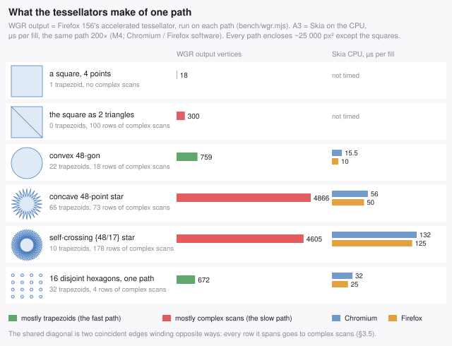

*Each path run through Firefox 156's own tessellator by `bench/tessfigs.mjs`,
beside what Skia on the CPU charged for it (A3, T60). The square costs 18
output vertices; the same square as two triangles in one path costs 300,
because the shared diagonal sends every row it spans to complex scans.*

The short form, for a batcher: **cancel every shared edge, drop what is
collinear, keep the band's detours from tangling where that is exact, and
merge what touches or comes in numbers — but not small scattered shapes or a
lone overlapping pair** (§1.7). Convexity pays only for a polygon that is a
`fill()` of its own, and a batch never is.

#### What a draw call costs, and what it does not

Per-face emission of S1 costs **49 ms of Chromium main thread against 21 ms**
for the batched frame (T61) — §1.1's `0.26 µs × fills`, 35 851 of them, plus
the JS that builds them — while the rasteriser ranks the same two frames by
shape, not by count: welded is 1.2× faster on S1 and 4.3× on S2, and per face
is 1.5× faster on S3 (§4.12). That is the whole division of labour: fills
are a **CPU** cost, paid on the thread your JS runs on; the frame rate is a
**tessellation** cost, paid per row of each path. On demoted Firefox both land
on the same CPU, which is why "fewer vertices" matters most there — and why
"fewer fills" alone does not.

---

## 4. The algorithm

### 4.1 Reordering under an occupancy grid

**Constraint.** Given triangles `t₀…tₙ₋₁` back-to-front, for any `i < j` where
`tᵢ` and `tⱼ` overlap on screen with different colours, `tᵢ` must still be drawn
before `tⱼ`. Same-coloured triangles commute — overlapping fills of one colour
are indistinguishable. Goal: the fewest single-coloured batches whose order is a
valid linear extension.

**The greedy.** Walk the depth-sorted list. Keep one open batch per palette
entry, and a screen grid where each tile holds the *ordinal* of the newest batch
that claimed it.

```js
// pseudo-JS; a real implementation is the same shape, with typed arrays and
// zero allocation per frame.
let nextOrdinal = 0;
const openByColour = new Int32Array(256).fill(-1);
const stamp = new Int32Array(tilesX * tilesY);      // tile -> batch ordinal

for (let i = 0; i < nVisible; i++) {
  const t = depthOrder[i], c = colour[t];

  // tiles whose CENTRE this triangle covers -- see 3.2, this is the whole trick
  const tiles = coveredTiles(t);

  let newest = 0;
  for (const p of tiles) if (stamp[p] > newest) newest = stamp[p];

  let b = openByColour[c];
  if (b < 0 || ordinal[b] < newest) {   // something newer than b overlaps t
    b = newBatch(c);                    // ordinal[b] = ++nextOrdinal
    openByColour[c] = b;
  }
  append(b, t);                         // singly-linked list over triangle ids
  for (const p of tiles) stamp[p] = ordinal[b];
}
emitBatchesInOrdinalOrder();
```

Why `ordinal[b] >= newest` is exactly right: the only triangles that could be
violated by moving `t` back to batch `b` are those drawn between `b` and `t`
that overlap `t`. Every one of them stamped one of `t`'s tiles with its own
batch's ordinal, which is greater than `ordinal[b]`. Ordinals are unique, so
`>=` correctly admits the case where the newest claimant *is* `b`. Emitting in
ordinal order is then a valid linear extension, by induction over the batches.

Cost is O(Σ tiles covered) — bounded by screen area × overdraw ÷ tile², not by
triangle count.

Two implementation notes that matter:

- **Don't clear the grid.** Tag ordinals with a per-frame epoch base
  (`base + batchIndex + 1`, `base` advanced by `triangleCount + 2` each frame).
  Last frame's stamps then read as older than anything this frame, for free. At
  2 px tiles that saves a 920 KB memset every frame.
- **Batch bookkeeping is linked lists in typed arrays** (`head[]`, `tail[]`,
  `next[]` indexed by triangle id), never arrays of arrays.

### 4.2 Why "tiles covered" must mean *interiors*

*Registry: T07 — fixture and extrapolation scope in §10.5.*

This is the single biggest lever and the easy thing to get wrong.

If a triangle claims **every tile its bounding box touches**, two edge-adjacent
triangles always collide, because their bboxes overlap. On a smooth mesh the
adjacent triangles are exactly the ones most likely to share a colour, so the
conservative test rejects precisely the merges you want. On the torus knot, bbox
stamping bottoms out around 11 800 batches no matter how fine the grid.

If a triangle claims **only the tiles whose centre it covers**, each tile centre
of a watertight surface belongs to exactly one triangle, adjacent triangles never
collide, and a single-depth-layer surface collapses to one batch per colour.

| batcher | torus knot (35 851 vis.) | sphere (45 428 vis.) | batch cost |
|---|--:|--:|--:|
| consecutive colour runs | 34 901 | 41 785 | 0.2 ms |
| Skia-style look-back, K=16 | 25 383 | 18 014 | 2.4 ms |
| Skia-style look-back, K=64 | 17 393 | 5 317 | 4.0 ms |
| occupancy grid, **bbox**, 8 px | 13 071 | 6 652 | 1.3 ms |
| occupancy grid, **bbox**, 2 px | 11 778 | 5 034 | 3.1 ms |
| occupancy grid, **interior**, 8 px | 4 214 | 3 231 | 2.8 ms |
| occupancy grid, **interior**, 4 px | 1 690 | 1 013 | 4.2 ms |
| occupancy grid, **interior**, 2 px | **835** | **255** | 8.7 ms |
| occupancy grid, **interior**, 1 px | 804 | 119 | 20.8 ms |
| *unreachable floor (one batch per colour)* | *181* | *77* | — |

(Batch cost is the Node figure for the torus knot before the epoch-tagging
optimisation; in-browser the whole batch+emit stage for `interior 2 px` measures
4–9 ms of the totals in §5.1.)

Two things to notice: the occupancy grid beats a bounded look-back at a fraction
of the cost (grid @ 8 px: 13 071 batches in 1.3 ms; look-back K=64: 17 393 in
4.0 ms), and interior sampling is worth another **7–10×** on top.

Implementation is three half-plane edge functions stepped incrementally across
the bbox tiles — a coarse triangle rasteriser, ~5 ops per tile.

**The trade, stated honestly.** Centre sampling is exact at tile = 1 px (it is
literally "do these two triangles cover a common pixel centre") and approximate
above that: an overlap smaller than about one tile can be missed, and those two
triangles may then be reordered. Measured on the torus knot at 4 px tiles, 705
of 70 801 genuinely overlapping triangle pairs (1.0 %) get reordered; on the
sphere, 0 of 0 — a convex single-layer surface has no overlapping pairs at all.
The bbox mode has **zero** violations at any tile size and is the right choice
if you need a provable guarantee. Check both with an exact separating-axis
test (§8.3). The visual consequence is quantified in §4.4.

### 4.3 Edge cancellation and boundary extraction

Per batch, emit each triangle's three directed edges `v₀→v₁, v₁→v₂, v₂→v₀`,
**except** where `adjacency[3t+e]` names a triangle in the same batch — those
cancel against their twin. With a precomputed adjacency table this is O(1) per
edge and needs no hashing in the frame loop. (Adjacency depends only on
topology, so build it once at load; for an un-indexed soup, weld vertices once.)

Then chain the survivors into closed loops. Two facts make this easy and safe:

- The surviving set is the boundary of a 2-chain, so in-degree equals out-degree
  at every vertex. A maximal walk therefore always returns to its start (Euler),
  so the implicit close that `fill()` performs is always the correct edge, never
  a spurious one.
- Under the **nonzero** winding rule the filled region depends only on the
  multiset of directed edges. It does not matter how the walk pairs edges at a
  pinch vertex — any pairing renders identically. No planar-graph bookkeeping
  needed.

It is worth checking empirically too (§8.3): the total signed area of the
emitted paths matches the sum of triangle areas to 0.0000 %.

Then drop collinear vertices. Exact test, no square root, with `d₁ = p − a`,
`d₂ = c − p`:

```
cross = d₁ × d₂
drop p if  cross² ≤ ε²·|d₁ + d₂|²   and   d₁·d₂ > 0
```

`|cross| / |a→c|` is exactly the distance p would move; the dot-product term
keeps genuine 180° spikes.

**T-junction caveat:** removing a collinear vertex on a boundary shared with a
differently-coloured chart can open a hairline crack, since the neighbour still
has a vertex there. At ε = 0.05 px this is below the AA noise floor. Don't get
greedy with ε.

### 4.4 Conflation seams: the constraint, and the three levers

*Registry: T13, T14 — fixture and extrapolation scope in §10.5.*

Canvas2D composites the antialiased coverage of each fill separately. Two
triangles sharing an edge each cover about half of the pixels along it, and
`source-over` of two 50 % coverages gives 75 %, not 100 %: a thin line of
background shows through every shared edge. This is the **conflation
artifact**, and canvas2d gives you exactly one way to close it — paint some
coverage back over the edge with a `stroke()` in the fill colour. (Expanding
the polygons instead trades the seam for its own artifacts and is out of scope
here.)

So **stroking is a constraint, not a choice**. Every comparison in this guide
is stroke-against-stroke, and the production baseline is per-triangle
`fill()` + `stroke()`. Under that constraint there are three levers, and
batching supplies all three.

> **Amended by §4.8 and §4.12.** "Exactly one way" was too strong: the fill
> drawn *first* can grow over the seam instead, and the band that does it
> without moving any vertex (§4.8) is now measured at batcher scale too
> (§4.12, T64) — it leaves under 1.5 % of the seam gap where the 0.5 px
> stroke below leaves 27–36 %, at the same software raster cost. The three
> levers still describe how to stroke well, and the stroke is still the
> repair that has been measured end to end on a GPU.

#### Lever 1 — fewer strokes

`stroke()` covers the whole current path, so it is priced per *path*, not per
edge. Batching collapses the stroke count exactly as it collapses the fill
count, and edge cancellation has already deleted the interior edges those
strokes would have covered:

| scene | baseline fills / strokes | batched fills / strokes |
|---|--:|--:|
| torus knot | 36 180 / 36 180 | **859 / 859** |
| sphere | 41 218 / 41 218 | **203 / 203** |

That is where the bulk of the win comes from: stroking costs **+10 %** of a
batched frame and **+125 %** of a per-triangle one (§5.1).

#### Lever 2 — thinner strokes

The convention is `lineWidth = 1`, and it over-corrects. An opaque 1 px stroke
centred on a colour boundary spills half a pixel into the neighbouring region,
so the boundary ends up displaced toward whichever side strokes last. Sweeping
it, RMSE against the supersampled reference:

| lineWidth | torus knot | torus knot unwelded | sphere |
|--:|--:|--:|--:|
| 1.0 (conventional) | 7.20 | 7.65 | 2.81 |
| 0.75 | 6.26 | 6.82 | 2.36 |
| **0.5** | **5.57** | **6.00** | **2.26** |
| 0.35 | 5.74 | 5.88 | 2.70 |

The optimum is around 0.4–0.5 on all three scenes, it is worth 20–25 % of the
error, and it is completely free — same fills, same vertices, same time.

Why the convention is nevertheless 1: in a *per-triangle* renderer both
triangles stroke their shared edge, the two half-pixel displacements point in
opposite directions and cancel. Measured — for the per-triangle baseline,
width 1 beats 0.5 on the sphere (3.99 vs 4.49). The moment you batch, each seam
is stroked from one side only and the correct width halves.

#### Lever 3 — stroke seams, not silhouettes

Not every surviving boundary edge is a seam. Classify each one by what is on
the other side:

- **neighbour visible, different batch** → two fills share this edge, their
  coverages conflate → **seam, must be stroked**;
- **neighbour backfacing, culled, or absent** → a silhouette. Whatever is
  behind already covers the pixel fully, so `α·front + (1−α)·behind` is the
  correct composite and there is no deficit. Stroking it only inflates the
  object by half a pixel all the way round.

The adjacency table already knows which is which, so the stroke pass can be
restricted to the seam subset. It needs a second path — the seam edges do not
form closed loops, so they are chained into open polylines — which roughly
doubles emitted vertices. Measured, that is cheaper than it sounds:

| scene | full-boundary stroke | seam-only stroke | cost | RMSE |
|---|--:|--:|--:|---|
| torus knot | 53.8 ms | 55.3 ms | +2.8 % | 5.57 → **4.48** |
| sphere | 9.48 ms | 9.94 ms | +4.8 % | 2.26 → **2.15** |

+3–5 % of the frame for ~20 % less error on the torus knot. It fails safe: with
no adjacency there is no way to tell a seam from a silhouette, so the shipped
module falls back to stroking the whole boundary rather than stroking nothing.

#### Putting the levers together

Against a 4× supersampled reference, Chromium, torus knot:

| strategy | fills | strokes | RMSE | >48 % |
|---|--:|--:|--:|--:|
| per-triangle, fill only (no seam repair) | 36 180 | 0 | 13.99 | 1.93 % |
| **per-triangle fill+stroke, width 1 — the baseline** | 36 180 | 36 180 | **7.36** | 0.50 % |
| batched + cancel, no stroke | 859 | 0 | 10.19 | 0.90 % |
| batched + cancel + stroke, width 1 | 859 | 859 | 7.20 | 0.49 % |
| batched + cancel + stroke, width 0.5 | 859 | 859 | 5.57 | 0.25 % |
| **batched + cancel + seam-stroke, width 0.5** | **859** | **847** | **4.48** | **0.10 %** |

Two things to take from the middle rows. Batching *alone* removes most of the
seam error for free (13.99 → 10.19) because the cancelled edges stop being
rasterised at all — but not all of it, since the boundaries between
differently-coloured batches are still genuine seams. And the fully-levered
version is **39 % more accurate than the production baseline while running
2.7× faster** (§5.1).

#### Which reference, and why

Two 4× box-filtered references were built, because the choice changes
conclusions:

- **`4× fill-only`** — supersampling attenuates the conflation deficit by the
  supersampling factor but does not remove it. Still carries ~1/4 of the seam
  error of a 1× render, biased the same way as the naive baseline.
- **`4× fill+stroke`, `lineWidth` 1 *device* pixel** — at 4× the seam is one
  supersampled pixel wide and a one-supersampled-pixel stroke fills it exactly,
  so this reference is seam-free without measurable silhouette bloat.

They disagree by RMSE 4.5–5.4 — the size of the residual seam in the fill-only
one, comparable to the differences being measured. **For a watertight mesh the
fill+stroke reference is authoritative**; all RMSE figures above are against it.
For a genuine soup, which has no shared edges to repair, the fill-only one is
(§6.7).

*Stated plainly:* the fill+stroke reference is a very good approximation of true
coverage, not a proof of it. Point-sampled supersampling with antialiasing off
would be exact, and canvas2d offers no way to switch path antialiasing off.

### 4.5 Where the batcher stops being optimal

*Registry: T09, T10, T11 — fixture and extrapolation scope in §10.5.*

The greedy is a heuristic. Minimising the number of single-coloured blocks in a
linear extension of a DAG is NP-hard, so "optimal" is not on the table — but it
is worth knowing how much is being left behind, and where.

#### How far from the floor?

"Number of distinct colours" is a useless floor: it ignores the depth
constraints. A real lower bound comes from chains. Take any path in the
constraint DAG (`u` before `v` whenever they overlap and `u` is behind `v`).
Every element keeps its relative order in any valid emission, so each colour
change along the chain forces a new batch:

```
minBatches ≥ max( distinct colours , 1 + max over chains of colour changes )
```

The chain term is a DP over the depth order, which is already a topological
order, so it costs one pass (§8.7).

| scene | visible | colours | chain bound | bound | greedy (best tile) | ratio |
|---|--:|--:|--:|--:|--:|--:|
| sphere | 9 876 | 77 | 1 | 77 | **82** | **1.06×** |
| grid | 7 060 | 57 | 7 | 57 | 145 | 2.54× |
| torus knot | 8 762 | 181 | 59 | 181 | 579 | 3.20× |

On a single-depth-layer surface the greedy is essentially optimal — 82 batches
against a floor of 77. On the self-overlapping torus knot it is 3.2× above,
though the bound there is weak (the longest constraint chain only forces 59
batches, so the colour count dominates and the true optimum is somewhere in
between). Worth knowing, not worth chasing.

#### Tile size has to track triangle size

This is the correction that matters, and the earlier "use 2 px" advice was
wrong. What governs batching quality is the **ratio** of triangle size to tile
size, not the tile size. Same mesh, projection scaled down so the mean triangle
shrinks:

| mean tri area | fills @8 | @4 | @2 | @1 | best tile |
|--:|--:|--:|--:|--:|--:|
| 270 px² | 757 | **618** | 691 | 753 | 4 |
| 87 px² | 1 711 | 808 | **661** | 722 | 2 |
| 24 px² | 3 746 | 1 643 | 764 | **652** | 1 |
| 5.9 px² | 6 459 | 3 746 | 1 643 | **764** | 1 |
| 1.5 px² | 9 530 | 6 459 | 3 746 | **1 643** | 1 |
| 0.4 px² | 12 658 | 9 530 | 6 459 | **3 746** | 1 |

Read the diagonal: `@1` at 1.5 px² equals `@2` at 5.9 px² equals `@4` at 24 px²
— every halving of triangle size needs a halving of the tile. A fixed 2 px grid
is 2.7× off at the top of that table and 2.3× off at the bottom.

Picking it from the mean triangle area reproduces the measured optimum at every
one of those six points:

```
tile = clamp( 2^round(log2( sqrt(meanTriArea) / 4 )), 1, 8 )
```

and it is also **cheaper** than a fixed fine grid — 2.4 ms against 16.6 ms for a
fixed 1 px grid on large triangles, because the cost is per covered tile. One
sampled pass over the bounding boxes pays for it. `tile: 'auto'` is now the
default in `painter2d.js`; there is no reason to set it by hand.

#### Sub-pixel triangles defeat the grid

Below about 2 px² a triangle covers no tile centre even at 1 px, so it falls
back to claiming the tile holding its centroid — a conservative claim, and once
most triangles are that small the fallback *is* the batcher. At 0.4 px² the
grid manages 3 746 fills from 17 056 triangles: 4.6 triangles per fill, against
a floor of 182.

The fix is to stop guessing for those: keep a short per-tile list of sub-tile
triangles and test the newcomer against them with an exact separating-axis
test. Adjacent sub-pixel triangles tile the surface rather than overlapping it,
so nearly every test comes back false and the merges survive. Measured, at
1 px tiles:

| mean tri area | mode | fills | order violations |
|--:|---|--:|--:|
| 5.9 px² | centroid fallback | 764 | 867 (0.71 %) |
| 5.9 px² | **exact, walk ≤ 16** | 790 | **304 (0.25 %)** |
| 1.5 px² | centroid fallback | 1 643 | 554 (0.45 %) |
| 1.5 px² | **exact, walk ≤ 16** | **944** | **131 (0.11 %)** |
| 0.4 px² | centroid fallback | 3 746 | — |
| 0.4 px² | **exact, walk ≤ 16** | **917** | — |

So it is **strictly better on quality everywhere** (3–4× fewer real order
violations, because the tile-quantised fallback both invents conflicts that do
not exist and misses ones that do), and better on fill count below ~2 px² —
1.7× at 1.5 px², 4.1× at 0.4 px².

It is not shipped on by default, because of the cost: the exact pass takes
batching from 1.5 ms to 9.8 ms at 1.5 px². On Chromium that roughly pays for
itself (700 fewer non-convex fills ≈ 10 ms of GPU at 14.5 µs each); on Firefox,
where a fill is cheap and the work is all vertices, it does not. That is the one
place in this guide where the best answer differs by engine, so the default is
the one that is never a loss.

*One trap if you implement it yourself:* the small-triangle list only helps if
those triangles **stop writing the tile stamp**. A first attempt that added the
exact test while still stamping the tile measured a dead-flat 1.00× — the
conservative claim was still blocking everything. And do not "tune" the walk
limit down to make the numbers look good: walk ≤ 1 gives the fewest fills of
any setting (626 at 0.4 px²) purely by detecting fewer conflicts, and its
violation count is 6.6× worse than walk ≤ 16.

#### The short answer

Sparse in **depth order** — the same colour scattered far apart in the sorted
list — is exactly what the occupancy grid is for, and it handles it: the sphere
goes from 45 428 triangles to 191 fills, 1.06× off the floor. Sparse in
**screen space** — one colour appearing in many disconnected regions — still
merges the fills but yields no shared edges, so you keep the draw-call win and
lose the vertex win. Sparse as in **tiny** is where it genuinely breaks, and the
answer there is `tile: 'auto'` first and exact sub-tile testing second.

### 4.6 Cheap pre-ordering, as an alternative to the grid

*Registry: T12 — fixture and extrapolation scope in §10.5.*

A reasonable question: if the trouble is that a depth sort scatters colours,
can you just sort better and skip the occupancy grid?

You can, partly. Split the depth-sorted list into B equal-count bands and
colour-sort within each band (stable, so depth order survives within one
colour). One counting-sort pass, no allocation. Plain run-length batching then
finds long runs, and no interior-coverage rasterisation is needed at all.

It is an approximation — reordering inside a band can violate the painter order
for triangles that overlap within it — so B is a quality knob. Measured on the
torus knot against the seam-free reference:

| strategy | fills | verts | record | raster | RMSE |
|---|--:|--:|--:|--:|--:|
| production baseline (per-tri fill+stroke) | 36 180 | 144 720 | 126.2 ms | 65.0 ms | 7.36 |
| bands 16 + runs + cancel + stroke | 1 603 | 53 100 | **4.0 ms** | 30.1 ms | 9.40 |
| bands 64 + runs + cancel + stroke | 5 498 | 71 690 | 8.5 ms | 43.0 ms | 7.39 |
| bands 256 + runs + cancel + stroke | 14 646 | 96 060 | 113.1 ms | 61.5 ms | 7.10 |
| **occupancy grid 2 px + cancel + stroke** | **859** | **50 199** | 9.3 ms | **35.0 ms** | **7.20** |
| bands 64 **+** grid 2 px + cancel + stroke | 933 | 50 716 | 8.7 ms | 33.5 ms | 7.63 |

Three conclusions:

1. **Pre-ordering works, and it is genuinely cheap.** At 64 bands it matches the
   production baseline's fidelity (7.39 vs 7.36) with 6.6× fewer fills, using
   nothing but a counting sort and run-length detection.
2. **The occupancy grid dominates it.** At equal-or-better fidelity the grid
   produces 6.4× fewer fills (859 vs 5 498) and rasterises 1.2× faster. End to
   end on Chromium the gap is large: 52.7 ms for the grid against 104.4 ms for
   bands-64 (§5.1), because 6 182 non-convex fills sits right in the middle of
   Skia's cost valley (§3.1).
3. **Pre-ordering does not help the grid** — it makes it slightly worse (933
   fills and RMSE 7.63, against 859 and 7.20). Colour-sorting inside a band
   breaks up the depth locality the grid exploits, and band edges force batch
   splits. It is an *alternative* to the grid, not a complement.

Where bands are worth having: **B=16 has the lowest recording cost of any
option measured** — 4.0 ms against the grid's 9.3 ms — at a fidelity cost
(9.40 vs 7.20) that is visible but far better than unstroked per-triangle
rendering. If you are hard main-thread-bound and can spend image quality, that
is a real trade. `reorderByDepthBands()` is exported for it. Otherwise use the
grid.

On soup, pre-ordering is not merely useless but destructive: RMSE 41.2 at 16
bands and 27.3 at 64, against 5.4 for the plain baseline. Reordering assumes
the depth order is locally unimportant, and in a soup it is exactly what is
holding the image together.

### 4.7 Textured triangles: the pattern recipe, and merging coplanar ones

*Registry: T15, T16 — fixture and extrapolation scope in §10.5.*

Everything above assumed a flat colour per triangle. With a texture the
primitive changes, and so does the batching rule — but the shape of the answer
is the same: merge until an error budget says stop.

#### There are two recipes, and the usual one is the slow one

The conventional way to texture a triangle in canvas2d:

```js
ctx.save();
ctx.beginPath(); ctx.moveTo(x0,y0); ctx.lineTo(x1,y1); ctx.lineTo(x2,y2);
ctx.clip();                              // triangle, in screen space
ctx.setTransform(a,b,c,d,e,f);           // the UV -> screen affine map
ctx.drawImage(texture, 0, 0);
ctx.restore();
```

There is a second one that is rarely used. Put the UV→screen map on the
**context**, build the path in **texture space**, and fill it with a
`CanvasPattern`:

```js
ctx.fillStyle = pattern;                 // createPattern(texture,'no-repeat'), once
ctx.setTransform(a,b,c,d,e,f);           // same UV -> screen affine map
ctx.beginPath();
ctx.moveTo(u0,v0); ctx.lineTo(u1,v1); ctx.lineTo(u2,v2);
ctx.fill();
```

A pattern lives in *user space*, and user space is now texture space, so texel
(u,v) lands exactly where the affine map sends it. No clip, no `save`/`restore`,
no `drawImage`. Measured on 1152 textured triangles:

| recipe | Chromium rec / raster | Firefox rec / raster |
|---|--:|--:|
| `clip` + `drawImage` per triangle | 3.98 / 7.15 ms | 2.50 / 21.0 ms |
| **pattern fill per triangle** | **0.50 / 5.70 ms** | **0.50 / 5.0 ms** |
| `clip` alone, no `drawImage` | 0.73 / 1.85 ms | 0.50 / 4.5 ms |
| `pattern.setTransform` per triangle instead | 1.30 / 6.30 ms | 0.75 / 6.0 ms |

**8× less recording on Chromium and 4.2× less rasterisation on Firefox, before
any merging at all.** And put the matrix on the *context*, not on the pattern:
mutating `pattern.setTransform` per shape costs 2.6× more to record.

The deeper reason to prefer it: a pattern fill is an ordinary `fill()`. Every
rule from the flat-colour case — one path with many subpaths, edge
cancellation, no `closePath()`, nonzero winding — applies unchanged.

**For a sprite, the ranking inverts.** A screen-aligned atlas rect has no
clip for the pattern to remove, and `drawImage` with a source rect wins on
every engine that separates the two: 1.46–2.25× on Chromium's CPU path,
5.9–6.9× on Chrome's GPU canvas, 108–169× on Safari (§4.13). §4.13 also
covers what the image source (``, `ImageBitmap`, canvas) costs, which
this section does not vary: every texture here is a canvas built in code. That
is the favourable case, because on Chrome's GPU canvas a 512² pattern made
from an `` or `ImageBitmap` ran at CPU raster cost. Keep pattern sources
as canvases. And every texture here is one image that never repeats. A 3D
engine's tiled materials are §4.14. There the `'repeat'` pattern ties on
Chrome with a pre-tiled clip, and loses by 1.1–1.4× on Safari.

**On WebKit the recipe does not win, and §3.4 says why.** In the CG backend
every pattern fill calls `applyFillPattern()`, which builds a *fresh*
`CGPattern` and a pattern colour space per fill — nothing is cached between
fills — while `drawImage` is a bare `CGContextDrawImage`. Measured on the same
atlas over 1 152 triangles (§4.13, one run on M6's Safari 26.6.2), the two
recipes **tie**: `clip` + `drawImage` 93.2–98.0 ms, pattern 100.6–101.0 ms.
So the recipe buys nothing on Safari and costs nothing there either, and the
runtime switch this paragraph used to recommend has, on this fixture,
nothing to switch between. **Merging coplanar faces** (below) is still the
thing to do, since it reduces exactly the number of pattern fills that cost
is proportional to. A switch chosen by timing both paths at startup, as in
§1.7, remains the safe design if your content differs from S20. Do not branch
on the user-agent string.

#### The constraint: `setTransform` is affine, a plane is not

`ctx.setTransform` takes six numbers. There is no perspective divide. But the
exact texture→screen map of a plane under perspective projection is a
**homography**, which reduces to an affine map only where `w` is constant.

That is the whole story of coplanar merging:

- **Two coplanar triangles can share one fill exactly** when their quad is a
  parallelogram in screen space — equivalently, when `w` is constant across it,
  equivalently under an orthographic projection. Then one affine map reproduces
  both, and the merge is free and lossless.
- **Otherwise merging is an approximation** whose error grows with the size of
  the merged region, and the test is *"does one affine map fit this region to
  within ε pixels?"*

The cheap form of that test: fit the affine map to three corners of the region,
then evaluate it against the exact projection at the remaining corners, the
edge midpoints and the centre, and take the worst deviation. Nine probes.
Equivalently and even cheaper as a first filter: the relative variation of `1/w`
across the region, since the affine map is exact iff `w` is constant.

For a regular UV grid the efficient realisation is a **quadtree over texture
space** — subdivide while the fit exceeds ε. (This is the classic affine
subdivision that software renderers used before hardware perspective
correction.) For an irregular mesh, grow a coplanar chart over the adjacency
graph using the same test, and extract its boundary with the same edge
cancellation as §4.3 — in texture space, since that is where the path lives.

#### Measured: a perspective-tilted plane

1280×720, 512×512 texture, reference is subdivision to ε = 0.1 px (18 796
fills), which converges to the exact homography. `perDraw` is GPU-inclusive.

| strategy | fills | verts | RMSE vs exact | Chromium perDraw | Firefox perDraw |
|---|--:|--:|--:|--:|--:|
| uniform 64×64, **per triangle** | 8 192 | 24 576 | 11.69 | 23.81 ms | 25.16 ms |
| uniform 64×64, **per quad** | 4 096 | 16 384 | **8.59** | **8.61 ms** | **6.17 ms** |
| adaptive ε = 0.25 px | 4 699 | 18 796 | 8.62 | — | — |
| adaptive ε = 0.5 px | 2 482 | 9 928 | 10.49 | — | — |
| adaptive ε = 1 px | 1 174 | 4 696 | 12.03 | **2.26 ms** | **1.60 ms** |
| adaptive ε = 2 px | 622 | 2 488 | 15.28 | — | — |
| adaptive ε = 4 px | 292 | 1 168 | 19.29 | **0.56 ms** | **0.40 ms** |
| adaptive ε = 8 px | 154 | 616 | 31.30 | — | — |
| single fill, whole plane | 1 | 4 | 102.13 | — | — |

Three things worth taking from that.

**1. Merging the two triangles of a quad is strictly better — faster *and* more
accurate.** 2.8× on Chromium, 4.1× on Firefox, and RMSE drops from 11.69 to
8.59. That is not a fluke: two independent per-triangle affine maps disagree
along the shared diagonal, which is exactly the classic diagonal crease of
affine-mapped quads. One map fitted to the quad has no crease. **So for the
user's two-triangle plane, the answer is unambiguous: one polygon, one
transform, one fill — cheaper and better looking.**

**2. Beyond the quad it is a clean quality/speed dial.** ε = 1 px is quality
parity with per-triangle rendering (12.03 against 11.69) at **7× fewer fills**
and **10.5× / 15.7× less frame time**. ε = 4 px is 28× fewer fills and 42× /
63× less time, at a visible but not catastrophic cost.

**3. There is no free lunch at the top.** One fill for the whole plane is RMSE
102 — the affine warp is grossly wrong. Merging without an error test is how you
get that.

#### Traps specific to textured merging

- **Seams still exist**, and they are worse than in the flat case because
  neighbouring charts sample the texture with *different* matrices. The §4.4
  stroke treatment still applies; `strokeStyle` accepts a pattern, so the fix is
  the same shape. Budget for it.
- **`no-repeat` patterns are transparent outside the image.** The path must stay
  inside the texture in UV space, or you get holes. Use `'repeat'` for tiling
  surfaces, and remember the tiling then happens in *texture space*, which is
  what you want.
- **Do not measure pattern fills on a `willReadFrequently` canvas in Chromium.**
  Its software pattern fill is pathological: the matrix probe below shows
  ~1.6–3 ms *per* 200×200 pattern fill, against 0.023 ms on Firefox's software
  backend — a 70× gap that has nothing to do with the matrix.

  | 2000 pattern fills, identical area | Chromium raster | Firefox raster |
  |---|--:|--:|
  | identity | 3 204 ms | 46 ms |
  | scale 2.5 | 6 314 ms | 1 029 ms |
  | rotate 20° | 3 728 ms | 257 ms |
  | rotate 20° + scale 2.5 | 6 052 ms | 1 183 ms |
  | shear | 3 607 ms | 228 ms |

  The cost tracks device-space *area*, not the kind of matrix — so this is not
  a rotation penalty, it is Chromium's CPU pattern path being slow across the
  board. The GPU-inclusive `perDraw` column in the table above is the number to
  use for Chromium; the software column in the earlier flat-colour sections is
  not transferable to patterns.
- **`drawImage` without a clip is not a shortcut.** Dropping the clip paints the
  whole texture per triangle: 14.5 ms on Chromium and **1 068 ms** on Firefox
  for the same 1152 triangles. The clip is doing real work in that recipe; the
  pattern recipe removes the need for it rather than the work.

### 4.8 Killing gaps by outset, not by stroke

*Registry: T17, T46, T47 — fixture and extrapolation scope in §10.5.*

For a textured surface the stroke repair of §4.4 is unattractive: a stroked
pattern samples the texture along a line, and it displaces the boundary. There
is a better answer, and it turns out to be both higher quality *and* faster.

**Two mechanisms, applied in order** — and then a third, from *The outset moves
geometry* onwards, which supersedes the second: it closes the same gap without
moving any vertex. *The eight options, measured* prices every form of both
against each other; the short version is **8b** if you want it free and **5f
trimmed** if you want it exact.

1. **Merge the coplanar triangles.** A face made of two triangles has a shared
   diagonal. Merge them into one polygon and that diagonal is never rasterised,
   so there is no seam there to hide. This is the primary path and it should be
   the fastest thing in the renderer: one path, one transform, one fill.
2. **Outset the farther polygon along shared edges.** Faces that are *not*
   coplanar cannot merge, so their shared edge is drawn twice and conflates.
   Instead of painting over it, grow the polygon that is drawn *first* half a
   pixel past the edge. The nearer polygon then blends its antialiased edge over
   solid coverage instead of over the background, and the composite is exactly
   right.

Two rules make the outset correct, and both use tests the batcher already has:

- **Only outset an edge whose neighbour is drawn later.** If the neighbour is
  already down, growing over it moves the visible boundary instead of hiding a
  gap. This is the batch-ordinal comparison from §4.1.
- **Only outset shared edges, never silhouettes.** A silhouette outset just
  makes the object half a pixel too big. This is the seam/silhouette
  classification from §4.4, lever 3.

Mechanically: outset the polygon in **screen** space (offset each selected edge
line outward, re-intersect at the vertices), then map the grown vertices back
through the inverse affine to texture space, so the pattern still lands exactly
where it belongs on the original face.

#### Measured on a textured cube

1000×700, padded 512×512 atlas, three visible faces, `perDraw` GPU-inclusive.
Gap area is measured exactly, not eyeballed — see the note below.

| strategy | ops | Chromium | Firefox | gap area | worst pixel |
|---|--:|--:|--:|--:|--:|
| per-triangle `clip` + `drawImage` | 6 | 0.0208 ms | 1.0776 ms | 424 | 0.286 |
| per-triangle pattern fill | 6 | 0.0147 ms | 0.0468 ms | 417 | 0.267 |
| **per-FACE pattern fill** | **3** | **0.0086 ms** | **0.0248 ms** | 172 | 0.263 |
| per-FACE + outset 0.5 px | 3 | 0.0090 ms | 0.0326 ms | 18 | 0.067 |
| **per-FACE + outset 1.0 px** | **3** | **0.0094 ms** | **0.0313 ms** | **0** | **0.004** |
| per-FACE + outset 2.0 px | 3 | 0.0085 ms | 0.0309 ms | 0 | 0 |
| per-FACE + stroke (the rejected fix) | 6 | 0.0171 ms | — | 15 | 0.039 |

Reading it:

- **Merging the face halves the gap area for free** — 417 → 172 — because the
  diagonal simply stops existing. And it is 1.7× faster on Chromium, 1.9× on
  Firefox, at half the operations.
- **A 1 px outset takes the gap to exactly zero.** Not "small": zero leaking
  pixels, worst residual 0.004 of a pixel's coverage. 0.5 px is not enough (a
  pixel straddling the edge needs the farther face to cover all of it), and
  beyond 1 px nothing changes.
- **The outset is nearly free**: +9 % on Chromium, +26 % on Firefox.
- **Outsetting beats stroking on both axes.** The stroke does not even reach
  zero (15 vs 0) and costs 1.8× more (0.0171 vs 0.0094), because it needs a
  second operation per face while the outset only moves four vertices.
- **Against the starting point** — per-triangle `clip` + `drawImage` — the
  finished path is **2.2× faster on Chromium and 34× on Firefox, with the gaps
  gone**.

#### Requirement: a padded texture

The outset ring samples texture slightly outside the face's UV rect, and so
does every band form below. That ring is always covered by the neighbour, so
*what* it samples never shows — but it must be **opaque**, or the gap
survives. Pad the atlas: give every face a gutter
of duplicated edge texels, or lay the atlas down on an opaque base. This is
standard practice in real-time graphics for exactly this reason.

#### Vocabulary, and the two tests every option needs

Fixed terms for the rest of §4.8, because the options differ only in which of
these they look at:

- **shared edge** (or *seam edge*) — an edge of polygon P that is also an edge
  of another **visible** polygon Q. Its two coverages conflate, so it is the
  only kind of edge that needs repairing.
- **silhouette edge** — an edge whose neighbour is backfacing, culled or
  absent. Whatever is behind already covers those pixels fully, so there is no
  deficit and nothing to repair. Touching one is pure damage.
- **farther / nearer** — of two polygons sharing an edge, the one drawn
  **first** is farther. Only the farther one may repair the edge: growing over
  a neighbour that is already down moves the visible boundary instead of
  hiding a gap.
- **run** — a maximal chain of consecutive shared edges along one polygon's
  boundary loop, after restricting to *shared with a later-drawn neighbour*.
- **free end** — a vertex where a run stops. It is the one place a repair's
  outward ink has nothing over it, and it is where the options differ most.
- **band** — the strip of coverage a repair lays along a shared edge, of width
  *w*, however it is produced.

And the two tests. Every option below needs zero, one or both:

1. **the adjacency test** — for this edge, is there a visible neighbour? Needs
   a per-edge neighbour table (`buildAdjacency`, §4.3). Options 1 and 2 skip
   it; 3 and 4 need only a per-*polygon* answer; 5–8 need it per edge.
2. **the depth test** — is that neighbour drawn later? A batch-ordinal
   comparison, free once you have the adjacency (§4.1). Options 1 and 2 skip
   it; everything else needs it.

Option 8 additionally needs the neighbour's **adjacent vertex** at a shared
vertex, which is one more lookup than the adjacency bit.

##### The four quality numbers

Defined once, used in every table below, and all four are exact rather than
eyeballed (§4.8's methodology notes):

| column | meaning | ideal |
|---|---|--:|
| **gap** | missing ink inside the object: Σ max(0, α_true − α) over pixels the object covers solidly, α_true from a box-filtered 4× render of the union as **one** fill | 0 |
| **outline** | coverage moved anywhere the object is *not* solid, against the untouched plain fill — the bloat number, and it needs no reference at all | 0 |
| **seam RMSE** | colour error against a seam-free 4× reference, over interior pixels within 3 px of a shared edge | small |
| **off-seam Δ** | pixels differing from the plain fill by more than 1/255, further than 3 px from any shared edge — what the repair disturbed that it had no business touching | 0 |

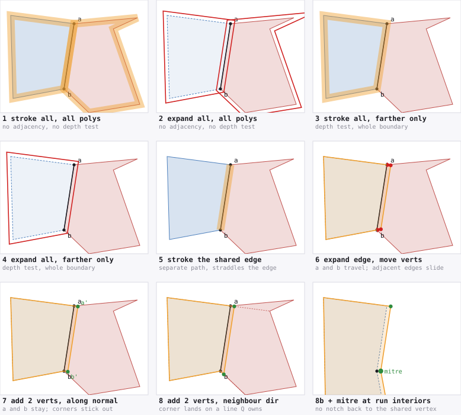

*Every option applied to the same pair. P (blue, farther, drawn first) shares
the edge a→b with Q (red, nearer). At **a** the two polygons' other edges
continue straight through the vertex; at **b** they meet at a corner — that
difference is what option 8 turns on. Band width is exaggerated throughout.*

#### The outset moves geometry, and geometry is shared

*Registry: T46, T47 — fixture and extrapolation scope in §10.5.*

The outset is correct on a convex quad and the table above says so. But
re-intersecting two offset edge lines **moves the vertices at both ends of the
edge**, and a vertex is not private to the edge that asked for it:

- if an adjacent edge is a **silhouette**, the moved vertex slides along it and
  the object's own outline grows — extra ink in the one place nothing is going
  to cover;
- on a **non-convex** loop the displacement at a vertex is no longer the edge
  normal. At a reflex corner the two offset lines meet on the far side of the
  original corner; at a sharp convex one the mitre runs away and has to be
  clamped — and the clamp costs gap, measurably (0.12 → 0.52 below). Either way
  the boundary moves somewhere other than where the gap was.

Neither is fatal — the outset still closes the gap on both fixtures below. What
they cost is **outline**, and the cost is 9–11× the alternative's.

#### The band: the same coverage, and no vertex moves

Take the two rules unchanged — only edges shared with a visible neighbour, only
on the polygon drawn **first** — and instead of growing the polygon, lay a
**band of its own texture along those edges**, straddling them, as a separate
path. Nothing in the polygon moves.

Why that is enough, and why it is exact:

- the half of the band **outside** the polygon is covered later by the nearer
  neighbour — precisely the job the outset ring was doing;
- the half **inside** the polygon repaints the texels the fill already put
  there, through the same affine map, so it is a no-op.

So the band changes nothing anywhere except the pixels straddling the shared
edge, which are the pixels it exists to finish covering. That is not an
argument to be taken on trust — it is the `off-seam Δ` column below, and it is
zero.

Two mechanics decide whether it works:

- **The band must overlap the fill, not abut it** — as long as it is a
  *separate* fill. A band placed entirely outside the polygon shares its inner
  edge with the fill's edge, and two abutting antialiased coverages conflate:
  the artifact being repaired, recreated one pixel over. Measured, an
  outward-only band in its own fill leaves **half the gap standing** (88.6
  against 0.84 on the cube). Centre it. (The constraint is a consequence of the
  second fill, not of the band — *one fill, not two* below lifts it.)
- **Width is twice the equivalent outset.** A centred band of width *w* reaches
  *w*/2 past the edge, and §4.8 measured that a straddling pixel needs a full
  pixel of cover. So *w* = 2, and 1 px leaves a third of the gap (37.5 against
  0.96).

Optionally, **trim** each free end of a band run back by *w*/2. A run ends
where a seam meets the silhouette, and that is the one place the band's outer
half is not covered by anything; pulling it back keeps every painted pixel
inside the outline, at the price of the last half pixel of seam.

#### Do it as a fill, not a stroke

The obvious implementation is `stroke()` on the seam edges with the face's
pattern as `strokeStyle` — and it is the wrong one. A pattern **stroke** is not
a fast path: on Firefox the same band costs **7–9× more stroked than filled**,
and the two heaviest pattern strokes here do not merely run slow — they take
the canvas out of acceleration outright. That is read off Gecko's own indicator
(§3.2's instrument), not inferred from the timing: those two rows come back
`soft` and every other row in both tables comes back `ACCEL`, twice, on
separate runs. Chromium is milder — 1.0–1.3× — but never faster.

The band does not need a stroke. It is one quadrilateral per seam edge — the
edge extruded ±*w*/2 along its normal — so emit each quad as a **subpath of one
path, all wound the same way**, map the corners back through the inverse affine
into texture space, and `fill()` once per polygon. Under the nonzero rule the
overlapping quads fill their union, and consecutive quads overlap around the
vertex they share, which is what the stroke's mitre join was doing. A pattern
fill whose path is in texture space is exactly §4.7's recipe, so this is the
machinery the renderer already has.

The two forms produce the same picture: as 4× references they differ by RMSE
**0.000** on the cube and **0.002** on the sawtooth (max Δ 0.1 and 0.8).

If you are tempted to save the pattern by stroking a flat colour instead: the
band's inner half is *visible*, so it has to carry the texture. Same coverage
to within 0.3 px, and seam RMSE **34.80 against 2.30**.

#### And then: one fill, not two

The band does not need a fill of its own either. Conflation happens *between*
fills, so a band that is a **subpath of the polygon's own path** cannot conflate
with it — nonzero rasterises the union as one region with one coverage. The
extra operation disappears, and so does the reason the band had to be centred:
with no interior edge to conflate across, a band lying **entirely outside** the
polygon is now legitimate. Which means it can be written as two extra vertices
in the loop the renderer was already emitting. On a seam edge `a → b`:

```
a  →  a + n·w  →  b + n·w  →  b
```

`a` and `b` **do not move**. This is the outset with the re-intersection
deleted — the same grown edge, but the corners and the silhouette stay exactly
where the geometry put them. Two forms, and the cheap one is not the obvious
one:

| form | extra ops | extra verts / seam edge | |
|---|--:|--:|---|
| band as its own fill (above) | **1 per polygon** | 4 | ships |
| one fill, **in-line** vertices | 0 | **2** | ships |
| one fill, band quads as extra subpaths | 0 | 4 | *control only* |

The third row is not a candidate — it is the cell that makes the other two
comparable. An in-line detour can only grow the polygon, so it is necessarily
*outward*; a separate fill can be *centred*. Comparing those two directly
changes both the shape and the submission at once, and the shape is not what
matters (see the isolation below). The subpath form supplies the missing
combination — centred shape, one fill — and is then dropped: same picture as
in-line, twice the vertices, 3× slower on Firefox.

| | ops | verts | Chromium | Firefox | gap | outline | seam RMSE | off-seam Δ |
|---|--:|--:|--:|--:|--:|--:|--:|--:|
| **S8** fill only | 3 | — | 0.0085 | 0.0322 | 175.75 | 0 | 12.54 | 0 |
| S8 outset 1.0 px | 3 | — | 0.0085 | 0.0273 | 0.90 | 23.31 | 2.28 | 453 |
| S8 one fill, in-line 1 px | **3** | 18 | **0.0085** | **0.0240** | **0.51** | 11.45 | 2.29 | 385 |
| S8 one fill, subpaths 2 px | 3 | 24 | 0.0085 | 0.0721 | 0.48 | 12.25 | 2.30 | 388 |
| S8 band as own fill, trimmed | 5 | 24 | 0.0126 | 0.0326 | 0.92 | **0.50** | 2.32 | **0** |
| **S14** fill only | 2 | — | 0.0077 | 0.0134 | 81.61 | 0 | 13.73 | 0 |
| S14 outset 1.0 px | 2 | — | 0.0077 | 0.0142 | 0.12 | 11.36 | 4.28 | 459 |
| **S14 one fill, in-line 1 px** | **2** | 42 | **0.0077** | 0.0183 | **0.12** | **0.93** | 4.28 | **3** |
| S14 one fill, subpaths 2 px | 2 | 68 | 0.0077 | 0.0541 | 0.38 | 0.96 | 4.30 | 4 |
| S14 band as own fill, trimmed | 3 | 68 | 0.0098 | 0.0261 | 0.44 | **0.03** | 4.33 | **0** |

Three things fall out, and the third decides which form to use.

- **The in-line form beats the outset outright.** Same op count, indistinguishable
  cost (identical on Chromium; *cheaper* on Firefox, 0.0240 against 0.0273 —
  both within this fixture's run-to-run spread), a **smaller** gap on both
  fixtures, and it never moves a vertex. There is no axis on which the outset
  wins. If you are already outsetting, this is a strictly better version of the
  same idea, and it is a two-line change to the emitter.
- **The subpath form is measured, not recommended.** Same picture as in-line at
  twice the vertices, and on Firefox **3× slower** (0.0721 against 0.0240,
  0.0541 against 0.0183) — Gecko's path tessellation cache reacting to path
  complexity exactly as §3.2 describes. The one thing it could have bought over
  in-line is the corner that the in-line detour notches out where two seam
  edges meet; that notch is interior on both fixtures, so it bought nothing.
  It stays in the table because the next bullet needs it.
- **But one fill does not reach the separate band's outline figure**, and by how
  much depends on the fixture: 11.45 against 0.50 on the cube, 0.93 against 0.03
  on the sawtooth. Where the difference comes from is worth isolating, because
  it is not the band's shape. Hold the shape fixed — the same centred 2 px band,
  the same painted region — and change only how it is submitted:

  | S8, centred 2 px band | fills | outline |
  |---|--:|--:|
  | band as extra subpaths | 1 | 12.25 |
  | band as its own fill | 2 | **2.64** |

  Same geometry, 4.6× less ink outside the outline. So the second fill is doing
  it, and the mechanism is the one that has been the villain all section:
  **conflation.** A band in its own fill composites source-over onto the
  polygon's own *partial* edge coverage, so whatever it spills past the outline
  lands attenuated; one fill paints the union at full strength. And it does not
  attenuate the coverage that matters, because inside the polygon the band sits
  on **opaque** interior, where there is nothing partial to conflate with —
  which is why the gap closes either way. The conflation weakens exactly the ink
  nobody wanted.

  What is spilling, in both forms, is the **ends** of a seam run: along a seam's
  length the later neighbour covers the band, but where the run terminates on
  the silhouette the neighbour has stopped. Trimming those ends barely helps
  (11.45 → 11.12) because the spill runs *perpendicular* to the seam, not along
  it; removing it properly would mean mitring the strip against the silhouette
  edge, which is the outset's move and brings the outset's problem back with it.

So the quantity that decides between the two forms is **free ends per band
edge**: S8's cube face has 3 ends for 3 edges (1.000) and pays 11.45 px²; S14's
sawtooth has 2 for 13 (0.154) and pays 0.93. Which means the rule cannot be
applied by looking at a picture — it needs the number, and the number is a
counts-only question. `bench/seamruns.mjs` answers it for the shipped batcher.

#### What the batcher's seam runs actually look like

Boundary edges of every batch, classified and chained exactly as `emit()` does,
then restricted to the **band subset** — shared with a visible *other* batch
that is drawn **later**, which is the subset a band may repair. Counts only,
C4, no canvas:

| fixture | boundary | band edges | runs | closed | free ends | ends / band edge |
|---|--:|--:|--:|--:|--:|--:|
| S1 torus knot | 51 605 | 24 488 | 9 022 | 940 | 16 164 | **0.660** |
| S2 sphere | 21 674 | 10 107 | 2 440 | 10 | 4 860 | **0.481** |
| S3 grid | 67 187 | 30 084 | 14 957 | 1 471 | 26 972 | **0.897** |

Run lengths, in band edges:

| fixture | 1 | 2 | 3 | 4–7 | 8–15 | 16+ | longest |
|---|--:|--:|--:|--:|--:|--:|--:|
| S1 | **5 404** | 1 212 | 1 094 | 727 | 366 | 219 | 93 |
| S2 | **1 688** | 297 | 105 | 125 | 77 | 148 | 188 |
| S3 | **9 229** | 2 230 | 1 591 | 1 526 | 348 | 33 | 31 |

**Real batcher output is in the cube's regime, not the sawtooth's** — 0.48 to
0.90 against the cube's 1.000 and the sawtooth's 0.154. So the cheap in-line
form would land on the unfavourable side of the very rule that recommends it,
and S14 does **not** stand in for a batcher boundary. That is worth being
precise about, because the reason is not the obvious one:

- it is **not** that the boundary lacks shared edges. Almost all of it is
  shared — 24 488 edges banded from this side plus 24 488 from the neighbouring
  side, out of 51 605 boundary edges on S1. Edge cancellation has already
  deleted the interior; what is left is nearly all seam.
- it is the **drawn-later rule**. Along one loop the neighbouring batches
  alternate between earlier and later in the depth order, so the subset a band
  may touch is shattered: **most runs are a single edge** (5 404 of 9 022 on
  S1, 9 229 of 14 957 on S3), and a one-edge run is two free ends. S14 has one
  neighbour for its entire shared boundary and therefore one 13-edge run, which
  is a property of that fixture and not of batchers.

Two consequences, and both are limits rather than results:

- **The in-line form's outline error at batcher scale is unmeasured, and the
  run structure predicts it is bad.** *(Now measured, §4.12 / T64: 789–1 027
  px² of ink past the silhouette against the 0.5 px stroke's 273–582 — bad, as
  predicted, but outweighed by a gap 26–117× smaller; and option 8's corner
  rule at run ends cuts it by 12–37 %.)* Nothing here licenses shipping it on a
  batched frame; the S14 row licenses it for geometry whose seam runs are long
  and closed, which is the *face-granularity* case §4.8 is about.
- **The separate fill's extra operation is per polygon owning a band edge**,
  which at batcher scale is nearly every batch — about **835 more fills** on
  S1, roughly doubling the fill count, and 2–4 more path vertices per band edge
  (48 976 in-line on S1, against the 36 526 that §5.1's seam-stroke pass adds).
  Against Firefox's ~10 000-vertex budget (§1.11) a batched frame is already
  over, either way.

*Superseded by §4.12 for the in-line form:* the band is now measured end to
end at batcher scale on the software rasteriser, against Firefox's
tessellator, and on one hardware GPU (M6, T69 — 0.80–0.81× the stroke's canvas
cost). The paragraph below is kept as it was written.

Which leaves the honest position: for face-granularity geometry the band is
measured and settled, and for batcher-scale geometry §4.4's stroke repair is
still the only thing that has been measured end to end.

One case is **not** measured either way: a seam edge *shorter than the band
width*. The in-line detour is near-degenerate there and can tangle with the
detour on the adjacent edge. The shortest shared edge on S14 is **25.8 screen
px** against a 1 px band — the sawtooth's tightest tooth has a 6 px pitch but
still swings 26 px sideways — so these fixtures are nowhere near that regime and
nothing here says what happens at a sub-pixel edge. The separate-fill
quads are structurally immune to it — overlapping subpaths under the nonzero
rule simply union — so if your boundaries carry slivers, that is a second
reason to give the band its own fill until someone measures the alternative.

*Measured since (§4.12, T63):* on S1 / S2 / S3, 128 / 988 / 227 band edges are
shorter than the 1 px band. They block the exact mitre at 13 / 74 / 8
junctions, which are left crossed — nonzero resolves them, and the in-line
form's gap stays at 0.2–1.4 % of the unrepaired frame's. Dropping the band on
them instead doubles S2's gap (33 → 75 px²). So slivers are not, after all, a
reason to prefer the separate fill.

#### Option 8: place the added vertices along the neighbour's edge

Option 7 offsets its two added vertices along the shared edge's **normal**, so
the band is a rectangle and its corners stick out perpendicular. At a free end
of a run — where a seam meets the silhouette and nothing covers the band — that
perpendicular corner is exactly the ink that escapes.

Put the added vertex on the line the **neighbour's other edge at that corner**
occupies instead, at whatever distance along it reaches the full width out from
the shared edge. The corner then lies on a line the neighbour itself owns, so
it cannot poke past the neighbour's own outline. One line-line intersection per
corner, with the travel clamped so a direction nearly parallel to the edge
cannot send the vertex to infinity.

**And it must not be applied at a run's interior.** Where two shared edges
meet, the neighbour's "other edge" at that vertex *is* the next shared edge, so
the direction is tangential, the band never reaches outward, and one deficit
appears per interior vertex: measured on S14, **gap 19.39 against 0.12** — the
repair stops working. So:

- **free end of a run** → the neighbour's other edge (option 8's rule);
- **interior of a run** → an ordinary mitre, intersecting the two offset lines.

Mitring also merges consecutive band segments into one chain, so a run of *k*
edges costs *k*+1 added vertices instead of 2*k*, and the notch that option 7
cuts back to each shared vertex disappears with them. On S14 that is **18 path
vertices against 42**. This is the form the table calls **8b**, and it is the
only version of option 8 worth writing.

#### The eight options: algorithm, pros, cons

All eight stay on the list. They are not eight attempts at one idea — they sit
at different points on *implementation cost*, *draw calls*, *record cost*,
*frame cost*, *path vertices*, *cross-engine risk* and *precision*, and a
renderer that cannot afford the best one still needs to know what the cheap
ones cost it. Numbers in each entry are from the tables below; `w` is the band
width in device pixels.

##### 1 — stroke every edge of every polygon

```
for each polygon P, in depth order:
    fill(P)
    stroke(P)                        // same paint, lineWidth w
```

- **Pros.** No adjacency, no depth order, no geometry code — two lines, and it
  works on an un-indexed triangle soup where nothing else on this list does.
  Drives the gap to 0.04–0.08 at w = 2.
- **Cons.** Doubles the draw calls. Inflates every silhouette by w/2, so
  **outline 1 923–1 951 px²** and **seam RMSE 39.6** on S8 — it does not repair
  the seam, it buries it. With a `CanvasPattern` it is also the slowest row
  measured: Firefox did not finish it inside 45 s on S8.
- **Use when** you have no adjacency at all and no way to get it (§6.7's
  `weldSoup` is the better answer if you can).

##### 2 — expand every edge of every polygon

```
for each polygon P, in depth order:
    P' = offsetLoop(P, everyEdge, w)   // offset each edge line, re-intersect
    fill(P')                            //   at every vertex, mitre-limited
```

- **Pros.** No extra draw call and no extra vertices — the cheapest way to make
  the gap go away, and the only option that reaches **exactly 0.00**. No
  adjacency, no depth order.
- **Cons.** The worst outline of the eight — **1 919–3 876 px²**, seam RMSE up
  to **64.3** — because every object grows by w in every direction. Needs a
  polygon-offset routine with a mitre limit, and that routine self-intersects
  on slivers. On Firefox it is also erratic (0.1417 ms on S8 against 0.0236 at
  w = 2).
- **Use when** the object is silhouetted against nothing that matters and you
  need the gap gone for the least code. Rarely.

##### 3 — stroke every edge of the farther polygon

```
for each polygon P, in depth order:
    fill(P)
    if P has ANY neighbour drawn later:  stroke(P)
```

- **Pros.** Halves the strokes against option 1, and needs only a
  per-*polygon* answer — "is anything of mine drawn later" — not per-edge
  adjacency. Gap 0.16–0.46 at w = 2.
- **Cons.** Still whole-boundary: **outline 956–1 310 px²**, seam RMSE 15.9 on
  S8. Still an extra draw call on every polygon that qualifies. Pattern-stroke
  cost applies (0.90 ms on S8; one width did not finish).
- **Use when** you have depth order but no per-edge adjacency.

##### 4 — expand every edge of the farther polygon

```
for each polygon P, in depth order:
    P' = (P has any later neighbour) ? offsetLoop(P, everyEdge, w) : P
    fill(P')
```

- **Pros.** The cheapest option on both engines (**0.0077–0.0090 ms**, i.e.
  indistinguishable from no repair), no extra draw call, no extra vertices, and
  gap down to 0.12–0.23.
- **Cons.** **Outline 954–1 311 px²** — the same inflation as option 2, applied
  to half the polygons. Same offset routine and same mitre risk.
- **Use when** cost is the only axis and the outline genuinely does not matter
  (an object with no visible silhouette).

##### 5 — stroke only the shared edges, on the farther polygon

```
build per-edge adjacency once (buildAdjacency, 4.3)
for each polygon P, in depth order:
    fill(P)
    E = { edges of P shared with a visible polygon drawn LATER }
    chain E into polylines
    stroke(polylines) with lineWidth = 2w      // centred: reaches w each side
```

The band **must straddle** the edge. Placed entirely outside, its inner edge
abuts the fill's edge and the two antialiased coverages conflate — the artifact
being repaired, recreated one pixel over: **gap 88.6 against 0.84**.

- **Pros.** The precision winner. **Outline 0.03–0.50 px²** trimmed, and the
  only form measuring **exactly zero** off-seam disturbance on both fixtures —
  because a separate fill composites its spill onto the polygon's own partial
  edge coverage and so attenuates exactly the ink nobody wanted (isolated:
  same band, 12.25 as one fill against 2.64 as two). Conceptually the simplest
  correct option: nothing about the polygon changes.
- **Cons.** +1 draw call per polygon owning a shared edge — at batcher scale
  that is ~835 more fills on S1, roughly doubling the fill count. As a
  **pattern stroke** it is 7–9× the Firefox cost of the same picture; see 5f.
  Needs per-edge adjacency and depth order.
- **Trim** each free end back by w/2 and outline drops another 5–35× (2.64 →
  0.50 on S8, 1.05 → 0.03 on S14), at the price of a slightly worse worst
  pixel.

##### 5f — the same band, emitted as a fill (implementation variant of 5)

```
    ... same edge selection ...
    one path:  for each selected edge, a quad = edge extruded ±w along its
               normal, all wound the SAME way
    fill(path)                                  // nonzero -> their union
```

- **Pros.** The **same picture** as 5 — as 4× references the two differ by RMSE
  **0.000** (S8) and **0.002** (S14) — at a fraction of the cost, because a
  pattern *fill* whose path is in texture space is §4.7's fast recipe while a
  pattern *stroke* is not. On Firefox 0.0338 against 0.2931 (S8). Overlap at
  each shared vertex does what the stroke's mitre join did.
- **Cons.** 4 path vertices per band edge. Still the extra draw call.
- **Always prefer 5f to 5.** There is no measured axis on which the stroke form
  wins.

##### 6 — expand only the shared edge, by moving its vertices

```
for each polygon P, in depth order:
    d[e] = w  if edge e is shared with a later-drawn visible neighbour, else 0
    offset every edge line of P outward by d[e]
    re-intersect at EVERY vertex (mitre-limited) -> P'
    fill(P')
```

- **Pros.** Zero extra draw calls, **zero extra vertices**, and among the
  cheapest measured. If you already have an offset routine it is a two-line
  change. Gap 0.12–0.90.
- **Cons.** Re-intersecting **moves the vertices at both ends of every edge it
  touches**, and a vertex is shared with edges nobody asked to move: **outline
  11.4–23.3 px²** and **453–459 pixels changed more than 3 px from the seam**.
  Needs a mitre limit, and the limit costs gap (clamping at ×2 instead of ×4
  puts 0.4 px back on S14).
- **Superseded.** Option 8b costs the same and is 2.4–27× better on outline.
  Keep 6 on the list because it is what 8b *reduces to* after the collinear
  pass, not because you would write it.

##### 7 — expand only the shared edge, by adding two vertices

```
for each polygon P, walking its boundary loop:
    emit vertex v
    if edge v is shared-with-later:
        n = outward normal of edge v
        emit  v + n*w
        emit  v_next + n*w
    // v_next is emitted by the next iteration, so the path steps out and back
```

- **Pros.** **No vertex moves** — the corners and the silhouette stay where the
  geometry put them, so outline falls to **0.93–14.0 px²** and off-seam to
  **3–390**. No extra draw call. No offset routine, no mitre limit, no winding
  analysis: it is the outset with the re-intersection deleted.
- **Cons.** **+2 vertices per band edge** (42 against 16 on S14). Notches back
  to every shared vertex, so a run of *k* edges is *k* separate steps. Its
  corners stick out perpendicular at a free end, which is the ink that escapes.
- **Use when** you want 6's cost with most of 5's precision and the simplest
  possible code.

##### 8 — the added vertices follow the neighbour's adjacent edge

```
same walk as 7, but for each end of the shared edge:
    d = direction from that vertex along the NEIGHBOUR's OTHER edge there
    place the added vertex where the line (vertex, d) meets the line
        "shared edge, offset outward by w"        // clamp the travel: a
                                                  // near-parallel d must not
                                                  // escape to infinity
```

- **Pros.** The corner lands on a line the **neighbour itself owns**, so it
  cannot poke past the neighbour's outline. Halves the worst outline pixel
  (0.255 against 0.478 on S8) and improves total outline (10.90 against 11.45).
- **Cons.** **Not a working repair on its own.** At a vertex *interior* to a
  run the neighbour's other edge **is the next shared edge**, so the direction
  is tangential, the band never reaches outward, and one deficit appears per
  interior vertex: **gap 19.39 against 0.12** on S14. Also needs the
  neighbour's adjacent vertex, which is one lookup beyond the adjacency bit.
- **Never ship 8 unqualified.** Ship 8b.

##### 8b — option 8 at run ends, ordinary mitre in between

```
for each polygon P:
    mark runs of consecutive shared-with-later edges
    walk the loop:
        if vertex v is INTERIOR to a run:  skip it        // no notch back
        emit vertex v
        if a run starts at v:
            for each vertex j from v to the run's far end:
                if j is interior to the run:
                    emit  intersect(offsetLine(j-1), offsetLine(j))   // mitre
                else:
                    emit  neighbourDirCorner(j)                       // as 8
    fill(P)
then run 4.3's collinear-drop pass over the loop (eps = 0.05 px)
```

- **Pros.** The best in-path form, and it **dominates 6 and 7**: same
  operations and cost as 6 with 2.4–27× less outline; better outline than 7
  with *fewer* vertices. Mitring replaces the run's interior vertices, so the
  cost is **+2 vertices per run, whatever the run's length** — 18 against 42 on
  S14. No notch. No offset-polygon routine. And the collinear pass then reduces
  it to option 6 automatically wherever option 6 suffices.
- **Cons.** The most code of the eight — runs, two corner rules, a mitre limit,
  the neighbour's adjacent vertex. Cannot reach 5f's outline figure
  (9.11–9.57 against 0.50 on S8), because a single fill cannot attenuate its
  own spill.
- **This is the default.** Emit it unconditionally and let the collinear pass
  decide what survives.

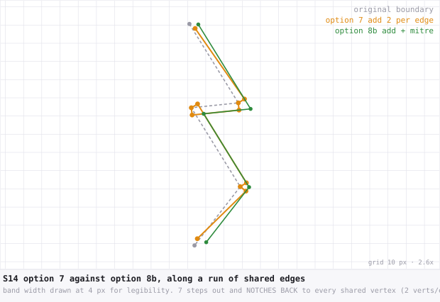

*Along a run, option 7 steps out and notches back to every shared vertex; 8b
mitres the run into one chain. Same repair, 42 path vertices against 18.*

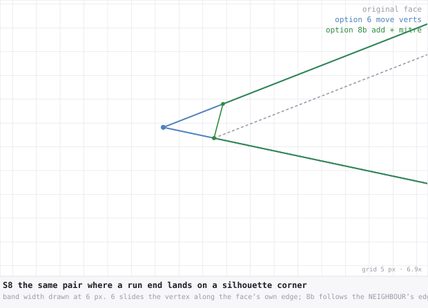

*At a free end that lands on a silhouette corner the two go in different
directions: 6 slides the vertex along the face's own edge, 8b adds one along
the neighbour's. Nothing is collinear here, so nothing cancels and the two
render differently — up to 129/255 across 197 pixels.*

#### The eight options, measured

Every option under the same metrics, one run, `perDraw` GPU-inclusive,
Chromium / Firefox. **gap** is missing ink inside the object; **outline** is
coverage moved anywhere the object is not solid, against the untouched fill;
**seam RMSE** is colour error against a seam-free 4× reference near a shared
edge; **off-seam Δ** counts pixels disturbed more than 3 px from any seam.
Widths are the best of a 1 px / 2 px sweep for that option.

**S8, textured cube** — 3 faces, 3 seam edges, every run ending on the
silhouette:

| # | option | ops | Chromium | Firefox | gap | outline | seam RMSE | off-seam Δ |
|---|---|--:|--:|--:|--:|--:|--:|--:|
| 0 | no repair | 3 | 0.0085 | 0.0289 | 175.75 | 0 | 12.54 | 0 |
| 1 | stroke every edge, every poly | 6 | 0.0191 | — | 0.08 | 1951 | 39.56 | 3 936 |
| 2 | expand every edge, every poly | 3 | 0.0090 | 0.1417 | **0.00** | 1953 | 39.90 | 3 946 |
| 3 | stroke every edge, farther poly | 5 | 0.0155 | — | 0.46 | 1310 | 15.95 | 2 592 |
| 4 | expand every edge, farther poly | 3 | 0.0085 | 0.0887 | 0.23 | 1311 | 16.59 | 2 597 |
| 5 | edge band, separate — stroked | 5 | 0.0155 | 0.2931 | 0.96 | 2.63 | 2.29 | **0** |
| 5f | edge band, separate — filled | 5 | 0.0122 | 0.0338 | 0.84 | 2.64 | 2.30 | **0** |
| 5f | …filled, ends trimmed | 5 | 0.0126 | 0.0326 | 0.92 | **0.50** | 2.32 | **0** |
| 6 | expand edge, move its verts | 3 | 0.0086 | 0.0236 | 0.90 | 23.31 | **2.28** | 453 |
| 7 | expand edge, add 2 verts | 3 | 0.0081 | 0.0228 | 0.34 | 14.00 | 2.29 | 390 |
| 8 | …verts along neighbour's edge | 3 | 0.0081 | 0.0232 | 0.62 | 10.90 | 2.30 | 388 |
| **8b** | **…+ mitre at run interiors** | **3** | **0.0086** | **0.0216** | 0.31 | 9.57 | 2.30 | 357 |

**S14, sawtooth** — one non-convex chart, 13 seam edges in one run, 6 reflex
corners:

| # | option | ops | Chromium | Firefox | gap | outline | seam RMSE | off-seam Δ |
|---|---|--:|--:|--:|--:|--:|--:|--:|
| 0 | no repair | 2 | 0.0077 | 0.0151 | 81.61 | 0 | 13.73 | 0 |
| 1 | stroke every edge, every poly | 4 | 0.0138 | 0.6660 | 0.04 | 1923 | 4.28 | 3 895 |
| 2 | expand every edge, every poly | 2 | 0.0077 | 0.0305 | **0.00** | 1919 | 4.28 | 3 891 |
| 3 | stroke every edge, farther poly | 3 | 0.0106 | 0.3354 | 0.16 | 956 | 4.28 | 1 945 |
| 4 | expand every edge, farther poly | 2 | 0.0077 | 0.0256 | 0.12 | 954 | 4.28 | 1 943 |
| 5 | edge band, separate — stroked | 3 | 0.0106 | 0.1881 | 0.16 | 1.05 | **4.28** | **0** |
| 5f | edge band, separate — filled | 3 | 0.0102 | 0.0256 | 0.24 | 1.05 | 4.28 | **0** |
| 5f | …filled, ends trimmed | 3 | 0.0098 | 0.0273 | 0.44 | **0.03** | 4.33 | **0** |
| 6 | expand edge, move its verts | 2 | 0.0077 | 0.0138 | 0.12 | 11.36 | 4.28 | 459 |
| 7 | expand edge, add 2 verts | 2 | 0.0077 | 0.0191 | 0.12 | 0.93 | 4.28 | 3 |
| 8 | …verts along neighbour's edge | 2 | 0.0077 | 0.0204 | 19.39 | 0.55 | 6.54 | 9 |
| **8b** | **…+ mitre at run interiors** | **2** | **0.0077** | **0.0171** | 0.12 | **0.42** | **4.28** | 1 |

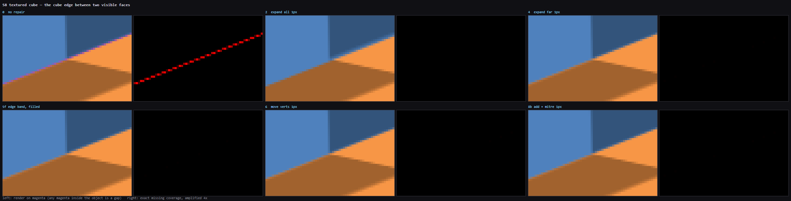
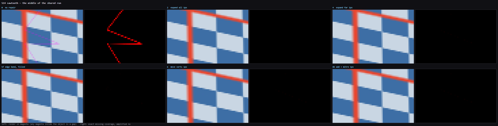

*The same rows, rendered. Left of each pair: the frame on **magenta**, so any
surviving gap is unmistakable — magenta inside the object is a leak. Right: the
exact missing coverage from the black/white differencing, amplified 4×, so
black means zero. The no-repair panels show the seam; every repair above closes
it. What the pictures cannot show is the **outline** column, which is why
options 2 and 4 look as clean here as 8b and are not.*

#### Reading the eight

**Options 1–4 are eliminated on quality, not on cost.** Every one of them can
drive the gap to nearly zero — option 2 reaches exactly 0.00 — and every one
pays for it with **1 000 to 3 900 px² of moved outline** and a seam RMSE of
15.9 to 39.9, against 2.3 for options 5–8. They do not repair the seam; they
inflate the object until the seam is buried.

Within that, the two conditions are not worth the same:

- **restricting to the farther polygon** (1→3, 2→4) improves outline by only
  ~1.5× (1951→1310, 1919→954). It halves *which* polygons grow, and each one
  still grows everywhere.
- **restricting to the shared edge** (4→6, the expand pair) improves it by
  **56× on the cube and 84× on the sawtooth** — and by **498× and 911×** for the
  stroke pair (3→5), because a whole-boundary stroke spills on both sides of
  every edge it covers. This is the condition that matters, and it is the one
  that needs per-edge adjacency rather than just a depth comparison.

**Options 5–8 are indistinguishable on the two things the repair exists for.**
Gap 0.02–0.96 px against 176 and 82 unrepaired; seam RMSE 2.28–2.33 and
4.28–4.33, a spread of 1 %. Whichever you pick, the seam is closed and the
colour at the seam is right. They differ only in **what they disturb elsewhere**
and in **what they cost**, so that is what decides.

**Option 8b dominates 6 and 7** — it is the best in-path form:

- against **6** (move the vertices): same operations, same cost, same or better
  gap, and outline 9.57 against 23.31 (cube) and **0.42 against 11.36**
  (sawtooth) — 2.4× and 27×. Nothing recommends 6 over 8b.
- against **7** (add verts along the normal): same operations, better outline
  (9.57 vs 14.00; 0.42 vs 0.93), a **2× better worst outline pixel** (0.18 vs
  0.28), and *fewer* path vertices — 18 against 42 on S14, because mitring
  merges the run into one chain.

**Option 5, given its own fill, is still the precision winner** — 0.03–0.50 px²
of outline and the only column of exact **zeros** off-seam — because a separate
fill composites its own spill onto the polygon's partial edge coverage and so
attenuates it, which no in-path form can do (isolated above: same band, 12.25
one fill against 2.64 two fills). It costs one extra operation per polygon and
must be emitted as a **fill**, not a stroke: as a stroke it is 7–9× the Firefox
cost for the same picture.

So the whole eight collapses to two answers:

| want | use | cost |
|---|---|---|
| cheapest repair that is still right | **8b**, then the collinear pass | no extra op, **+2 verts per run**, fewer after cancellation |
| least disturbance anywhere | **5f, trimmed** | +1 fill per polygon owning a seam edge |

and one warning: **option 8 without the run-interior mitre is not a working
repair** (gap 19.39 on S14). The neighbour-direction rule is correct only where
the neighbour's other edge is genuinely another edge.

#### The added vertices are subject to cancellation, and option 6 is what is left

Firefox caps path vertices per frame (§1.11, ~10 000), so "2 added vertices per
shared edge" is a budget item and not a rounding error. Two things reduce it,
and the second retires an option.

**Mitring makes the cost per *run*, not per edge.** Option 7 adds 2 vertices to
every band edge. Option 8b's mitre chain *replaces* a run's interior original
vertices — there is no notch back to them — so a run of *k* edges gives up *k*−1
vertices and gains *k*+1: a **net +2 per run, whatever the run's length**.
Verified by counting the emitted paths: S14, one 13-edge run, 16 → **18**
against option 7's **42**; S8, runs of 2 and 1 edges, 12 → **16** against 18.
Against the run structure counted in T49 that is +2 × 9 022 runs = **18 044**
added vertices on S1, where option 7 would add 2 × 24 488 = **48 976** — 2.7×
fewer, for a better picture.

**And then the collinear pass deletes what is left over.** §4.3 already drops
collinear boundary vertices with an exact test at ε = 0.05 px, and it already
runs on these loops. An added vertex is redundant exactly when it is collinear
with its neighbours in the emitted loop — which happens when **the two
polygons' other edges at that shared vertex lie on one line**. Then option 8b's
corner is where option 6's *moved* vertex would have gone, the original vertex
between them is collinear, and dropping it leaves option 6's loop exactly.
Measured, `bench/optgeom.mjs`:

| | emitted verts | droppable at ε 0.05 | after dropping |
|---|--:|--:|--:|
| S14, run ends on a straight edge | 18 | **2** | 16 = option 6's loop, *identical area* |
| S8, run ends on a silhouette corner | 16 | **0** | 16 |

On S14 the reduction is exact: the two loops enclose the same region — area
equal to six figures, symmetric difference **0.063 px²** of a 113 483 px² union
— so there option 6 really is as good, and two vertices cheaper. On S8 the two
polygons' edges at a hexagon corner meet at ~120°, nothing is collinear,
**nothing drops**, and the vertex is load-bearing: options 6 and 8b differ by up
to **129/255** across 197 pixels, which is the 2.4× outline gap between them.

So the honest conclusion is that **option 6 is not a separate option** — it is
what option 8b becomes, automatically, wherever it is adequate. Which gives the
implementation rule: **emit option 8b unconditionally and let the collinear
pass decide**, rather than testing the geometry up front. It costs nothing new
(the pass already runs), it is a numeric ε test rather than a special case so
near-collinear is handled too, and it can never drop a vertex that is doing
work. §4.3's T-junction caveat applies unchanged — do not get greedy with ε;
raising it to 0.5 px on S14 drops nothing further, so 0.05 is already taking
everything on offer.

What is **not** measured: the collinear fraction at batcher scale. It needs the
neighbouring batch's loop geometry at every run end, which `bench/seamruns.mjs`
does not compute. The vertex figures above are therefore an upper bound there,
not an estimate.

#### The trade-off matrix

One row per option, one column per axis a renderer actually budgets. **impl**
is lines-of-code order, not a measurement. **ops** and **verts** are what the
option *adds* per polygon. Every cell is `S8 / S14`, taken from **one** row per
fixture — the best width for that option on that fixture, which is w = 2 for
the stroked bands and the cube's 7/8b rows and w = 1 elsewhere — so cost and
quality in a row always describe the same render.

| # | needs | impl | ops added | verts added | Chromium ms | Firefox ms | gap px² | outline px² | off-seam |
|---|---|---|---|---|--:|--:|--:|--:|--:|
| 0 | — | — | 0 | 0 | .0085 / .0077 | .0289 / .0151 | 175.8 / 81.6 | 0 | 0 |
| 1 | nothing | ▁ | **+1 stroke** | 0 | .0191 / .0138 | **—** / .666 | 0.08 / 0.04 | 1951 / 1923 | 3936 / 3895 |
| 2 | nothing | ▁▁ | 0 | 0 | .0090 / .0077 | .1417 / .0305 | **0.00 / 0.00** | 1953 / 1919 | 3946 / 3891 |
| 3 | depth, per-poly | ▁ | +1 stroke | 0 | .0155 / .0106 | **—** / .335 | 0.46 / 0.16 | 1310 / 956 | 2592 / 1945 |
| 4 | depth, per-poly | ▁▁ | 0 | 0 | **.0085 / .0077** | .0887 / .0256 | 0.23 / 0.12 | 1311 / 954 | 2597 / 1943 |
| 5 | adjacency + depth | ▁▁ | +1 stroke | 0 | .0155 / .0106 | .2931 / .1881 | 0.96 / 0.16 | 2.63 / 1.05 | **0 / 0** |
| 5f | adjacency + depth | ▁▁▁ | **+1 fill** | 4 / band edge | .0122 / .0102 | .0338 / .0256 | 0.84 / 0.24 | 2.64 / 1.05 | **0 / 0** |
| 5f trimmed | + run ends | ▁▁▁ | +1 fill | 4 / band edge | .0126 / .0098 | .0326 / .0273 | 0.92 / 0.44 | **0.50 / 0.03** | **0 / 0** |
| 6 | adjacency + depth | ▁▁ | **0** | **0** | .0086 / .0077 | .0236 / .0138 | 0.90 / 0.12 | 23.31 / 11.36 | 453 / 459 |
| 7 | adjacency + depth | ▁ | **0** | 2 / band edge | .0081 / .0077 | .0228 / .0191 | 0.34 / 0.12 | 14.00 / 0.93 | 390 / 3 |
| 8 | + neighbour vertex | ▁▁▁ | **0** | 2 / band edge | .0081 / .0077 | .0232 / .0204 | 0.62 / **19.39** | 10.90 / 0.55 | 388 / 9 |
| **8b** | + neighbour vertex | ▁▁▁▁ | **0** | **2 / run** | .0086 / .0077 | .0216 / .0171 | 0.31 / 0.12 | 9.57 / **0.42** | 357 / 1 |

**—** = did not finish inside the 45 s watchdog (a pattern stroke on Firefox).

Reading the columns:

- **draw calls.** Only 1, 3, 5 and 5f add one. 2, 4, 6, 7, 8 and 8b add none —
  they change the path the fill was going to draw anyway. At batcher scale
  that is the difference between ~835 extra fills per frame and zero.
- **path vertices.** The axis Firefox's ~10 000-per-frame budget (§1.11) spends.
  Free for 2/4/6; 4 per band edge for 5f; 2 per band edge for 7 and 8; **2 per
  run** for 8b — 18 044 against 48 976 on S1's counted run structure.
- **record cost.** Tracks `ops` and vertices; the whole spread across 0–8b on
  Chromium is 0.0077–0.0216 ms, i.e. under 0.015 ms on a 3-polygon fixture.
- **frame cost, and cross-engine risk.** This is where the options separate
  hardest, and not on Chromium. Any option that emits a **pattern stroke**
  (1, 3, 5) is 7–9× its fill equivalent on Firefox and can leave the canvas
  `soft` — the two heaviest read `soft` on Gecko's own indicator where every
  other row reads `ACCEL`. Option 2 is erratic there too. **Every recommended
  option below emits only fills.**
- **precision.** Two independent numbers, and the whole-boundary options fail
  the second one by three orders of magnitude. Gap says whether the seam
  closed; outline says what it cost elsewhere.

#### Rules

1. **Never repair a silhouette edge.** Nothing is behind it to conflate with,
   so the repair is pure inflation. This single condition is worth **56–84×**
   in moved outline when expanding and **498–911×** when stroking — far more
   than the depth test, which is worth ~1.5×. If you can only afford one test,
   afford this one.
2. **Only the polygon drawn first repairs a shared edge.** Growing over a
   neighbour already on the canvas moves the visible boundary instead of
   hiding a gap.
3. **Emit fills, never a pattern stroke.** Same picture (RMSE 0.000–0.002),
   7–9× the Firefox cost, and the heavy cases drop the canvas out of
   acceleration.
4. **Default to 8b**, then run §4.3's collinear pass. No extra draw call, +2
   vertices per run, and it reduces to option 6 by itself wherever option 6 is
   adequate. Emit it unconditionally rather than testing the geometry up front.
5. **Reach for 5f-trimmed when the outline must not move at all.** It is the
   only form measuring exactly zero off-seam, and it costs one fill per polygon
   that owns a shared edge. Budget that against your fill count first.
6. **Band width is twice the equivalent expansion.** A centred band of width w
   reaches w/2 past the edge, and a straddling pixel needs a full pixel of
   cover: w = 2 for a band, d = 1 for an expansion. 1 px of band leaves a third
   of the gap (37.5 against 0.96).
7. **The band must overlap the fill, not abut it** — when it is a separate
   fill. Outside-only re-creates the conflation it repairs (gap 88.6 against
   0.84). Inside one fill the constraint lifts, which is why 7/8/8b can be
   outward-only.
8. **The band must carry the texture**, not a flat colour: its inner half is
   visible. Same coverage, seam RMSE **34.80 against 2.30**.
9. **Pad the atlas.** Every option's outward ink samples slightly outside the
   face's UV rect. It is always covered, so *what* it samples never shows — but
   it must be opaque or the gap survives.
10. **Do not apply option 8's neighbour rule at a run interior.** There the
    neighbour's other edge is the next shared edge and the direction is
    tangential: gap 19.39 against 0.12.
11. **Measure gaps, do not look for them**, and measure the outline too. A
    repair that closes the gap by inflating the object scores perfectly on a
    gap-only metric — options 1 and 2 reach 0.00 while moving 1 900+ px² of
    outline.

#### Scope, stated honestly

The outset is measured on three large quads. The primary case — a plane or a
cube face made of two coplanar triangles, drawn with one operation — is
settled. Generalising the **outset** to the 940 arbitrary, possibly non-convex
boundary loops the flat-colour batcher produces per frame stays unmeasured, and
the reason is not just cost: offsetting a general polygon needs mitre handling
and moves vertices it shares with edges nobody asked to move. The band above is
the mechanism that removes that objection, and it is measured on a non-convex
loop — but on **one** such loop, not on 940 of them per frame, so its op count
and vertex count extrapolate and its per-frame cost at batcher scale does not.

For the **flat-colour** many-triangle case nothing here changes the answer, and
the run-structure counts above now say why it is not merely unmeasured but
unpromising in its cheap form: the stroke repair of §4.4 is what is measured, on
S1 and S2, at scale. The band is a candidate there too — a flat-coloured band is a fill in the batch colour, and
§4.4's lever 2 exists precisely because a stroke displaces the boundary the
band would leave alone — but that experiment has not been run, and an untested
mechanism does not get to replace a measured one.

#### Methodology: measure gaps, do not look for them

Render the same frame twice, once on a **black** background and once on
**white**. A fully covered pixel comes out identical both times; a pixel with
background bleeding through differs by exactly the bleed fraction times 255. So

```
beta = |white - black| / 255
```

is the missing coverage at that pixel, exactly. Summed over pixels that a
single-fill silhouette mask says are interior, that is the total gap area in
pixels, and zero means zero.

That metric earned its keep immediately: it reported a stubborn ~66 px² residual
that survived every outset size. Localising it showed 53 px² sitting **more than
10 px deep inside the faces** — nowhere near any edge. The cause was the test
atlas: its cell height was 512/3, so the per-cell `fillRect`s landed on
fractional boundaries, got antialiased, and left 1024 semi-transparent texels.
The renderer was innocent; the fixture was leaking. **If you measure gaps, first
prove your texture is opaque** — one pass over the alpha channel.

#### Methodology: a gap metric that also catches bloat

The black/white differencing above gives per-pixel coverage exactly, but
comparing it against a *binary* interior mask forces you to erode the
silhouette ring away — and the ring is exactly where an outset does its damage.
Two changes fix that, and they are what the four quality columns are:

1. **Exact coverage, not a binary mask.** Render the union of every visible
   polygon as **one path, one fill** at 4× and box-filter it: a single fill has
   no internal seam by construction, so this is the object's true coverage,
   fractional on the silhouette included, to 1/(16·255). Then
   `gap = Σ max(0, α_true − α)` over strictly interior pixels — no erosion, no
   threshold. It is a stricter number than §4.8's: the "exactly zero" rows there
   read 0.4–0.9 here, because that metric dropped every deficit below 0.02 and
   this one sums all of them. The **ranking** is what transfers.
2. **For the outline, drop the reference entirely.** On the silhouette, coverage
   from a 4× box filter and coverage from Skia's analytic antialiasing differ
   for reasons that are not defects, so no absolute number there means anything.
   What means something is the change against the **plain fill**, which draws
   the true polygons: `outline = Σ |α − α_fill|` over every pixel the object
   does not solidly cover. Zero means the outline was not touched, and only the
   plain fill scores zero by construction.

And the colour reference is cross-checked rather than assumed. Three were built
at 4×: fill-only, outset by 1 *device* pixel, and a 2-device-pixel band. The two
seam-free ones agree to RMSE **0.078** (cube) and **0.027** (sawtooth) while
both differ from fill-only by **0.29** and **0.20** — so the reference does not
depend on which mechanism closed its seam, which is the one thing that could
have made this comparison circular.

### 4.9 Overdraw: occlusion culling without a depth buffer

*Registry: T18, T19, T20 — fixture and extrapolation scope in §10.5.*

#### The observation

A painter's-algorithm renderer already owns a **total depth order**. So it does
not need depth *values* in order to occlusion-cull. Walk the same sorted list
the other way — near to far — and "is this face visible?" stops being a depth
question and becomes a two-dimensional one:

> is this face's screen footprint already claimed?

That is a coverage buffer, and coverage is one bit per sample. The sort has
already done the depth buffer's job, which is why no per-pixel depth appears
anywhere in this section. The lineage is old: Doom's `solidsegs` and Build's
C-buffer did exactly this in 1D, per scanline column. This is the same idea in
2D — or equivalently Intel's Masked Software Occlusion Culling (2016) with the
depth half of every tile deleted as redundant. §9 is the annotated reading
list, including the one paper that is very nearly this exact algorithm.

Which also explains why it pays *more* here than on a GPU. On a GPU, culling a
hidden triangle saves its pixels. In canvas2d the pixels are the cheap part;
what you actually remove is the face's contribution to the **batcher's input**,
and it takes its path vertices, its share of a `fill()` and its share of a
`stroke()` with it.

#### The trick that makes the test free

**The mark and the test are the same operation.** Marking a face that is
already fully covered sets no new bit — so "did I set a bit?" answers "was I
visible?" at no extra cost. There is no query phase, no second traversal, and
no hierarchy needed for correctness:

```
for t in order, near -> far:
    newbits = 0
    for each sample row of t:
        OR the row's span into the mask, remembering whether any bit was 0
    if (t covered at least one sample && newbits == 0)
        drop t                       # invisible
```

Three things make it cheap:

- **Coverage is a bitmask** — one `Int32` per 32 samples of a sample row — and
  spans come from exact edge/scanline intersections, not per-pixel edge
  functions. A span costs O(span / 32) word operations instead of O(span) pixel
  operations. Fold the sample scale into the vertices once and the row loop
  contains no multiply at all: both x limits walk by DDA and the only branch is
  the one crossing the middle vertex.
- **A block hierarchy** — one saturation counter per block of 32 samples × 8
  sample rows — rejects a hidden face in one to four array reads, with no
  scanline setup and no marking. Skipping the marking is *exact*, not
  approximate, precisely because marking a fully covered face would have been a
  no-op. Measured on the torus knot: 4.3 ms → 1.8 ms, and the cull rate goes
  slightly **up**, because the bbox test also catches sub-sample faces sitting
  inside already-saturated blocks.
- **Survivors come out already sorted.** Write them into the output array from
  the far end while walking near → far, and the result is in painter order with
  no reverse pass and no second array.

#### The skirt: one pass, and it beats supersampling

At one sample per pixel the residual error is not spread evenly. It is entirely
faces whose *visible* part is a sub-sample sliver — and those live in exactly
one place: straddling an occlusion boundary, with a surviving face on the other
side of a shared mesh edge. So:

> **refuse to cull a face that has a surviving neighbour.**

One O(nVis) pass over the adjacency you already built for edge cancellation
(§4.3), and no extra rasterisation. Torus knot, against a 3×3-supersampled
reference of the unculled scene:

| | cull % | ms | px off by >16/255 | >64/255 | RMSE |
|---|--:|--:|--:|--:|--:|
| bare, 1 sample/px | 75.4 % | 1.75 | 116 | 2 | 0.281 |
| bare, 2×2 samples/px | 75.4 % | 2.72 | 22 | 0 | 0.099 |
| **skirt, 1 sample/px** | **73.6 %** | **1.82** | **23** | **0** | **0.097** |
| skirt, 2×2 samples/px | 73.7 % | 2.95 | 1 | 0 | 0.021 |

The skirt at one sample per pixel is **better on fidelity than doubling the
sample rate and 1.5× cheaper**, for 1.8 points of cull rate. That is the
configuration to ship. And it costs **nothing at all** for one object occluding
another: the skirt only grows across shared mesh edges, so it charges only where
a surface occludes *itself*.

Note what "one sample per pixel" means — the coverage grid sits on the same
lattice the rasteriser samples. Going coarser is where it falls apart: at half
resolution the torus knot's >16/255 pixel count goes from 23 to 10 *with* the
skirt but to 487 without it, and on the grid to 4 243 (§5.5). Going finer buys
little that the skirt has not already bought.

#### What it costs, and when not to run it

The one mesh shape this cannot help is a **convex closed** one. After backface
culling there is a single sheet, overdraw is exactly 1.00×, and every cycle the
culler spends is wasted: 1.57 ms on a 19 596-face sphere to remove zero faces.
So the guard is not optional. `Occluder` measures its own cull rate and, below
`minRate` (6 %), skips itself for 4 frames, then 8, doubling to a cap of 64,
re-probing once at the end of each interval. Amortised worst case on content
with no occlusion: ~0.03 ms a frame. This is CHC++'s "don't re-query what was
visible" reduced to its simplest useful form, and it is what lets one
configuration be safe on any mesh — the same reasoning as `autoFallback` (§1.7).

Do not try to replace the guard with a mid-walk early-out. Cull rate *rises*
as the walk goes on — the nearest faces are never cullable and the farthest
usually are — so aborting early on a low running rate throws away exactly the
faces you were trying to find. In a two-object scene the far object arrives at
the very end of the list.

#### Wiring it in

```js
// once, at load
const occluder = new Occluder({
  width, height, triangleCount,
  indices,
  adjacency,          // the same array buildAdjacency() gave the batcher
  sampleScale: 1,     // the rasteriser's own lattice; see above
  skirt: true,        // free for inter-object occlusion, cheap for self-
  autoSkip: true      // stop paying on convex meshes
});

// every frame, between the depth sort and the batcher
scene.build(...);
occluder.cull(scene);
scene.order = occluder.list;      // survivors, far -> near
scene.nVis  = occluder.count;
batcher.draw(ctx, scene);
```

Order matters: **cull before you batch.** Afterwards the hidden faces have
already been tessellated into a merged boundary and there is nothing left to
remove. When the guard decides to skip, `list`/`count` come back as the
caller's own `order`/`nVis`, so that snippet stays correct either way.

Two things that make this safe rather than lucky:

- **`PainterBatcher` already tolerates a shrinking visible set.** A culled
  triangle never gets `batchOf` written this frame, so the seam test
  `batchOf[n] >= tag && batchOf[n] < tag + nB` reads it as not-visible and the
  shared edge is classified as silhouette rather than seam. That is the correct
  answer — the neighbour is not being drawn, so there is no conflation to
  repair — and it *reduces* stroke work. One caveat: the epoch reset clears
  `stamp` but not `batchOf`, so after ~60 000 frames a stale entry can land
  back inside the live tag range and cost you one spurious stroked edge. Add
  `batchOf.fill(0)` next to `stamp.fill(0)`; culling makes that path reachable
  for many more triangles than before, since culled faces never refresh theirs.
- **The culler trusts the same centroid sort the painter trusts**, so it
  inherits the painter's ordering errors and introduces no new class of them.
  What changes is the *symptom*: a sort inversion the painter would have drawn
  in the wrong order becomes a face that vanishes instead. Worse in kind, so it
  is worth counting — measured against a true per-pixel z-buffer, with the
  skirt on, that is **1 face and 1 pixel** on the torus knot (§5.5).

#### What is left on the table

Marking dominates the remaining cost, and it is paid per face. The next step is
to mark per **cluster**: precompute contiguous ~128-face patches at load time,
and note that a patch whose faces are all front-facing projects exactly to the
non-zero-winding region of its boundary loop — so you rasterise ~30 edges
instead of 128 triangles, and one hierarchy test can reject the whole patch.
Estimated 4–8× cheaper marking; not implemented here. The catch is ordering: an
occluder is only valid for occludees behind its *far* z, so clusters want
sorting by far-z for marking and near-z for testing, or you accept centroid
sorting and the same class of error the painter already accepts.

---

### 4.10 Fog

*Registry: T29, T30, T31, T32, T36, T37 — fixtures and extrapolation scope in
§10.5.*

#### The answer first

**Fog is a term you fold into a pass you already run. It is not a pass.** That
is what every renderer without a depth buffer did (§9.8) and what every modern
deferred renderer still does — one `lerp(color, fogColor, f(depth))` inside a
shader that already has depth bound. A depth map plus a composite chain is the
anomaly.

*Where* you fold it depends on one thing: **whether your albedo pass is flat.**

| your fill pass | fold fog into | measured |
|---|---|--:|
| flat colours only | the **palette** — `[material][shade][band]`, one pass, zero composites | **0.50× the chain**, Firefox |
| uses `CanvasPattern` for textured faces | **a WebGL fog pass** — canvas2d keeps fill and shade, WebGL rasterises the fog term from your geometry behind a real depth buffer | **0.85× the frame, 3.7× on the fog stage** |

Those are the only two answers that move. Everything you can do *inside*
canvas2d's composite algebra lands within a few per cent of the chain you
already have, for the reason in "Where the fog cost actually is" below: the
composites are ~1 ms and the fog **geometry pass** is ~14 ms.

The rest of this section is why, in the order the question actually gets asked.

#### The palette version, when the albedo is flat

Each face gets one flat colour, so the granularity is **per face** and the
mechanism is a lookup:

```
palette[material][shade][fogBand]  ->  '#rrggbb'
```

pregenerated once. Per frame you pick a `fogBand` per face from whatever fog
function you like, and the fog is *in* the colour. That is Doom's
`scalelight[LIGHTLEVELS][MAXLIGHTSCALE]`, one dimension wider (§9.8).

#### The precondition, stated before the numbers

**Folding needs a flat albedo.** `albedo·shade·(1−d) + fog·d` can only be one
`'#rrggbb'` if the albedo is one colour for the whole face. The moment the
albedo pass uses a `CanvasPattern` for a textured face (§4.7), that face's
albedo varies per pixel and there is nothing to fold it into. So a deferred
engine that textures anything cannot take this wholesale — it can take it for
the flat-shaded *subset* of its geometry, and has to keep a composite chain for
the rest.

Read the rest of this section with that in mind: the 2× is real and it is only
available to a flat-shaded pipeline.

#### What it buys, measured

Torus knot, 28 714 visible faces, 1280×720, 8 fog bands, all flat-shaded.
Target algebra in every correct row:

```
out = albedo · shade · (1 − d)  +  fog · d
```

| id | what it does | passes | composites | Chromium | Firefox | vs A |
|---|---|--:|--:|--:|--:|--:|
| **A** | `×keep`, invert in place, tint, `+add` | 3 | 6, one unaccelerated | 65.6 ms | **99.8 ms** | 1.00× |
| **B** | keep and add as separate batches | 4 | 4, all accel | 76.9 ms | 120.2 ms | 1.20× |
| **B2** | keep and add, **one batch two emits** | 3 | 4, all accel | 70.9 ms | 106.5 ms | 1.07× |
| **C** | keep folded into the shade palette, `+add` | 3 | **2**, all accel | 75.2 ms | 99.1 ms | **0.99×** |
| **F** | `screen(d)` — **white fog only** | 3 | **1**, all accel | 69.5 ms | 100.1 ms | 1.00× |
| **E** | keep in shade, no add — **black fog only** | 2 | 1 | 68.8 ms | 82.7 ms | 0.83× |
| **D** | folded into the palette | **1** | **none** | 74.5 ms | **50.4 ms** | **0.50×** |
| | *(no fog at all, reference)* | 2 | 1 | 66.5 ms | 85.0 ms | 0.85× |

**D is 2.0× the shipped chain on Firefox** — stable across two runs at 0.49×
and 0.50× — because it deletes two geometry passes. E and F are not the same
picture; they are the two degenerate fog colours, priced below.

**And the result that inverts the obvious advice: A is the best of the general
composite architectures.** Not B (1.20×), not B2 (1.07×), and C only draws
level. The reason is the cardinality table below: **a fog pass keyed by band
alone is 8 colours and batches to a handful of fills**, and the invert then
derives the additive term from it for free. Folding keep into the shade pass
instead multiplies *that* pass's colour count by the band count (24 → 192);
that costs nothing measurable on Firefox and 1.15× on Chromium, where the extra
small non-convex fills land in Skia's fill-count valley (§3.1).

B is worth a note of its own, because the first version of this measurement got
it wrong. B drew the keep map and the add map as two *independent* passes, which
re-batched the same colour key twice — an artefact of the harness, not of the
architecture. Both maps are functions of `d` alone, so they **share a colour
key**: one batching, two emits. Fixing that is B2, and it recovered 13 of B's 20
points. It is still behind A.

So if you are keeping a composite chain, **keep the invert.** It is off
Firefox's accelerated list (§6.13) and it is still cheaper than every
arrangement that avoids it. Take C only for what it actually buys — it removes
the unaccelerated op at no cost on Firefox — and only where that matters: on a
canvas that could otherwise stay accelerated, such as a static camera or a fog
buffer you do not redraw. On animated geometry the canvas demotes by itself
(T06) and there is nothing to protect.

*Measurement caveat, and it is a real one.* Chromium reported **A at 65.6 ms
and no-fog at 66.5 ms** in this run. A strictly does more work, so that
ordering is impossible and the Chromium spread here is ±2–10 ms (D moved
67.7 → 74.5 between runs). Do not read any Chromium ranking in this table
inside ~10 %. Firefox, being all-CPU with no pipelining, is the stable side at
±3–9 %; what survives on both engines is D ≈ 0.50×, B ≈ 1.20×, C ≈ A.

Why: each pass is priced in vertices, and the passes are keyed by different
things with very different cardinalities.

| pass | keyed by | colours | fills | verts |
|---|---|--:|--:|--:|
| albedo | material | 8 | 203 | 44 969 |
| shade | shade level | 24 | 489 | 88 428 |
| fog keep/add | **fog band alone** | 8 | **8** | 8 585 |
| folded | material × shade × band | 619 | 1 075 | **80 537** |

A fog pass keyed by band alone batches to about *B* fills — 8 bands, 8 fills —
which is why it looks free and is not: it still costs 8 585 vertices, and
vertices are what Firefox charges for. Folding trades 872 extra fills for
61 445 fewer vertices, and at §1.1's coefficients that is a win on both
engines.

#### Where the fog cost actually is

Before optimising the composites, decompose the 15 %:

| | Firefox |
|---|--:|
| frame with fog (A) | 99.8 ms |
| frame with no fog | 85.0 ms |
| **fog costs** | **14.8 ms — 15 % of the frame** |
| …of which the composites are | ~1.2 ms |
| …and the fog **geometry pass** is | **~13.6 ms** |

The composites are four accelerated ops at 0.0081 ms each plus the invert at
1.06 ms (§5.6). **So every trick that rearranges the compositing — a different
op, a chroma key, CSS blend modes, a WebGL composite — is fighting over 1.2 %
of the frame.** The 13.6 ms is one more batching and one more full-screen
opaque rasterisation, and no composite algebra touches it.

That is the single most useful number in this section. It is why A, B2, C and F
all land within a few per cent of each other, and why D — which removes passes
rather than ops — is the only thing that moves.

#### Three early-outs, upstream of the fog pass

*Early-outs 1 and 2 are exact algebra — the same identity "Fog pays for the
clears" establishes below — and both now fall out of the histogram the prep
step already builds (§4.11), at no cost. Early-out 3 has since been measured,
and the measurement inverted it: the direction that pays is the **opposite**
one. See §4.11 and T52–T56 before implementing #3 as written here.*

Everything above optimises the fog pass. These three skip it — in whole or in
part — before it runs, and all three come out of **one pass over the face list
you have already depth-sorted** (§4.1, §4.9): no new sort, no new traversal,
just a read of each face's fog factor `d` on the walk you were doing anyway.
Split faces into **fogged** (`d = 1`, contributes exactly the fog colour —
"black" on the keep map) and **lit** (`d < 1`, contributes something a viewer
can tell apart from the backdrop):

1. **No lit face anywhere → the frame is a solid rectangle.** If every visible
   face is fully fogged, `out = fog` everywhere (the same identity as "Fog pays
   for the clears" above), so skip the fill pass, the shade pass, the fog
   geometry pass, and every composite, and paint one full-canvas `fillRect` in
   the fog colour instead. This is what a thick or radial fog does to a distant
   scene: geometry that ordinary occlusion culling (§4.9) cannot touch, because
   nothing opaque is covering it — each face is simply, individually
   saturated — collapses to a single accelerated op at roughly the per-op cost
   already measured in §5.6 (~0.008 ms), instead of the full pipeline (99.8 ms
   in the reference scene above). This is the case the culling in §4.9 cannot
   reach on its own: it removes faces hidden *behind* opaque geometry, not
   faces that are merely uninformative because fog has saturated them.

2. **No fogged face anywhere → skip the fog pass, keep fill+shade.** The
   opposite question, same pass: if no face reaches `d > 0`, the fog term is
   zero everywhere, so drop the fog geometry pass and its composites entirely.
   That reproduces the "no fog at all" reference row two tables up — 85.0 ms
   Firefox / 66.5 ms Chromium against 99.8 / 65.6 with fog — reached
   dynamically, per frame, instead of by shipping a fog-less build. This is
   the common frame: fog usually only bites past some distance, and most of
   the time a player is looking at nearby geometry that never reaches it, so
   the expensive difference/composite chain is skipped outright rather than
   merely made cheap.

3. **Mixed frame → drop only the fogged faces the lit ones can't need.** When
   the pass finds both kinds, keep a running union of the screen footprints of
   the **lit** faces as you walk the list — the same coverage machinery as
   §4.9's mask, or as coarse as a per-tile boolean grid — and test each fully
   fogged face's footprint against that union before drawing it. Skip it only
   when the two are disjoint: nothing lit exists at that screen location, at
   any depth, so this face's contribution is indistinguishable from the
   fog-coloured backdrop either way. Where they do overlap, keep drawing it —
   a lit face can sit *behind* a fully fogged one, and the fogged face's
   opaque, fog-coloured coverage is the only thing hiding it; a plain occlusion
   test cannot tell "covered by opaque near geometry" apart from "covered by
   nothing, but so fogged it doesn't matter," which is exactly why #1's mask
   has to stay conservative in that direction.

**#3 as written is the wrong direction, measured.** Keeping the union of the
*lit* faces and testing the *fogged* ones against it is the version that reads
naturally, and on a radial fog it finds almost nothing: the lit faces are the
big central region, so the fogged ones almost always overlap them. The
direction that pays is the inverse — keep a per-tile record of which *classes
are present*, make the dominant class the backdrop, and drop the **dominant**
band's faces where no foreign band is present. Same one pass over the same
list, and it removes 94.3 % of the faces where #3 removes a handful (§4.11).
The other correction is to stop asking about coverage at all: a coverage claim
needs triangle interiors and is defeated by a mesh tessellated below tile size,
which is exactly the terrain case (§4.11, and the figure there).

All three assume the background discipline "Fog pays for the clears" already
requires — a fog-coloured backdrop, not stale or arbitrary content — since a
skipped face leaves whatever is already there. #1 and #2 apply to any fold or
composite architecture, D included: even with fog baked into one palette
lookup, an all-fogged or all-clear frame still lets you skip the whole
fill/shade walk, not just a separate fog stage. #3 only buys anything where
there is a separate geometry pass left to shrink — A, B, B2, C, E, F, or the
WebGL upload in W2 — because D has already folded fog into the one colour pick
per face and has no second pass to drop a face out of, though the same
disjointness test still drops the face from the fill/shade walk itself.

#### What the accelerated op set can express

Worth writing down because it closes the search rather than adding to it.

**No composite operation can read a colour channel and write alpha.** The
Porter-Duff ops key entirely off alpha; the separable blend modes operate on
colour but their alpha result is always plain source-over,
`αo = αs + αb(1−αs)`, independent of the blend function. The only colour→alpha
paths in canvas2d are `ctx.filter` with an SVG `feColorMatrix
type="luminanceToAlpha"`, `getImageData`, and a WebGL shader — the first two
being the two worst rules in the guide.

That matters because `out·(1−d) + F·d` *is* `source-over` with `F` at alpha `d`
— one `OP_OVER`, the cheapest blend there is. You cannot get there, and not
only because of the swizzle: **you cannot build a per-face partial-alpha canvas
with a painter at all.** Every alpha-writing op composites rather than
replaces, so two overlapping faces compound — `0.3 + 0.5·0.7 = 0.65`, not
`0.3`. Front-to-back with `destination-over` does not rescue it either: the
first writer claims only `da = d < 1`, so farther faces bleed through. `copy` is
the only replace-semantics op and it is whole-canvas. **Opaque colour channels
are the only painter-correct carrier for a per-face quantity**, which is why the
grayscale buffer is not a workaround but the only option.

You do not need alpha, though, because **each blend's neutral colour is a
chroma key**:

| neutral colour | ops | i.e. "transparent on…" |
|---|---|---|
| **white** | `multiply` | white pixels leave the destination alone |
| **black** | `screen`, `lighter` (`OP_ADD`) | black pixels leave the destination alone |
| *alpha-driven* | `over`, `dest-over`, `dest-out`, `atop`, `source`, and the four `UnboundedBlend` ops | unreachable from a painter-built colour map |
| *none* | `copy`, `clear` | |

Keying on some *other* colour is available too, but at the palette rather than
at the composite: you choose what value the map holds, so you choose which
value lands on the neutral. That is free, and it collapses back to the two
cases.

**Exactly two colour neutrals, therefore exactly two terms.**
`out = A·S·(1−d) + F·d` has one multiplicative term (needs the white key) and
one additive term (needs the black key), so it needs **two maps and two ops**,
and no re-keying, tinting or reordering reduces that. The same floor falls out
of the arithmetic independently: `multiply` by `M` then `screen` by `N` gives
`out·M·(1−N) + N`, and setting `N = F·d`, `M = (1−d)/(1−F·d)` per channel
solves it exactly — both in `[0,1]` since `F ≤ 1`, both functions of the band
alone. Two derivations, same answer. C already sits on the floor.

**The one thing the enumeration hands you is the degenerate cases.** When the
fog colour *is* the neutral of the other key, the two terms fuse into one:

- `screen(out, d) = out·(1−d) + d` — **white fog, exactly, in one op** (F above:
  one composite instead of six, and it measured level with A on Firefox).
- `multiply(out, 1−d)` — **black fog, exactly, in one op** (E, 0.83×).

So a configurable fog colour deserves a fast path at white and at black that
the general case cannot have.

#### What it costs

**Batch splitting.** Fog in the colour means faces at different depths cannot
merge. That is the real price and it grows with band count:

| bands | folded fills | folded verts | vs 2-pass no-fog | RMSE | max Δ | px >8/255 | px >16/255 |
|--:|--:|--:|--:|--:|--:|--:|--:|
| 8 | 1 075 | 80 537 | 0.73× / 0.91× | 3.82 | 10 | 1.43 % | **0 %** |
| 16 | 1 498 | 84 883 | 0.84× / 1.13× | 1.80 | 6 | 0 % | 0 % |
| 32 | 2 313 | 93 063 | 1.04× / 1.56× | 0.90 | 3 | 0 % | 0 % |

(`vs` is predicted record cost, Chromium / Firefox.) Quality is measured
against exact per-**pixel** fog with perspective-correct depth — `1/z` is linear
in screen space, `z` is not — so the error is purely the per-face
quantisation.

**Where to sit: 8 to 16 bands.** The batcher's own RMSE against a supersampled
reference is 4.48 on this scene (§5.1), so at 8 bands fog banding is already
*below the renderer's existing error floor*, and at 16 there is no pixel off by
more than 8/255. Doom shipped 32 and Quake 64; you need fewer because your
faces are small.

**Beyond 16 it inverts.** At 32 bands folding costs more than the chain on
Firefox (1.56×). The knee is real and it is where you should stop.

**A wider colour index.** material × shade × band exceeds 256, so the
per-triangle colour array has to go from `Uint8Array` to `Uint16Array`, and
`PainterBatcher`'s `openByColour = new Int32Array(256)` has to widen with it.
Two lines.

**The two-pass split, if you were using it for seams.** Folding collapses
albedo × shade into one pass, so if that multiply was doing seam mitigation you
lose it. §4.4's three stroke levers do that job with measured numbers; check
whether the split still earns its keep once they are in. If it does, take
architecture C instead — fog folded into the *shade* palette only, plus one
`lighter` add — which keeps the split and still beats A.

#### Two things that come free

**Radial fog costs nothing extra.** Fog about a world point that is not the
camera is just a different band function. Measured at 8 bands: 1 249 fills /
80 344 verts, 0.76× Chromium / 0.99× Firefox against no fog — the same answer
as linear. A depth-map pipeline has to encode it and a screen-space gradient
cannot express it at all, because fog has to follow the depth of the *visible
surface*, not the pixel's position.

**Fog stops forcing an opaque canvas.** There is no fog canvas, so there are no
face contours with baked-in alpha to show up as haloes after a multiply, and
nothing has to pre-fill the background with the fog colour. `alpha: true` and
fog become compatible, which they are not in a composite pipeline.

#### If you keep a fog pass

Which, if you texture anything, you will. Two things are worth knowing before
you try to make it cheap — and see the A/C result above first, because the
obvious cleanup is not one.

**Half resolution does not work, for two independent reasons.** The first is
fidelity: a low-res fog map upsampled bilinearly averages across depth
discontinuities, so background fog bleeds onto object silhouettes as a halo.
The standard fix is bilateral / nearest-depth upsampling (§9.8), which needs a
full-res depth buffer to choose the tap — and you do not have one. The second
is that it would not pay anyway:

| fog canvas | fog fills | fog verts | vs full |
|---|--:|--:|--:|
| 1280×720 | 8 | 8 585 | 1.00× |
| 640×360 | 8 | 8 399 | 0.98× |
| 320×180 | 8 | 8 086 | **0.94×** |
| 160×90 | 8 | 7 374 | 0.86× |

**Vertex count is resolution-independent** — a merged region's boundary has the
same number of vertices whether it covers 4 pixels or 400, and only the
collinear-ε test (§4.3), whose epsilon is in pixels, trims any of them. Quarter
resolution removes the raster area and 6 % of the work Firefox actually
charges for.

**And do not "clean up" the invert without measuring it.** The reflex is to
replace it with `multiply` for the keep term and `lighter` (`OP_ADD`) for the
add term — both on Firefox's accepted list, both below 0.008 ms full-canvas
(§5.6), neither able to demote a canvas (§6.13). Measured, that is architecture
B and it is **1.23× slower**, because it needs a second fog geometry pass and a
geometry pass costs more than a full-canvas blend. Keep `lighter` for the term
that is genuinely additive; keep the invert for deriving it.

#### Fog pays for the clears — the correctness half is exact

*Registry: T42 — fixture and extrapolation scope in §10.5.*

A three-pass pipeline clears two canvases a frame it does not obviously need
to. The fill pass and the shade pass are both fully covered by geometry
wherever geometry exists, and where it does not, the fog term is saturated:

```
out = albedo · shade · (1 − d)  +  fog · d       and at  d = 1,  out = fog
```

so **whatever stale content last frame left in the fill and shade canvases is
multiplied by zero.** Not attenuated — multiplied by zero. That is exact
algebra, not an approximation, and it means the two `fillRect`s can go.

Two conditions, and both are things you have to actually do:

- **The fog keep map's background must be black** (`1 − d = 0`) and the add
  map's background must be the **full fog colour**. If you clear the keep map
  to white, as the B2 arrangement above does, the background keeps `1 − d = 1`
  and the stale pixels come through at full strength. This is also the
  physically right background — an infinitely distant pixel *is* fog colour —
  and it is the same background that removes the halo ("The halo came from the
  fill pass", below), so it is not an extra cost.
- **Your fog has to reach full density at the far plane.** If `d` maxes out at
  0.9, ten per cent of the stale frame survives, everywhere there is no
  geometry.

Measured, S1, one frame of camera A rendered on top of a frame of camera B,
compared against the same frame with both passes cleared:

| | pixels differing at all | > 8/255 | > 16/255 | max Δ | RMSE |
|---|--:|--:|--:|--:|--:|
| **with fog** | 1.90 % | **0.11 %** | 0.02 % | 52 | **0.70** |
| without fog | 15.10 % | 12.82 % | 12.32 % | 198 | 36.34 |

The fogged row is the whole claim: **0.11 % of pixels off by more than 8/255,
and the ones that are, are the antialiased silhouette pixels** — where the fog
map's own coverage is partial, so `1 − d` is small but not zero and a sliver of
the stale frame survives. Chromium agrees to three digits (0.10 %, max 53),
which it should, because this is arithmetic rather than rasterisation.

For scale, the batcher's own RMSE against a supersampled reference is 4.48 on
this scene (§5.1), so a 0.70 RMSE from skipping both clears is an order of
magnitude below the error already there.

**The cost half does not go the way the algebra does.** Two `fillRect`s are not
what you save:

| | Chromium | Firefox |
|---|--:|--:|
| fog, both passes cleared | 107.8 ms | 98.5 ms |
| fog, neither cleared | **97.3 ms** | **101.1 ms** |
| no fog, both cleared | 87.6 ms | 80.5 ms |
| no fog, neither cleared | 81.3 ms | 78.1 ms |
| one pass alone, cleared | 36.9 ms | 34.8 ms |
| one pass alone, not cleared | **29.1 ms** | **30.6 ms** |

- **Chromium: skip them.** 10 % on the fogged pipeline, 21 % on a single pass,
  and the algebra says the picture is the same.
- **Firefox: it is a wash, and in the full pipeline slightly negative** —
  101.1 against 98.5. §3.2 has the reason, and it is not about the `fillRect`:
  a full-canvas opaque `fillRect` is what sets `canDiscardContent`, which lets
  Gecko skip **preserving the previous frame's buffer**. Remove the clear and
  you have not removed a draw, you have traded it for a whole-canvas persist.
  A single pass still comes out ahead (30.6 against 34.8); a three-canvas
  pipeline does not.

So the rule is **skip the clears if you have measured your own pipeline, and
take the correctness result either way** — the algebra is what transfers, the
timing is not.

**One more thing the same trick buys, and it is smaller than it looks.**
Redrawing the same opaque faces into an uncleared canvas composites their
antialiased coverage again, so a seam pixel converges geometrically towards the
face colour and away from the void behind it. Measured against a 4×
supersampled reference of the same frame:

| redraws of the same frame | RMSE | MAE | pixels > 8/255 |
|--:|--:|--:|--:|
| 1 | 3.01 | 0.63 | 3.23 % |
| 2 | 3.75 | **0.55** | **2.13 %** |
| 4 | 5.17 | 0.64 | 2.15 % |
| 8 | 6.27 | 0.71 | 2.16 % |
| 32 | 7.57 | 0.79 | 2.16 % |

**It is real, it is worth about a third of the visibly-wrong pixels, and it
saturates after two.** Beyond that the seam pixels have converged and every
further redraw only pulls them past the correct blend — RMSE and MAE both climb
while the >8/255 count stays flat. So: a genuine seam mitigation on a static
camera, at zero cost, if the pipeline was going to skip the clear anyway.
Not a reason to redraw a frame you were not already redrawing, and no help at
all when the camera moves, because then the accumulated content is a *different*
frame's geometry rather than the same one's edges.

#### The WebGL fog pass — the answer for a textured pipeline

A deferred engine that textures anything cannot fold, because a pattern-filled
face has no single colour to fold into. And merging the shade pass into the fill
pass is not available either: it brings the antialiasing seam gaps back, which
is the whole reason the two passes are separate.

So the fog stage moves off canvas2d instead. **canvas2d keeps the fill and
shade passes exactly as they are** — patterns, analytic AA, the seam machinery
of §4.4 all untouched — and a WebGL canvas becomes the display surface:

1. canvas2d draws the fill pass, then `multiply`s the shade pass onto it.
   (`OP_MULTIPLY`, accelerated, measured below 0.008 ms — §5.6.)
2. Upload that one canvas as a texture. One `texSubImage2D` into a texture
   allocated once.
3. Upload the projected geometry — screen `x, y` and **`1/z`**, because 1/z is
   the quantity that is linear in screen space (§8.4). `bufferSubData` into
   buffers allocated once.
4. One draw call, depth test on, clear colour = the fog colour. The fragment
   shader samples the scene texture and does
   `mix(scene, fogColor, d(1.0/vIW))`.

Measured, S1, 8 bands where bands still apply, `bench/webglfogpage.html`:

| | Chromium | Firefox | fog stage (Firefox) |
|---|--:|--:|--:|
| **C0** the shipped chain: `×keep`, invert, tint, `+add` | 67.2 ms | 101.2 ms | 20.9 ms |
| **B2** keep + add, one batch two emits, no invert | 71.9 ms | 105.4 ms | 25.1 ms |
| **B3** as B2 but one `Path2D` per band, filled twice | 71.2 ms | 113.4 ms | 33.1 ms |
| **A1** alpha fog map, one `source-over` | 70.2 ms | 100.9 ms | 20.6 ms |
| **W1** WebGL composites two uploaded textures | 68.0 ms | 102.8 ms | 22.5 ms |
| **W2** **WebGL rasterises the fog from geometry** | **65.3 ms** | **85.9 ms** | **5.7 ms** |
| *(fill + shade only, no fog)* | 67.5 ms | 80.3 ms | — |
| *(one texture upload alone)* | 64.2 ms | 81.4 ms | 1.1 ms |

**W2 takes the fog stage from 20.9 ms to 5.7 ms — 3.7× — and the whole frame
from 101.2 to 85.9, 1.18×.** Of its 5.7 ms, 1.1 ms is the texture upload; the
rest is packing the vertex arrays. It is also the only option here that is
*better* than the chain on both engines rather than within noise.

And it is better in three ways that are not speed:

- **The fog is per-pixel exact.** The GPU interpolates `1/z` and the depth
  buffer resolves occlusion, so there are no bands at all — no band count, no
  quantisation error (§4.10's banding table stops applying), and none of the
  batch splitting that bands cost.
- **Nothing can demote.** No canvas2d canvas ever receives an op off Firefox's
  accepted list, so `mFallbacks` is never set by the fog stage (§6.13).
- **Radial fog is a one-line change** in the fragment shader, and it stays
  exact rather than per-face.

What it costs you is a WebGL context, a second geometry upload path, and the
honest observation that at this point you are uploading indexed geometry and
interpolating depth per pixel — most of a WebGL renderer. The reason to stay on
canvas2d for the fill pass is analytic antialiasing for free and §4.4's seam
machinery, and that reason survives; but if fog is what forces WebGL into the
engine, the question of what else belongs there is now open.

**W1 is the instructive failure.** Compositing two *uploaded canvas textures*
in a shader removes every canvas2d composite and buys **nothing** (102.8 against
101.2). That is the decomposition below, confirmed from the other side: the
composites were never the cost. Only removing the fog **geometry pass** moves
the number, and only W2 does that.

#### Two canvas2d ideas that measured worse, and why

**Reusing one path for both fog maps (B3).** The keep map and the add map are
both functions of the band, so they share a colour key: one batching, two
emits (B2). The next step looks obvious — build each band's boundary once as a
`Path2D` and fill it into both canvases. Measured **1.12× on Firefox, worse
than B2's 1.04×**. §1.8's `Path2D` result explains it: a `Path2D` costs ~1.6×
a context path to build, and filling it twice does not recover that.

**An alpha fog map (A1).** With the halo understood (below) the fog map no
longer has to be opaque, and `out = scene·(1−d) + F·d` is *literally*
`source-over` of an `rgba(F, d)` map — one op, one map, the cheapest blend
there is. It measures level with the chain, and it is **unusable**: 39.9 % of
pixels differ from the exact result, 27.5 % by more than 8/255, max delta 114.

The reason is worse than the obvious one. Overlapping faces compounding alpha
is only half of it — **every band boundary compounds too.** Two adjacent bands
share an edge, both fills cover that edge's pixels partially, and in an *alpha*
canvas partial coverage accumulates instead of overwriting. It is precisely
§4.4's conflation problem moved into the alpha channel, where nothing cancels
it, and with 8 bands there is a dense network of such boundaries. An opaque map
does not have the problem because the later fill *replaces*.

This is the concrete demonstration of the claim in "What the accelerated op set
can express": **opaque colour channels are the only painter-correct carrier for
a per-face quantity.** Not a technicality — a 40 %-of-pixels technicality.

#### The halo came from the fill pass, not from the fog buffers

Worth recording because it was load-bearing for a while and it was wrong. The
halo — a visible contour around every face after the multiply — looks like the
fog buffer leaking its antialiased edges, and the apparent fix is to keep every
fog buffer opaque by pre-filling it.

It was the **fill pass** drawing over void. Every face's antialiased edge was
composited against nothing, and the multiply then revealed the contour. Filling
the *fill* canvas with the **fog colour** first removes it completely — which is
also the physically right background, since a fogged scene is opaque by
definition and infinitely far away is exactly fog colour.

Two consequences: the fog buffers are free to be transparent (which is what
made A1 testable at all), and the background case comes out right for free — no
geometry means the fog map contributes nothing and the fill canvas's fog-colour
pre-fill shows through.

#### What is left, and what turned out not to matter

Everything above is measured. These are the remaining ideas, with the two that
were on this list and have since been settled marked as such.

1. **~~WebGL composites canvas2d textures~~** — measured, buys nothing (W1,
   102.8 against 101.2 on Firefox). The composites were never the cost.
2. **~~WebGL rasterises the fog from geometry~~** — measured, and it is the
   answer: 3.7× on the fog stage (W2). Promoted out of this list into its own
   subsection above.
3. **Parallelise the passes.** Still unmeasured and still the largest number
   nobody has taken: the passes are independent — same geometry, different
   palettes — and on Firefox the frame is 99 % main-thread CPU. Three
   `OffscreenCanvas` targets driven from three workers would batch and emit
   concurrently. Architecturally invasive, needs the geometry shared
   (`SharedArrayBuffer`, so COOP/COEP headers), and it is unclear whether a
   worker's 2D `OffscreenCanvas` gets the accelerated backend on Firefox at
   all. But it attacks the 80 ms of fill+shade, which W2 does not touch.
4. **Constrain the fog colour.** White or black fuses the two terms into one
   accelerated op, today, for free (E and F above). Only helps if the colour is
   yours to choose.
5. **~~CSS-stacked canvases~~** — measured, and it is the nothing the
   decomposition predicted. Two stacked canvas elements with
   `mix-blend-mode: multiply` on the upper one, against the same two canvases
   composited with a canvas2d `multiply` into one visible canvas, S1, presented
   frame interval:

   | | Chromium | Firefox |
   |---|--:|--:|
   | canvas2d `multiply`, one visible canvas | 27.40 ms | 49.13 ms |
   | CSS `mix-blend-mode: multiply` | 26.83 ms | 48.73 ms |
   | CSS `mix-blend-mode` + `filter: invert(1)` | 26.73 ms | 49.86 ms |

   Under 2 % on both engines, in both directions — noise. The compositor really
   does do the blend for free, and it really does not matter, because the
   composite was 1.2 % of the frame before you moved it (T43). The one thing it
   buys that the table does not show: a CSS filter never reaches
   `DrawTargetWebgl`, so it cannot demote a canvas (§3.2) — which is a reason to
   prefer it over `ctx.filter` if you need an invert *and* the canvas under it
   must stay accelerated, and no reason at all otherwise.

---

### 4.11 Colour redundancy: the prep step

*Registry: T52–T56 — fixture and extrapolation scope in §10.5.*

#### The observation

§4.9 drops a face because something opaque covers it. There is a second,
disjoint reason to drop one, and no coverage buffer can see it:

> the value this face writes is already the value at every pixel it covers.

Call it colour redundancy, or inverted overdraw. The fog pass makes it
obvious. Radial fog with a `fogStart` plateau leaves the middle of the screen
at band 0, and every visible face there — terrain and props alike — fills the
same colour on top of the same colour. Those faces are the **frontmost** ones.
The culler cannot touch them: they are individually visible, they own their
pixels, and they still cost the batcher three vertices and a share of its walk
each. On the measured iso scene at 8 bands, that is 20 701 faces describing
what is, over 99 % of the covered screen, one flat colour.

The same shape appears in the fill pass wherever two meshes share a material —
green leaves over green terrain — and it is invisible to §4.9 for the same
reason.

#### The predicate that works, and the one that does not

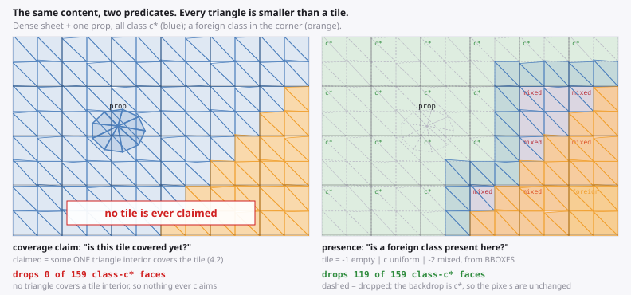

The natural reach is a **coverage claim**: keep a coarse tile grid, mark tiles
as claimed as faces cover them, drop a face whose tiles are already claimed.
It does not work, and it fails three separate ways at once:

- claiming a tile means covering its **interior** (§4.2), so a terrain triangle
  smaller than a tile claims nothing, ever;
- the answer depends on draw order, and the depth sort interleaves the big
  mesh's faces with the props' faces, so the big mesh rarely claims a tile
  before a prop wants to test against it;
- shrinking the tile to fit the triangles shrinks what a claim is worth.

Ask a different question and all three go away:

> **is a face of a *foreign* class present anywhere near here?**

| | coverage claim | foreign-class presence |
|---|---|---|
| grid holds | claimed bit | `-1` empty · `c` uniform · `-2` mixed, one `Int32` |
| needs | triangle interiors | **screen bboxes** |
| defeated by | triangles below tile size | nothing — a small triangle is a fine witness |
| order-dependent | yes | **no** |
| in a uniform region | claims nothing | reads `c*` in every tile, so everything drops |
| exact at | the grid's resolution | **any sample rate** (see the proof below) |

Presence is monotone in the wrong direction to be dangerous: a bbox is a
superset of a footprint, so a tile can only be *more* mixed than the truth, and
a face can only be *more* likely to be kept. That is the safe direction.

#### P1 — presence + backdrop substitution

The whole prep step, and it folds into the walk the pass already makes to
compute its own colour key.

1. **Walk the visible face list once** — the same walk that turns `fogAmount`
   into a band, or picks a material index. For each face `t` of class `c`:
   - `area[c] += ` its screen triangle area;
   - `tile[p] |= c` for every tile `p` its screen bbox touches, where `|=` means
     *`-1` becomes `c`, `c` stays `c`, anything else becomes `-2`*.
2. **Pick the backdrop** `c* = argmax area`. Area-weighted, not count-weighted:
   one big terrain face says more about what the screen looks like than fifty
   prop faces.
3. **Read the two degenerate verdicts off the histogram for free.**
   `area[c*] == total` and `c*` is the saturated band → the whole frame is one
   `fillRect` (§4.10's early-out 1). `area[0] == total` → no fog anywhere, skip
   the pass (early-out 2). Both fall out of step 1 at no cost.
4. **Set the clear colours** so the backdrop *is* `c*` (below).
5. **Compact.** Walk `order` forward; drop face `t` iff `class[t] == c*` and
   every tile its bbox touches reads exactly `c*`. Write survivors to a list.
   A forward walk keeps painter order, so the batcher needs no reverse pass.
6. **Hand the survivor list to the batcher** instead of `order`, along with this
   pass's own colour array. Nothing downstream changes.

```js
// once, at load
const prep = new ClassPrep({ width, height, tile: 16, classes: nBands, triangleCount });

// per frame, inside the fog pass -- this is the loop you already had
prep.begin();
for (let i = 0; i < s.nVis; i++) {
  const t = s.order[i];
  const b = band[t] = quantise(fogAmount(t));          // already computed
  prep.note(t, b, s.bx0[t], s.by0[t], s.bx1[t], s.by1[t], areaOf(t));
}
switch (prep.resolve(s, band)) {                        // histogram -> verdict
  case ALL_SATURATED:  ctx.fillStyle = fogColour; ctx.fillRect(0, 0, W, H); return;
  case NONE_SATURATED: return;                          // skip the pass outright
}
fogBatcher.draw(fogCtx, s, prep.list, prep.count, band);
```

**Grid size.** One `Int32` per tile: 3 600 words at 16 px on 1280×720, 14 KB,
and `fill(-1)` per frame is below the noise floor. Cardinality is unbounded
because the cell holds a class id, not a bitmask.

**Run it after the occluder,** and that is not arbitrary. The predicate has to
be evaluated on the set that will actually be drawn: a fogged face the culler
already removed contributes no pixel, so its absence from the grid is *correct*,
and it makes the grid tighter. Evaluating before the cull would only be more
conservative.

**Why it is exact.** Every face covering a pixel in tile `T` has its bbox
touching `T`. So if `T` reads `c*`, every face there is class `c*`, so every
*sub-sample* of every pixel in `T` is class `c*`, so the pixel is `c*` whether
this face was drawn or not — and where no face survives, the backdrop is `c*`.
Note what the argument does not depend on: not the sample rate, not the draw
order, not the antialiasing. It also means the drop **removes conflation seams
rather than creating them**: a band boundary that used to be two antialiased
fills over a black backdrop is now one fill over a backdrop of exactly the
neighbouring colour, which is the correct 50/50 blend with nothing showing
through (§4.4).

#### What the backdrop substitution costs

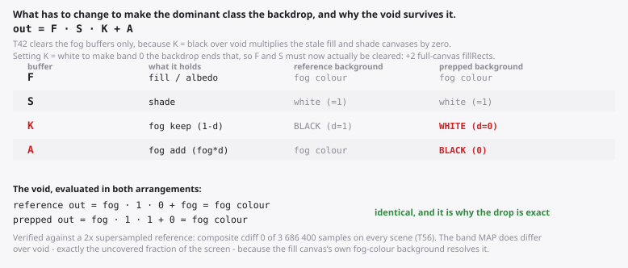

You need a canvas whose background is yours to choose. The fog keep and add
maps qualify; the **fill canvas does not** — its background is pinned to fog
colour by the halo fix (§4.10), which is what makes silhouette antialiasing
against void come out right. So P1 in this form is a fog-pass tool, and the
fill pass needs P3 or the injection idea below.

The price is exactly **T42's free clears**: setting the keep map's background
to white ends the identity that multiplied the stale fill and shade canvases by
zero, so those two must now actually be cleared. Two full-canvas `fillRect`s,
measured at or below 0.073 ms each (§5.6), against thousands of vertices and
most of the batcher's walk. Take it.

#### What it buys, measured

Iso scene (S15): a 58 800-face terrain heightfield with 300 prop meshes
standing on it, 30° pitch / 45° yaw, 20 701 visible faces, terrain covering
68.7 % of the screen, 8 fog bands, 16 px prep tile. `fogStart` swept, so the
result is a curve against how much screen the dominant class owns rather than
one flattering number.

| `fogStart` | `c*` share of covered px | faces dropped | fog-pass verts | vs base | prep ms | composite cdiff |
|--:|--:|--:|--:|--:|--:|--:|
| 0.00 | 34 % | 4.2 % | 23 052 | 0.97× | 0.80 | 0 |
| 0.30 | 29 % | 9.4 % | 20 896 | 0.96× | 0.81 | 0 |
| 0.50 | 75 % | 50.2 % | 10 169 | **0.62×** | 0.91 | 0 |
| 0.65 | 99 % | 94.3 % | 884 | **0.11×** | 0.86 | 0 |
| 0.80 | 100 % | 100 % | 0 | 0.00× | 0.84 | 0 |

Not a knife-edge: 75 % coverage already pays 0.62×, and at 100 % the pass
disappears into one `fillRect`. The four predicates against each other at
`fogStart` 0.65:

| | faces | fills | verts | vs base | batcher ms | prep ms | cdiff |
|---|--:|--:|--:|--:|--:|--:|--:|
| baseline | 20 701 | 3 | 10 402 | 1.00× | 7.28 | — | — |
| **P1 presence** | 1 174 | 3 | **884** | **0.11×** | **0.36** | 0.86 | 0 |
| P2 cluster kill | 9 869 | 3 | 3 169 | 0.32× | 2.97 | 1.64 | 0 |
| P3 dominant cover | 13 014 | 3 | 8 079 | 0.78× | 4.20 | 9.52 | 0 |
| *the same set, scattered* | 11 007 | 3 | *17 709* | *1.68×* | 3.63 | — | — |

Fill count does not move (3 → 3), so this is a vertex-and-CPU win — Firefox-
shaped after demotion (§3.2), and worth about the same on the record stage for
both engines (0.075 → 0.008 ms predicted Firefox, 0.094 → 0.009 Chromium).

#### The CPU accounting, and where the win actually is

The surprise. **Batching and boundary extraction over 20 701 faces costs
7.28 ms of JS; §1.1's record-stage model prices the same geometry at
0.075 ms.** That cost lives *upstream* of §1.1's three stages — it is your own
code, before a single canvas call — so it is not in the model and has to be
measured on its own axis (A8: a timer around the batcher with an inert
counting context, so no deferred GPU work can hide inside it).

That is the cost centre a prep step attacks most directly, because the batcher
walks the survivor list, not the input:

| scene | baseline batcher | with P1 | prep pays | **net** |
|---|--:|--:|--:|--:|
| iso (S15) | 7.28 ms | 0.36 ms | 0.86 ms | **−6.05 ms** |
| torusKnot (S1) | 15.34 ms | 5.95 ms | 1.15 ms | **−8.25 ms** |
| sphere (S2) | 12.30 ms | 0.57 ms | 0.56 ms | **−11.18 ms** |
| 5deep (S6) | 10.41 ms | 4.92 ms | 0.63 ms | **−4.85 ms** |

P1 is a net CPU win on all four, including the convex sphere the §4.9 culler
has to back off from. Node on the fixture machine (§10.1); it is JS, so it
transfers by face count rather than by engine.

#### The contiguity law

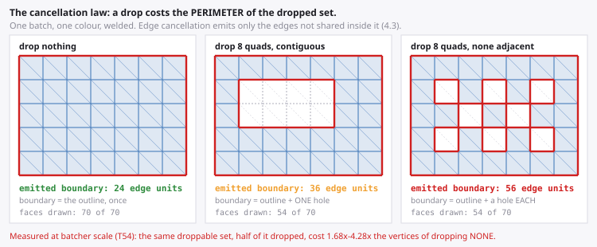

Dropping faces changes what edge cancellation can cancel. An edge cancels only
when `adjacency[3t+e]` names a face **in the same batch** (§4.3), so a dropped
face turns its neighbour's shared edge into boundary. The law is exact:

> **A drop costs the perimeter of the dropped set, measured inside its batch,
> and saves that set's interior edges.**

The figure counts it on one batch of 70 faces: the outline alone is 24 edge
units, the same eight quads dropped as a contiguous block cost 36, and dropped
with no two adjacent they cost 56. At batcher scale it is worse than that
sounds. Taking P1's droppable set and dropping a random half of it instead of
all of it:

| scene | full, contiguous | same faces, half of them |
|---|--:|--:|
| iso | 884 verts, 0.11× | 17 709 verts, **1.68×** |
| torusKnot | 7 616, 0.88× | 19 430, **2.01×** |
| sphere | 2 595, 0.97× | 13 943, **4.28×** |
| 5deep | 6 361, 0.91× | 13 343, **1.72×** |

**Dropping half the redundant faces costs 1.7–4.3× more vertices than dropping
none.** This is §6.11's mechanism at scale, and it is the single most important
thing to get right about any of this. Three corollaries:

- **Dropping a whole colour class is free.** Colour is the batch key, so every
  edge on that class's border was already a batch boundary and was never
  cancelling. The batch simply vanishes. This is P1's normal case.
- **Dropping a whole connected component is free.** Its cancellation was
  internal and leaves with it; no shared edge crosses between meshes.
- **Dropping scattered faces is a loss,** and a per-face predicate produces
  exactly that pattern by default.

If a predicate does produce a scattered set, make it contiguous before acting
on it: one O(n) flood over the `adjacency` array you already have, dropping only
components above a size threshold — or the cheap approximation, drop a face only
if all three of its neighbours are droppable too. **That is not §6.10's
erosion.** Erosion there ate the *coverage claim*, which destroys occluder
fusion; eroding the *drop set* makes you drop less and claim nothing, which is
the correct direction.

Two smaller interactions, both favourable. Welding and `buildAdjacency` are
load-time and purely topological, so nothing here disturbs them. And the seam
classification improves: a dropped neighbour yields `eSeam = 0`, so with
`seamStrokeOnly` the edge is read as silhouette and never stroked (§4.4). One
prerequisite, though: the `batchOf` staleness noted in §4.9 becomes much more
reachable, because a second dropper means many more faces that never refresh
their entry. Add `batchOf.fill(0)` next to `stamp.fill(0)` before turning any of
this on.

#### P2 — the cluster kill

The same test at cluster granularity. Per cluster, hold the min and max class
and the union bbox; if `min == max == c*` and every tile the bbox touches reads
`c*`, the whole cluster goes in one test.

Measured, it is **dominated by P1 on every scene here** — 0.32× against 0.11×
on the iso scene — and its reach is entirely a question of granularity:
251/331 clusters killed on the iso scene (16×16-quad terrain patches and one
cluster per prop), 7/128 on `torusKnot`, 15/102 on the sphere, and **0/5 on
`5deep`**, where a cluster is a whole sphere and spans too many bands to ever
be uniform. Its measured 1.64 ms also includes an O(n) pass to derive the
cluster bounds; with precomputed bounding volumes, or folded into P1's own walk,
it is O(clusters).

So it is not the thing to ship. It is worth having as a cheap early-out ahead
of P1 when you already keep a scene graph and your clusters are small relative
to the class regions — and worth skipping otherwise.

#### P3 — dominant cover, when the backdrop is not yours

The fill pass cannot substitute a backdrop, so its redundancy has to be proved
by coverage. One bitmask `M` meaning *"the current colour here is `c*`"*, walked
in painter order:

1. `M.fill(0)`; walk `order` far → near.
2. Face of class `c*`: rasterise its spans into `M`. If it covered at least one
   sample and set **no new bit**, it is redundant — drop it. (The mark and the
   test are one operation, as in §4.9.)
3. Face of any other class: **clear** its footprint from `M`, and keep it.
4. Sub-sample guard: a face that covers no sample is small, not redundant —
   keep it (§6.11).

Exact, no backdrop needed, and one mask, because each face touches exactly one
mask — the clear costs no extra traffic. Fidelity is bounded by the sample
rate rather than by the argument, so unlike P1 it needs checking: against a 2×
supersampled reference it misses 347 samples of 3 686 400 on the iso fog pass
(0.009 %), 204 on `torusKnot`, 62 on `5deep`, 0 on the sphere — sub-sample
slivers at silhouettes, the same residual class the skirt exists for in §4.9.

**And as written it costs more than it saves.** Every case measured is a net CPU
loss: 9.52 ms of prep against 3.08 ms of batcher saved on the iso fog pass,
4.88 against 3.50 on the iso fill pass, 8.94 against 5.99 on `torusKnot`. It
finds real redundancy — 38.0 % of faces and 0.76× vertices on a fill pass whose
props share the terrain's material — and it finds none at all where there is
none: 0.0 % on `torusKnot`'s eight-material fill pass and on the sphere.

What would fix it is known: it has no block hierarchy, which is what took the
§4.9 culler from 4.3 ms to 1.8 ms. The catch is that the clear breaks
monotonicity, so the saturation counter has to decrement as well as increment.
Unmeasured, and the honest state of P3 is *correct, and not yet cheap enough.*

#### What the keeper cannot do

The other pure-filter option for the fill pass: a tile whose class census is
`{c}` **and** which some single face fully contains keeps that face and drops
every other class-`c` face whose bbox lies inside it. No injection, no batcher
change.

It finds essentially nothing. At 4 px tiles it keepered 6 690 of 57 600 tiles
and dropped **0.1 %** of faces on the iso scene; at 16 px, 0 tiles and 0.0 %;
on `torusKnot` 836 tiles at 4 px and 0.0 %; on the sphere 0 tiles at every size.
Terrain triangles are ~10 px, so no single one contains even a 4 px tile
reliably — §4.5's "tile size has to track triangle size", arriving from the
other side. A tile covered *collectively* but by no single face needs the
substituted rectangle instead, which is a generator rather than a filter and is
not measured here.

#### Two cost centres, two guards

The sphere is the instructive row. P1 drops **84.8 %** of its faces and moves
the emitted vertex count by **0.97×** — the band regions on a convex mesh
already cancel down to their boundaries, so there was nothing there to save.
The same drop takes the batcher's own CPU from 12.30 ms to 0.57 ms.

So the two savings are independent and need separate guards:

| what you are trying to save | guard on | sphere reads |
|---|---|---|
| the batcher's own walk (upstream JS) | **faces dropped** | 84.8 % — huge win |
| emitted vertices (record + raster) | **vertex reduction** | 0.97× — nothing |

A single `minRate` in the shape of `Occluder`'s would give the wrong answer on
one of them. Guard on both, and note that the two disagree in the *useful*
direction only when the drop is contiguous — `torusKnot` at `fogStart` 0.50
drops 4.1 % and measures **1.02×**, a small scattered drop costing slightly
more than it saves, which is the case the guard exists to catch.

And the structural point: **the prep step pays where the culler cannot.** A
convex closed mesh has 1.00× overdraw and nothing to occlusion-cull, but its
far band is still saturated and wholly redundant. The two are complementary,
not overlapping, and one cull no longer serves every pass — a colour-redundancy
survivor list is per-pass by construction, because each pass keys on a
different thing.

#### Where it pays, and where it does not

| | P1 presence | P2 cluster | P3 cover | keeper |
|---|---|---|---|---|
| needs the backdrop | **yes** | yes | no | no |
| needs a scene graph | no | **yes** | no | no |
| needs rasterisation | no | no | **yes** | no |
| cost | O(faces), bbox only | O(clusters) | one coverage pass | O(faces × tiles) |
| measured prep | 0.56–1.15 ms | 0.20–2.66 ms | 1.8–9.5 ms | 1.2–13.8 ms |
| net CPU, measured | **−4.9 to −11.2 ms** | −3.7 to +1.4 ms | +0.5 to +6.4 ms | worse than baseline |
| exact at any sample rate | **yes** | yes | no (1 spp) | yes |
| works on the fill pass | no | no | **yes** | in principle only |
| best case | one class owns most of the screen | small clusters, wide class regions | two meshes share a material | large single-colour faces |
| worst case | every tile mixed — backs off cheaply | clusters span classes | colour-noisy content | dense tessellation |

Use cases, concretely:

- **Radial or distance fog over a scene that fills the viewport** — the case
  this was built for. P1, and expect the pass to disappear as the plateau
  grows.
- **Any pass keyed by something coarser than the geometry** — a fog band, a
  material index, a shadow-mask bit. The coarser the key, the more redundancy
  there is to find.
- **A near-static camera** — the prep result is a function of the face list and
  the camera, so dirty-flag it and skip the prep *and* the pass. Cheap, and it
  keeps a fog buffer accelerated on Firefox (§3.2).
- **Not** for a pass whose colour key is nearly per-face (folded fog, D in
  §4.10). There is no dominant class to find, and the histogram says so in one
  pass.
- **Not** as a fidelity trade. P1 is exact; if you find yourself reaching for a
  tolerance, you have left P1 and are somewhere that needs a supersampled
  reference (§8.5).

#### The recommendation

**Ship P1 on the fog keep and add maps, guarded on both metrics, and nothing
else yet.** It is exact at any sample rate, costs 0.56–1.15 ms, returns 4.9 to
11.2 ms of CPU on every scene measured, needs no rasterisation, no scene graph
and no adjacency, and its inputs — a class per face and a screen bbox — are
already what the batcher consumes. Fix `batchOf.fill(0)` first. Keep P2 only if
you already have small clusters and want the early-out; leave P3 out until it
has the block hierarchy; do not build the keeper.

#### What is left on the table

- **The browser number.** Everything above is the node counting harness plus
  the upstream-CPU axis. The engine-side rasterisation saving — where §4.10's
  13.6 ms fog geometry pass actually lives — is *not* in these numbers, and the
  vertex count is standing in for it. A `preppage.html` alongside
  `bench/fogpage.html` is the missing measurement, and no claim about frame
  time should be made before it exists.
- **P3's block hierarchy**, with a decrementing saturation counter.
- **Rectangle injection** for tiles covered collectively — the fill-pass
  answer the keeper cannot reach. Give the injected quad real adjacency across
  its diagonal so it cancels to four boundary edges, and emit it into the same
  path as its colour batch or it brings a conflation seam with it (§4.4).
- **Analytic level sets.** For a fixed-orientation orthographic camera and an
  analytic fog function, the dominant region's boundary is a curve you can
  solve for once per camera move — an ellipse for a ground plane — and the test
  becomes ~10 flops per face with no grid at all. It is also locked to that
  camera and that fog, so it belongs behind an explicit capability flag rather
  than in the default path, unlike everything else in this section.

### 4.12 Feeding the tessellator: path shape at batcher scale

*Registry: T61, T62, T63, T64, T65, T66, T69, T72 — fixture and extrapolation scope in §10.5.*

§3.5 is what the backends do with a path. This is what that means for the
paths a batcher hands them, measured on S1–S3 with the same batch assignment
every time — only the cut into `fill()` calls and subpaths varies
(`bench/pathshape.js`, one function per strategy, shared by the counts in
`bench/tess.mjs` and the timings in `bench/tesspage.html`).

#### The answer first

1. **Weld and cancel — still, but not because of the rasteriser alone.** With
   the seams repaired on both sides, a welded frame rasters **1.5–1.6× (S1)
   and 4.8–6.5× (S2) faster** than a per-face one on Skia's CPU path, and
   **ties on the most fragmented scene (S3)**; it costs **2–7.6× less main
   thread**, and on Firefox's accelerated path it tessellates to **1.2–15×
   less**. Unrepaired, per-face *beats* welded on S3 by 1.5× — which is the
   observation that prompted this section, and it is real. It stops being true
   the moment the per-face frame repairs its own seams. **On a hardware GPU
   welding wins every scene, S3 included** — 1.4–3.7× the whole frame
   unrepaired, 2.0–6.0× repaired (T69).
2. **Repair the seam inside the path, not with a stroke.** The in-line band
   (§4.8's option 7, now at batcher scale) closes **98.6–99.8 % of the seam
   gap** where the 0.5 px seam stroke closes **64–73 %**, at the same software
   raster cost within ~10 %, and adds **4–13 % to Firefox's tessellated
   output** where the stroke adds an estimated **60–440 %** (§6.16). Its cost
   is outline — ink past the silhouette at the ends of band runs — and putting
   those ends on the neighbour's own edge (§4.8's option 8, at run ends only)
   brings the frame's total coverage error to **1.6–4× below the stroke's**.
   That is `seamBand: 1` in `src/painter2d.js` — **the default since v1.30**,
   for the reason in the next point.
3. **On a hardware GPU the band is cheaper than the stroke too.** Chromium 153
   on an Apple M4 GPU (M6) — which rasterises canvas through **Skia Graphite**,
   not the Ganesh of §3.1 — sustained, five runs: the canvas side of the frame
   — its calls, recording and GPU work, with the batcher's JS replayed out —
   costs **0.80–0.81× the stroke's** on all three scenes, and the whole frame
   ties within 8 % (the difference is the band's own JS). §3.1's fitted GPU
   cost — Ganesh's, on M1 — had predicted the opposite, ~+18 ms on S1; on
   Graphite the band costs +0.53 ms over no repair at all (T69). One GPU and
   one backend: Ganesh, and M1's discrete GPU, are still unmeasured for the
   band. **Safari is the exception measured:** there the band costs the canvas
   1.4–1.7× the stroke (+0.6–3.5 ms), off the main thread, while the whole
   frame still ties (T72).
4. **Fix the band's junctions that can be fixed exactly, and leave the rest.**
   Mitring reflex junctions of ≤ 90° removes **6–20 % of the band's path
   vertices and 57–80 % of its junction crossings**, and changes the filled
   region **nowhere** — 0 of 41 million sampled points. It buys under 1 % of
   tessellated output and nothing measurable on the rasteriser: ship it
   because it is free and removes degenerate input, not as a lever. Past 90°
   the same mitre is exact only where the polygon behind the corner is at
   least w thick, and a pinch cuts it (§6.15).
5. **What does not pay, here:** giving convex loops their own fill and
   forbidding self-overlapping batches — within noise or worse on the
   rasteriser, ±3 % on tessellated output. Locality batching helps only the
   most fragmented scene (1.16–1.22× on S3) and costs 7–15× the fills.

#### Per face against welded, repaired and not

A3 is a whole frame on Skia's CPU path — the strategy's JS, the recording and
the raster, forced to complete; A9 is Firefox's tessellated output for the
same paths (§8.1). Firefox's timer is coarsened to 1 ms, and neither engine's
ranking is readable inside ~10 % (T29).

| cut | fills | Chromium A3 ms | Firefox A3 ms | Chromium main thread ms | tessellated MB (A9) |
|---|--:|--:|--:|--:|--:|
| per face, no repair | 35 851 / 45 428 / 33 907 | 66 / 64 / 51 | 59 / 56 / 46 | 49 / 65 / 45 | 29.9 / 14.4 / 26.6 |
| per face + band | 35 851 / 45 428 / 33 907 | 114 / 116 / 93 | 103 / 96 / 83 | 88 / 120 / 72 | 33.0 / 23.5 / 26.4 |
| per face + stroke (C3) | 71 702 / 90 856 / 67 814 | 112 / 111 / 93 | 101 / 89 / 76 | 105 / 113 / 96 | 78.7 / 76.1 / 72.1 |
| batched, no cancellation | 835 / 124 / 472 | 83 / 58 / 120 | 78 / 51 / 112 | 21 / 21 / 22 | 19.2 / 1.6 / 20.2 |
| batched boundary, no repair | 835 / 118 / 471 | 55 / 15 / 78 | 51 / 13 / 71 | 21 / 15 / 28 | 17.5 / 1.5 / 20.1 |
| batched + band, exact fixes | 835 / 118 / 471 | 71 / 18 / 91 | 68 / 20 / 82 | 29 / 16 / 36 | 18.2 / 1.6 / 22.7 |
| … + free ends on the neighbour (**`seamBand: 1`**) | 835 / 118 / 471 | 73 / 18 / 100 | — / — / — | 31 / 16 / 36 | 18.4 / 1.6 / 22.5 |
| batched + 0.5 px seam stroke (C1) | 1 666 / 237 / 943 | 69 / 17 / 92 | 65 / 16 / 92 | 28 / 16 / 33 | 39.4 / 7.4 / 45.3 |

*Firefox's `T` run predates the free-end rule; its band row is the exact-fixes one above.*

Read it in pairs:

- **Unrepaired, per-face against welded:** 66 / 64 / 51 ms against 55 / 15 /
  78 (Chromium; Firefox the same shape). Welding wins on S1 and S2 and
  **loses by 1.5× on S3**. The per-face
  frame lives almost entirely in Skia's *mask* tier (every triangle's bbox is
  under 32 px), which is cheap per call; the welded frame is a few hundred
  general-tier paths, and on S3 those paths are long, jagged, and wide.
- **Repaired, per-face against welded:** per-face with the band 114 / 116 /
  93, per-face with a stroke (C3) 112 / 111 / 93, welded with the band
  71–73 / 18 / 91–100, welded with the seam stroke 69 / 17 / 92. Once the
  per-face frame closes its own seams it doubles its paths (stroke) or its
  vertices (band), and the mask tier stops saving it. S3 is a tie; S1 and S2
  are clear wins for welding.
- **The main thread** is where per-face always loses: 49 / 65 / 45 ms against
  21 / 15 / 28 welded, and seam-repaired 88 / 120 / 72 against 29–31 / 16 /
  36 — §1.1's `0.26 µs × fills`, 33 907–45 428 of them, plus the JS that
  builds them.
- **Firefox's accelerated backend** sees the same ordering in A9: welded
  output is 1.3× (S3), 1.7× (S1) and 9.6× (S2) smaller than per-face
  unrepaired, 1.2–15× repaired, and per-face with a stroke is the largest
  thing measured anywhere in this guide — up to 72–79 MB a frame, up to
  **18–20 buffers** (the stroke half is an upper bound, T67).

#### Where welding stops paying on a CPU rasteriser

The one variable that separates S3 from S1 and S2 is how *fragmented* the
colour regions are, and it can be varied without touching the geometry: raise
the palette's shade count and the same mesh breaks into smaller regions (S16).
x is the emitted boundary vertices over 3n — the fraction of the per-face
vertex count that edge cancellation failed to remove.

| scene | shades | x = boundary verts / 3n | per face | welded | per face + band | welded + band | per face, main thread | welded, main thread |
|---|--:|--:|--:|--:|--:|--:|--:|--:|
| S1 | 2 | 0.20 | 61 · 54 | 29 · 27 | 108 · 105 | 37 · 32 | 39 | 14 |
| S1 | 4 | 0.21 | 68 · 53 | 31 · 28 | 111 · 100 | 38 · 34 | 44 | 14 |
| S1 | 8 | 0.26 | 64 · 56 | 37 · 33 | 112 · 105 | 46 · 42 | 42 | 15 |
| S1 | 16 | 0.38 | 66 · 60 | 48 · 45 | 111 · 106 | 57 · 56 | 45 | 17 |
| S1 | 32 | 0.54 | 65 · 61 | 61 · 55 | 116 · 111 | 82 · 80 | 44 | 20 |
| S3 | 2 | 0.14 | 49 · 44 | 25 · 25 | 83 · 78 | 28 · 26 | 34 | 14 |
| S3 | 6 | 0.36 | 51 · 43 | 56 · 49 | 92 · 77 | 59 · 54 | 35 | 19 |
| S3 | 12 | 0.46 | 52 · 44 | 62 · 57 | 84 · 77 | 71 · 66 | 36 | 20 |
| S3 | 24 | 0.60 | 53 · 44 | 79 · 70 | 91 · 80 | 92 · 87 | 37 | 23 |
| S3 | 48 | 0.73 | 55 · 48 | 87 · 77 | 95 · 78 | 107 · 93 | 41 | 26 |

*A3 ms, Chromium · Firefox; main thread is Chromium's. Every row is the same geometry and visible set.*

Welded wins at low fragmentation on both meshes, by 2× at x ≈ 0.2. Unrepaired
per-face overtakes it on S3 somewhere between x = 0.14 and 0.36, and on S1 not
at all up to 0.54 (61 against 65 ms there — inside the noise). **Seam-repaired,
the crossover moves to x ≈ 0.6 on S3 — both engines tie there, per face wins
at 0.73 — and S1 never reaches it.** The main thread never crosses: per face
costs 34–45 ms at every point, welded 14–26. So the useful rule has two parts, and the second
is the one that matters: *welding pays on the CPU rasteriser until about half
of the per-face vertices survive cancellation, and it pays on the main thread
always.* It is two meshes, so treat 0.5 as a direction, not a threshold — the
guard in §1.7 does not change on this evidence (it trips at 0.85 and fills
above 0.25 n, for content that is not a mesh at all).

#### The band at batcher scale, against the stroke

§4.8 settled the band for face-granularity geometry and left the batched frame
unmeasured, predicting from the run structure that the in-line form's outline
error would be bad there. Measured (C8 against C1, CPU raster, both engines —
the two agree to within 0.2 on every number below):

| repair | path verts S1 / S2 / S3 | gap px² | bloat px² | gap + bloat |
|---|--:|--:|--:|--:|
| none | 50 463 / 9 914 / 61 471 | 6986.9 / 2575.1 / 2338.7 | 26 / 10 / 25 | 7013 / 2585 / 2364 |
| 0.5 px seam stroke (C1) | 106 803 / 25 222 / 132 731 | 2192.4 / 929.1 / 621.3 | 306 / 273 / 582 | 2498 / 1202 / 1204 |
| band, option 7 | 99 444 / 25 955 / 117 929 | 18.7 / 33.8 / 5.6 | 790 / 828 / 1028 | 809 / 862 / 1033 |
| band, exact fixes | 90 554 / 20 898 / 110 442 | 18.7 / 33.3 / 5.6 | 789 / 829 / 1027 | 808 / 863 / 1033 |
| band, exact fixes + free ends (`seamBand: 1` to v1.41) | 90 126 / 20 875 / 109 323 | 49.7 / 35.9 / 20.4 | 567 / 732 / 648 | 617 / 768 / 669 |
| … + the single-band clip (`seamBand: 1` since v1.51) | 90 105 / 20 875 / 109 268 | 49.6 / 35.9 / 20.4 | 567 / 732 / 648 | 616 / 768 / 669 |

*Chromium; Firefox agrees to within 0.2 px² on every cell it ran (all but the last row).*

Three columns decide it:

- **gap** — missing ink inside the object against a 4× union reference (§4.8's
  metric). The band leaves **18.7 / 33.3 / 5.6 px²** of it, 0.2–1.3 % of the
  unrepaired frame's; the 0.5 px seam stroke leaves **2 192 / 929 / 621**,
  27–36 %. §4.4 chose 0.5 px on RMSE — a colour metric that punishes the
  1 px stroke for moving boundaries — and it is still the right stroke
  width; what this adds is that at batcher scale a 0.5 px stroke leaves a
  third of the conflation standing.
- **bloat** — ink added outside the object's own silhouette. Here the band
  pays what §4.8 predicted: **789 / 829 / 1 027 px²** against the stroke's
  306 / 273 / 582. That is the free-end spill — a run of band edges that ends
  on the silhouette pokes its perpendicular corner out by w — and at batcher
  scale most runs are one edge long (§4.8's T49).
- **cost** — equal on the CPU rasteriser within ~10 % (A3 above: 71–73 / 18 /
  91–100 against 69 / 17 / 92), and on Firefox's accelerated path not close:
  the band adds 4–13 % to the fills' tessellation, the stroke an estimated
  60–440 % (§6.16).

**And the bloat has a cause you can remove.** It is concentrated at the ends
of band runs, where option 7's perpendicular corner leaves the later
neighbour's triangle and pokes past the silhouette. §4.8's option 8 is the
cure — put the corner on the line from the run's end vertex to the
neighbour's third vertex, an edge the neighbour itself owns — and at batcher
scale it needs one more lookup per band edge (the neighbour's apex, a sum of
three indices). Applied at free ends only, with the exact mitre in between
(the last row above): bloat falls **28 / 12 / 37 %**, the gap rises to
50 / 36 / 20 px² — still **44 / 26 / 30× below the stroke's** — and the
frame's total coverage error lands at **617 / 768 / 669 px², 1.6–4× below the
stroke's 2 498 / 1 202 / 1 204.** It is lossy by design: 9 552 / 1 320 /
12 286 pixels differ from the unfixed band, which is the ink it stopped
spilling. That combination, with the exact single-band clip added at v1.51,
is `seamBand: 1` in `src/painter2d.js`, and the shipped code emits exactly the
paths measured in the last row (same fills, vertices and tessellated output on
S1–S3).

#### On a hardware GPU: the band, the stroke, and per face

*Registry: T69, T72.*

Every timing above is Skia on the CPU, which is where demoted Firefox and
GPU-less Chromium live. The GPU numbers come from M6 — Chromium 153 on an
Apple M4's integrated GPU, whose canvas backend `chrome://gpu` reports as
**Skia Graphite** on Dawn/Metal (§3.3), not §3.1's Ganesh — with
`tesspage.html` part `T`, five runs, the
minimum reported and nothing ranked inside ~10 % (T29). Two A2 columns,
because on a GPU the first one hides the answer:

- **frame** — the whole thing, scene rotating every draw so no path repeats:
  the batcher's JS, the canvas calls, the GPU. On this machine the GPU keeps
  up, so the frame is main-thread-bound and mostly the batcher's own JS
  (A8, §4.11) — it cannot see what the GPU pays for a path.
- **replay** — the same frames' canvas calls recorded once and replayed,
  eight rotations in turn: the calls, the recording and the GPU work, and no
  JS in front of them. This is the column that prices the path.

| cut | frame, S1 / S2 / S3 (ms) | replay, S1 / S2 / S3 (ms) | A3, S1 / S2 / S3 (ms) |
|---|--:|--:|--:|
| welded, no repair | 8.59 / 5.18 / 9.61 | 1.80 / 0.16 / 1.93 | 22.9 / 5.8 / 32.7 |
| welded + band, free ends on the neighbour (**`seamBand: 1`**) | 10.94 / 5.72 / 12.78 | **2.33 / 0.24 / 2.64** | 29.7 / 7.1 / 39.3 |
| welded + 0.5 px seam stroke (C1) | 10.55 / 5.80 / 11.85 | 2.87 / 0.30 / 3.25 | 27.4 / 6.7 / 37.6 |
| per face, no repair | 15.01 / 19.05 / 13.28 | 13.77 / 17.31 / 11.97 | 24.3 / 22.1 / 19.1 |
| per face + band | 28.96 / 34.95 / 25.05 | 19.75 / 23.13 / 15.93 | 37.9 / 37.2 / 30.5 |
| per face + stroke (C3) | 27.24 / 34.85 / 24.08 | 20.48 / 27.38 / 21.08 | 39.1 / 41.3 / 34.9 |

*M6, Chromium 153, A2 per draw (§8.1: displayed canvas, ≥ 50 ms of draws per rAF callback), min of 5 runs. Spread (max ÷ min − 1) is 1–13 % on the welded rows except S2's C1 replay, a 0.30 ms cell at 25 %, and up to 35 % on the per-face rows, whose main thread varies run to run. A3 is the same machine's CPU raster, for comparison.*

Read it in three pairs:

- **Band against stroke.** Replayed, the band costs **0.81 / 0.80 / 0.81×**
  the stroke — cheaper on every scene, outside the noise. The whole frame
  ties (1.04 / 0.99 / 1.08×); what the band adds there is its own
  construction — +1.2 ms of batcher JS on S1 (A8, `bench/tess.mjs`) — not
  anything the GPU does.
- **What §3.1's fit predicted.** It priced merged non-convex paths at
  ~0.45 µs of GPU per vertex and predicted ~+18 ms for the band's 39 663 extra
  vertices on S1. Measured, the band costs **+0.53 / +0.08 / +0.71 ms** over no
  repair at all — 0.007–0.015 µs per added vertex, 30–60× under the fit. The
  fit was **Ganesh** on M1's discrete GPU, from the per-face-to-merged sweep of
  §5.1; M6 is **Graphite** on an integrated one. So this does not refute the
  fit — it shows it does not transfer — and whether the band costs Ganesh
  more than the stroke is still unmeasured. On the only backend measured it
  was the wrong prediction, the band wins every other axis in this section,
  and `seamBand` now defaults to 1 (§1.2): a judgement on one backend's
  evidence, with the Ganesh case named as the open one.
- **Per face against welded.** Welded wins every scene on the GPU, S3
  included: 1.4–3.7× the whole frame unrepaired, 2.0–6.0× repaired, and
  6–108× on the replayed canvas cost. T02's ranking holds on hardware. The
  M4 SwiftShader run that ranked per face ahead on S1 and S3 was the emulator,
  as suspected. The A3 column is the other half of the story, and it
  reproduces M4: on the CPU rasteriser unrepaired per face *does* beat welded
  on S3 (19.1 against 32.7 ms here, 1.7×) — the mask tier again — and stops
  doing so once it repairs its seams.

SwiftShader's other ranking — the band 1.4–1.7× ahead of the stroke — had the
right sign and the wrong size: 1.23–1.25× on hardware, replayed. Neither was
evidence at the time, and only the sign survived.

**Safari, on the same machine, goes the other way** (T72, two runs):

| cut | Safari replay, S1 / S2 / S3 (ms) |
|---|--:|
| welded, no repair | 3.65 / 0.77 / 5.30 |
| welded + band (`seamBand: 1`) | **6.46 / 1.48 / 9.34** |
| welded + seam stroke (C1) | 4.59 / 0.88 / 5.85 |
| per face, no repair | 18.32 / 24.35 / 18.09 |
| per face + stroke (C3) | 37.97 / 46.45 / 35.35 |

The band costs WebKit's canvas **1.41 / 1.68 / 1.60×** the stroke — and it is
the band's paths, not their JS: its replay runs 2.0–2.6× longer than its main
thread, where the stroke's is main-thread-bound. Safari's part `G` has the
same signature — convexity worth 1.4×, a crossing 4.2× — which is how a CPU
rasteriser prices a band's step-out-and-back, and nothing like Graphite's.
The whole frame ties (0.96–1.00× within each run; across runs JavaScriptCore
moved the batcher's own cost 1.8×, so only same-run comparisons are read).
Welding wins here too, by 3.4–53×. `seamBand` stays 1 on this evidence —
three engines tie or win the frame, and the fidelity gain is the same
everywhere — but on a Safari frame bound by its GPU process rather than its
main thread, the band is the costlier repair by up to +3.5 ms.

#### What the band does to the path, and what it should do

*Registry: T57, T63, T65, T73 — fixture and extrapolation scope in §10.5.*

The band has one job: cover the seam gap along an edge whose neighbour is drawn
*later*, from underneath that neighbour. Everything else it does is a side
effect, and there are three to keep small — **points added to the path,
crossings, and ink on anything except the one neighbour it lies under**. §4.8's
option 7 does the job with all three: every band edge a → b becomes a detour
a → a + n·w → b + n·w → b, a detour is a concavity, **so a banded loop is
non-convex wherever it has a band edge**, and wherever two detours meet at a
reflex corner their offsets cross. Measured on the shipped code, per frame,
S1 / S2 / S3:

| path | vertices | loops with a crossing | crossings | convex loops | JS per frame, ms (A8) | tessellated verts (A9) | filled region, against option 7 |
|---|--:|--:|--:|--:|--:|--:|---|
| welded, no repair | 50 463 / 9 914 / 61 471 | 205 / 20 / 298 | 728 / 391 / 577 | 1 960 / 41 / 5 036 | 9.5 / 7.1 / 12.7 | 1.53 M / 0.130 M / 1.75 M | — |
| + band, option 7 | 99 444 / 25 955 / 117 929 | 1 886 / 128 / 2 895 | 10 888 / 5 205 / 10 194 | 645 / 29 / 1 936 | 10.7 / 7.6 / 14.7 | 1.60 M / 0.142 M / 1.98 M | the reference |
| + every exact fix (`BAND_EXACT`) | 90 532 / 20 898 / 110 382 | 1 353 / 76 / 1 761 | 6 220 / 2 824 / 6 035 | 645 / 29 / 1 937 | 10.9 / 7.6 / 15.1 | 1.59 M / 0.141 M / 1.98 M | **identical**: 0 of 41 M sampled points |
| + free ends — **the default** | 90 105 / 20 875 / 109 268 | 1 515 / 110 / 2 062 | 6 846 / 3 217 / 6 422 | 888 / 32 / 2 391 | 11.3 / 7.6 / 15.7 | 1.61 M / 0.141 M / 1.96 M | by design: the spill it removes |
| + tight-corner mitre (`BAND_TIGHT`, optional) | 88 506 / 20 382 / 108 676 | 1 413 / 93 / 2 002 | 6 043 / 2 971 / 6 091 | 888 / 32 / 2 391 | 11.4 / 7.7 / 15.7 | 1.61 M / 0.141 M / 1.96 M | 39 / 0 / 0 samples: sliver spill |
| + skip short edges (`BAND_SKIP_SHORT`, optional) | 90 014 / 20 237 / 109 217 | 1 509 / 104 / 2 056 | 6 802 / 2 665 / 6 373 | 889 / 32 / 2 393 | 11.6 / 7.6 / 16.2 | 1.61 M / 0.141 M / 1.96 M | reopens gap: +1.2 / +75 / +0.2 px² |

*Out of 4 845 / 187 / 9 446 loops. Counts: `node bench/tess.mjs`; the A8 and A9 columns: `node bench/bandx.mjs` section 4 (`BANDX_ONLY=4` runs it alone), which runs `src/painter2d.js` itself with `seamBandFixes` set per row — configurations interleaved, min of 60, the lower of two runs; differences under ~0.7 ms did not repeat between runs (T73). Timed one after another instead, the last configuration read 1–3 ms slow: the size of the effect.*

- **The band doubles the path and takes its convexity**: 1.97 / 2.62 / 1.92×
  the vertices, 15 / 13 / 18× the crossings, and the convex share of loops
  falls from 41 / 22 / 53 % to 13 / 16 / 20 %. It is still the cheaper
  repair: the stroke it replaces is a second path of 2.1–2.5× the welded
  vertices and 2.3–5× the tessellated output.
- **The exact fixes are the default**: collinear spikes, the reflex mitre and
  the single-band clip together remove **9 / 20 / 6 % of the vertices, 43 /
  46 / 41 % of the crossings and 28 / 41 / 39 % of the crossing loops** for
  **+0.0–0.7 ms of JS per frame**, and the filled region does not move (0 of
  41 million sampled points, T63). Rasterised pixels are not bit-identical —
  194–515 pixels move by up to 42/255, because a rasteriser antialiases a
  crossing and its mitred equivalent differently — and at those pixels neither
  is closer to the 4× truth (T65).
- **No pixel-identical fix restores convexity.** The detour *is* the
  concavity; the convex-loop count does not move under the exact fixes. What
  would remove more changes the picture, and each is optional or declined
  below.
- **The fixes are hygiene, not a lever.** Under 1 % of Firefox's tessellated
  output, CPU raster inside the noise, and on Graphite the same replay time as
  without them (T69). The lever was welding and cancellation, which halved the
  path before the band doubled it back.

#### The junction cases, one by one

`bench/bandx.mjs` classifies every place two band edges meet, and every place
a band run meets a plain edge:

| junction | S1 | S2 | S3 | fix | exact? | default? |
|---|--:|--:|--:|---|---|---|
| band/band, convex | 12 674 | 4 079 | 13 660 | none (a bevel would paint over the tip's third polygon) | — | declined |
| band/band, reflex ≤ 90° | 4 345 | 2 075 | 3 645 | mitre to one point | **yes** | **yes** |
| band/band, reflex > 90° (a tight corner) | 3 376 | 511 | 3 165 | the same mitre | where the polygon is ≥ w thick behind it | optional (`BAND_TIGHT`) |
| band/band, blocked by an edge shorter than w | 13 | 74 | 8 | drop that edge's band | no: reopens a sub-pixel stretch | optional (`BAND_SKIP_SHORT`) |
| band/band, exactly collinear | 0 | 0 | 0 | drop the spike | **yes** | **yes** |
| run end against a plain edge, reflex, cap crosses it | 61 | 0 | 563 | clip the band at the crossing | **yes**, with the pinch guard | **yes** |
| band/band junction at a **pinch** vertex | 5 907 | 177 | 6 358 | skip the tight mitre and the clip there | (the guard) | **yes** |
| run end, anywhere (a free end) | 8 160 | 302 | 15 470 | corner on the later neighbour's own edge | no: removes spill | **yes** |

*`bench/bandx.mjs` on C8 (A4). Band edges: 24 488 / 6 890 / 28 213, of which 128 / 988 / 227 are shorter than the 1 px band. Of the run ends, 1 197 / 19 / 1 978 are at a reflex vertex.*

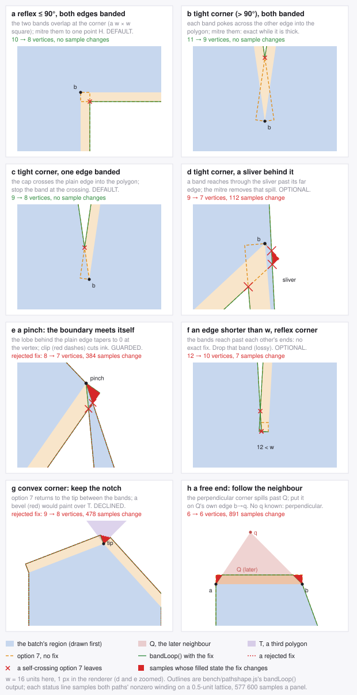

*Every outline is `bench/pathshape.js`'s `bandLoop()` on a loop built to show
the case, band width exaggerated to 16 units; every panel's status line is
computed — the nonzero winding of the unfixed and the fixed path sampled on a
0.5-unit lattice, the samples that change drawn red. `node bench/bandfigs.mjs`
regenerates it, and refuses to if a panel stops showing what it claims.*

Case by case, in the figure's order:

- **(a) Reflex corner ≤ 90°, both edges banded.** The two bands overlap past
  the corner in a w × w square and their offset segments cross. Mitre them to
  their crossing H: **−2 points** (the band corner and the polygon's own
  corner vertex go, H replaces the other band corner). Exact, because the quad
  the path gives up lies inside *both* bands — which takes two tests: the turn
  is at most 90° (n₁·n₂ ≥ 0), and each band reaches the other's corner (an edge
  shorter than w fails it, case f). Default.
- **(b) Tight corner, > 90°, both banded.** Each band now pokes across the
  *other* edge into the polygon, and they cross each other. The same mitre
  saves the same 2 points and **is exact wherever the polygon is at least w
  thick behind the corner** — 0 changed samples on S2 and S3, and in the
  panel. Earlier versions of this guide said it cuts a hole; that measurement
  had dropped the containment test along with the angle test (§6.15).
- **(c) Tight corner, one edge banded.** The band's end cap crosses the plain
  edge into the polygon. Stop the band at the crossing: **−1 point** (the cap
  corner and the corner vertex become the crossing). Exact — 0 changed samples
  on S1–S3 with the pinch guard — and default (`BAND_CLIP`).
- **(d) A sliver behind the tight corner.** Where the polygon behind the other
  edge is thinner than w, the band reaches *through* it and past its far
  edge, onto a silhouette or an earlier neighbour. The mitre of (b) removes
  that spill: 39 of 17.9 M samples on S1, and at the pixel level gap +0.003 /
  −0.25 / 0 px² and outline unchanged. Not pixel-identical, so not default:
  `BAND_TIGHT` buys 0.5–2.4 % of the vertices for it.
- **(e) A pinch.** Where the batch's boundary passes through a vertex twice,
  the polygon behind the edge tapers to zero thickness *at* the vertex, and
  (b) and (c) both cut band ink on the far side — 4 124 samples on S1 and
  276 on S3 before the guard. The guard is one array read: the batcher already
  chains boundary edges by start vertex, and a vertex with two of them is a
  pinch. Found by the exactness check, not by looking at pictures.
- **(f) An edge shorter than w at a reflex corner.** The two bands reach past
  each other's ends; no exact fix exists. Dropping the short edge's band
  trades a sub-pixel stretch of seam cover for a simpler path, and measured it
  is exactly that on S1 and S3 (gap +1.2 / +0.2 px²) — but S2's sphere has
  988 sub-pixel band edges and its gap grows **3.1×** (+75 px²) for 3 % fewer
  vertices. Optional (`BAND_SKIP_SHORT`); only worth it on meshes with few
  sub-pixel edges, where it also saves almost nothing (0.05–0.1 %).
- **(g) A convex corner.** No crossing: option 7 returns to the tip between
  the two bands, which costs one point. Joining the two band corners across
  the tip (a bevel) removes it and 14–38 % of the path's vertices — and paints
  over **the third polygon that shares the tip**, which may be drawn earlier:
  1 775–2 312 pixels a frame. Declined. The notch's point is the price of not
  touching a polygon the band does not serve.
- **(h) A free end.** Where a band run stops, option 7's perpendicular corner
  leaves the later neighbour's triangle and paints whatever lies beyond it.
  The fix follows the neighbour's own edge: the corner goes on the line from
  the run's end vertex to the neighbour's third vertex, w out — the only
  placement that keeps the band inside the one neighbour it serves. It needs
  that third vertex (one lookup per band edge in the adjacency the batcher
  already has); without it, the corner stays perpendicular, never joined
  across the tip for the reason in (g). Default, and not exact by design: it
  removes the spill (outline error −28 / −12 / −37 %, 1 320–12 286 pixels
  move). The gap rises from 18.7 / 33.3 / 5.6 to 49.6 / 35.9 / 20.4 px² —
  still 26–44× under the stroke's; *inferred*, not measured: the perpendicular
  corner had been covering some seam along the neighbour's other edge. If the
  constraint is that the band's pixels be option 7's exactly, set
  `seamBandFixes: BAND_EXACT`.

What is left after all of it: the crossings the band makes with *other*
parts of its own loop — 1 344 / 1 663 / 843 more than 8 segments apart —
where two stretches of boundary run within w of each other. No local fix
sees them; the nonzero rule resolves them, in the complex scans WGR was
already emitting for those rows.

What each variant does to the filled region, sampled (`bench/bandx.mjs`; below the first three rows, each `+` row adds its one fix to the exact pair — spike and reflex mitre — not to the row above it):

| variant | path verts S1 / S2 / S3 | junction crossings (≤ 3 apart) | sampled points that change side | verdict |
|---|--:|--:|--:|---|
| option 7, no fix | 99 494 / 25 981 / 117 997 | 7 551 / 2 571 / 6 416 | (reference) | |
| + collinear spike | 99 479 / 25 879 / 117 937 | 7 549 / 2 566 / 6 403 | **0** / **0** / **0** | exact |
| + reflex ≤ 90° mitre | 90 604 / 20 924 / 110 510 | 3 216 / 511 / 2 768 | **0** / **0** / **0** | exact |
| + single-band clip, pinch-guarded (`BAND_EXACT`) | 90 582 / 20 924 / 110 450 | 3 194 / 511 / 2 713 | **0** / **0** / **0** | exact |
| … the clip without the pinch guard | 90 543 / 20 924 / 110 000 | 3 160 / 511 / 2 251 | 0 / 0 / 276 | changes |
| + tight mitre, pinch-guarded (`BAND_TIGHT`) | 89 007 / 20 431 / 109 946 | 2 437 / 265 / 2 497 | 39 / **0** / **0** | sliver spill |
| … the tight mitre without the guard | 85 339 / 20 431 / 107 290 | 766 / 265 / 1 218 | 4 163 / 0 / 3 728 | changes |
| + no band on a short edge at a reflex junction | 90 524 / 20 545 / 110 457 | 3 218 / 463 / 2 774 | 2 245 / 86 619 / 383 | lossy |
| + no band on any edge under w | 90 379 / 19 782 / 110 072 | 3 213 / 446 / 2 776 | 6 629 / 129 220 / 10 622 | lossy |
| + bevel convex junctions | 74 927 / 13 006 / 95 292 | 3 239 / 481 / 2 778 | 128 096 / 56 557 / 140 498 | lossy |
| exact + free ends (**the default**) | 90 157 / 20 901 / 109 336 | 3 785 / 640 / 3 149 | 145 609 / 31 234 / 269 748 | by design |

*Sampled nonzero winding of every touched batch path, fixed against unfixed, on a 0.25 px lattice around every vertex — 7–26 million samples per variant. Vertex counts run 26–68 above the other tables' because this script also counts the loops the collinear pass collapses below three vertices, which the emitter drops.*

and what they do to the picture, against the unfixed band (CPU raster; "err"
is the mean |error| against a 4× render of the *unfixed* band, at the pixels
that changed — the variant's, then the band's own; rows combine as in the
table above):

| fix | path verts S1 / S2 / S3 | pixels changed > 1/255 | max Δ | err: fix / unfixed | gap S1 / S2 / S3, px² | ink outside, px² |
|---|--:|--:|--:|--:|--:|--:|
| collinear spike (exact) | 99 429 / 25 853 / 117 869 | 0 / 1 / 0 | 0 / 3 / 1 | — · 1.4 / 0.3 · — | 18.7 / 33.8 / 5.6 | 790 / 828 / 1 028 |
| + reflex ≤ 90° mitre (exact) | 90 554 / 20 898 / 110 442 | 505 / 411 / 193 | 34 / 42 / 12 | 6.0 / 6.0 · 6.5 / 6.7 · 4.8 / 4.6 | 18.7 / 33.3 / 5.6 | 789 / 829 / 1 027 |
| + single-band clip (exact, `BAND_EXACT`) | 90 532 / 20 898 / 110 382 | 515 / 411 / 194 | 34 / 42 / 12 | 5.9 / 5.9 · 6.5 / 6.7 · 4.8 / 4.5 | 18.7 / 33.3 / 5.6 | 789 / 829 / 1 027 |
| + tight mitre, guarded (`BAND_TIGHT`) | 88 957 / 20 405 / 109 878 | 524 / 423 / 200 | 34 / 42 / 12 | 5.8 / 5.8 · 6.3 / 6.7 · 4.7 / 4.5 | 18.7 / 33.1 / 5.6 | 789 / 829 / 1 027 |
| + short-edge skip at reflex junctions | 90 474 / 20 519 / 110 389 | 505 / 681 / 193 | 45 / 114 / 12 | 6.2 / 6.1 · 9.0 / 4.8 · 4.8 / 4.6 | 18.8 / 56.9 / 5.6 | 789 / 816 / 1 027 |
| + no band under 1 px (lossy) | 90 327 / 19 756 / 110 004 | 533 / 877 / 269 | 77 / 114 / 66 | 6.4 / 6.0 · 12.7 / 4.3 · 5.6 / 5.2 | 18.8 / 75.3 / 5.6 | 789 / 807 / 1 026 |
| + bevel convex (lossy) | 74 877 / 12 980 / 95 224 | 2 312 / 1 775 / 1 780 | 60 / 45 / 88 | 4.1 / 4.7 · 3.8 / 6.2 · 6.3 / 4.2 | 9.1 / 4.1 / 2.4 | 794 / 831 / 1 043 |
| exact + free ends (**the default**) | 90 105 / 20 875 / 109 268 | 9 519 / 1 320 / 12 257 | 200 / 200 / 228 | 10.3 / 2.7 · 12.4 / 4.7 · 11.7 / 3.3 | 49.6 / 35.9 / 20.4 | 567 / 732 / 648 |
| … + short-edge skip | 90 014 / 20 237 / 109 217 | 9 611 / 2 407 / 12 270 | 200 / 222 / 228 | 10.5 / 2.7 · 14.7 / 3.2 · 11.7 / 3.3 | 50.8 / 111.2 / 20.6 | 557 / 576 / 648 |

*Chromium 141 `--disable-gpu` (`tesspage.html` part `B`, run twice, at v1.20 and v1.51 — the rows both runs share agree exactly); Firefox software agrees to within 0.2 on the rows it ran.*

Read the exact rows carefully, because they are the only ones that claim to
be free. **Geometrically they are exact** — the sampled winding of every
batch they touch does not change, and the guide's own `bandLoop` (§1.4's path
recipe) is checked against the shipped one on 3 000 random loops. **On pixels
they are not bit-identical**: 194–515 pixels move, by up to 12–42/255,
because a rasteriser antialiases a crossing and its uncrossed equivalent
differently — and at those pixels **neither render is closer to the truth**
(5.9 against 5.9, 6.5 against 6.7, 4.8 against 4.5). That is resampling
noise, and it goes both ways.

#### Small or negative: locality, convex split, non-overlapping batches

| cut | fills | Chromium A3 ms | Firefox A3 ms | Chromium main thread ms | tessellated MB (A9) |
|---|--:|--:|--:|--:|--:|
| batched boundary, no repair | 835 / 118 / 471 | 55 / 15 / 78 | 51 / 13 / 71 | 21 / 15 / 28 | 17.5 / 1.5 / 20.1 |
| boundary, locality 128 | 1 936 / 270 / 1 498 | 52 / 16 / 72 | 52 / 14 / 70 | 25 / 15 / 28 | 17.1 / 1.6 / 19.8 |
| boundary, locality 32 | 5 726 / 798 / 6 875 | 59 / 18 / 64 | 54 / 16 / 61 | 27 / 16 / 33 | 17.9 / 2.2 / 19.5 |
| boundary, convex loops own fill | 2 754 / 158 / 5 481 | 57 / 14 / 82 | 52 / 13 / 72 | 26 / 14 / 31 | 16.9 / 1.5 / 19.5 |
| boundary, non-overlapping batches | 863 / 118 / 486 | 66 / 23 / 89 | 64 / 23 / 89 | 33 / 22 / 40 | 17.5 / 1.5 / 20.2 |

- **Locality** (`localityTile` 128 and 32, §6.4): smaller paths confine WGR's
  complex scans and let some of the frame reach Skia's mask tier, and on S3 —
  the fragmented scene — the 32 px key is worth **1.16–1.22×** on the
  rasteriser. It costs 7–15× the fills, and on S1 and S2 it is a loss. §6.4's
  verdict stands: off by default, and worth trying only on content as
  fragmented as S3.
- **Convex loops in their own `fill()`** — the only way a boundary loop can
  reach Skia's convex tier or Ganesh's convex op, since a multi-subpath path
  never does. 22 % (S2) to 53 % (S3) of loops are convex, but they are small
  loops, most land in the mask tier by size, and the extra fills (1.3–12× as
  many) cost what the tier saves: within noise everywhere.
- **Batches that never overlap themselves.** The hypothesis: overlapping
  same-winding subpaths push WGR into complex scans and double the clamping
  in Skia's general tier, so a batch should reject a face that overlaps one of
  its own. Measured with a strict test (a tile centre strictly inside both),
  the shipped batcher's batches almost never do: **+28 batches on S1, +15 on
  S3, none on S2** (a convex sheet cannot overlap itself). Tessellated output
  moves 0–0.5 %. There is nothing there to remove. (Its A3 row is slower for
  an unrelated reason: the bench variant runs the batcher twice.)

### 4.13 Sprites and image sources

*Registry: T75, T76, T77 — fixture and extrapolation scope in §10.5.*

§4.7 left two questions open. It prices `clip` + `drawImage` against a pattern
fill for a textured *triangle*. A sprite is a different case: a rectangle cut
out of an atlas, where `drawImage` needs no clip at all. And every texture
elsewhere in this guide is a canvas built in code. None of them came from a
PNG or a JPEG, so none of the numbers says what the source type costs.
`bench/imagepage.html` answers both on the same 512×512 atlas (S19, S20) and a
fresh 2048×2048 image (S21), on two machines:

- **M4, no GPU.** Chromium 141 on Skia's CPU rasteriser (`--disable-gpu`) and
  Firefox 156 software. This is the path a demoted Firefox canvas runs (§3.2).
- **M6, a real GPU.** Chrome 153 on **Skia Graphite** over Metal, Firefox
  156.0.1 under its default accelerated profile, and Safari 26.6.2. The M6
  numbers below are a second round, two runs per engine, on a page that
  calibrates its repetitions on the frame interval. The first round, four runs
  on Chrome and Firefox and one on Safari, left many GPU rows at the 100 Hz
  refresh floor. Where both rounds exist, T75 records what the first one got
  wrong.

**Scope: this is 2D sprite and single-texture data.** Both workloads sample one
512×512 atlas that never repeats. The 3D engine's case, small per-material
textures tiled across each face, is §4.14, and **its rankings differ**. Read
§4.14 before texturing a 3D engine from this section.

**Every M6 Firefox A2 here is a mixed-regime figure.** With the acceleration
indicator working, every accelerated-profile case reads accelerated after its
first frame and after A1, and software by the end of A2. A control with the
workload replaced by nothing demotes the same way (§4.14). So these rows start
accelerated and finish in software, and are labelled that way.

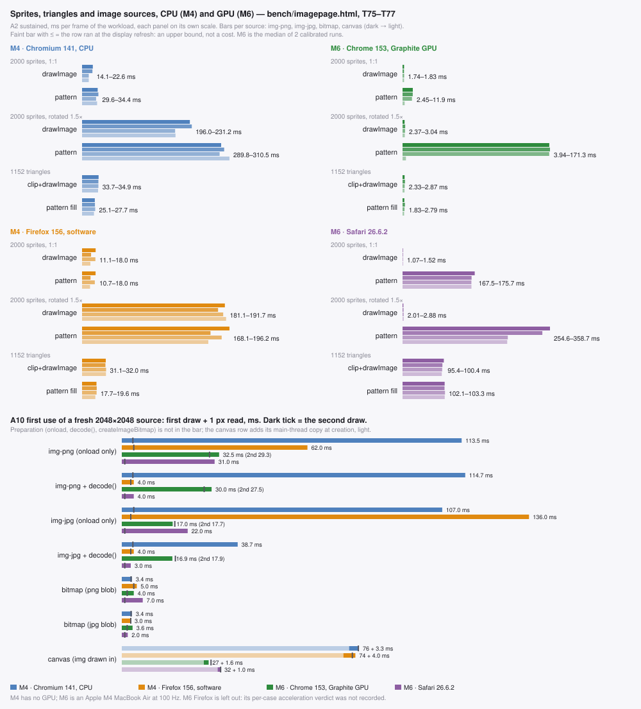

*Generated by `bench/imagefigs.mjs` from `bench/out/*-img-m4.json` and M6's calibrated `*-img2-gpu-r*.json` (T75–T77).*

#### The answer first

| question | answer | CPU (M4) | GPU (M6) |
|---|---|---|---|
| sprite: `drawImage` or pattern `fillRect`? | **`drawImage`**, with a source rect | Chromium 1.46–2.25×, Firefox a tie | Chrome **5.9–6.9×**, **53–73×** rotated; Safari **108–169×**, 84–292× rotated; Firefox (mixed) a tie |
| triangle: `clip` + `drawImage` or pattern? | **pattern**, as §4.7 says, except on Safari | 1.24–1.34× Chromium, 1.59–1.80× Firefox | 1.03–1.42× Chrome, 26.7–33.2× Firefox (mixed); **a tie on Safari** |
| which source, steady state? | **a canvas for patterns**; for `drawImage` it depends on engine and draw | `` 1.6× dearer on Chromium; opacity 1.5–1.6× on Firefox | Chrome: a 512² pattern from an `` or bitmap **runs at CPU raster cost**, 4.4–67× a canvas's; Safari: the `` is the cheapest `drawImage` source |
| first draw of a fresh image? | **`await createImageBitmap(blob)`** | 3–5 ms instead of 62–137 ms | 2–8 ms instead of 17–42 ms |
| does `img.decode()` do the same? | **not on Chromium**, CPU or GPU | Chromium 115 ms after it | Chrome 28.4–29.0 ms after it |
| is a large `` fast once decoded? | **not on Chrome's GPU canvas** | yes (3.7 ms) | **25.3–25.8 ms every draw**, against 1.8–1.9 for a bitmap |

#### Sprites: `drawImage` wins everywhere it can be told apart

2 000 sprites of 64×64 from an 8×8-cell atlas. The two recipes are
`drawImage(src, sx,sy,64,64, dx,dy,64,64)` against §4.7's pattern recipe applied
to a rect: `setTransform(1,0,0,1, dx−sx, dy−sy); fillRect(sx,sy,64,64)` with one
`CanvasPattern` of the atlas. A2 sustained, ms per frame of 2 000 sprites.
Sources are listed as img-png / img-jpg / bitmap / canvas. M6 cells are
ranges over two runs.

| recipe | Chromium CPU (M4) | Firefox software (M4) | Chrome Graphite (M6) | Safari (M6) |
|---|---|---|---|---|
| `drawImage`, 1:1 | 22.6 / 21.9 / **14.1** / **14.1** | 18.0 / 12.0 / 17.7 / **11.1** | 1.75–1.76 / 1.72–1.74 / 1.75–1.83 / 1.57–1.79 | **1.04–1.07** / 1.14–1.22 / 1.43–1.48 / 1.47–1.52 |
| pattern `fillRect`, 1:1 | 33.0 / 34.4 / 29.6 / 31.7 | 18.0 / 11.2 / 17.0 / **10.7** | 11.9 / 11.7–11.9 / 10.9 / 2.26–2.45 | 166.8–175.7 / 162.9–168.0 / 164.3–167.5 / 164.6–167.6 |
| `drawImage`, rotated 1.5× | 227.1 / 231.2 / **196.0** / **196.9** | 190.1 / 181.1 / 187.9 / 191.7 | 2.34–2.37 / 2.56–3.04 / 2.48–2.89 / 2.20–2.61 | **1.23–2.01** / 2.08–2.35 / 2.20–2.73 / 2.32–2.88 |
| pattern, rotated 1.5× | 293.0 / 299.4 / 289.8 / 310.5 | 196.2 / 171.0 / 185.8 / 168.1 | 161.6–170.5 / 161.3–171.3 / 159.5–170.4 / 2.57–3.94 | 328.0–358.7 / 315.1–340.1 / 240.4–256.1 / 240.5–254.6 |

**`drawImage` is cheaper on every engine that separates the two, and on the
GPU the gap grows by an order of magnitude.** On Chrome's Graphite canvas, a
pattern sprite from an `` or a bitmap costs **5.9–6.9×** a `drawImage`
sprite unscaled and **53–73×** rotated. From a canvas the pattern costs only
1.27–1.56× unscaled and 0.98–1.80× rotated, because only a canvas-sourced
pattern stays on the GPU (source type, below). On Safari the pattern costs
**108–169×** unscaled and **84–292×** rotated. That is the CoreGraphics
mechanism §3.4 read from the source, now measured. Firefox ties in software
(within 7 % unscaled, 13 % rotated) and under the accelerated profile
(0.82–1.54× unscaled and 0.84–1.18× rotated, mixed regime).

The mechanism is the clip. §4.7's pattern recipe wins for triangles because it
removes a `clip` + `save`/`restore` per triangle. A sprite has no clip to
remove, so the pattern only adds a `setTransform` per sprite and a shader that
samples through a matrix.

**This is a negative result for the SwiftShader instrument.** M4's
SwiftShader Chromium, Ganesh on an emulated GPU, ranked pattern sprites 3–5×
*ahead*. On a real GPU they are 5.9× and more *behind*. The ranking it gave was
wrong, not just imprecise, which is what §10.1 warns about its timings.

#### Triangles: §4.7 holds on Chrome and Firefox, and ties on Safari

The same atlas mapped over 1 152 triangles (S20), A2, ms per frame:

| recipe | Chromium CPU (M4) | Firefox software (M4) | Chrome Graphite (M6) | Firefox, accelerated profile, mixed (M6) | Safari (M6) |
|---|--:|--:|--:|--:|--:|
| `clip` + `drawImage` | 33.7–34.9 | 31.1–32.0 | 2.05–2.87 | 69.6–88.6 | 95.1–100.4 |
| pattern fill | 25.1–27.7 | 17.7–19.6 | 1.53–2.79 | 2.57–2.76 | 101.3–103.3 |

- **Chrome:** the pattern wins by 1.03–1.42× per run. That is narrower than
  it looks: the two runs spread by up to 57 %, and one run's `` and
  bitmap pairs are inside the 10 % noise. From a canvas it is 1.28–1.42×.
- **Firefox, accelerated profile:** the pattern is **26.7–33.2×** cheaper. That
  is the clip-path cost §3.2 records for 1 152 novel clip paths per frame
  thrashing the path cache, measured in a loop that ends in software.
- **Safari:** the two recipes **tie**, clip ÷ pattern 0.92–0.99. §4.7's recipe
  buys nothing on Safari, and costs nothing either. §3.4's worry that Safari
  might *invert* it is answered on this fixture: a tie, from three runs over
  two rounds.

#### Bleed: a transformed sprite leaves its cell on most samplers

Part X measures bleed directly. It renders the same sprites from two copies of
the atlas that are identical inside the cells, one with black gutters and one
with white. Any pixel that differs between the two renders was sampled outside
the sprite's cell. Pixels that differ, of 921 600:

| sampler | either recipe, 1:1 | `drawImage`, rotated 1.5× | pattern, rotated 1.5× |
|---|--:|--:|--:|
| Chromium, Skia CPU (M4, M6) | 0 | **43 728–46 820** | **46 830** |
| Chrome, Graphite GPU (M6, displayed canvas) | 0 | **43 728** | **43 767–46 830** |
| Chromium, Ganesh on SwiftShader (M4, displayed canvas) | 0 | **48 397** | **46 830–48 413** |
| Firefox, Skia CPU (M4, M6) | 0 | 0 | 0, or **45 063–46 833** from a canvas source |
| Firefox, WebGL backend (M6 GPU; M4 llvmpipe) | 0 | **43 766**; 43 785 | **43 763**; 43 787 |
| Safari, `willReadFrequently` canvas (M6) | 0 | **0** | **43 633–43 634** |
| Safari, displayed canvas (M6) | 0 | **0** | **45 158–45 159** |

About 36 000–38 000 of those pixels differ by more than 16 levels. **Only
Safari's `drawImage`, on either canvas, and Firefox's CPU path (except for a
pattern made from a canvas), keep a transformed sprite inside its source
rect.** Every other sampler bleeds with either recipe, and Firefox's GPU
canvas bleeds where its CPU path does not. The source rect does not stop a
bilinear filter from reading the neighbouring cell. So the reason people
reach for `drawImage` (it "clips to the source rect") does not hold on most
engines, and the pattern is no worse there. **A transformed sprite needs a
padded atlas whichever recipe draws it**, the same requirement §4.8 states for
a textured face: extrude each cell's border texels into a gutter of at least
1 px at the largest scale you draw. That the displayed canvas ran on the GPU
is *inferred* on Chrome and Firefox from its different sampling, and
unverified on Safari.

#### The source type, in the steady state

The four sources hold the same pixels. On every engine, PNG-derived ``,
`ImageBitmap` and canvas read back **bit-identical**, so every timing gap
below is a path gap, not a content gap.

**For a pattern, a canvas is the source that is never slower.** For
`drawImage` there is no single answer: it depends on the engine and on whether
the draw is a sub-rect or a whole scaled image.

- **Chromium CPU (M4): the `` is the slow source.** An unscaled
  `drawImage` sprite costs 22.6 ms from an `` and 14.1 ms from a bitmap or
  a canvas, 1.60×.
- **Chrome GPU (M6): not for sub-rect sprites.** A sub-rect `drawImage` from an
  `` (1.75–1.76 ms) ties with a bitmap (1.75–1.83) and a canvas
  (1.57–1.79). **But a whole-image scaled draw is 2.8–4.1× dearer from an
  `` at every size from 256 to 4096 px** (§4.14), and a 2048² `` is
  13–14× its bitmap even at 1:1 (first use, below).
- **Chrome GPU: a 512² pattern needs a canvas source.** A pattern made from an
  `` or an `ImageBitmap` costs what the CPU raster costs: A2 ÷ A3 is
  1.00–1.04, at 10.9–11.9 ms unscaled and 159.5–171.3 ms rotated. The same
  pattern made from a canvas costs 2.26–2.45 and 2.57–3.94 ms, **4.4–5.3×**
  and **at least 40×** cheaper. *Mechanism unmeasured.* A2 = A3 fits a
  pattern image that is not resident on the GPU, sampled on the CPU. **Small
  tiled patterns do not show it** (§4.14: A2 is 12–20 % of A3 from the same
  kinds of source), and neither does the triangle pattern. So it is not every
  pattern, and what separates them (size, `'repeat'`, `fill()` against
  `fillRect()`) is unmeasured. A canvas source avoids it in every case.
- **Safari (M6): the `` is the cheapest `drawImage` source.** 1.04–1.07 ms
  unscaled, against 1.43–1.52 for a bitmap or a canvas, so the canvas costs
  **1.37–1.46×** more there. For patterns the order reverses: the rotated
  pattern favours a bitmap or canvas (240.4–256.1 ms) over an ``
  (315.1–358.7) by 1.23–1.49×.
- **Firefox software (M4 and M6): opacity matters.** An unscaled sprite costs
  11.1 ms from an `alpha: false` canvas and 12.0 ms from a JPEG ``,
  against 17.7–18.0 ms from a PNG `` or a bitmap made from it: 1.5–1.6×
  on M4, and 1.52–1.64× on M6. *Mechanism inferred, not measured.* A JPEG and
  an `alpha: false` canvas have no alpha channel, so Firefox can copy them
  instead of blending. Rotated, the gap shrinks to 1.08×.
- **Firefox, accelerated profile (M6, mixed regime): no source ranking.**

#### First use, and a large `` that never gets fast

A steady-state loop never sees decoding: the warm-up frames pay for it. A game
pays for it on the frame a new sprite sheet first appears. A10 (§8.1) prices
that frame. Each trial uses a fresh 2048×2048 source (S21), a fresh target,
one draw scaled to 1280×720, and a 1 px read to force completion. Median of
7 trials, ms, first draw / second draw. M6 cells are ranges over r1–r4.

| preparation | Chromium CPU (M4) | Firefox sw (M4) | Chrome GPU (M6) | Firefox accel. (M6) | Safari (M6) |
|---|--:|--:|--:|--:|--:|
| `` PNG, `onload` only | **113.5** / 3.7 | **62** / 4 | **28.5–28.8 / 25.3–25.6** | **33–42** / 1–5 | **29** / 1 |
| `` PNG, `await img.decode()` | **114.7** / 3.7 | 4 / 3 | **28.4–29.0 / 25.4–25.8** | 4–8 / 2–5 | 3 / 1 |
| `` JPEG, `onload` only | **107.0** / 4.0 | **136** / 3 | **16.6–17.0 / 17.7–18.6** | **31–38** / 2–5 | **22** / 1 |
| `` JPEG, `await img.decode()` | 38.7 / 3.7 | 4 / 3 | **16.9–17.3 / 17.8–18.4** | 4–8 / 1–4 | 3 / 1 |
| `await createImageBitmap(pngBlob)` | **3.4** / 3.1 | **5** / 4 | **3.5–4.3** / 1.8–1.9 | **4–8** / 1–4 | 7 / 1 |
| `await createImageBitmap(jpgBlob)` | **3.4** / 3.1 | **3** / 3 | **3.0–3.7** / 1.8 | **4–8** / 1–5 | **2** / 1 |
| canvas, `` drawn in at load (+ main-thread block) | 3.3 / 3.1 (+ 75.9) | 4 / 3 (+ 74) | 1.4–1.7 / 2.4–2.6 (+ 27.5–27.8) | 2–4 / 2–3 (+ 33–50) | 1 / 1 (+ 32) |

- **A plain `` decodes inside its first draw on every engine**: 16.6–137 ms
  of main thread on the frame that uses it.
- **`createImageBitmap` is the one preparation that fixes it everywhere.** The
  first draw costs 2–8 ms on every engine. The decode still takes 16–147 ms of
  wall time, but inside a promise, not inside your frame.
- **`img.decode()` fixes it on Firefox and Safari and not on Chromium**, on the
  CPU or on the GPU. A PNG costs the same after `decode()` as without it
  (114.7 against 113.5 ms on M4, 28.4–29.0 against 28.5–28.8 on M6).
  *Mechanism unmeasured.* The decode it triggers is evidently not the one the
  draw looks up.
- **On Chrome's GPU canvas, a 2048² `` is slow on every draw, not just the
  first.** The second draw costs 25.3–25.8 ms (PNG) and 17.7–18.6 ms (JPEG),
  against 1.8–1.9 ms from a bitmap: **13–14×**. The 512² atlas in the
  steady-state loop does not pay it, so what triggers it is unmeasured. Size,
  or a draw count before the image becomes resident, would both fit. Either
  way a large `` drawn every frame on Chrome is a recurring cost that no
  warm-up hides.
- **A canvas copy moves the stall to load time rather than removing it.**
  27.5–75.9 ms of synchronous main thread at creation, depending on the engine.
  That is fine behind a loading screen and wrong mid-game. To end up with a
  canvas without the stall, draw an `ImageBitmap` into it: that copy starts
  from pixels that are already decoded.

#### What is left unmeasured

- **A steady accelerated Firefox number.** Every M6 Firefox A2 demotes during
  its loop (§4.14), so none is a clean accelerated cost.
- **Why** Chrome runs a 512² pattern from an `` at CPU cost and a 128²
  tiled one on the GPU, and why its `` costs 2.8–4.1× a bitmap for a
  scaled whole-image draw but not for a sub-rect one.
- **Ganesh on a real GPU** (M1). Every Chrome GPU number here is Graphite.
  §10.1 warns against carrying a ratio between the two.

The rules, then:

1. **Never let an `` be drawn for the first time inside a frame.**
   `await createImageBitmap(blob)` at load. `img.decode()` is not a
   substitute on Chromium.
2. **Sprites: `drawImage` with a source rect**, on every engine. Pad the atlas
   if the sprites rotate or scale.
3. **Patterns: always from a canvas.** Draw each `ImageBitmap` once into a
   canvas (`alpha: false` if the art is opaque). On Chrome's GPU canvas that
   is the difference between a pattern on the GPU and one at CPU raster cost.
4. **`drawImage`: never a whole `` scaled on Chrome.** Draw its bitmap or
   a canvas (2.8–4.1×, and 13–14× for a 2048² image). Safari's sprites are
   the one case where the `` is cheapest, by 1.37–1.46×.
5. **Triangles: §4.7's pattern recipe**, with a canvas source. On Safari it
   ties with `clip` + `drawImage`, so there is nothing to switch for.
6. **Textured 3D faces: §4.14.**

### 4.14 Textured 3D faces: tiled materials

*Registry: T78, T79 — fixture and extrapolation scope in §10.5.*

§4.13 measured sprites and one atlas that never repeats. A canvas2d 3D engine
textures its faces differently: small per-material textures that **tile**
across each face. That gives three ways to draw a face:

- a **`'repeat'` pattern** with the face's UV → screen map on the context (§4.7's
  recipe);
- **`clip` + a pre-tiled canvas**, where the material was tiled into a canvas at
  load, then drawn through the same map;
- **`clip` + one `drawImage` per repetition**.

`imagepage.html`'s part M prices all three on S22: a perspective floor and two
walls, 336 quads with a mean of 4 475 px² each, covering 74.7 % of the canvas.
There are eight 128×128 materials, each tiled 4 × 4 per face (and once more
at 1 × 1), and three sources per material: a PNG ``, an `ImageBitmap`,
and a small 128×128 canvas. Part B sweeps image size for the per-draw cost of
each source (S23). Machine M6: three runs of part M, two of part B, and one of
each control. The picture check first confirms the three recipes draw the same
scene, up to edge antialiasing and tile seams: RMSE 2.4 / 7.6 on Chrome, 4.5 /
8.9 on Firefox, but **11.3 / 17.4 on Safari**. Safari's recipes therefore
differ in picture as well as in cost.

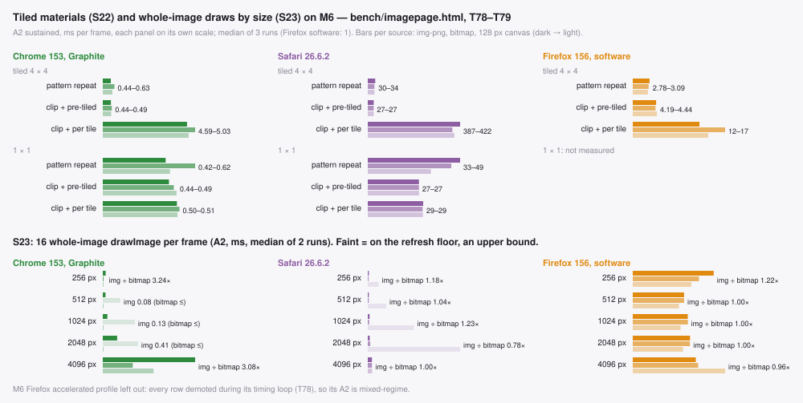

*Generated by `bench/imagefigs.mjs` from `bench/out/*-imgM-gpu-r*.json`, `*-imgM1-gpu-r1.json` and `*-imgB-gpu-r*.json` (T78, T79).*

#### The answer first

| question | Chrome (Graphite) | Firefox | Safari |
|---|---|---|---|
| which recipe for a tiled face? | pattern **ties** with pre-tiled | pattern, **≥ 39×** (mixed regime, below); 1.39–1.60× in software | **pre-tiled**, 1.11–1.40× ahead of the pattern |
| `drawImage` per tile? | **7.8–11.4×** the others | 1.2–2.0× the pattern in software | **13.5–17.0×** |
| which source for a pattern? | `` or canvas; a bitmap is 1.36–1.47× dearer | no difference | canvas or bitmap; `` 1.07–1.15× dearer |
| whole-image `drawImage`: `` against its bitmap? | **2.8–4.1× dearer from 256 px up** | ≤ 1.25× | ≤ 1.23×, and cheaper at 2048 |

**The portable choice for a 3D engine is the `'repeat'` pattern, from a
canvas.** It is never worse than 1.4× the best recipe on any engine, it is at
least 39× ahead on Firefox's accelerated profile, and it keeps texturing an
ordinary `fill()` so every batching rule applies (§4.7). **Never draw tiles
one `drawImage` at a time.**

#### The recipe, per engine

A2, ms per frame of the S22 scene. Chrome and Safari cells are ranges over
three runs; the sources are listed as img-png / bitmap / canvas.

| recipe | Chrome, tiled 4×4 | Chrome, 1×1 | Safari, tiled 4×4 | Safari, 1×1 | Firefox software, 4×4 |
|---|---|---|---|---|---|
| `'repeat'` pattern | **0.43–0.46** / 0.63–0.64 / 0.50–0.53 | 0.42 / 0.62 / 0.45 | 34.0–34.8 / 30.1–31.8 / 30.3–31.9 | 48.5 / 43.9 / 33.2 | **3.09 / 2.93 / 2.78** |
| `clip` + pre-tiled canvas | **0.44–0.46** / 0.45–0.50 / 0.45–0.54 | 0.44 / 0.47 / 0.49 | **24.9–27.4 / 24.8–27.1 / 24.8–27.2** | **26.9 / 26.9 / 27.0** | 4.30 / 4.19 / 4.44 |
| `clip` + `drawImage` per tile | 4.52–4.61 / 5.00–5.05 / 4.47–5.15 | 0.50 / 0.51 / 0.50 | 386.1–422.1 / 374.2–399.2 / 367.2–397.2 | 29.1 / 28.8 / 29.0 | 12.3 / 17.0 / 13.9 |

- **Chrome: the pattern and the pre-tiled canvas tie.** From an ``,
  0.43–0.46 against 0.44–0.46 ms. `drawImage` per tile costs 7.8–11.4× them at
  4 × 4, and nothing extra at 1 × 1, where it *is* one `drawImage`.
- **Safari: the pre-tiled canvas wins.** The pattern is 1.11–1.40× dearer at
  4 × 4 and 1.23–1.80× at 1 × 1. Per tile it is 13.5–17.0×. This agrees with
  §3.4's source reading, where every pattern fill builds a new `CGPattern`,
  and with §4.13's sprites, where Safari's pattern loses by two orders of
  magnitude. It also agrees with §4.7's triangles, which tie on Safari.
- **Firefox: the pattern wins everywhere.** On the accelerated profile it
  costs 0.39–0.50 ms against 19.8–24.5 for either clip recipe, at least
  **39×**, and 47.6–51.4× at 1 × 1. That is the clip-path cost §3.2 records.
  In software the margin is 1.39–1.60× over pre-tiled and 3.98–5.82× over per
  tile. **Every accelerated-profile row here demoted during its timing loop**
  (below), so those numbers mix both regimes. The ranking is the same in
  either.

#### The source, for materials

**No source is far behind for a tiled pattern on any engine.** That separates
this case from §4.13's large no-repeat sprite pattern, where Chrome ran
patterns from an `` or bitmap at CPU raster cost (A2 ÷ A3 = 1.00–1.04).
Here, from the same kinds of source, A2 is 12–20 % of A3. *Mechanism
unmeasured.* Size, `'repeat'`, or `fill()` against `fillRect()` could each
separate the two, and none was varied alone.

- **Chrome:** the `` pattern is cheapest (0.43–0.46 ms). The canvas is
  1.09–1.23× that, and the **bitmap is the dearest, 1.36–1.47×**.
- **Safari:** the `` pattern costs 1.07–1.15× the small canvas at 4 × 4,
  and 1.46× at 1 × 1 (one run). A bitmap is level with the canvas at 4 × 4.
  So a small pre-rendered canvas is never slower on Safari, but the gap is
  1.07–1.46×, not an order of magnitude. Whether Safari re-decodes the PNG is
  **not measured**: no row times a decode.
- **Firefox:** the sources are within a few per cent of each other on either
  profile.

A canvas is therefore the safe pattern source: within 1.23× of the best on
every engine, and never the dearest.

#### Whole-image draws: Chrome's `` costs 2.8–4.1× its bitmap at every size

Part B draws one image 16 times per frame, scaled into 320×180 cells, for
sizes 256–4096 px. A2 per 16 draws, ms, ranges over two runs; **F** marks a
row on the refresh floor, so an upper bound:

| size | Chrome `` / bitmap / canvas | Safari `` / bitmap / canvas | Firefox software `` / bitmap / canvas |
|--:|---|---|---|
| 256 | **0.07–0.08** / 0.02–0.03 / 0.02 | 0.04–0.06 / 0.05 / 0.04–0.59 F | 2.35 / 1.93 / 1.70 |
| 512 | **0.07–0.08** / 0.03–0.50 F / 0.01–0.02 | 0.05–0.06 / 0.05–0.06 / 1.00 F | 1.49 / 1.49 / 1.34 |
| 1024 | **0.12–0.13** / F / 0.01–0.02 | 0.05–0.10 / 0.07–0.08 / 2.50 F | 1.60 / 1.60 / 1.39 |
| 2048 | **0.37–0.41** / F / 0.01–0.02 | 0.09–0.10 / 0.12–0.13 / 0.14–5.00 F | 1.66 / 1.66 / 1.46 |
| 4096 | **2.22–2.62** / 0.81–0.85 / 1.42–1.44 | 0.17–0.23 / 0.19–0.23 / 0.20–0.23 | 1.83 / 1.90 / 2.68 |

- **On Chrome an `` costs 2.8–4.1× its bitmap from 256 px up**, wherever
  the bitmap row is resolved, and 3.7–33.6× a canvas up to 2048. §4.13's
  2048² first-use table saw the same thing as a slow second draw. The 512²
  sprite atlas does *not* pay it for 1:1 sub-rect draws (1.75–1.76 ms against
  a bitmap's 1.75–1.83), so it applies to scaled whole-image draws. *Mechanism
  unmeasured.*
- **Safari and Firefox:** `` ÷ bitmap stays at 0.75–1.25 at every size.
- At 4096 on Chrome the canvas (1.42–1.44) costs more than the bitmap
  (0.81–0.85).
- 11 rows stayed on the refresh floor despite the calibration, all of them
  cheap draws in part B. Chrome's `` against bitmap at 1024 and 2048 is
  therefore unresolved, and bounded only by the canvas.

#### On Firefox, the timing loop itself demotes the canvas

With the acceleration indicator fixed, every accelerated-profile Firefox row
on M6 reads `ACCEL > ACCEL > soft`: accelerated after its first presented
frame, still accelerated after A1, and on software by the end of A2. That is
all 114 rows, and the 9 rows of a control with **the workload replaced by
nothing** (only the loop's clears). It matches M4's llvmpipe runs (§4.13).
Part F's targets, which never run a sustained loop, stay accelerated. So a
Firefox A2 on this page is a **mixed-regime** figure: part of it accelerated,
the rest software. What in the loop fails the usage profile (§3.2) is
**unmeasured**. The control ran 4 096 clears per frame, and the real cases 4
to 250. §8.1 carries the consequence for every Firefox A2.

#### Rules

1. **Texture 3D faces with a `'repeat'` pattern whose source is a canvas.** It
   ties on Chrome and wins by ≥ 39× on accelerated Firefox and 1.4–1.6× in
   software. On Safari it costs 1.11–1.40× a pre-tiled clip.
2. **On Safari only, `clip` + a pre-tiled canvas is 1.11–1.80× cheaper** than
   the pattern. Keep it behind the §1.7-style runtime switch if Safari
   matters, and pick by timing both at startup.
3. **Never `drawImage` once per tile**: 7.8–17.0× at 4 × 4.
4. **On Chrome, never draw a whole `` scaled every frame.** Draw its
   bitmap or a canvas: 2.8–4.1× at every size measured.


---

## 5. Measurements

Scenes: 1280×720, `alpha: false`. `torusKnot` is a 65 536-triangle tube, 192
palette entries, self-overlapping. `sphere` is 65 536 triangles, 96 palette
entries, a single depth layer. `soup` is 40 000 independent random triangles with
no shared edges and random colours — the adversarial case.

Common pipeline cost (transform, backface + frustum cull, flat shade, 16-bit
radix depth sort), excluded from the strategy comparison: **1.1 ms/frame** on
Chromium, 1–2 ms on Firefox, for 65k triangles.

Fill and vertex counts differ by a percent or two between tables here and in
§4: the model is rotating, and the tables are sampled at different animation
frames. Ratios are stable; absolute counts wobble with the pose.

### 5.1 End-to-end, GPU included (the number that counts)

*Registry: T02, T22 — fixture and extrapolation scope in §10.5.*

`perDraw` = total wall time ÷ (frames × draws-per-frame), rAF-driven, workload
sized well above one vsync. `cpu` is what `performance.now()` sees;
`hidden` = `perDraw − cpu` is the part it cannot see. **Every row strokes**
except where noted, because a renderer that does not stroke does not hide its
seams (§4.4).

**Chromium 152**

| scene | strategy | fills | strokes | verts | perDraw | cpu | hidden |
|---|---|--:|--:|--:|--:|--:|--:|
| torus knot | **per-tri fill+stroke** (baseline) | 35 723 | 35 723 | 142 892 | **143.2** | 142.5 | 0.7 |
| | grid 2 px + cancel + stroke | 940 | 940 | 55 238 | **53.8** | 8.9 | 44.8 |
| | grid + cancel + seam-stroke | 940 | 924 | 105 447 | 55.3 | 10.6 | 44.7 |
| | grid + cancel, **no** stroke (seamy) | 940 | 0 | 50 252 | 48.7 | 8.7 | 40.0 |
| | bands 64 + runs + cancel + stroke | 6 182 | 6 182 | 86 712 | 105.0 | 69.2 | 35.9 |
| sphere | **per-tri fill+stroke** (baseline) | 42 016 | 42 016 | 168 064 | **156.1** | 159.5 | ~0 |
| | grid 2 px + cancel + stroke | 191 | 191 | 11 387 | **9.5** | 3.6 | 5.8 |
| | grid + cancel + seam-stroke | 191 | 191 | 28 357 | 9.9 | 4.0 | 5.9 |
| | grid + cancel, **no** stroke (seamy) | 191 | 0 | 11 098 | 8.2 | 3.6 | 4.6 |
| | bands 64 + runs + cancel + stroke | 1 972 | 1 972 | 45 854 | 51.9 | 50.9 | 1.0 |
| torus knot **unwelded** | per-tri fill+stroke (baseline) | 35 723 | 35 723 | 142 892 | 141.7 | 137.3 | 4.4 |
| | grid 2 px + cancel + stroke | 940 | 940 | 142 108 | **69.8** | 11.6 | 58.2 |

**Firefox 155** (software after demotion; `hidden` ≈ 0 confirms it)

| scene | strategy | fills | strokes | verts | perDraw | cpu |
|---|---|--:|--:|--:|--:|--:|
| torus knot | **per-tri fill+stroke** (baseline) | 35 723 | 35 723 | 142 892 | **57.1** | 57.1 |
| | grid 2 px + cancel + stroke | 940 | 940 | 55 238 | **35.0** | 35.2 |
| | grid + cancel + seam-stroke | 940 | 924 | 105 447 | 36.3 | 36.4 |
| | grid + cancel, **no** stroke (seamy) | 940 | 0 | 50 252 | 32.7 | 32.7 |
| | bands 64 + runs + cancel + stroke | 6 182 | 6 182 | 86 712 | 48.8 | 49.4 |
| sphere | **per-tri fill+stroke** (baseline) | 42 016 | 42 016 | 168 064 | **44.6** | 45.2 |
| | grid 2 px + cancel + stroke | 191 | 191 | 11 387 | **7.1** | 7.1 |
| | grid + cancel + seam-stroke | 191 | 191 | 28 357 | 7.6 | 7.6 |
| | bands 64 + runs + cancel + stroke | 1 972 | 1 972 | 45 854 | 15.1 | 15.1 |
| torus knot **unwelded** | per-tri fill+stroke (baseline) | 35 723 | 35 723 | 142 892 | 57.1 | 57.1 |
| | grid 2 px + cancel + stroke | 940 | 940 | 142 108 | **59.2** | 59.3 |

*(The torus-knot baseline appears as 76.5 ms in the raw indexed-scene JSON: it
was the first case measured on a fresh canvas and carries Firefox's
acceleration-demotion transient. The unwelded scene draws identical geometry
post-demotion and reads 57.1 ms, which is the honest figure and the one used
here. Worth knowing if you rerun the harness.)*

Reading these:

- **Stroking is cheap once batched, ruinous when it is not.** Adding the seam
  stroke costs **+10 %** batched (48.7 → 53.8, 8.2 → 9.5, 32.7 → 35.0) and
  **+125 %** per triangle. Arithmetic, not magic: edge cancellation removed the
  strokes at the same rate it removed the fills.
- **On Chromium the per-triangle stroke saturates the main thread** — 143–156 ms
  with `hidden` ≈ 0. 42 016 fills + 42 016 strokes + 84 032 style assignments
  never even reach the GPU-bound regime.
- **Welding is not optional.** Unwelded, the vertex count does not fall
  (142 108 vs 142 892), so on Firefox — which is purely vertex-bound in software
  — batching becomes a **net loss**: 57.1 → 59.2 ms. Welded, the same geometry
  gives 35.0 ms. On Chromium unwelded still wins (141.7 → 69.8) because the
  stroke-*call* collapse alone is worth 2×, but you leave half the win behind.
- **Seam-only stroking costs +3–5 %** (53.8 → 55.3, 9.5 → 9.9, 35.0 → 36.3) for
  ~20 % less error (§4.4).
- **Firefox is monotone; Chromium is U-shaped.** Bands-64 at 6 182 non-convex
  fills lands at 105 ms on Chromium, worse than either extreme — see §3.1.
- **Recording cost falls 16–44×** (142.5 → 8.9, 159.5 → 3.6). Even where the GPU
  is the bottleneck, that is main-thread budget handed back.

### 5.1b Edge cancellation, isolated

*Registry: T08 — fixture and extrapolation scope in §10.5.*

Identical batching and fill count; the only difference is whether shared
interior edges are cancelled (§6.2):

| scene | engine | subpath-per-triangle | edge-cancelled |
|---|---|--:|--:|
| sphere | Firefox | 22.9 ms | **10.1 ms** |
| sphere | Chromium | 36.2 ms | **31.8 ms** |
| torus knot | Firefox | 48.4 ms | **27.7 ms** |
| torus knot | Chromium | 69.4 ms | **64.3 ms** |

### 5.2 Where the vertex count gets to

*Registry: T35 — fixture and extrapolation scope in §10.5.*

Vertices after edge cancellation and collinear removal, as a fraction of the
per-triangle `3n` (counts only, §8.2):

| batcher | torus knot | sphere |
|---|--:|--:|
| per-triangle | 100 % | 100 % |
| colour runs + cancel | 99.3 % | 96.7 % |
| grid bbox 2 px + cancel | 85.7 % | 63.9 % |
| grid interior 2 px + cancel | **46.9 %** | **8.9 %** |
| *colour-only (invalid) + cancel* | *43.4 %* | *6.0 %* |

Interior-coverage batching gets within a few percent of the unreachable floor on
the sphere. Colour runs — the "free" optimisation of merging *consecutive*
same-colour triangles — buys essentially nothing (1–3 % fewer fills), because a
depth sort scatters colours. Don't bother with run-length batching alone.

### 5.3 Micro-benchmarks

1024×1024, 8000 triangles, identical geometry, only the API usage differs.
`rec` = GPU canvas, no flush; `raster` = software Skia + forced completion.
Minimum of 5 rounds (a mean is useless against sporadic machine interference).

| case | Chromium rec / raster | Firefox rec / raster |
|---|--:|--:|
| 8000 fills, 1 subpath each | 2.83 / 10.33 | 5.50 / 10.67 |
| 80 fills, 100 subpaths each | 0.37 / 17.77 | 0.33 / 23.33 |
| 8 fills, 1000 subpaths each | 0.40 / 24.63 | 0.33 / 24.67 |
| 1 fill, 8000 subpaths | 0.40 / 15.27 | 0.33 / 14.33 |
| 1 fill, 8000 subpaths, **+ closePath** | **169.82** / 183.5 | 0.50 / 14.33 |
| 1 fill, 8000 subpaths, explicit closing `lineTo` | 0.48 / 14.33 | 0.33 / 14.67 |
| path build only, no fill (24 000 ops) | 0.22 / — | 0.17 / — |
| `fillRect` × 8000 | 0.88 / 3.90 | 0.67 / 3.00 |
| style: same string every fill | 2.13 / 10.30 | 3.17 / 9.67 |
| style: cycle 256 `#rrggbb` | 3.40 / 12.13 | 5.00 / 11.67 |
| style: cycle 256 `rgb(r,g,b)` | 3.82 / 11.97 | 6.33 / 12.67 |
| style: build the string per fill | 4.48 / 12.83 | 7.00 / 13.33 |
| `Path2D` allocated per fill | 3.47 / 11.97 | 6.33 / 12.33 |
| one `Path2D`, 8000 subpaths | 0.43 / 14.37 | 0.67 / 13.67 |
| coordinates snapped to integers | 2.08 / 9.20 | 3.00 / 9.00 |

Derived recording cost model, which predicts the measured cases to a few
percent:

```
Chromium:  record ≈ 0.26 µs × fills + 9 ns × vertices
Firefox:   record ≈ 0.65 µs × fills + 7 ns × vertices
```

Vertices are nearly free to *record*; fills are not. Changing `fillStyle` adds
~0.16 µs/fill (Chromium) or ~0.23 µs (Firefox) — about half a fill's cost again,
a second and independent reason to batch by colour. Hex beats `rgb()`; both beat
building the string in the loop.

Note the software-raster column moves the *other* way for the first four rows:
8000 separate small fills rasterise in 10.3 ms, one path with 8000 scattered
subpaths takes 15.3 ms, and 8 paths of 1000 subpaths take 24.6 ms. Merging
subpaths, on its own and with the vertex count unchanged, makes software
rasterisation **worse** — see §6.2 and §6.4 for the two reasons.

**Context flags** (8000 fills, record):

| flag | Chromium | Firefox |
|---|--:|--:|
| `alpha: false` | 2.28 | **3.00** |
| `alpha: true` | 2.18 | **10.83** |
| `alpha: false, desynchronized: true` | 2.23 | **11.00** |
| `alpha: false, willReadFrequently: true` | 9.52 | 8.67 |

`alpha: false` is a **3.6× win on Firefox** and neutral on Chromium.
`desynchronized: true` is a **3.7× loss on Firefox** and neutral on Chromium —
do not enable it blind. `willReadFrequently` costs 4× on Chromium, as expected:
it forces the CPU backend.

---

### 5.4 State-machine costs (raw)

*Registry: T34 — fixture and extrapolation scope in §10.5.*

8000 identical triangle fills; the only difference between rows is which state
call surrounds them. Subtract the reference row to get the cost of the call.
Minimum of 5 rounds.

| case | Chromium rec / raster | Firefox rec / raster |
|---|--:|--:|
| **reference**, `fillStyle` set once | **2.22 / 10.47** | **2.83 / 9.67** |
| `fillStyle =` same string per fill | 2.17 / 10.30 | 3.33 / 10.33 |
| `fillStyle =` new string, same value | 2.33 / 10.43 | 3.17 / 9.00 |
| `save()` / `restore()` per fill | 4.12 / 12.50 | 3.33 / 10.33 |
| `setTransform(identity)` per fill | 2.68 / 10.53 | 3.17 / 10.33 |
| `translate()` ×2 per fill | 3.43 / 12.17 | 2.83 / 10.00 |
| `globalAlpha = 1` per fill | 2.23 / 10.23 | 2.83 / 10.33 |
| `globalAlpha` alternating | 2.40 / 10.57 | 2.83 / 9.33 |
| `globalCompositeOperation` per fill | 2.33 / 10.80 | 2.83 / 10.00 |
| `shadowBlur = 0` per fill | 2.08 / 10.67 | 3.00 / 9.67 |
| `fill('nonzero')` explicit arg | 2.50 / 10.43 | 2.67 / 9.00 |
| `fill('evenodd')` | 2.55 / 10.77 | 3.83 / 11.33 |
| full-canvas rect `clip()` every 100 fills | 2.25 / 10.37 | 3.17 / 9.67 |
| `stroke()` instead of `fill()` | 2.18 / 7.30 | 3.00 / 6.67 |
| **`fill()` + `stroke()`** (the seam hack) | 3.38 / **15.73** | **16.33** / 13.33 |

Shadows, at 500 fills rather than 8000 because they are in a different league:

| case | Chromium rec / raster | Firefox rec / raster |
|---|--:|--:|
| no shadow (reference) | 0.12 / 0.70 | 0.00 / 0.33 |
| `shadowBlur = 4` | 0.12 / **4.83** | 0.17 / **9.33** |

Clearing the frame, 200 full-canvas operations at 1024²:

| case | Chromium raster | Firefox raster |
|---|--:|--:|
| `fillRect(0, 0, w, h)` | 18.93 ms | 18.33 ms |
| `clearRect(0, 0, w, h)` | **0.10 ms** | 19.00 ms |
| `canvas.width = w` | 0.17 ms | 0.00 ms |

Chromium turns a full-canvas `clearRect` into a cheap discard; Firefox does not.
Both treat a backing-store resize as free — but it also resets every context
property, which is a footgun as often as a feature. At ~95 µs, one `fillRect`
clear is about 1 % of a well-optimised frame; not worth agonising over.

Transform, 8000 fills:

| case | Chromium rec / raster | Firefox rec / raster |
|---|--:|--:|
| transform baked into the coordinates | 2.18 / 8.10 | 4.33 / 8.33 |
| `ctx.setTransform` once, raw coordinates | 2.15 / 8.73 | 4.33 / 8.67 |

Identical. Use whichever is clearer; there is no reason to pre-multiply your
vertices by the viewport transform by hand.

### 5.5 Occlusion culling, measured

*Registry: T18, T19, T20, T21 — fixture and extrapolation scope in §10.5.*

All on the **corrected** sheet (§2), 1280×720. The procedures are §8.4 for the
visibility ground truth and §8.5 for the fidelity reference.

#### How much is there to cull?

1 sample per pixel, near → far in the engine's own centroid order, counting
faces that own **zero** pixels of the final image:

| scene | visible faces | overdraw | own no pixel | of pixel area | sub-sample |
|---|--:|--:|--:|--:|--:|
| torus knot | 28 714 | 2.00× | **73.1 %** | 48.2 % | 2.8 % |
| sphere | 19 596 | 1.00× | 0.0 % | 0.0 % | 15.8 % |
| grid (heightfield) | 30 893 | 2.58× | 60.9 % | 54.7 % | 3.2 % |
| 8 spheres | 28 537 | 1.33× | 33.5 % | 24.0 % | 9.3 % |
| 5 deep | 18 690 | 1.50× | 28.6 % | 31.9 % | 9.0 % |
| soup 40k | 20 214 | 11.91× | 82.3 % | 69.1 % | 0.5 % |

`8 spheres` is a 2×2×2 block of instances and `5 deep` is five stacked down the
view axis, both added for this section — one solid object cannot exhibit
inter-object occlusion, and it is a different shape of win (see the fills column
below).

The last column is the other reason a face can own no pixel: it is smaller than
a pixel centre. Those are **not** hidden and must not be dropped (§6.11). And
the sphere row is the control: a convex closed mesh has one sheet after backface
culling and nothing to cull at all.

#### The shipped modules, wired together

Geometry → cull → batch → emit, counts and CPU only, no canvas (§8.2):

| scene | faces | fills | verts | strokes | cull ms | net CPU |
|---|--:|--:|--:|--:|--:|--:|
| torus knot | −74 % | **−65 %** | **−75 %** | −66 % | 1.92 | **−1.59 ms** |
| grid | −54 % | −35 % | −54 % | −35 % | 3.48 | +0.15 ms |
| 8 spheres | −36 % | −32 % | −37 % | −30 % | 2.13 | +0.62 ms |
| 5 deep | −28 % | −28 % | −28 % | −28 % | 1.50 | +0.79 ms |
| sphere | 0 % | 0 % | 0 % | 0 % | 1.57 | +1.82 ms |

`net CPU` is `(cull + batch + emit) − (batch + emit)`. The torus knot is
**CPU-negative**: batching and emitting 74 % fewer faces saves more than the
culler costs. Everything with real occlusion is CPU-neutral for a 28–54 %
vertex cut. The sphere row is the guard's whole reason to exist (§4.9).

Two shapes of win, worth telling apart. On a **self-occluding** mesh (torus
knot, grid) the fills fall nearly as fast as the faces, because whole batches
disappear. On **inter-object** occlusion (8 spheres) the batcher had already
merged those faces well, so the fills barely move and the win is almost pure
vertex count — which is the cost centre Firefox charges for.

**Not yet measured in a browser.** The prediction to test, and the reason to
test it on **Firefox first**: after demotion Firefox is purely vertex-bound
(`cpu == perDraw`, §5.1), and this is a 54–75 % cut in vertices.

#### The variant sweep

Torus knot, 28 714 visible, base 705 fills / 76 998 verts. `FALSE` counts faces
dropped that a true per-pixel z-buffer says are visible; the last column is
pixels differing from a 3×3-supersampled reference by >2 / >16 / >64 out of 255,
of 921 600.

| variant | cull % | ms | FALSE (px) | fills | verts | RMSE | px >2/>16/>64 |
|---|--:|--:|--:|--:|--:|--:|--:|
| bare ss=½ | 75.2 | 1.45 | 117 (297) | 240 | 17 751 | 1.155 | 635/487/151 |
| bare ss=1 | 75.4 | 1.75 | 24 (51) | 224 | 17 566 | 0.281 | 175/116/2 |
| bare ss=2 | 75.4 | 2.72 | 25 (55) | 219 | 17 569 | 0.099 | 45/22/0 |
| dilate-test ss=1 | 75.1 | 2.36 | 21 (43) | 234 | 17 734 | 0.148 | 40/23/0 |
| **erode-mark ss=1** | **3.7** | 5.24 | 0 (0) | 689 | 75 993 | 0.000 | 0/0/0 |
| skirt ss=½ | 73.1 | 1.57 | 4 (6) | 273 | 19 550 | 0.093 | 25/10/0 |
| **skirt ss=1** | **73.6** | **1.82** | **1 (1)** | **256** | **19 108** | **0.097** | 24/23/0 |
| skirt ss=2 | 73.7 | 2.95 | 1 (1) | 252 | 19 148 | 0.021 | 1/1/0 |

`erode-mark` is the textbook conservative occluder, and it is a trap (§6.10).
`dilate-test` is sound but loses to the skirt on every axis: 1.3× the time for
2.4× the error at a hair more cull rate.

Same comparison on the other scenes, `skirt ss=1` against `bare ss=1`:

| scene | bare cull % | skirt cull % | bare px>16 | skirt px>16 |
|---|--:|--:|--:|--:|
| grid | 62.3 | 54.1 | 1 090 | **20** |
| 8 spheres | 37.3 | 35.6 | 70 | **0** |
| 5 deep | 29.7 | 27.8 | 42 | **0** |
| soup 40k | 82.8 | 82.8 | 492 | 492 |

The grid is where the skirt costs most (8 points) and buys most (55× less
visible error) — a heightfield at a grazing angle has a long, ragged
self-occlusion boundary, which is precisely the geometry that generates sliver
faces.

`soup 40k` has no shared edges at all, so the skirt is a no-op there. That is
the "weld your geometry" moral of §6.7 arriving from a different direction: an
unwelded mesh does not just cost you the vertex win, it costs you the cheap
fidelity fix for the culler as well.

---

### 5.6 Composite operations, and writing more than one canvas

*Registry: T24, T25 — fixture and extrapolation scope in §10.5.*

A deferred pipeline on canvas2d is several canvases and a few composites per
frame, so both halves need a price. Reproduce with `bench/fogpage.html` and
`bench/mrtpage.html`.

#### Full-canvas composite cost

One 1280×720 `drawImage` of one canvas onto another, ms per operation, on a
fresh target canvas per case so an unsupported op cannot contaminate the case
after it. `<0.008` means 2 048 of them fitted inside one vsync and the loop
never escaped the frame clock — an upper bound, not a measurement.

| operation | Chromium | Firefox |
|---|--:|--:|
| `source-over` | <0.008 | <0.008 |
| `screen` | <0.008 | <0.008 |
| `lighter` (`OP_ADD`) | <0.008 | <0.008 |
| `multiply` | 0.073 | <0.008 |
| `difference` | 0.087 | **0.93** |
| `difference` + white `fillRect` (invert in place) | 0.153 | — † |
| `ctx.filter = 'invert(1)'` + `drawImage` | 0.321 | **9.45** |
| `ctx.filter = 'invert(1)'` + self `drawImage` | 0.054 † | **68.3** |

† vsync-floored, do not trust the value.

Three things to take from it:

- **The accelerated set is effectively free.** `multiply`, `screen`, `lighter`
  and `source-over` are all at or below the measurement floor on Firefox, and
  `multiply` is the only one with a visible cost on Chromium. If your composite
  chain is built from these, the composites are not your problem — the passes
  are (§4.10).
- **`difference` is 116× the accelerated ops on Firefox**, and `ctx.filter` is
  1 180× — 8 500× if you filter a canvas onto itself. These are the two ops
  Firefox will not accelerate, and the cost is on top of demoting the canvas
  (§6.13).
- **`lighter` is 24× cheaper than `multiply` on Chromium** (0.003 against
  0.073, measured at 2 048 and 538 reps). If a term can be additive rather than
  multiplicative, make it additive.

#### Two canvases: interleaved or sequential?

The tempting shape for a multi-target pass is MRT — one walk over the geometry
that writes every canvas as it goes, so the batching and boundary extraction
happen once instead of N times. Measured, torus knot, two 1280×720 canvases,
`bench/mrtpage.html`:

| shape | Chromium | | Firefox | |
|---|--:|--:|--:|--:|
| | frame | cpu | frame | cpu |
| sequential — finish A, then walk again for B | **105.7** | 22.3 | 84.5 | 83.7 |
| interleaved, same style to both | 108.2 | 19.8 | 71.4 | 70.1 |
| interleaved, **distinct style per canvas** | 129.7 | 19.7 | **71.7** | 70.1 |
| *(one canvas only, reference)* | 55.7 | 18.2 | 46.8 | 45.9 |

**This is one of the very few places in this guide where the engines disagree**
(the other is §4.5's sub-tile testing).

- **Chromium: sequential wins, 1.23×.** And the mechanism is visible in the two
  interleaved rows — fanning the same style to both targets costs 2 %, but
  writing a *different* style to each costs **23 %**, at identical CPU (19.7 ms
  both). Switching destination is cheap; switching destination *and* pipeline
  state per draw is what stops the backend batching.
- **Firefox: interleaved wins, 1.18×**, and the distinct styles cost nothing
  (71.4 against 71.7). After demotion (§3.2) there is no GPU draw batch to
  break, so the only thing that matters is that interleaving halves the JS
  boundary walk — 83.7 ms of CPU down to 70.1.
- The micro version — 4 000 `fillRect`s, alternating against sequential —
  shows almost nothing on either engine (Chromium 0.31 against 0.33 ms of CPU;
  Firefox noisy either side of 1.07). So it is not the destination switch by
  itself.

**Ship sequential.** Chromium's 1.23× penalty is unambiguous and Firefox's
1.18× gain only exists in the demoted-software regime you cannot rely on being
in — before demotion Firefox has the same draw batch to break that Chromium
does. That is the §1.8 argument applied to a case where the engines genuinely
differ: pick the setting that is never badly wrong.

**But the row that actually matters is the last one.** Two canvases cost
1.8–1.9× one canvas on both engines (55.7 → 105.7, 46.8 → 84.5), and no
ordering recovers that. The lever is not how you write two canvases, it is
whether you need two — which is what §4.10 is about.

#### Which invert idiom, and does the answer depend on the scene?

*Registry: T43 — fixture and extrapolation scope in §10.5.*

§5.6's op table prices the operations in isolation. What a renderer actually
chooses between is *whole frames*, so here is the same question asked that way:
the full three-pass chain with the fog map inverted five different ways, on a
828-face scene and a 35 544-face one, sustained, GPU-inclusive.

| how the fog map is inverted | FF simple | FF complex | Cr simple | Cr complex |
|---|--:|--:|--:|--:|
| `difference` + white `fillRect` | **31.1** | **100.4** | 18.1 | 99.7 |
| `filter = 'invert(1)'` + self `drawImage` | 37.0 | 106.2 | 18.1 | 95.6 |
| `filter = 'invert(1)'` + `drawImage` of a copy | 37.1 | 112.2 | 18.0 | 106.7 |
| `filter = 'invert(0)'` + self `drawImage` *(identity)* | 36.3 | 104.7 | 18.0 | **91.1** |
| no invert: add map straight from the palette | 33.9 | 104.6 | 18.8 | 103.2 |

Three things, and the third is the one worth carrying:

- **On Firefox `difference` wins on both scene sizes**, by 16–19 % over the
  filter idioms, and the ranking does *not* flip with scene size. This is the
  whole-frame version of §4.10's A-beats-B2 result and it agrees with it.
- **On Chromium every row is inside ±10 %**, which §4.10 already says is
  Chromium's spread on this fixture. Nothing here is a Chromium result.
- **`invert(0)` is the identity filter — it computes nothing — and it costs
  the same as `invert(1)`** (36.3 against 37.0 on Firefox, 91.1 against 95.6 on
  Chromium). So the price of `ctx.filter` is the *filter machinery*: setting up
  a filter pipeline, and on Firefox taking the canvas off the accelerated path
  to do it. Turning the amount down is not a lever, and an `invert(0)` left in
  a shipping pipeline is pure cost for a no-op.

*If you measured this and got the opposite ranking*, the variable to check
first is not the scene — it is whether the fog canvas was accelerated at the
time (§3.2), because that flips the price of `ctx.filter` by orders of
magnitude (§5.6's table: 9.45 ms against <0.008 ms) and nothing in
`performance.now()` on a single frame will tell you which regime you were in.

### 5.7 Open batch slots, and where the CPU timer ranks backwards

*Registry: T44 — fixture and extrapolation scope in §10.5.*

A batcher that holds *K* batches open and joins each incoming face to the
newest open batch of its colour — Skia's `GrOpsTask` shape, and what a "weld
buffer with K slots" is — has one obvious knob. Sweeping it produces the
cleanest example in this guide of §2's thesis.

S1, 35 544 visible faces, `batchLookback(K)` against the shipped occupancy-grid
batcher, sustained:

| K | fills | path verts | Cr cpu | Cr **frame** | FF cpu | FF frame |
|---|--:|--:|--:|--:|--:|--:|
| 1 | 25 302 | 240 810 | 93.2 | 162.5 | 81.4 | 84.6 |
| 2 | 17 799 | 237 339 | 30.9 | 146.0 | 65.1 | 66.9 |
| 4 | 7 179 | 211 155 | 17.2 | 122.5 | 58.1 | 59.3 |
| 8 | 2 814 | 197 308 | 11.8 | 109.5 | 52.0 | 53.5 |
| 16 | 2 564 | 195 958 | **10.7** | 96.6 | 48.3 | 49.8 |
| 128 | 2 298 | 160 970 | **10.5** | 94.1 | 46.5 | 47.7 |
| 4096 | 3 305 | 204 224 | 11.4 | 102.0 | 47.9 | 49.2 |
| **gridExact** | **168** | **47 255** | 14.2 | **29.4** | 28.8 | 30.1 |

(Fill and vertex counts are from the Chromium run; the camera animates, so they
move a few per cent between runs and the two engines' counts do not match to the
digit. The ranking does not move.)

**Read the Chromium columns.** The occupancy-grid batcher costs **35 % more
CPU** than the best lookback setting (14.2 ms against 10.5 ms) and produces a
frame **3.2× faster** (29.4 ms against 94.1 ms). A sweep ranked on
`performance.now()` picks K = 128 and ships a frame three times slower than the
one it rejected. This is T03's warning with a knob attached to it: the CPU timer
is not merely imprecise here, it is *ordered backwards*.

The mechanism is §3.1's fill-count valley: 2 298 non-convex fills is deep inside
it, 168 is out the other side. And Firefox does not show the trap at all —
after demotion `cpu ≈ frame` there, so both columns agree and both pick
`gridExact`. Which is the general shape of this failure: **the engine that
hides the GPU is the one that lies to your timer.**

Two more things the sweep says, both about the knob itself:

- **It is not monotone.** K = 32 is worse than K = 16 on both engines
  (2 616 fills against 2 564, and 112.1 ms against 96.6 on Chromium). A
  look-back batcher stops at the first batch whose bounding box blocks the
  face, so raising K adds candidates *and* adds blockers; the interaction with
  the scene's spatial order is not smooth. Do not tune it by hill-climbing.
- **Lookback with any K is 3.4× the vertices of the grid** (160 970 against
  47 255) at 13× the fills. Bounding boxes are the wrong test — §4.2 is about
  exactly this — and no amount of K recovers it, because the boxes of
  edge-adjacent triangles genuinely do overlap while their interiors do not.

**So the rule about slot counts is: do not tune the slot count.** If your
batcher's joinability test is a bounding box, the win available from K is a
fraction of the win available from replacing the test. And if you must sweep
something, sweep it against the presented frame interval — on the engine that
pipelines, the CPU timer will hand you the wrong answer with a straight face.

---

## 6. Traps and non-obvious results

### 6.1 `closePath()` is quadratic — in Blink only

*Registry: T23 — fixture and extrapolation scope in §10.5.*

Building one path from N triangle subpaths, `closePath()` after each:

| subpaths per fill | total subpaths | Chromium, no close | Chromium, +close | Firefox, +close |
|--:|--:|--:|--:|--:|
| 250 | 8000 | 0.38 ms | 5.70 ms | 0.17 ms |
| 1000 | 8000 | 0.38 ms | 21.42 ms | 0.50 ms |
| 4000 | 8000 | 0.42 ms | 84.53 ms | 0.33 ms |
| 8000 | 8000 | 0.37 ms | **169.33 ms** | 0.50 ms |

Total work is constant across rows; only how many subpaths share one path
changes. Chromium's cost scales linearly with subpaths-*per-path*, so the whole
build is **O(N²)**. Firefox is flat.

Mechanism, `third_party/blink/renderer/modules/canvas/canvas2d/canvas_path.cc`:

```cpp
void CanvasPath::closePath() {
  if (IsEmpty()) [[unlikely]] return;
  // If the current path is a zero lengthed path ... then closePath is no op.
  if (path_builder_.BoundingRect().height() == 0 &&
      path_builder_.BoundingRect().width() == 0 && ...
```

`PathBuilder::BoundingRect()` (`platform/geometry/path_builder.cc`) caches into
`current_bounds_`:

```cpp
gfx::RectF PathBuilder::BoundingRect() const {
  if (!current_bounds_) {
    current_bounds_.emplace(gfx::SkRectToRectF(builder_.computeBounds()));
  }
  return current_bounds_.value();
}
```

but `MoveTo`, `LineTo` and `Close` all call `ClearCachedData()`, which resets it.
Every `closePath()` is therefore a cache miss recomputing
`SkPathBuilder::computeBounds()` over every point accumulated so far.

`fill()` closes each subpath implicitly, so **omitting `closePath()` is free and
correct**. An explicit closing `lineTo` back to the start is also fine (0.48 ms)
if you want the closure visible in the data. This is not 3D-specific: any
canvas2d code that batches subpaths hits it — charts, maps, sprite batchers.

### 6.2 Batching without edge cancellation can be a net loss

Identical batching, identical fill count; the only difference is whether shared
interior edges are cancelled (end-to-end, from §5.1):

| scene | engine | subpath-per-triangle | edge-cancelled |
|---|---|--:|--:|
| sphere | Firefox | 22.9 ms | **10.1 ms** |
| sphere | Chromium | 36.2 ms | **31.8 ms** |
| torus knot | Firefox | 48.4 ms | **27.7 ms** |
| torus knot | Chromium | 69.4 ms | **64.3 ms** |

On the software path that is 1.9–2.3×. Note the Firefox torus-knot row: without
cancellation, batching (48.4 ms) is barely better than the per-triangle baseline
(51.5 ms) — you paid to leave the fast path and got nothing back. This is the
honest form of "batching subpaths into one fill is CPU-heavy on Firefox": it is
true, and edge cancellation is the fix.

### 6.3 Self-intersection: free on the GPU, brutal on the CPU

*Registry: T27 — fixture and extrapolation scope in §10.5.*

Same vertex count (128), same bounding box, 300 copies:

| shape | Chromium rec / raster | Firefox rec / raster |
|---|--:|--:|
| convex ring | 0.75 / 2.97 | 0.50 / 2.67 |
| concave zigzag, no self-intersection | 0.57 / 18.53 | 0.50 / 21.00 |
| self-intersecting star, 127 crossings | 0.57 / **86.83** | 0.67 / **80.33** |

Recording cost is identical — purely a rasterisation effect, and consistent
across engines. Concave costs ~6.5× convex; self-intersecting costs **~29×
convex**. On Chromium's GPU stencil-then-cover path this vanishes; any software
path pays it.

Relevance here: the boundary loops produced by edge cancellation *can*
self-intersect if the merged surface patch overlaps itself on screen. For a
locally height-field surface they don't, and the nonzero rule keeps them correct
either way — but the cost is not free, and it is one more reason the occupancy
grid should be splitting overlapping regions into separate batches anyway.

*At batcher scale (§4.12, T66):* the shipped batcher's batches almost never
overlap themselves (+0–28 batches when forbidden, 0–0.5 % of tessellated
output), and the in-line band's thousands of junction crossings cost within
the noise on the software rasteriser — a batch is in Skia's general tier
already, so a crossing is a few more intersections, not a tier change. The
29× above is what a crossing costs a path that would otherwise be convex.

### 6.4 Locality: large in synthetic tests, small in practice

*Registry: T28 — fixture and extrapolation scope in §10.5.*

80 fills of 100 subpaths, identical geometry, only the spatial arrangement
differs:

| arrangement | Chromium raster | Firefox raster |
|---|--:|--:|
| subpaths scattered over the whole 1024² canvas | 17.10 ms | 16.67 ms |
| subpaths in 80 local clusters | **8.03 ms** | **8.00 ms** |

2.1×, because a scanline rasteriser keeps every edge crossing the current
scanline in its active list. That suggests splitting batches by screen region.
Measured at scene scale, adding the macro-tile to the batch key
(`localityTile: 256`):

| scene | fills | Chromium raster |
|---|--:|--:|
| torus knot, gridExact t4 + cancel | 1 634 | 27.5 ms |
| torus knot, + locality 256 | 2 295 | 26.2 ms |
| sphere, gridExact t4 + cancel | 940 | 11.0 ms |
| sphere, + locality 256 | 1 010 | 11.0 ms |

0–5 %. Real batches are already spatially local — a shade band is a contiguous
patch of surface — so the synthetic worst case does not arise. The option is in
`painter2d.js` and is off by default. **Recorded because it is a negative result
worth not re-deriving.**

*One exception, measured since (§4.12, T66):* on content as colour-fragmented
as S3, a 32 px locality key is worth **1.16–1.22×** on the software rasteriser
(M4, both engines) at 15× the fills; on S1 and S2 it is a loss.

### 6.5 Know when not to batch

Genuine random soup — no shared edges, random colours, heavy mutual overlap — is
where all of this loses. Firefox, 19 799 visible triangles:

| strategy | fills | raster | RMSE vs truth |
|---|--:|--:|--:|
| per-triangle baseline | 19 909 | **36 ms** | 2.30 |
| gridBBox t8 | 15 134 | 43 ms | 2.30 |
| gridExact t8 + cancel | 7 291 | 47 ms | 7.08 |
| gridExact t1 + cancel | 10 879 | 71 ms | 2.30 |

Fewer fills, slower, and at coarse tiles measurably wrong. Two reasons: no
shared edges means the vertex count never drops, and real overlap everywhere
means merged paths sprawl across the canvas. Note also that *finer* tiles
produce *more* batches here (7 291 → 10 879), because they correctly detect more
genuine overlaps.

Cheap runtime guard: after batching, if vertices have not dropped below ~85 % of
`3 × nVisible` **and** fills are still above ~25 % of `nVisible`, the batcher is
not earning its keep — fall back to per-triangle for that frame. Both counters
are already computed; see §1.7 for the exact predicate.

The same content also must not be stroked, for the same underlying reason — see
§6.7.

### 6.6 Smaller ones

- **`Path2D` per shape costs ~1.6× the context path** (3.47 vs 2.13 ms on
  Chromium; 6.33 vs 3.17 on Firefox) and allocates. One long-lived `Path2D` with
  many subpaths costs the same as the context path. Use `Path2D` only for
  geometry drawn more than once.
- **`fillRect` is ~2.6× cheaper than a triangle fill** to record and ~2.7×
  cheaper to rasterise. If part of the scene is axis-aligned, say so to the API.
- **Integer-snapped coordinates rasterise ~12 % faster** (9.2 vs 10.3 ms) — less
  AA work. Not recommended here: it costs sub-pixel positioning and makes a
  rotating model crawl.
- **Draw-call count dominates recording; vertex count dominates rasterisation.**
  Different optimisations, and on Chromium's GPU path they trade against each
  other. Measure both.
- **Always nonzero, never evenodd.** Edge cancellation relies on the
  winding-number argument in §4.3; under evenodd the merged region would be
  wrong wherever the boundary self-overlaps.
- **A 16-bit counting sort** on quantised centroid depth sorts 65k triangles in
  well under a millisecond and allocates nothing. Don't call `Array.prototype
  .sort` with a comparator in a render loop.

---

### 6.7 Un-indexed geometry: weld it, do not stop stroking

*Registry: T22 — fixture and extrapolation scope in §10.5.*

Adjacency is what makes edge cancellation possible, and a mesh that arrives
without shared vertex ids has none — every triangle looks isolated. The seams
are still entirely real and still have to be hidden, so the answer is to
recover the adjacency, not to give up on either half of the scheme.

Same torus knot, three ways of holding the same geometry:

| geometry | vertices | emitted verts | fills / strokes |
|---|--:|--:|--:|
| natively indexed | 32 768 | 55 300 | 835 / 835 |
| un-indexed (3 verts per triangle) | 196 608 | 142 668 | 835 / 835 |
| un-indexed, **welded at load** | 32 768 | **55 300** | **835 / 835** |

Welding restores the indexed result *exactly*. It is a hash of quantised
positions, done once at load, and `weldSoup()` ships for it.

What it is worth, end to end (§5.1): on Firefox the unwelded mesh makes batching
a **net loss** — 57.1 ms baseline against 59.2 ms batched — because the vertex
count never drops and Firefox's software rasteriser is vertex-bound. Welded, the
same frame is 35.0 ms. On Chromium unwelded still wins (141.7 → 69.8 ms) since
the stroke-call collapse alone pays, but welding takes it to 53.8 ms.

**The failure mode to avoid.** Seam-only stroking (§4.4, lever 3) needs
adjacency to tell a seam from a silhouette. Without it, a naive implementation
classifies *nothing* as a seam and strokes *nothing* — measured RMSE 10.21
against 6.00 for full-boundary stroking, i.e. the seams come straight back. The
shipped module guards this: `seamStrokeOnly` degrades to stroking the whole
boundary when `adjacency` is null. If you implement it yourself, do the same.

**Where stroking genuinely should not happen** is content with no shared edges
at all — independent, randomly-coloured, mutually overlapping triangles. There
is no conflation deficit to repair, so the stroke is pure half-pixel bloat:
measured on Firefox, RMSE 5.43 → 14.74 and 1.4× slower. This is not what a 3D
renderer produces, and it is not a reason to disable stroking on a mesh whose
adjacency you simply have not recovered yet.

### 6.8 Pre-ordering is an alternative to the grid, not an addition

Full numbers in §4.6. In summary: colour-sorting within depth bands is a real,
very cheap batching mechanism — 16 bands gives the lowest recording cost of
anything measured (4.0 ms against the grid's 9.3 ms) — but the occupancy grid
dominates it end to end (52.7 ms against 104.4 ms on Chromium), and applying
both is worse than the grid alone (933 fills and RMSE 7.63, against 859 and
7.20). Colour-sorting inside a band destroys the depth locality the grid feeds
on, and band edges force batch splits.

Two things worth taking away beyond this workload:

- **A quality knob with a measurable cost is better than a heuristic.** The band
  count moves smoothly from "exact" to "visibly wrong", and the RMSE-vs-
  reference harness prices each step.
- **Reordering assumes the depth order is locally unimportant.** In a coherent
  mesh it nearly is. In a soup it is the only thing holding the image together,
  and the same trick that costs 0.03 RMSE on a sphere costs 36 on a soup.

### 6.9 destination-over is not a z-buffer

*Registry: T26 — fixture and extrapolation scope in §10.5.*

A tempting idea: draw **front-to-back** with `globalCompositeOperation =
'destination-over'`, so each fill only paints where nothing has been painted
yet, and hope the engine early-outs on covered pixels the way a depth test
would. Measured, it does not, and it costs about twice as much.

**First, the architectural cost.** `destination-over` computes
`dst + (1−dst.a)·src`. On an `alpha: false` canvas the destination alpha is
already 1 everywhere, so it draws **literally nothing** — verified with a pixel
probe on both engines. Using it therefore forces `alpha: true`, a transparent
clear, and a full-canvas background fill at the *end* of the frame.

**Second, there is no early-out.** Sweep overdraw while holding the total fill
count constant — 6000 large triangles split into 1, 2, 4 or 8 layers. An
early-out would make `destination-over` get *cheaper* as layers increase,
because more of each later layer is already covered:

| layers | Chromium srcOver raster | dstOver raster | Firefox srcOver | dstOver |
|--:|--:|--:|--:|--:|
| ×1 | 26.8 ms | 116.8 ms | 23.5 ms | 122.5 ms |
| ×2 | 26.3 ms | 118.6 ms | 23.0 ms | 119.0 ms |
| ×4 | 25.2 ms | 118.1 ms | 22.5 ms | 119.5 ms |
| ×8 | 25.7 ms | 116.4 ms | 22.5 ms | 121.5 ms |

Dead flat, both modes, both engines. Nothing is being skipped. And
`destination-over` rasterises **4.4–5.4× slower** at every level.

The reason is the opposite of the hypothesis. **`source-over` with an opaque
source is the cheapest blend that exists**: the result does not depend on the
destination, so the engine can skip reading it — in Skia it collapses to a plain
overwrite, and Firefox's accelerated backend maps it to a scissored `glClear`
for large rects (`DrawRectAccel`). `destination-over` is *defined* in terms of
the destination, so it is always read-modify-write. Front-to-back ordering does
not help because the rasteriser has no idea a pixel is finished.

**End to end**, forced to completion, torus knot, stroking on:

| case | Chromium 152 | Firefox 155 |
|---|--:|--:|
| per-triangle, source-over, `alpha:false` | **68.2 ms** | **54 ms** |
| per-triangle, destination-over, `alpha:true` | 126.6 ms (1.86×) | 113 ms (2.09×) |
| batched, source-over, `alpha:false` | **38.1 ms** | **42 ms** |
| batched, destination-over, `alpha:true` | 66.7 ms (1.75×) | 76 ms (1.81×) |

1.75–2.1× slower in every configuration.

**And it is not even equivalent.** Batched `destination-over` front-to-back
differs from `source-over` back-to-front on 2.27 % of pixels, max channel delta
198. Under `destination-over` the *first* draw wins, which inverts the
fill/stroke relationship inside a batch; flipping the emission order to
stroke-then-fill did not recover it (2.274 % vs 2.267 %). If you want this mode
you have a fidelity problem to solve as well as a performance one.

**Firefox source notes**, for completeness: `OP_DEST_OVER` *is* on the
accelerated path — `SupportsDrawOptions` accepts it and `SetBlendState` maps it
to `BlendFunc(GL_ONE_MINUS_DST_ALPHA, GL_ONE)` — so this is not a software
fallback. But `SupportsLayering` returns true only for `OP_OVER`, and
`SupportsAAStroke` accepts only `OP_SOURCE` and `OP_OVER`, so a stroked
`destination-over` path loses AA-stroke acceleration. The cost is real work, not
a missing code path.

**Verdict: don't.** `source-over` back-to-front on an `alpha: false` canvas is
the fast path, and it is fast precisely *because* it is the default that
everything is optimised for.

*Methodology note, because this one nearly fooled me.* The rAF-sustained
measurement reported batched `destination-over` on Chromium at **14.4 ms against
source-over's 22.8 ms** — an apparent 1.6× win, reproducible across three runs.
The tell was the `hidden` column: `−0.04 ms` of GPU time for ~1000 non-convex
fills is not physically possible. Re-measured on a canvas that must finish
before `getImageData` returns, the same case is **66.7 ms** — 1.75× slower, not
1.6× faster. When `perDraw − cpu` collapses to zero, your harness has stopped
capturing the GPU; it has not discovered free rendering.

### 6.10 Conservative occluders destroy occluder fusion

*Registry: T21 — fixture and extrapolation scope in §10.5.*

The textbook rule for a coverage-based culler is: **erode** what you mark,
**dilate** what you test, and then you can never cull something visible.
Applied per face to a watertight tessellated mesh it does not merely cost cull
rate — it removes essentially all of it:

| scene | skirt, no erosion | erode 1 sample |
|---|--:|--:|
| torus knot | 73.6 % | **3.7 %** |
| grid | 54.1 % | **0.0 %** |
| 8 spheres | 35.6 % | **0.9 %** |
| 5 deep | 27.8 % | **0.2 %** |
| soup 40k | 82.8 % | 75.7 % |

The mechanism: every face insets away from *its own shared edges*, so
neighbours that tile the surface stop meeting, the union never saturates, and
nothing behind them is ever fully covered. Occluder fusion is the entire point
of a coverage buffer, and erosion is exactly what breaks it.

Note the one row where it survives — `soup 40k`, whose triangles genuinely
*overlap* rather than abut, so each one saturates a region on its own. That is
the tell: erosion is sound for a handful of large independent occluders, which
is the case the textbook rule was written for, and unsound for the tessellated
surface a 3D engine actually submits.

Same shape as the trap in §4.5: a conservative claim that blocks everything is
not a safe default, it is a broken one. When you want fidelity from a
coverage-based culler, buy it with the adjacency skirt (§4.9), or failing that
with sample rate — never with erosion.

### 6.11 A sub-pixel face is not a hidden face

*Registry: T18 — fixture and extrapolation scope in §10.5.*

Two very different things make a face own no pixel:

- it covered samples and lost all of them — **occluded**, drop it;
- it covered no sample at all — **sub-pixel**, keep it.

Conflating them looks like a bigger cull and costs you vertices. The sphere is
15.8 % sub-pixel faces; dropping them takes 19 596 faces to 16 491 (−16 %) and
takes the emitted vertex count from 8 889 to 10 295 — **+16 %**. Each dropped
face punches a hole in a merged region, and the boundary grows to go round it.
Removing a face from the *interior* of a mergeable region is the one case where
drawing less costs more.

The test is one comparison — `won == 0 && area > 0` — and it is worth stating in
those terms rather than as "invisible", because the natural implementation of a
coverage culler gets it wrong for free: a triangle thinner than one sample row
marks nothing, so "did I set a bit?" says *no*, so it reads as invisible. Guard
it explicitly (`Occluder` returns keep when the sample count is zero).

This is the mirror image of §4.5's sub-pixel problem. There, tiny triangles
defeat the batcher's occupancy grid; here they defeat the culler's sample grid.
Both times the answer is to detect them and stop guessing, not to treat them as
ordinary faces.

The +16 % here is the small version of a law that holds for **any** reason you
might drop a face, measured at batcher scale in §6.14 and §4.11: the cost of a
drop is the perimeter of the dropped set inside its batch. Sub-pixel faces are
just the worst-shaped dropped set there is — maximum perimeter, zero area.

### 6.12 "Fewer canvas calls" is not the objective function

It is the natural one-line summary of this guide, and it is wrong — and the
guide's own numbers hold the counterexample. Firefox, torus knot, **unwelded**
(§6.7): batching takes 35 723 `fill()` calls down to 940, a **38× reduction in
canvas API calls**, and the frame gets *slower*, 57.1 → 59.2 ms. The vertex
count had not moved (142 892 → 142 108), and vertices are all Firefox charges
for after demotion.

In the other direction on Chromium, holding the picture fixed: 42 016 fills →
69 ms, 6 031 fills → **129 ms**, 191 fills → 8.5 ms (§3.1). Fill count is not
monotone, it is U-shaped, because the *shape* of a fill changes as you merge.

The objective function is the three cost centres of §1.1, and the two engines
weight them oppositely: Chromium spends 44.8 ms of a 53.8 ms torus-knot frame
where `performance.now()` cannot see it, while Firefox after demotion spends the
whole frame on the CPU in vertex processing. There is no single scalar to
minimise, which is why §1.1 insists on measuring the sum and §2 insists on
measuring it honestly.

Which is also why there is still no browser branch to write (§1.8). The
engine-specific parts are **cliffs, not gradients** — Firefox's demotion profile
and its 4 000-verb tessellation limit, Blink's quadratic `closePath()` and its
U-shaped fill cost, Graphite's opaque-only reordering. You do not tune a dial
per engine; you stay off every cliff. It happens that nothing you do to avoid
one pushes you toward another, and *that* is the real content of "one
configuration, every engine" — not that the engines are alike.

### 6.13 `difference` and `ctx.filter` are the two ops you cannot afford

*Registry: T06, T24 — fixture and extrapolation scope in §10.5.*

Inverting a canvas is the natural way to turn a depth map into a fog map, and
canvas2d offers two idioms for it. Both are traps, and for a reason that has
nothing to do with how fast the pixel maths is.

Firefox's `DrawTargetWebgl::SupportsDrawOptions` accepts exactly `OP_OVER`,
`OP_DEST_OVER`, `OP_ADD`, `OP_DEST_OUT`, `OP_ATOP`, `OP_SOURCE`, `OP_CLEAR`,
`OP_MULTIPLY` and `OP_SCREEN`. `OP_DIFFERENCE` is not on it; neither is any
`ctx.filter`. So the draw takes the Skia fallback, and the fallback is the one
thing that increments `mFallbacks` (§3.2):

```
unsupported op  ->  MarkSkiaChanged  ->  ReadIntoSkia()  ->  OnFallback()
                ->  mFallbacks > 0   ->  frame FAILED (short-circuit)
                ->  10 frames at ratio 1.0 > 0.3
                ->  mAllowAcceleration = false, permanently
```

**One invert per frame is enough to switch the canvas to software for good**,
whatever your paths look like. That is the ~10-frame cliff, and it is the same
mechanism as a `getImageData`.

The direct cost is severe on its own — full-canvas 1280×720, from §5.6:

| | Chromium | Firefox |
|---|--:|--:|
| any accelerated op | ≤0.073 | <0.008 |
| `difference` | 0.087 | **0.93** |
| `ctx.filter = 'invert(1)'` | 0.321 | **9.45** |

**One correction to the obvious conclusion.** For *animated* 3D geometry the
canvas demotes anyway — 35 k novel paths a frame gives a cache-miss ratio near
1.0 and fails frames on its own (§3.2). Measured with the demotion probe, every
op showed the same step, `multiply` and `lighter` included: early 25 ms → late
45 ms. So the invert is not the *only* thing demoting your canvas, and removing
it will not keep you accelerated by itself.

What that changes is where the op choice matters: on a canvas that **draws no
novel paths** — a compositing target that only receives `drawImage` — which
stays accelerated indefinitely. That is exactly where your fog composites
happen, and it is why the gap in the table above is 116× rather than nothing.
So the rule survives, sharpened: **do the composites on a canvas that draws no
geometry, and use only ops from the accepted set.**

**And the sharper form, now read off the indicator rather than argued.** The
damage is bounded to one canvas, because the usage profile is a member of
`DrawTargetWebgl` and the verdict is a member of the *context* (§3.2). Measured
on a scene small enough to stay accelerated on its own, 90 frames:

| | geometry canvas | scratch canvas | geometry, CPU ms, late frames |
|---|---|---|--:|
| geometry only | **ACCEL** | — | 6.77 |
| geometry **and** the `difference` | **soft** | — | 8.17 |
| geometry; `difference` on a **scratch** canvas | **ACCEL** | soft | 6.47 |

So an unsupported op costs you **+26 % of CPU on every subsequent geometry draw
on that canvas, forever** — and nothing at all if you move it one canvas across.
The scratch canvas is demoted and does not care: it draws no paths, so software
compositing is all it was ever going to do.

**And note what that column is.** It is the recording-plus-rasterising cost of
the geometry, not the frame rate. A scene small enough to stay accelerated is
usually also small enough to be vsync-bound, so the penalty shows up in the
timer and *not* in the frame rate — right up until the frame stops fitting in
16.7 ms, at which point 26 % of your geometry budget is the difference between
shipping the frame and dropping it. That is exactly the shape of bug that gets
diagnosed as "Firefox is just slow" three months later.

Three practical consequences:

- **One scratch canvas per unsupported op is enough**, and it can be reused for
  every such op in the pipeline; there is nothing left on it to protect.
- **Do not try to recover.** Stopping the op does not lift the demotion, and
  neither does resizing the canvas (§3.2). Get it right the first frame.
- **This is a Firefox rule with a Chromium reason too.** `difference` and
  `ctx.filter` are also the two most expensive ops on Chromium in the table
  above, so the arrangement that avoids poisoning Gecko is the same one that is
  cheapest on Blink.

*And if you benchmarked the two idioms against each other and got contradictory
answers on different scenes* — that is expected, and it is not the scene. The
two idioms differ by 6× on Chromium alone (0.054 self-`drawImage` against
0.321 `drawImage`), and whether the canvas had already demoted flips the
ranking again. You were comparing two unaccelerated paths in an unstable
regime.

**And one honest limit on this section.** "Never invert" is the right rule for
a flat-shaded pipeline, which can delete the whole chain (§4.10). It is *not*
the right rule for a textured deferred pipeline: there, `difference` on the fog
buffer is measured **cheaper than every arrangement that avoids it** — 99.8 ms
against 120.2 ms for two independent fog passes, 106.5 ms once those two share
a batching, and 99.1 ms for the two-op minimum (§4.10). The op is genuinely
bad; the alternatives are worse.

The reason is worth carrying away, because it generalises past fog: **this op
costs 1.06 ms and a geometry pass costs ~13.6 ms** (§4.10). On a canvas that is
already demoted, trading a full-canvas blend for a pass over the geometry is
close to a hundred-to-one loss, however bad the blend is. Measure the
replacement before you make it, and if you keep the invert, keep it
deliberately.

### 6.14 Dropping half the redundant faces is worse than dropping none

*Registry: T54 — fixture and extrapolation scope in §10.5.*

Placed here because it is the trap every face-dropping idea walks into, and it
is invisible until you count vertices. Edge cancellation deletes an edge only
when the neighbour across it is **in the same batch** (§4.3). So a dropped face
turns its neighbour's shared edge into boundary, and:

> the cost of a drop is the **perimeter of the dropped set** inside its batch.

Take a correct, exact set of colour-redundant faces (§4.11) and drop a random
half of it instead of all of it:

| scene | drop all of it | drop half of it |
|---|--:|--:|
| iso (S15) | 884 verts, **0.11×** | 17 709 verts, **1.68×** |
| torusKnot | 7 616, 0.88× | 19 430, **2.01×** |
| sphere | 2 595, 0.97× | 13 943, **4.28×** |
| 5deep | 6 361, 0.91× | 13 343, **1.72×** |

Every face removed was genuinely redundant. Removing half of them still made
the pass **1.7–4.3× more expensive than removing none**, because each surviving
island of dropped faces is a hole the merged boundary has to go round. The
guidance that follows is short: drop a whole colour class (its border was
already a batch boundary, so the cost is zero), or a whole connected component,
or a large contiguous patch — and if your predicate yields a scattered set,
flood it over the adjacency array and keep only the components worth their
perimeter.

Two things this is **not**. It is not §6.10's erosion trap: that eroded the
*claim* and destroyed occluder fusion, whereas eroding the *drop set* makes you
drop less and is the correct knob. And it is not an argument against dropping —
the same predicate, applied to the whole set, is 0.11×.

### 6.15 A band fix that trusts the polygon behind the corner

*Registry: T63 — fixture and extrapolation scope in §10.5.*

Both of the band's corner fixes — the mitre where two bands cross at a reflex
corner, and the clip where one band's cap crosses a plain edge — delete a
piece of band on the assumption that **the polygon continues behind the other
edge**, so the piece was painted over anyway. Where the polygon is at least w
thick there, that holds at any angle. Where it is not, the band had reached
*through* the polygon, and the fix removes ink on the far side. Measured by
sampling the nonzero winding of every batch path a fix touched, fixed against
unfixed (`bench/bandx.mjs`), one condition at a time:

| rule | S1 points that change side | S2 | S3 |
|---|--:|--:|--:|
| mitre every reflex band/band junction | **4 188** of 20.2 M | 41 of 7.5 M | 3 730 of 18.8 M |
| … if each band reaches the other's corner | 4 163 of 20.2 M | **0** of 7.4 M | 3 728 of 18.8 M |
| … and not at a pinch vertex | 39 of 17.9 M | **0** of 7.4 M | **0** of 16.7 M |
| … and only if the turn is ≤ 90° (the default) | **0** of 17.3 M | **0** of 7.4 M | **0** of 16.3 M |
| clip a single band at a tight corner | 0 of 17.6 M | 0 of 7.4 M | 276 of 17.5 M |
| … not at a pinch vertex (the default) | **0** of 17.4 M | **0** of 7.4 M | **0** of 16.4 M |

Three thicknesses, three outcomes (§4.12's figure, panels b, d, e):

- **Thick** — the polygon continues for at least w behind the corner. Both
  fixes are exact, at any turn.
- **Zero, at a pinch** — the batch's boundary passes through the vertex twice,
  so the polygon behind the edge tapers to nothing *at* the vertex. 4 124 of
  S1's changed samples and all 276 of the clip's on S3. One array read finds
  it: the batcher already chains boundary edges by start vertex, and a vertex
  with two outgoing is a pinch. The guard is in the default.
- **A sliver** — thinner than w, with no pinch. The band had reached through
  it onto whatever lies past its far edge; the mitre removes that spill. 39
  samples on S1, gap +0.003 px², outline unchanged. Not pixel-identical, so
  the mitre past 90° is optional (`BAND_TIGHT`), not default.

**This entry was wrong for two versions.** Until v1.51 it said a mitre past
90° "reaches back into the polygon itself and cuts a hole". The measurement
behind that dropped the containment test *and* the angle test at once, and
the angle test then fixed it — by excluding every tight corner, the thick
ones that were exact along with the thin ones that were not. Asking one
condition per row found the real variable, and it was not the angle. Change
one thing per variant.

Two more things make this a trap rather than a footnote. **It passes every
check that looks at pictures**: on S2 the naive rule's damage is 41 samples,
which a rendered frame will not show you. And **the first sampling check got
it wrong the other way**: testing each boundary loop on its own flagged 155
loops and 12 455 changed samples on S1, because a hole loop's winding means
nothing without the batch's outer loop; on the whole batch path the count is
4 188. Sample the whole batch path, or you will either miss the bug or chase
ones that are not there.

### 6.16 On Firefox, the seam stroke costs a second tessellation

*Registry: T57, T67, T70 — fixture and extrapolation scope in §10.5.*

Everywhere this guide measured the seam stroke it looked cheap: +10 % of a
batched M1 frame (§5.1), and on the software rasteriser within ~10 % of the
band that replaces it (§4.12). On Firefox's *accelerated* backend it is not
cheap, because it is a second path per batch and that path is tessellated too
— by aa-stroke, into the same 4 MB buffer as the fills (`DrawWGRPath`'s
stroke branch, §3.5). A lone stroked segment is 42 output vertices; a batch's
seam polyline is hundreds of them.

| scene | fills' tessellation | seam stroke, as modelled | corrected, M4 (T67) | corrected, M6 (T67) | in-line band instead |
|---|--:|--:|--:|--:|--:|
| S1 | 1.53 M | 1.92 M (1.25×) | ~0.96–1.59 M | ~1.59–2.13 M | +0.08 M |
| S2 | 0.13 M | 0.51 M (3.95×) | ~0.26–0.43 M | ~0.43–0.57 M | +0.01 M |
| S3 | 1.75 M | 2.20 M (1.25×) | ~1.10–1.83 M | ~1.83–2.44 M | +0.21 M |

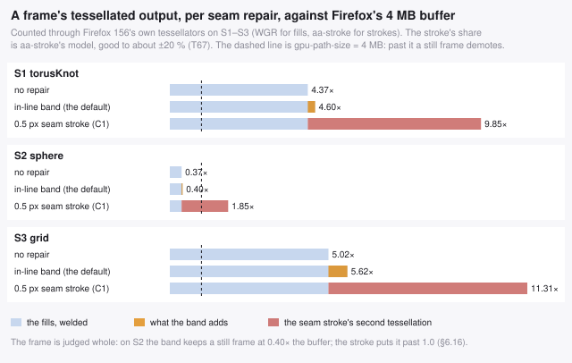

*Counted by `bench/tessfigs.mjs` through Firefox's own tessellators; the
stroke's share is aa-stroke's model, good to about ±20 % (T67). The dashed line
is the 4 MB `gpu-path-size`.*

How far the model is from what Gecko uploads depends on the machine: a
synthetic stroke load held still stayed accelerated at 1.2× of it on M4 (real
output 50–83 % of the model) and demoted at 1.2× on M6 (83–111 %) — T67. Either
way the seam stroke is **0.6–4.4× the fills' own tessellation, against 4–13 %
for the band**. On S2 held still that is the whole verdict, measured on M6:
the band frame (0.41× the buffer) stays accelerated and replays in **0.39 ms**,
the stroke frame (1.85× as modelled) demoted in all six runs that drew it and
replays in **2.06 ms** on the software rasteriser — 5.3× (T70). On M4 the same
stroke frame came back accelerated in one run and demoted in another.

The trap is the one §2 keeps finding: the cost is real, it is just not on the
axis you were watching. A stroke is priced per *path* in the record stage
(§4.4), costs little in software, and doubles the path-vertex count §1.11
budgets — and none of those three numbers says how big its tessellation is.

### 6.17 On Firefox, staying accelerated can be the slow path

*Registry: T68, T70 — fixture and extrapolation scope in §10.5.*

Everything in §1.11 is about not losing Firefox's accelerated canvas. The
trap is assuming that keeping it is the win. Measured on M6 (Firefox 156.0.1
on an Apple M4 GPU), with the software profile of the same browser as the
control:

| what stays accelerated | accelerated | software | |
|---|--:|--:|--:|
| a still batched frame inside the buffer (S2, welded / band / C1 at 8 MB), canvas cost | 0.26–0.59 ms | 1.34–2.36 ms | **3.3–6.1× faster** |
| 20 000 small separate triangle fills, still or turning | 24.5–33.7 ms | 5.8–8.6 ms | **3.3–4.4× slower** |
| the 8 px load that `gpu-path-size = 8` keeps accelerated | 30.5 ms | 8.3 ms | **3.7× slower** |
| a large frame forced past the buffer (`profile-frames = 0`), still or rotating | 1.1–5.2× the software time | | **slower** |

*A2, whole frame except the first row (replay, T69's column). T68, T70.*

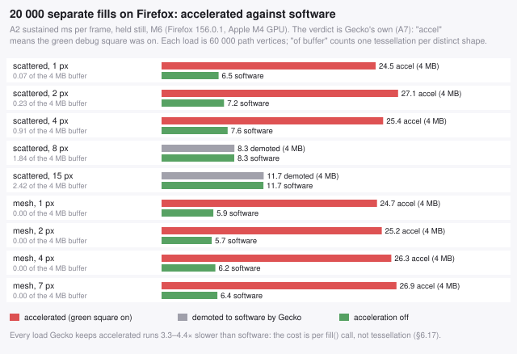

*Every load of part `N` on M6, held still: the accelerated profile (red where
Gecko kept it accelerated, grey where it demoted) against acceleration off
(T68, T70).*

The small-fill loads stay accelerated because the buffer counts distinct
shapes (T68): small triangles repeat in 1/16 px key space, so the miss ratio
never trips even while the view turns. And they are slow for a reason that
has nothing to do with the buffer: the mesh load has two distinct shapes and
hits the cache on every fill, and still costs 24.7 ms. It is the accelerated
path's per-`fill()` overhead — ~1.2 µs of main thread each on M6, against
~0.3 µs in software — paid 20 000 times. That is also the field report's "8 MB
keeps it accelerated, but slower than software", reproduced exactly (§3.5).

The mechanism is the same one §1.1 prices on every engine — fills are a main-
thread cost — so the fix is the same too: batch, and a batch is one `fill()`.
The check is one pref: time the frame with `gfx.canvas.accelerated = false`
before you spend effort staying accelerated. And one more reason not to read
the green square as a speed indicator: on M6, a load of large new shapes kept
its square while running at exactly the software profile's cost, through a
route in `DrawTargetWebgl::DrawPath` that draws with Skia without failing the
usage profile (T70 — observed, cause not established).

### 6.18 A raw `` decodes inside the first frame that draws it

*Registry: T77 — fixture and extrapolation scope in §10.5.*

`onload` means the bytes arrived, not that the pixels exist. The first
`drawImage` of a fresh 2048×2048 `` took **16.6–137 ms** of main thread
inside the draw call, on every engine measured, CPU and GPU. The obvious fix,
`await img.decode()`, works on Firefox and Safari (a first draw of 1–8 ms).
On Chromium it does **nothing for a PNG**: 114.7 ms after `decode()` against
113.5 ms without on the CPU, and 28.4–29.0 against 28.5–28.8 on Chrome's GPU
canvas. `await createImageBitmap(blob)` gives a first draw of 2–8 ms on every
engine, because the decode happens in the promise.

**And on Chrome's GPU canvas the second draw is no better.** A 2048² ``
costs 25.3–25.8 ms on *every* later draw, against 1.8–1.9 ms from the bitmap
of the same image: 13–14× on every frame. Warming up does not hide it.
Draw large images from a bitmap or a canvas (§4.13).

### 6.19 Two texture recipes that look harmless and cost 8–170×

*Registry: T75, T78 — fixture and extrapolation scope in §10.5.*

- **A pattern `fillRect` per sprite.** It reads like §4.7's fast recipe, but a
  sprite has no clip for it to remove. On M6 it costs **108–169×** a
  `drawImage` sprite on Safari and **5.9–6.9×** on Chrome, where it is 53–73×
  rotated (§4.13).
- **One `drawImage` per tile of a repeating material.** It is the obvious way
  to tile without a pattern, and it costs **7.8–11.4×** on Chrome and
  **13.5–17.0×** on Safari at 4 × 4 tiles per face (§4.14). A `'repeat'`
  pattern, or one `drawImage` of a canvas pre-tiled at load, draws the same
  face.

## 7. Checklist

Setup, once:

- [ ] `getContext('2d', { alpha: false })`. No `desynchronized`, no
      `willReadFrequently`.
- [ ] Palette pregenerated as 256 `'#rrggbb'` strings in an array.
- [ ] Mesh indexed; `buildAdjacency()` computed at load. **Un-indexed geometry
      gets `weldSoup()` first** — without it you lose the whole vertex-count
      win, and on Firefox batching becomes a net loss (§6.7).
- [ ] All per-frame buffers preallocated as typed arrays.
- [ ] `Occluder` constructed with the *same* adjacency array as the batcher,
      `sampleScale: 1`, `skirt: true`, `autoSkip: true` (§4.9).
- [ ] `batchOf.fill(0)` next to `stamp.fill(0)` in the epoch reset. Culling
      already makes the stale-entry path reachable; a colour-redundancy filter
      makes it much more so (§4.9, §4.11).
- [ ] One `ClassPrep` per pass that has a coarse colour key, tile 16 px, and a
      survivor `Int32Array` per pass (§4.11).
- [ ] **Per-browser overrides, only after everything above holds** (§1.13):
      each one chosen by timing both paths on real frames at startup, never
      by user-agent.
- [ ] Every image `await createImageBitmap(blob)`-ed before its first frame,
      then drawn once into a canvas (`alpha: false` if opaque), and that
      canvas used as every `createPattern` source. Never a raw `` drawn
      whole in the frame loop. Sprites drawn with `drawImage`, not a pattern.
      Tiled materials drawn with a `'repeat'` pattern, never one `drawImage`
      per tile. Atlases for rotated or scaled sprites padded with extruded
      gutters (§4.13, §4.14, §6.18).

Every frame:

- [ ] Depth sort with a counting/radix sort on quantised depth, not
      `Array.prototype.sort`.
- [ ] **Occlusion-cull between the sort and the batcher** (§4.9). Cull once;
      every pass of a multi-pass pipeline spends the same result.
- [ ] Clear with one `fillRect`.
- [ ] Batch with an **interior-coverage** occupancy grid, tile size derived
      from the mean triangle area — not a fixed constant (§4.5).
- [ ] Cancel shared edges; emit boundary loops only.
- [ ] Drop collinear vertices at ε = 0.05 px.
- [ ] One `fillStyle` and one `fill()` per batch, the seam repair inside it
      (§1.4's path recipe); a `strokeStyle` and a `stroke()` only as the
      fallback without adjacency. Some seam repair is not optional (§4.4): the in-line band (`seamBand: 1`, the default) closes the seam
      98.6–99.8 % where the stroke closes 64–73 %, at equal software cost and
      0.80–0.81× the stroke's canvas cost on Chromium's GPU (§4.12, T69); on
      Safari 1.4–1.7× the stroke's canvas cost, a frame tie (T72).
- [ ] Banding? Mitre two bands at a reflex corner (≤ 90°, each reaching the
      other's corner), clip one band whose cap crosses a plain edge, never at
      a pinch; keep a convex corner's notch; put a run's free ends on the
      neighbour's own edge (§4.12, §6.15). The exact fixes cost +0.0–0.7 ms and
      change no filled point — leave them on; `seamBandFixes: BAND_EXACT` if
      the free ends' outline change is not wanted.
- [ ] Merge polygons into one fill where the draw order allows and they
      touch, or are many; keep small scattered shapes and a lone overlapping
      pair as separate fills (§1.7, rule 17). Soup: let `autoFallback` emit
      per face.
- [ ] Textured? Use the pattern recipe, not `clip` + `drawImage`, and merge
      coplanar triangles under one affine map while an ε-pixel fit test allows
      it (§4.7). Never merge a textured region without that test.
- [ ] Face-granularity geometry? Kill gaps by outsetting the earlier-drawn
      polygon 1 px along later-neighbour edges, not by stroking (§4.8) — and
      pad the texture so the grown ring is opaque.
- [ ] Repairing a gap? Treat the **shared edge only**, never the whole
      boundary — worth 56–84× in moved outline, where the depth test alone is
      worth 1.5× (§4.8).
- [ ] In-path form: add two vertices per shared edge, along the **neighbour's**
      adjacent edge at a run's free ends, mitred to each other in between
      (8b). Never the neighbour direction at a run interior — the band stops
      reaching outward and the gap comes back (§4.8).
- [ ] Need zero disturbance off the seam? Band in its own `fill()`, centred,
      ends trimmed — one extra fill per polygon. Never a pattern `stroke()`
      (§4.8).
- [ ] Stroke fallback only: `lineWidth = 0.5`, not 1. One-sided stroking; 1 shifts the boundary.
- [ ] Stroke the seam edges, not the silhouette edges — and fall back to the
      whole boundary if you have no adjacency to distinguish them.
- [ ] Close stroked loops with an explicit `lineTo` back to the first point.
- [ ] Multi-pass? Every post-process folded into the palette, and every
      composite op on Firefox's accepted list (§1.10).
- [ ] Fog, and a **flat** albedo? In the palette as `[material][shade][band]`
      at 8–16 bands, not as a depth map and a composite chain (§4.10).
- [ ] Fog, and a **textured** albedo? Keep the chain, and keep its invert —
      the cleanups that remove it measured slower (§4.10).
- [ ] Fog pass? Classify faces by fog factor on the depth-sort walk you already
      do, before drawing anything: all fogged → one `fillRect`, none fogged →
      skip the fog pass, mixed → drop only the fogged faces that don't overlap
      any lit face's footprint (§4.10, "Three early-outs, upstream of the fog
      pass").
- [ ] Fog pass, mixed frame? Run the prep step in that same walk: histogram the
      bands by *area*, scatter each face's bbox into a per-tile class grid, make
      the dominant band the keep map's background, and drop every dominant-band
      face whose bbox tiles all read that band (§4.11). Exact; measured
      **0.11× the fog pass's vertices and 0.36 ms of batching against 7.28 ms**
      where the dominant band owns the screen.
- [ ] Dropping faces for *any* reason? Drop them in **contiguous** sets — whole
      colour classes, whole meshes, whole clusters. A scattered drop costs the
      perimeter of what you removed and measured 1.7–4.3× worse than dropping
      nothing (§4.11).
- [ ] Guard every dropper on **two** numbers: faces removed (the batcher's own
      walk) and vertices removed (record and raster). They disagree, and the
      sphere is the case where one of them says zero (§4.11).
- [ ] Writing several canvases? One at a time — finish A, then start B (§5.6).
- [ ] Every op off Firefox's accepted list — `difference`, any `ctx.filter` —
      on a **scratch canvas that draws no geometry**. It poisons only the
      canvas it runs on, and permanently (§6.13).
- [ ] Tessellated output per frame under Firefox's `gpu-path-size` — count
      it per distinct shape with `bench/wgr.mjs` (A9), which predicts a still
      frame's verdict, and run consecutive frames through
      `bench/ffcache.mjs` for a moving one; ~10 000 *path* vertices was one
      scene's exchange rate (§3.5, T68). Confirm with
      `gfx.canvas.accelerated.debug = true`: the green square in the corner
      says whether it is accelerated.
- [ ] …and then time it with `gfx.canvas.accelerated = false` as well. The
      square does not say whether accelerated is *faster*: thousands of small
      separate fills stay accelerated at 3.3–4.4× the software cost (§6.17).
- [ ] The frame's first draw a full-canvas opaque `fillRect` or `clearRect`,
      with no clip active — that is what lets Gecko discard the previous frame
      instead of preserving it (§3.2).

Never:

- [ ] `closePath()` while building a multi-subpath path (O(N²) in Blink).
- [ ] Raising `gpu-path-size` to keep a canvas of many small fills
      accelerated. It works, and the frame gets 3.7× slower (§6.17).
- [ ] A band fix at a pinch vertex, or a mitre at every reflex junction
      without the containment test. Both cut band ink where the polygon behind
      the corner is thinner than the band (§6.15).
- [ ] A shared edge left in one path twice. Two coincident, opposite edges
      push every row they span into WGR's slow path — 16.7× on one square
      (§3.5).
- [ ] A `stroke()` per triangle when you could have one per batch.
- [ ] Turning stroking off to make a benchmark look good — that is not the same
      picture.
- [ ] `save()`/`restore()` around individual draws.
- [ ] A non-zero `shadowBlur` in the hot loop.
- [ ] `getImageData` / `toDataURL` / self-`drawImage` in the render loop.
- [ ] `evenodd` fill rule anywhere edge cancellation is used.
- [ ] A new `Path2D`, a new string, or any other allocation per shape.
- [ ] `destination-over` front-to-back hoping for a depth-test early-out.
      There is none, and it costs 1.75–2.1× (§6.9).
- [ ] `clip()` + `drawImage()` per textured triangle when a pattern fill does
      the same job 4–8× cheaper (§4.7).
- [ ] `pattern.setTransform()` per shape — put the matrix on the context.
- [ ] Outsetting a silhouette edge, or an edge whose neighbour was already
      drawn — the first inflates the object, the second moves the boundary.
- [ ] Trusting a gap measurement before proving the texture is fully opaque.
- [ ] Culling a face because it covers no sample point. That is small, not
      hidden, and dropping it *raises* the vertex count (§6.11).
- [ ] Eroding the marked footprint per face "to be conservative" — it takes the
      cull rate from 73.6 % to 3.7 % (§6.10).
- [ ] Running the culler unconditionally. A convex closed mesh has nothing to
      cull; measure the rate and back off (§4.9).
- [ ] Aborting the cull walk early on a low running rate — the rate rises as
      the walk goes on, so you would discard exactly what you were looking for
      (§4.9).
- [ ] Culling *after* batching. The hidden faces are already tessellated into
      the merged boundary by then (§4.9).
- [ ] `getImageData` anywhere in a multi-pass chain. One readback per frame
      demotes the Firefox canvas permanently (§3.2) — invert and tint in the
      palette instead (§1.10).
- [ ] A composite op outside Firefox's accepted set — `over`, `dest-over`,
      `add`, `dest-out`, `atop`, `source`, `clear`, `multiply`, `screen` — in a
      per-frame pass (§1.10). `difference` and `overlay` are *not* on it.
- [ ] `globalAlpha` or `rgba()` on geometry fills: it disqualifies the draw from
      Graphite's opaque reordering (§3.3), on top of §1.6's reasons.
- [ ] `difference`, or any `ctx.filter`, in the render loop. Both are off
      Firefox's accelerated path, both demote the canvas, and they cost 116×
      and 1 180× an accelerated op there (§6.13).
- [ ] Inverting a canvas *when you could have folded the whole chain away*
      instead (§4.10). If you cannot fold — textured albedo — the invert is the
      measured-best option and this line does not apply to you.
- [ ] The MRT shape: one geometry walk writing several canvases as it goes.
      1.23× slower on Chromium, because the per-draw style change across
      targets stops the backend batching (§5.6).
- [ ] A half-resolution fog or AO buffer. It haloes across silhouettes, the
      bilateral-upsample fix needs a depth buffer you do not have, and it saves
      6 % of the vertices anyway (§4.10).
- [ ] Optimising for "fewest canvas calls". It is the wrong objective function
      and there is a measured counterexample (§6.12).
- [ ] Tuning a batcher's open-slot count against `performance.now()`. On
      Chromium the CPU timer ranks the settings **backwards**: 35 % more CPU,
      3.2× faster frame (§5.7).
- [ ] `ctx.filter = 'invert(0)'` — or any other "cheap" filter amount. The
      identity filter costs what `invert(1)` costs, because the price is the
      filter machinery (§5.6).
- [ ] Relying on `canvas.width = canvas.width` to bring acceleration back. It
      clears the pixels and not the verdict (§3.2).
- [ ] Shipping `gfx.canvas.accelerated.profile-frames = 0` as advice. Held past
      the vertex cliff, an *accelerated* canvas can be 3× slower than the
      demoted one, and your users do not have the pref set (§1.11).
- [ ] A browser check. There is nothing here to branch on (§1.8).

Verify:

- [ ] Total signed area of the emitted paths equals the sum of triangle areas
      (proves edge cancellation did not change the region). With a band on,
      the area can only grow.
- [ ] Any "exact" path simplification: sample the nonzero winding of the
      **whole batch path** before and after, not loop by loop — a hole loop's
      winding means nothing on its own (§6.15). Zero points may change side.
- [ ] Every genuinely overlapping pair of differently-coloured triangles keeps
      its relative order (exact separating-axis test, not bounding boxes).
- [ ] RMSE against a supersampled reference — and pick the right one:
      fill+stroke at 4× for a watertight mesh, fill-only at 4× for content with
      no shared edges (§4.4). Never against the per-triangle fill-only render;
      that is the thing with the seams.
- [ ] The set surviving backface culling is the **near** sheet. Compare the mean
      view-z of kept against dropped faces; a convex object looks identical
      either way, so nothing on screen will tell you (§2).
- [ ] Culled faces own no pixel under a true per-pixel **z-buffer**, not merely
      under your own centroid sort — and count the ones that do (§5.5).
- [ ] Cull rate against the measured ceiling (§8.4) — the number a perfect free
      culler would reach on this frame, so you know whether a disappointing
      rate is the culler or the scene.
- [ ] Fog banding against exact per-**pixel** fog with perspective-correct
      depth, not against your own per-face value (§4.10). And find the knee:
      past ~16 bands the batch splitting costs more than the chain you removed.
- [ ] Sweep `lineWidth` on your own content. The optimum was 0.4–0.5 on all
      three scenes here, but it depends on how wide your colour regions are.
- [ ] Which acceleration regime each Firefox number came from. Run the page
      twice — default, and `gfx.canvas.accelerated.profile-frames = 0` — and
      say which one a number belongs to (§2).
- [ ] Skipping the clears? Diff one frame drawn over a *different* frame
      against the same frame drawn clean. With fog it should be ~0.1 % of
      pixels over 8/255, all of them on silhouettes (§4.10); without fog it is
      13 % and you have a bug, not an optimisation.

---

## 8. The measurement apparatus

Everything in this guide is a number, so the apparatus is part of the claim.
This section specifies it as algorithms rather than as commands, so the
document stands on its own: none of it needs more than a canvas, a typed array
and an hour. Where earlier sections show code, that code is a reference
implementation of something described here — the *parameters* are the advice,
not the file.

The order below is the order to build them in. §8.2 and §8.3 need no browser at
all and will find most of your bugs.

### 8.1 The three axes, and how to force each one

`ctx.fill()` does not rasterise (§2), so one timer cannot measure a canvas2d
renderer. Three separate procedures, and you want all three:

```
record(draw):                       # JS + engine API overhead
    draw(); draw()                  # warm the JIT and the path cache
    t0 = now()
    repeat K: draw()
    return (now() - t0) / K         # recording ONLY -- not the drawing cost

sustained(draw, N):                 # end to end, GPU included: the honest one
    # N sized so ONE callback is far above one vsync; target >= 50 ms of CPU,
    # otherwise you are measuring vsync, not your renderer
    frames = 0; t0 = now()
    every requestAnimationFrame:
        repeat N: draw()
        frames += 1
        until now() - t0 > 4000
    return (now() - t0) / (frames * N)

raster(draw):                       # pure software rasterisation
    # a willReadFrequently canvas forces the CPU backend; the 1 px read forces
    # the display list to COMPLETE before the call returns
    t0 = now()
    repeat K: draw(); ctx.getImageData(0, 0, 1, 1)
    return (now() - t0) / K
```

One caveat on `repeat N: draw()`, measured (T71): if `draw()` opens with an
opaque full-canvas `fillRect`, Chromium charges that clear N times per
callback, at 1.4–3.0× per draw once N ≥ 8 — so the repeat measures the
clears. Open the repeated draw with the same fill at alpha 0.996 (identical
to within 1/255), or clear once per callback; Firefox is indifferent.

And size N on the frame interval itself, not on a CPU estimate. A CPU raster
time overstates a GPU's cost 10–100×, so an N guessed from it puts one draw
into a 10 ms frame, and the row then reads the display's refresh rate. M6's
first `imagepage.html` run lost its fastest rows that way (T75). Double N until
one callback spans ≥ 50 ms, then measure.

**On Firefox, check the verdict after the loop, not before.** A loop of
repeated draws per callback, sustained for seconds, demotes a Firefox canvas
by itself. With the acceleration indicator read after the first frame, after
A1 and after A2, every `imagepage.html` case on M4 and M6 went
`ACCEL > ACCEL > soft`. So did a control that drew nothing but the loop's
clears (T78). A Firefox A2 taken this way is mixed-regime unless the verdict
after A2 reads accelerated. That is consistent with §10.1's standing warning
that a Firefox number is a software number unless the entry says otherwise.

Then `hidden = sustained − record` is the part `performance.now()` cannot see,
and it is the most informative column in any table you build. `raster` is also
your proxy for Firefox after demotion (§3.2), which is the regime a canvas2d 3D
renderer actually runs in there.

#### And one more, upstream of all three

The three above start at the first canvas call. On a batching renderer the walk
*before* it — grouping faces, extracting boundaries — is bigger than anything
the record stage prices: 7.28 ms against a 0.075 ms prediction, on the same
20 701 faces (§4.11). It needs a timer of its own, and it is the one place a
plain CPU timer is unambiguously legitimate:

```
upstream(build):                    # A8: your own JS, no canvas calls in it
    ctx = InertContext()            # every method a no-op; see 8.2
    build(ctx); build(ctx)          # warm
    best = inf
    repeat 8: t0 = now(); build(ctx); best = min(best, now() - t0)
    return best                     # min, not mean: this is deterministic work
```

The inert context is what makes it honest — with no real draw calls there is no
deferred GPU work to hide inside the timer, which is the failure mode §5.7
documents for a CPU timer placed anywhere near a real one. Use the **minimum**
rather than the mean: unlike a frame time this is deterministic, so the spread
is noise from the host and not from the work.

#### And one more, downstream of the calls and upstream of the GPU

The three timed axes cannot tell you what Firefox's *accelerated* backend will
do with a path, because a timer there measures llvmpipe or your GPU, and
neither is the budget. The budget is the tessellator's output (§3.5), and the
tessellator is ordinary deterministic CPU code — so run it:

```
tessellated(draw):                  # A9: Firefox's own tessellators, no browser
    ctx = WgrContext()              # bench/wgr.mjs: every fill() goes through
                                    #   WGR, every stroke() through aa-stroke,
                                    #   exactly as DrawTargetWebgl calls them
    draw(ctx)
    return ctx.uniqVerts + ctx.uniqStrokeVerts  # x 12 bytes = what is uploaded:
                                    #   only paths whose cache KEY is new this
                                    #   frame (ctx.verts counts every fill)
```

The key is Gecko's own: the path relative to its integer bounds origin, in
WGR's 1/16 px fixed point (`DrawPathAccel`, T68). A translated copy of a shape
is a cache hit and spends nothing, so a load of repeated shapes — a regular
mesh, sprites, a glyph-like fill drawn many times — uploads far less than
`verts` says. On a batched 3D frame almost every path is unique and the two
counts agree to within 2 % (T68).

Compare it with `gpu-path-size` (4 MB = 349 525 vertices by default) and it
predicts a *still* frame's A7 verdict — 22 of 22 in T58, and 147 of 147 still-frame fill
verdicts on M4 and M6 once repeated shapes are counted once (T68). It
predicts nothing for a rotating 3D frame, which demotes on the miss ratio
whatever its size (§3.5). And it is a count, so it carries no noise and needs
no minimum.

#### And one more, for the frame that first touches a resource

The three axes above all warm up first, so they cannot see anything paid once
per resource. An image is decoded, and on a GPU uploaded, on its first use.
A game pays for that on the frame a sprite sheet first appears (§4.13). **A10,
first use:**

```
first_use(prepare):                 # per trial, everything fresh
    src = await prepare()           # onload / decode() / createImageBitmap / canvas copy
                                    #   (time any synchronous span inside it as block)
    tgt = new displayed canvas; clear; ctx.getImageData(0, 0, 1, 1)
    await rAF
    t0 = now(); ctx.drawImage(src, ...); ctx.getImageData(0, 0, 1, 1)
    first = now() - t0              # the frame that meets the source cold
    t0 = now(); ctx.drawImage(src, ...); ctx.getImageData(0, 0, 1, 1)
    second = now() - t0             # the control: the same draw, warm
    return median over trials of (block, first, second)
```

The 1 px read is what makes a CPU timer legitimate here. It forces the draw to
complete, so the decode cannot hide in deferred work. The price is that
Firefox counts the read against the acceleration profile, which is why the
target is fresh every trial. `first − second` is the one-off cost, and `block`
is the part of the preparation that held the main thread.

### 8.2 Counting, with no browser at all

Most of the exploration in this guide never opened a browser. Replace the
context with an object that counts:

```
CountingContext:
    beginPath()   -> nothing
    moveTo(x, y)  -> subpaths += 1 ; verts += 1
    lineTo(x, y)  -> verts += 1
    fill()        -> fills += 1
    stroke()      -> strokes += 1
    fillStyle =   -> styleChanges += 1
```

That is enough to drive a full parameter sweep in milliseconds, deterministically
and with no vsync, because §1.1's recording cost is *linear* in fills and
vertices with measured coefficients:

```
record ≈ 0.26 µs × fills + 9 ns × vertices          (Firefox: 0.65 µs and 7 ns)
```

So counts predict the record axis directly, and the vertex count is the whole
story for a software rasteriser. **Use the browser to calibrate those two
coefficients, then explore against counts.** Going the other way — sweeping
parameters in a browser — is how you spend a day measuring vsync.

The one thing counts cannot tell you is Chromium's U-shaped fill cost (§3.1),
where the *shape* of a fill changes as you merge. Any conclusion that depends on
crossing that valley has to be confirmed on the `sustained` axis.

### 8.3 The two invariants that catch algorithm bugs

These are worth more than any benchmark, because a batcher that is fast and
wrong is easy to write and hard to see.

**Area conservation.** Edge cancellation must not change the filled region.
Swap in a context that accumulates the signed area of every path instead of
drawing it:

```
AreaContext:
    moveTo(x, y): flush() ; start = (x, y) ; cur = (x, y) ; open = true
    lineTo(x, y): acc += cur.x * y − x * cur.y ; cur = (x, y)
    flush():      if open: acc += cur.x * start.y − start.x * cur.y
                  open = false          # fill() closes subpaths implicitly
    fill():       flush() ; total += acc ; acc = 0
```

Then assert `total` equals the sum of the signed areas of the visible triangles.
This catches every cancellation bug in one number, because dropping an edge that
was not shared — or keeping one that was — changes the region immediately. It
should match to within float noise; the implementation here reports 0.0000 %.

**Restate the right-hand side the moment anything drops faces.** The invariant
is `area(emitted) == area(the faces you handed the batcher)`, and a culler
(§4.9) or a colour-redundancy filter (§4.11) makes that a different set from
the visible triangles. Compare against the **survivor** list, plus the area of
any substituted rectangles, or the check fires on every frame and you will
spend an afternoon debugging the harness. This bit the prep-step measurement.

**Order conservation.** Reordering is only legal between triangles that do not
overlap, so check exactly that:

```
for every pair (u, v) of visible triangles:
    if colour[u] == colour[v]:        skip     # order cannot matter
    if not interiorsOverlap(u, v):    skip     # reorder was legal
    assert emittedBefore(u, v) == depthBefore(u, v)
```

`interiorsOverlap` must be **exact** — separating axis on the six edge normals,
with touching counted as separated:

```
interiorsOverlap(P, Q):
    for n in (inward normals of P's 3 edges, then Q's 3 edges):
        project P onto n -> [p0, p1]
        project Q onto n -> [q0, q1]
        if p1 <= q0 or q1 <= p0: return false      # touching = separated
    return true
```

**Do not use bounding boxes here.** The entire premise of interior-coverage
stamping (§4.2) is that edge-adjacent triangles do *not* overlap — and their
bounding boxes always do, so a bbox test reports a violation on every shared
edge in the mesh and tells you nothing. A bbox may serve as a cheap pre-filter
*before* the exact test, never instead of it.

The pair loop is O(n²); bucket by bounding box, or sample a few thousand pairs.
Report violations as a count and as a fraction of overlapping pairs, not as
pass/fail — the exact-coverage batcher trades a small, measured number of them
for a large fill-count win (§4.5), and you want to see the number move.

### 8.4 Visibility ground truth: two references, two questions

For anything about overdraw you need to know which faces are actually visible,
and there are two different right answers.

**A. What your painter itself would show.** One sample per pixel, near → far,
first writer wins:

```
owner[] = none
for t in depthOrder reversed:                 # near -> far
    for each pixel centre inside t:
        area[t] += 1
        if owner[p] is none:
            owner[p] = t ; won[t] += 1
```

Two derived quantities do all the work:

- `won[t] == 0 and area[t] > 0` — **occluded**. Safe to cull.
- `area[t] == 0` — **sub-pixel**. Not occluded, and not safe to cull (§6.11).
- overdraw (depth complexity) = `Σ area` ÷ `count(owner ≠ none)`.

This is the **ceiling** a culler that trusts your sort could reach, and it is
the right ceiling to compare against — not a z-buffer's — because your renderer
is not a z-buffer. Measure it before writing a culler: if the number is small,
there is nothing to win, and a convex closed mesh returns exactly zero (§5.5).

**B. What is genuinely visible.** A real per-pixel z-buffer, perspective
correct — `1/z` is linear in screen space, `z` is not:

```
for t in any order:
    for each pixel centre inside t:
        iw = barycentric interpolation of (1/z) at that pixel
        if iw > zbuf[p]: zbuf[p] = iw ; owner[p] = t
```

Use B for exactly one thing: counting **false culls** — faces your culler
dropped that a true z-buffer says own pixels. The gap between A and B is your
*sort's* error, and it is worth knowing separately from your culler's, because
they have different fixes. A note on both: a half-plane rasteriser accepts only
one winding, so normalise by swapping two vertices when the signed area is
negative, or your reference silently renders nothing.

### 8.5 The fidelity reference

Never validate against the per-triangle render — that is the thing with the
seams (§4.4). Supersample instead:

```
reference(list, SS):                    # SS = 3 or 4
    buffer of SS·W × SS·H, cleared to the background
    for t in list, far -> near:         # painter's order, no antialiasing
        write t's flat colour at every sample centre inside t
    box-filter each SS × SS block to one pixel
```

Compare with three numbers, not one:

- **RMSE** over all channels — the summary.
- **max |Δ|** — the worst pixel.
- **a histogram**: how many pixels differ by more than 2, more than 16, more
  than 64 out of 255.

Report the histogram. RMSE hides the thing that actually matters: a thousand
pixels off by 3 is invisible, and one pixel off by 200 sparkles the moment the
camera moves. The occlusion work in §4.9 was chosen on the `>16` column, and it
picked a different configuration from the one RMSE alone would have.

Match the reference to the content: fill+stroke at 4× for a watertight mesh,
fill-only at 4× for content with no shared edges (§4.4).

### 8.5b Pricing a composite operation, and a second canvas

Two shapes that need care, because the naive versions both measure the wrong
thing.

**A composite op** is far too cheap to time directly on an accelerated backend
(2 048 full-canvas blends fit inside one vsync), and it saturates its target if
you repeat it — `lighter` goes white, `multiply` goes black, and you end up
measuring a saturated-content early-out. So: restore the target from a pristine
copy with `copy` (`OP_SOURCE`, accelerated everywhere) before each repetition,
and subtract the cost of a restore-only repetition.

```
rep(op):      copy pristine -> target ;  target.composite(op, source)
baseline():   copy pristine -> target
cost(op) = perRep(rep(op)) − perRep(baseline())
```

Use a **fresh target canvas per op**, or the first unsupported op demotes the
canvas (§3.2) and every op measured after it looks slow for the wrong reason.

And **budget the wall clock on every timing run.** This one bit hard: the
reps-per-frame calibration settles on thousands of reps while the canvas is
accelerated, then an unsupported op demotes it mid-measurement and those same
thousands of reps become software — 8 192 × 4 ms is 33 seconds per frame. Cap
reps, cap the ramp step, and stop a run when its budget is spent rather than
when its frame count is reached.

**A second canvas** wants three shapes measured, not two, because the
interesting variable turns out not to be the ordering:

```
sequential   walk the geometry into A, then walk it again into B
interleaved  one walk, fanning each call to both targets  (same style)
interleaved  one walk, fanning each call to both targets  (DISTINCT style)
one canvas   the reference you are actually paying against
```

The third is the one that matters and the easy one to omit: a real multi-target
pass writes *different* colours to each target, so it pays two distinct style
assignments per batch. Fanning one style to both understates the cost by 21
points on Chromium (§5.6). Note also that the interleaved shapes do strictly
*less* JS than sequential — one boundary extraction instead of two — so if
interleaving still loses, the loss is in the engine and not in your loop.

### 8.6 Checks that catch harness bugs rather than renderer bugs

Every one of these cost real time during this work.

- **`hidden ≈ 0` is a red flag, not a result.** Hundreds of non-convex fills
  reporting no GPU time means the harness stopped capturing the GPU. This made
  `destination-over` look 1.6× *faster*; forced to completion it was 1.75×
  slower (§6.9). Cross-check every surprising win on a canvas that must finish.
- **Never use the median rAF interval.** Chromium pipelines deeply and the
  intervals alternate (measured: `17 150 17 17 284 150 17 17 233 …`). Use total
  elapsed ÷ frame count.
- **Watchdog the run.** An occluded or hidden window throttles rAF to nothing
  and hangs forever.
- **Serve a single-instance lease with a heartbeat.** A browser that opens the
  start URL twice silently halves every number.
- **Kill orphans before starting.** A killed runner leaves detached browsers
  still benchmarking in the background, stealing CPU from the next run.
- **Check the orientation of your backface test.** For a closed mesh, compare
  the mean view-space z of the faces the test *kept* against the ones it
  *dropped*: kept must be the smaller. Under perspective you see less than a
  hemisphere, so the front-facing set is also the smaller one. A convex object
  looks identical either way, so nothing on screen will ever tell you — and a
  sign error here leaves fill and vertex counts almost unchanged while
  invalidating every occlusion number you take (§2).
- **Discard the first frames on a fresh canvas.** Firefox's
  acceleration-demotion transient runs for ~13–25 frames and the step is large
  (§3.2). Measure past it, or measure it deliberately, but do not average
  across it.
- **A page that hangs the runner is usually the runner.** Check what your
  harness treats as "the page finished" before blaming the page: this one keyed
  on a non-empty `micro` array, and a result object without that key sat
  through the full 15-minute timeout on a page that had finished in seconds.
- **Syntax-check the benchmark page before launching a browser at it — and
  check it against the globals its `<script src>` files already declare.** A
  duplicate top-level name is a `SyntaxError` that kills the whole inline
  script, and the only symptom is a window stuck on "booting". `new
  Function(inlineScript)` catches a self-contained error in milliseconds but
  **not** a collision with an outer script: this page declared `hex2`, which
  `bench/scene.js` already defines, and passed the isolated check while failing
  in the browser. Extract the top-level names from both sides and intersect
  them.
- **Open the page in a browser once, by hand, before launching a timed run.**
  Two runs were lost to 15-minute runner timeouts on pages that never got past
  their first statement; the console said exactly what was wrong in under ten
  seconds each time. A WebGL page has a second failure of the same shape — a
  uniform shared between vertex and fragment shaders must have matching
  precision, or `linkProgram` fails and nothing draws — so wrap setup in its own
  try/catch and post the error rather than leaving the page silent.
- **Report both sheets when a result depends on which one you drew.** Fill and
  vertex counts barely move between the near and far sheet of a mesh; occlusion
  numbers move a lot (73.1 % against 55.3 % on the torus knot).
- **Watch for a key array aliasing the scene's colour array.** Every pass in a
  multi-pass harness points `scene.col` at its own key array, and `scene.build()`
  writes the palette index back into whatever `scene.col` currently is. An
  animated harness gets away with it — `build()` refills the array every frame —
  but the moment a case holds the geometry *still*, the derived keys are
  computed from the previous pass's keys and collapse to a single colour. The
  symptom is a batcher that suddenly reports **one fill** for the whole mesh and
  a plausible-looking frame time. Keep a pristine `baseCol` and restore it
  before deriving keys.
- **A page that creates hundreds of canvases stops getting accelerated ones.**
  `gfx.canvas.accelerated.max-draw-target-count` is 200, and a benchmark that
  makes a fresh canvas per case reaches it — after which new canvases are never
  accelerated and the indicator reads "soft" for a reason that has nothing to do
  with the case. Put the acceleration measurements first in the page, or give
  them their own run (`parts=` in `bench/isopage.html` exists for this).

### 8.7 Knowing when to stop

Both halves of this problem have a computable floor, and knowing it turns "is
this good?" into arithmetic.

**For the batcher.** Minimising single-coloured blocks in a linear extension of
a DAG is NP-hard, so the optimum is out of reach — but a lower bound is not.
Every colour change along any chain in the constraint DAG (`u` before `v`
whenever they overlap and `u` is behind `v`) forces a new batch:

```
minBatches ≥ max( distinct colours , 1 + max over chains of colour changes )
```

The chain term is a DP over the depth order, which is already a topological
order, so it costs one pass. Measured, the greedy lands 1.06× above the floor on
a single-layer surface and 3.2× above it on a self-overlapping one (§4.5) —
which is how you know the remaining gap is the scene, not the batcher.

**For the culler.** §8.4's reference A *is* the ceiling: the cull rate a perfect
free culler would achieve on this frame. Compare against it rather than against
zero, so a disappointing rate tells you which of the two it is.

---

### 8.8 The shipped harness: what to run

§8.1–§8.7 specify the apparatus as algorithms, so the tables can be rebuilt
from this document alone. This is the other half — the harness that actually
produced them, which is what to run if you want to reproduce a number rather
than re-derive it. Node only, unless a line says otherwise.

```bash
node src/painter2d.test.mjs   # correctness of the batcher
node src/occluder.test.mjs    # safety properties of the culler
node bench/verify.js          # algorithmic invariants (area + ordering)
node bench/seamruns.mjs       # where a batch boundary's band runs end (4.8)
node bench/optgeom.mjs        # each gap repair's vertices, and which cancel (4.8)
node bench/optdiagrams.mjs    # regenerate assets/seam-options.svg
node bench/optfigs.mjs        # regenerate the two vertex-placement figures
node bench/explore.js         # batcher parameter sweep, counts only
node bench/overdraw.js --front        # how much overdraw is there to remove
node bench/occlude.js --front --rmse  # culler variants: rate, cost, fidelity
node bench/integrate.mjs              # both modules together, net CPU
node bench/fog.js                     # fog architectures priced (--radial, --sweep)
node bench/prep.js                    # colour-redundancy predicates, exactness, CPU (4.11)
node bench/prepdiagrams.mjs           # regenerate the three assets/prep-*.svg figures
node bench/tess.mjs                   # every path cut, through Firefox's own tessellators (3.5, 4.12)
node bench/ffcache.mjs                # Gecko's path cache + buffer + usage profile, frame by frame: verdicts (T68; arg = MB)
node bench/bandx.mjs                  # the band's junctions, which fixes are exact, what they cost (4.12)
BANDX_ONLY=4 node bench/bandx.mjs     # just what the fixes cost in src/painter2d.js, ~1 min
node bench/bandfigs.mjs               # regenerate assets/band-junctions.svg (every case, verdicts computed)
node bench/tessfigs.mjs               # regenerate tess-shapes, tess-budget, merge-or-split, accel-vs-soft .svg
node bench/wgr/build.mjs              # rebuild bench/wgr/wgr.wasm from Firefox's source (needs cargo)
```

Browser-side, via the harness below: `PAGE=fogpage.html` prices every composite
operation and probes Firefox's acceleration demotion; `PAGE=mrtpage.html`
settles whether to write several canvases interleaved or one at a time;
`PAGE=webglfogpage.html` measures moving the fog stage onto WebGL while canvas2d
keeps the fill and shade passes — which is the answer for a textured deferred
pipeline (§4.10); and `PAGE=isopage.html` answers the questions that only come
up once an engine ships:

- **is a canvas still accelerated?** — read directly off Firefox's own
  indicator rather than inferred from a step in a timing trace;
- **how much path geometry can one frame draw before Firefox demotes it?** —
  9 192 vertices yes, 12 761 no, and the cause bisects to one `about:config`
  pref (§3.2) — though what that pref budgets is tessellated output, which
  `tesspage.html` part `C` counts for the same paths (§3.5);
- **does an unsupported composite op poison the whole context or just its own
  canvas?** — just its own, permanently, +26 % on every later geometry draw
  there (§6.13);
- **which invert idiom, and does the answer depend on the scene?** (§5.6)
- **can the fog pay for the per-pass clears?** — yes, exactly, 0.11 % of pixels
  over 8/255 (§4.10);
- **what does the batcher's open-slot count cost?** — and why
  `performance.now()` ranks it backwards (§5.7).

That page needs Firefox's acceleration indicator to be useful, which is what the
extra run targets are for:

```bash
node bench/run.js firefox-dbg          # gfx.canvas.accelerated.debug = true
node bench/run.js firefox-nodemote     # never demote: what the frame WOULD cost
node bench/run.js firefox-noratio      # only a real fallback can fail a frame
node bench/run.js firefox-bigbuf       # 16x the path vertex buffer
```

Each writes a throwaway profile with one pref changed, which is how §3.2's
cause was found.

Browser measurements (opens real browser windows, collects JSON into `bench/out/`):

```bash
node bench/server.js
```

```bash
node bench/run.js edge firefox firefox-nonaccel
```

```bash
PAGE=isopage.html TAGSUFFIX=-iso node bench/run.js firefox-dbg edge
```

`EXTRA=parts=6` runs one part of that page on its own — worth doing for the
acceleration measurements, because a page that has already created a couple of
hundred canvases stops being given accelerated ones (§8.6).

```bash
PAGE=bandpage.html TAGSUFFIX=-band node bench/run.js edge firefox firefox-dbg
```

```bash
PAGE=imagepage.html TAGSUFFIX=-img node bench/run.js edge firefox-nonaccel
node bench/imagefigs.mjs              # regenerate assets/image-sources.svg
```

prices sprites (`drawImage` against a pattern `fillRect`) and §4.7's two
triangle recipes on every image source — PNG and JPEG ``,
`ImageBitmap`, canvas — measures atlas bleed with the gutter test, and times
the first use of a fresh image per preparation (§4.13). `EXTRA=parts=F` runs
only the first-use part. The page calibrates A2's repetitions on the frame
interval itself (§8.1), and flags any row still on the refresh floor as
`VSYNC-FLOORED`. Its bleed part renders on both a `willReadFrequently`
canvas and a displayed default one, and records the A7 verdict after the
first frame, after A1 and after A2. `?sustbg=opaque`, `?noop=1` and
`?detached=1` are the controls that placed M4's Firefox demotion (§4.13).
Part M draws a perspective scene of textured quads, a floor and two walls with
eight 128 px materials each tiled `?rep=` times (default 4). It prices a
`'repeat'` pattern against `clip` + a pre-tiled canvas and `clip` + one
`drawImage` per tile, from ``, `ImageBitmap` and small-canvas sources,
and first checks that the three recipes draw the same picture. Part B sweeps
image size (`?sizes=`, default 256–4096) for the per-draw cost of each source.

On M4 the tag suffix was `-img-m4`, with the Chromium arguments of the M4
block below. It ran once more with
`EDGE_ARGS="--no-sandbox --use-angle=swiftshader --enable-unsafe-swiftshader"`
and `-img-sws-m4` for the instrument run, and again with the fixed page as
`-imgX-sws-m4` (`EXTRA=parts=X`) and `firefox-dbg` `-img2-m4` under
`ff-softgl.prefs`. On M6 it ran as `-img-gpu-r1` to `-r4` on `edge` and
`firefox-dbg`, `-img-gpu-r1` on `firefox-nonaccel` and `safari`, and as
`-imgF-gpu-r1` and `-r2` for part F alone. Those runs predate the
repetition calibration and the indicator fix. The second M6 round used the
fixed page:

```bash
PAGE=imagepage.html TAGSUFFIX=-imgM-gpu-r1 EXTRA="parts=M" node bench/run.js edge firefox-dbg safari   # r1-r3
PAGE=imagepage.html TAGSUFFIX=-imgM1-gpu-r1 EXTRA="parts=M&rep=1" node bench/run.js edge firefox-dbg safari
PAGE=imagepage.html TAGSUFFIX=-imgB-gpu-r1 EXTRA="parts=B" node bench/run.js edge firefox-dbg safari   # r1-r2
PAGE=imagepage.html TAGSUFFIX=-img2-gpu-r1 EXTRA="parts=X,S,T,F" node bench/run.js edge firefox-dbg safari   # r1-r2
PAGE=imagepage.html TAGSUFFIX=-imgM-gpu-r1 EXTRA="parts=M,B" node bench/run.js firefox-nonaccel
PAGE=imagepage.html TAGSUFFIX=-imgMnoop-gpu-r1 EXTRA="parts=M&noop=1" node bench/run.js firefox-dbg
```

Runs disturbed by other load on the machine were repeated once and kept as
`*-disturbed.json`, and no table uses them.

prices the two gap repairs of §4.8 against each other on both fixtures, with
exact gap and outline coverage and Gecko's acceleration verdict per case.

```bash
PAGE=tesspage.html TAGSUFFIX=-tess node bench/run.js edge firefox-nonaccel
PAGE=tesspage.html TAGSUFFIX=-tessO EXTRA="parts=O" node bench/run.js edge firefox-nonaccel
PAGE=tesspage.html TAGSUFFIX=-tess EXTRA="parts=C,D,K&bufmb=4" node bench/run.js firefox-dbg
PAGE=tesspage.html TAGSUFFIX=-tess EXTRA="parts=C,D&bufmb=8" node bench/run.js firefox-bigbuf8
```

is §3.5 and §4.12: the Firefox cliff with the tessellated bytes of the very
paths drawn (`C`), which cuts stay accelerated held still and animated (`D`),
whether strokes spend the same budget (`K`), the Skia tiers one path at a time
(`S`) and the same shapes on the GPU canvas plus 16 separate convex fills
(`G`), every cut timed three ways (`T`), the field report's 20 000 small faces
(`N`), which polygons to merge into one fill and where that stops paying
(`O`, §1.7), the band's junction fixes against a 4× reference (`B`), and the
fragmentation sweep (`F`). `EXTRA=strats=…` and `bands=…` narrow `T` and `B`
to named cuts (URL-encode a `+` as `%2B`); `still=1` holds `T`'s scene still
so Firefox's path cache can hit, where the default rotates it every draw.

Part `T`'s columns are A3, then A2 twice: the whole frame including the
batcher's JS, and a **replay** of eight recorded frames' canvas calls with no
JS in front of them — the column that shows a GPU's cost, because on a GPU the
batcher's JS is most of the main thread and hides the rest (§4.12). Its A2
follows §8.1 (a displayed canvas, ≥ 50 ms of draws per rAF callback) since
v1.30; the M4 runs drew once per callback, which reads vsync as soon as a draw
is under a frame, and were only safe there because none was. Every timed draw
opens with a clear at alpha 0.996, not an opaque one: on Chromium an opaque
full-canvas clear repeated inside one callback costs 1.4–3.0× per draw once
there are eight or more of them, where a real frame pays for one (T71, §8.1).

The M6 runs — each timed part repeated 5 times on Chrome and twice on Firefox and Safari (once for Firefox's forced-accelerated still frame and its normal-profile animated one; the per-entry run counts are in T68–T72):

```bash
ST='boundary,shipped,band%2Bspike%2Breflex,band%2Bexact%2Bend8,perFace,perFace%2Bband,perFace%2Bstroke'
PAGE=tesspage.html TAGSUFFIX=-tess-m6-r1 EXTRA="parts=S,G,T&strats=$ST" node bench/run.js edge
PAGE=tesspage.html TAGSUFFIX=-tessT-still-m6-r1 EXTRA="parts=T&still=1&strats=$ST" node bench/run.js firefox-dbg firefox-nonaccel
PAGE=tesspage.html TAGSUFFIX=-tessT-anim-m6-r1 EXTRA="parts=T&strats=$ST" node bench/run.js firefox-dbg firefox-nodemote
PAGE=tesspage.html TAGSUFFIX=-tessSGN-m6 EXTRA="parts=S,G,N" node bench/run.js firefox-dbg firefox-nonaccel
PAGE=tesspage.html TAGSUFFIX=-tess-m6-r1 EXTRA="parts=S,G,T&strats=$ST" node bench/run.js safari
```

Keep the browser window in front and uncovered for the whole run, and the
display awake (`caffeinate -d` on macOS): an occluded or locked window gets no
rAF and the page stalls — M6 lost two runs that way.

On macOS `bench/run.js` finds Google Chrome and Firefox in `/Applications`
without `EDGE_EXE` / `FIREFOX_EXE`, and has a `safari` target that opens the
page as a tab in your own Safari and closes only that tab afterwards (Safari
takes no profile or flags from a command line).

**On a machine without Windows paths or a display** — M4, the Linux container
— point the runner at your builds and give it a virtual display:

```bash
XVFB=1 EDGE_EXE=/path/to/chrome FIREFOX_EXE=/path/to/firefox \
  EDGE_ARGS="--no-sandbox --disable-gpu" node bench/run.js edge firefox-nonaccel
XVFB=1 FIREFOX_EXE=/path/to/firefox FF_PREFS_FILE=bench/ff-softgl.prefs \
  node bench/run.js firefox-dbg
```

`ff-softgl.prefs` forces Firefox's accelerated canvas on where Gecko would
blocklist software GL; read its header before trusting a timing taken with it.

```bash
PAGE=shotpage.html TAGSUFFIX=-shots node bench/run.js edge
node bench/shots.mjs edge-shots
```

renders the contact sheets in `assets/` — every option's actual seam, magnified,
on magenta, beside its exact gap map.

```bash
node bench/report.js
```

## 9. Prior art, and what to subtract when you read it

Almost nothing in §4.9 is new. The z-bufferless world solved this repeatedly
between 1969 and 1997, then GPUs made it irrelevant for twenty years, and a
canvas2d 3D renderer walks straight back into it — because canvas2d is a
software-era target with a hardware-era API.

The one term to search on is **occluder fusion**. It is the axis the literature
classifies itself on: does a method combine many partial occluders into one
aggregate, or does it pick a single best occluder and test against that? Every
pairwise scheme — bounding-box overlap, exact separating-axis, shadow frusta —
is in the second camp and cannot see that fifty small triangles together hide a
large one. A coverage buffer is in the first camp for free, because the buffer
is the only representation it keeps (§4.9).

*Venues and years below are from memory; search by author and title rather than
trusting the citation.*

### 9.1 The closest prior art

- **Greene, "Hierarchical Polygon Tiling with Coverage Masks", SIGGRAPH 1996.**
  This is the paper. Hierarchical coverage masks, polygons processed in
  visibility order, and a region that becomes fully covered culls everything
  later that lands in it — with no depth buffer anywhere. If you read one
  thing, read this one. §4.9 is a 2D-triangle special case of it with a flat
  two-level hierarchy instead of a full pyramid.
- **Zhang, Manocha, Hudson, Hoff, "Visibility Culling using Hierarchical
  Occlusion Maps", SIGGRAPH 1997** — HOM, and the work that put "occluder
  fusion" into common use. **What to subtract:** its *depth estimation buffer*.
  HOM needs one because it has no global ordering to lean on; a painter's
  algorithm hands you a total order for free, and that order is exactly what
  the depth estimation buffer was approximating. Reading HOM with that piece
  deleted is the fastest way to understand why §4.9 needs no depth at all.
- **Hasselgren, Andersson, Akenine-Möller, "Masked Software Occlusion
  Culling", 2016** (Intel; the open-source implementation is
  `MaskedOcclusionCulling`). The modern, SIMD-tuned version: tiles of 32×8
  with a coverage bitmask plus two depth planes each. **What to subtract:** the
  two depth planes, for the same reason as HOM. What is worth stealing is
  everything else — the tile layout, the bit arithmetic, and the merge
  heuristics. If §4.9's culler ever needs to be 5× faster, this is the paper to
  reread rather than the one to replace it with.

### 9.2 The 1D ancestors

- **span buffer** / **S-buffer** / **C-buffer** (coverage buffer) — the console
  and demoscene names for front-to-back span insertion with no z. Search "span
  buffer hidden surface removal".
- **Doom's `solidsegs`** — the 1D case, one clip list over screen columns
  (`R_ClipSolidWallSegment`, `cliprange`). Sanglard's *Game Engine Black Book:
  DOOM* walks it properly. Build did the same.
- **Abrash, *Graphics Programming Black Book***, the sorted-spans chapters on
  Quake's visible-surface determination. Front-to-back span sorting with an
  edge list — and his account of why he eventually moved off it, which is a
  useful counterweight.
- **Warnock, 1969** — recursive screen subdivision. Where the hierarchy idea
  starts, and still the cleanest statement of "if this region is settled, stop
  looking at it".

### 9.3 Where this sits, and the vocabulary to say so

- **Sutherland, Sproull, Schumacker, "A Characterization of Ten Hidden-Surface
  Algorithms", ACM Computing Surveys 1974.** Still the best map of the
  pre-z-buffer world. Read it to find out which of your options are image-space
  and which are object-space, and why the object-space ones stop scaling.
- **Cohen-Or, Chrysanthou, Silva, Durand, "A Survey of Visibility for
  Walkthrough Applications", IEEE TVCG 2003** — the modern classification, and
  where *from-point* vs *from-region*, and *conservative* vs *approximate* vs
  *exact*, get pinned down.

In that vocabulary, §4.9's culler is **image-space, from-point, front-to-back,
occluder-fusing, and approximate** — approximate because coverage is decided at
sample points rather than analytically. Knowing that saves real time, because
searching "conservative occlusion culling" returns the erosion-based methods
that §6.10 measures collapsing to a 3.7 % cull rate on this kind of geometry.
Their guarantee is real; it is bought with the fusion you needed.

- **Newell, Newell, Sancha, "A Solution to the Hidden Surface Problem", 1972** —
  depth sort with explicit cycle detection and polygon splitting. Relevant
  twice over: it is the classical fix for the sort inversions §4.9 inherits,
  and for the order violations the exact-overlap check (§8.3) reports against
  the exact-grid batcher (§4.5). Worth knowing the cost before reaching for it — splitting
  raises the triangle count, which is the one thing this guide spends
  everything to reduce.

### 9.4 The adjacent pieces already in use here

- **Bittner, Wimmer, Piringer, Purgathofer, "Coherent Hierarchical Culling",
  Eurographics 2004**, and **Mattausch, Bittner, Wimmer, "CHC++", Eurographics
  2008**. `Occluder`'s `autoSkip` back-off is a stripped-down version of their
  "don't re-query what was visible" — theirs exists to hide GPU query latency,
  ours to stop paying on a convex mesh, but the temporal argument is identical.
- **Abrash, "Rasterization on Larrabee", 2009** — *trivial accept* and *trivial
  reject* are the standard names for what `bboxFull` does at block granularity,
  and the article is the clearest account of why the hierarchical test is the
  whole game.
- **active edge table** / **scanline coherence** — the classical name for
  `markTest`'s DDA span walk, and the way in if you implement the
  cluster-silhouette marking §4.9 leaves on the table: a cluster boundary loop
  is exactly the polygon an AET was designed for.
- **depth complexity** — the standard name for what §8.4 measures and this
  guide calls "overdraw". Search it if you want published figures to compare against.
- **aggressive occlusion culling** — the class the adjacency skirt belongs to:
  a method that trades a hard guarantee for rate, and then measures what it
  gave up. Klosowski & Silva's PLP ("prioritized-layered projection") is the
  formal treatment.
- **Kilgard & Bolz, "GPU-accelerated Path Rendering", SIGGRAPH Asia 2012** —
  not occlusion at all, but it is where **conflation** comes from, the word §4.4
  leans on for the seam problem. Worth reading to see that the artefact this
  guide spends three levers on is a known, named consequence of compositing
  coverage per path, not a canvas2d bug.

### 9.5 Terms that will waste your time

- **Hierarchical Z-Buffer (HZB)** — Greene, Kass, Miller, SIGGRAPH 1993, and
  what Nanite's two-pass culling uses. Excellent work; needs per-pixel depth,
  so most of it does not port to a painter.
- **PVS**, **cell-and-portal**, **potentially visible set** — precomputed, and
  static-geometry-only. The wrong shape for a mesh that rotates every frame.
- **early-Z**, **Hi-Z**, **Z-cull** — hardware features. Canvas2D exposes none
  of them (§6.9), and the one backend that uses a depth buffer for painter's
  work does not expose it either (§3.3).
- **conservative rasterization** — a real GPU feature with a real use, and the
  opposite of what §6.10 says you want here.

### 9.6 Books

- **Akenine-Möller et al., *Real-Time Rendering*, 4th ed., ch. 19** — the
  cleanest short treatment of the culling taxonomy and of occluder fusion.
- **Foley, van Dam, Feiner, Hughes, *Computer Graphics: Principles and
  Practice***, the visible-surface-determination chapter — where the classical
  scanline, span and area-subdivision machinery actually lives. Most of what a
  canvas2d 3D renderer needs was written down before hardware z-buffers were
  cheap, and this is where it is written down.

### 9.7 If you only take two search strings

```
occluder fusion coverage mask
hierarchical polygon tiling coverage masks Greene
```

Note what is *not* in this section: nothing on the batching, seam or texturing
material in §4.1–§4.8. That is not modesty about the literature — it is that
those parts are driven by measurements against two specific rasterisers and by
reading their source, and the useful references there are `DrawTargetWebgl.cpp`,
`StaticPrefList.yaml` and Skia's `GrTriangulator`, all of which §3 already
quotes, plus the apparatus in §8. Overdraw is the one part of this problem with a deep published
tradition, because it is the one part that is not about canvas2d at all.

### 9.8 How the z-bufferless era did fog

Worth its own subsection because §4.10 is not a workaround for canvas2d — it is
what everything without a depth buffer actually did, and the composite chain is
the deviation. Quotes below are from the released sources, not from memory.

**Doom (1993) — fog and lighting are the same thing.** `COLORMAP` is a stack of
256-byte tables, and `R_InitLightTables` fills a 2D array of pointers into it
from (sector light level, distance):

```c
for (i=0 ; i< LIGHTLEVELS ; i++) {
  startmap = ((LIGHTLEVELS-1-i)*2)*NUMCOLORMAPS/LIGHTLEVELS;
  for (j=0 ; j<MAXLIGHTZ ; j++) {
    scale = FixedDiv ((SCREENWIDTH/2*FRACUNIT), (j+1)<<LIGHTZSHIFT);
    scale >>= LIGHTSCALESHIFT;
    level = startmap - scale/DISTMAP;
    zlight[i][j] = colormaps + level*256;
  }
}
```

Walls pick a table **once per screen column**, inside the column loop in
`R_RenderSegLoop`:

```c
for ( ; rw_x < rw_stopx ; rw_x++) {
  ...
  index = rw_scale>>LIGHTSCALESHIFT;
  if (index >=  MAXLIGHTSCALE ) index = MAXLIGHTSCALE-1;
  dc_colormap = walllights[index];
```

and floors pick one **per scanline**, in `R_MapPlane(y, x1, x2)`:

```c
index = distance >> LIGHTZSHIFT;
if (index >= MAXLIGHTZ ) index = MAXLIGHTZ-1;
ds_colormap = planezlight[index];
```

The inner loop then costs one indirection, fused into the texture fetch. Zero
passes, zero blends. **Build** (Duke Nukem 3D) is the same design under a
different name: `palookup[]`, 32 shade tables selected by distance.

**Quake (1996) — memoise the lit result.** No distance fog in the software
renderer; what is instructive is the mechanism. `R_DrawSurfaceBlock8_mip0`
builds a *cached* lit surface block with

```c
prowdest[b] = ((unsigned char *)vid.colormap)[(light & 0xFF00) + pix];
```

— a 256×64 colormap indexed by (interpolated light in the high byte, texture
pixel in the low byte). The span drawers in `d_scan.c` then read straight out
of that cache (`*(pbase + (s >> 16) + (t >> 16) * cachewidth)`) with **no
lighting term at all**. So Quake's answer is a third strategy: compute the
shaded result once, key it on the surface, and reuse it across frames. Relevant
here if your camera is often still and only shading changes.

**PlayStation 1 — the closest match to this renderer.** No depth buffer at all:
the GPU draws from an *ordering table*, which is a bucketed painter's
algorithm. Fog is computed on the GTE geometry coprocessor, per vertex, before
rasterisation. `DPCS`/`DPCT` (depth cue, single and triple) derive the
interpolant from the perspective divide:

```
MAC0 = (((H*20000h/SZ3)+1)/2)*DQA + DQB      IR0 = MAC0/1000h    (0 .. 1000h)
```

`DQA` (R59, S.7.8 fixed point) and `DQB` (R60) are the depth-cue coefficients,
and `INTPL` then interpolates the vertex colour toward the far colour `FC`
using `IR0`. Note `H/SZ3` — the factor comes from **1/z**, the same
perspective-correct quantity §4.10 interpolates and §8.4 warns you to get right.
Then the rasteriser Gouraud-interpolates the result. Zero framebuffer
operations.

**The through-line.** Every one of them computed fog at the vertex or span
level and folded it into the colour, through a precomputed table indexed by
quantised distance. None of them composited it. Shipped quantisation: Doom 32
levels, Build 32, Quake 64 — and §4.10 measures 8 as already below this
renderer's own error floor, because the faces here are small enough that
per-face is nearly per-pixel.

Canvas2d's `fill()` is one flat colour, so the vertex level is not available
and per-face is the finest granularity you have. Architecture D is the PS1
approach coarsened by exactly one step.

**And the modern version, for the upsampling note in §4.10.** GPU deferred
renderers fold fog into the lighting pass for the same reason. Where they do
use a lower-resolution buffer — volumetric scattering, e.g. Hillaire's
"Physically Based and Unified Volumetric Rendering in Frostbite" (2015), a
froxel grid ray-marched and applied in the composite — they pair it with
**bilateral / nearest-depth upsampling** (Kopf et al., "Joint Bilateral
Upsampling", 2007) to stop it bleeding across silhouettes. That fix needs a
full-resolution depth buffer to pick the tap, which is exactly what a painter
does not have, which is why half-resolution fog haloes here and cannot be
rescued.

---

## 10. Test registry

Every number in this guide came from a specific experiment on a specific
fixture, and a result whose fixture you cannot locate is a result you cannot
extrapolate from. The articles above carry the prose and the tables; this
section carries the **fixtures**, the **subject of each test** — what was
varied against what was held constant — and, for each one, **what it licenses
you to conclude and what it does not**.

Use it in the other direction too: before running a new benchmark, check
whether an existing entry already answers the question on a close enough
fixture. Most of the time it does, and the extrapolation rules in §10.6 tell
you when it does not.

### 10.1 Fixture: the machine and the engines

| id | what |
|---|---|
| **M1** | Chromium 152 (Edge) and Firefox 155, Windows 11, 8 cores, discrete GPU. Canvas `1280×720`, `getContext('2d', { alpha: false })` unless an entry says otherwise. |
| **M2** | Node (no browser, no canvas) on the same machine — used for every counts-only and software-reference measurement. |
| **M3** | M1's Firefox under a throwaway profile with one `gfx.canvas.accelerated.*` pref changed — `debug`, `profile-frames`, `profile-cache-miss-ratio`, `gpu-path-size`, `gpu-path-complexity`. Used as an *instrument*, never as a shipping configuration; `bench/run.js` has one target per pref. |
| **M4** | A Linux container, **no GPU**: Ubuntu 24.04, 4 cores, Xvfb display. **Chromium 141.0.7390.37** (Playwright's build) with `--disable-gpu` — Skia on the CPU — or with SwiftShader as a stand-in GPU (Ganesh on a CPU-emulated device: its *path-renderer choices* are a GPU's, its timings are not). **Firefox 156.0** (conda-forge build), either software (`gfx.canvas.accelerated = false`, confirmed by the debug square staying off) or accelerated on llvmpipe with `bench/ff-softgl.prefs` forcing `DrawTargetWebgl` on. Canvas `1280×720`, `alpha: false`. Driven by `bench/run.js` with `XVFB=1` and the browser paths in `EDGE_EXE` / `FIREFOX_EXE`. |
| **M5** | Node 22 on M4 with `bench/wgr.mjs`: **Firefox 156's own tessellators** — WGR (`wpf-gpu-raster`) for fills and `aa-stroke` for strokes — built from the `FIREFOX_156_0_RELEASE` source into wasm by `bench/wgr/build.mjs`, unmodified except for two counters. Deterministic; no browser, no GPU. |
| **M6** | A MacBook Air (`Mac16,12`), **Apple M4** chip — 4 performance + 6 efficiency cores, **10-core integrated GPU**, 16 GB unified memory — *the chip's name is a coincidence: M6 has nothing to do with fixture M4*. macOS 26.6.2 (25G83); GPU driver is Apple's Metal driver bundled with that macOS build (no separate version). Display: an external 3440×1440 panel at **100 Hz**, `devicePixelRatio` 1. **Google Chrome 153.0.8010.54** standing in for Edge (the same Blink and Skia). `chrome://gpu`: *Canvas: Hardware accelerated*, **Skia Backend: GraphiteDawnMetal** — so its GPU canvas is **Skia Graphite**, not M1's Ganesh (§3.3) — WebGL through ANGLE's Metal renderer, Skia at `f8b66b75`. **Firefox 156.0.1** (build 20260921121718), accelerated by default here — the debug square is green on a control canvas in every accelerated run, and `about:support` reports *ACCELERATED_CANVAS2D: available*, WebGL "Apple -- Apple M4", every `gfx.canvas.accelerated.*` pref at its default — or software with `gfx.canvas.accelerated = false` (square confirmed off). On this machine Firefox's accelerated canvas does its tessellation on the content main thread (T70). **Safari 26.6.2** (WebKit 605.1.15), the tab opened in the user's own Safari by `bench/run.js`'s `safari` target; it reports 8 cores and a masked "Apple GPU", and has no acceleration indicator (T72). Node 25.9.0 for the counts. Canvas `1280×720`, `alpha: false`. Driven by `bench/run.js` with its macOS defaults. |

**Covered by one machine only:** Skia Graphite (§3.3) — M6's Chromium, which
`chrome://gpu` reports as Graphite on Dawn/Metal; every other Chromium GPU
number in this registry is Ganesh (M1). Do not carry a Chromium GPU ratio
between the two backends without saying which one you measured. And WebKit /
Safari — M6's Safari 26.6.2: two runs of three parts (T72), and two rounds of
`imagepage.html`, eight runs in all (T75–T79). §3.4's mechanism is quoted from WebKit's source,
and its consequence for patterns is measured in §4.13.

**M4 has no GPU, and says so in every entry that uses it.** Its Skia-on-CPU
numbers (Chromium `--disable-gpu`, Firefox software, and every A3 column) are
the same code a demoted Firefox runs anywhere and transfer as rankings. Its
*accelerated* Firefox runs are llvmpipe: the verdict (A7), the path cache, the
usage profile and WGR's tessellation are Gecko's own logic and transfer; a
frame time taken there is not a GPU number and no entry uses one. Its
SwiftShader Chromium is the same kind of instrument. And the scenes it draws
differ from Node's in the last bits — V8 and SpiderMonkey agree with each
other (S1 35 858 visible, S2 46 204, S3 33 650) but not exactly with Node's
35 851 / 45 428 / 33 907 — so a browser count and a counts-only count of "the
same" frame can differ by up to 1.7 %.

**Firefox is on its software rasteriser in most browser entries.** An animated
3D canvas demotes within ~10–25 frames (§3.2), so unless an entry explicitly
measures the accelerated window, a Firefox number is a *software* number. This
is the single most common way to misread this registry.

### 10.2 Fixture: the scenes

Measured, not described — visible counts and mean triangle area are what
actually determine how a batching or culling result transfers.

| id | scene | generator | tris | verts | shared edges | palette | dist / scale | visible (near / far) | mean tri px² (near) |
|---|---|---|--:|--:|--:|--:|--:|--:|--:|
| **S1** | `torusKnot` | `makeTorusKnot(512, 64, 3, 7, 8)` | 65 536 | 32 768 | 100 % | 192 | 3.1 / 620 | 28 714 / 35 851 | 48.7 |
| **S2** | `sphere` | `makeSphere(256, 128, 4)` | 65 536 | 33 024 | 100 % | 96 | 3.1 / 620 | 19 596 / 45 428 | 10.4 |
| **S3** | `grid` | `makeGrid(180, 4)` | 64 800 | 32 761 | 100 % | 96 | 3.1 / 620 | 30 893 / 33 907 | 18.2 |
| **S4** | `soup40k` | `makeSoup(40000, 8, 777)` | 40 000 | 120 000 | 0 % | 256 | 3.1 / 620 | 20 214 / 19 777 | 277.6 |
| **S5** | `8spheres` | `makeInstances(makeSphere(96,48,4), 2×2×2 at ±1.1)` | 73 728 | 37 632 | 99 % | 96 | 6.0 / 700 | 28 537 / 43 139 | 21.2 |
| **S6** | `5deep` | `makeInstances(makeSphere(96,48,4), 5 along z, 1.1 spacing)` | 46 080 | 23 520 | 99 % | 96 | 6.5 / 900 | 18 690 / 26 430 | 27.4 |
| **S15** | `iso` | `makeGrid(120,1)` + 300 scaled `makeSphere(10,5,1)` props standing on it | 58 800 | 32 641 | 96 % | 48 | 3.0 / 1600 | 20 701 / — | 63.4 |

S1–S6 at view angles `[0.4, 0.9, 0.13]` with the dist/scale in the table.
**S15 is the isometric case** — `[0.5236, 0.7854, 0]`, i.e. 30° pitch and 45°
yaw — one big mesh tessellated far below tile size with many small separate
meshes standing on it, covering 68.7 % of the screen. It exists because that
is the shape a coarse coverage claim fails on (§4.11) and no other scene here
has it: S5 and S6 are instances of one mesh with nothing underneath them.
Shade count 24 in every case; palette = shades × material bands.

**near / far is the sheet the backface test kept** (§2). The shipped
`bench/scene.js` keeps `area > 0`, which with these generators' winding is the
**far** sheet, so every entry marked *far* predates that discovery. Fill and
vertex counts barely move between sheets; occlusion structure moves a lot
(S1: 73.1 % of faces hidden near, 55.3 % far).

Derived and single-purpose fixtures, described where they are used rather than
duplicated here:

| id | what | used by |
|---|---|---|
| **S7** | S1 with every vertex duplicated — geometrically identical, no shared indices | §6.7 |
| **S8** | textured cube, padded atlas | §4.8 |
| **S9** | perspective-tilted textured plane | §4.7 |
| **S10** | synthetic overlap sweep: 6 000 large triangles split into 1 / 2 / 4 / 8 layers, fill count held constant | §6.9 |
| **S11** | synthetic composite fixture: an opaque structured source canvas and a black→white vertical ramp, both 1280×720 | §5.6 |
| **S12** | micro shapes — N independent triangles / rects, no mesh | §5.3, §5.4 |
| **S14** | two textured charts tiling one rotated, sheared rectangle, split by a **sawtooth**: 16 vertices, 6 reflex corners, sharpest interior angle 20.6°, 13 shared edges over 511 px. Built to be the shape a batcher boundary loop actually is, which the cube (S8) is not | §4.8 |
| **S13** | `makeTorusKnot(64, 12, 3, 7, 8)` — 1 536 tris, **828 visible**, ~3 000 path verts batched. Deliberately small: the only scene here that stays *accelerated* on Firefox, which is the precondition for measuring anything about demotion | §3.2, §6.13 |
| **S16** | fragmentation sweep: S1 with the palette's shade count varied over 2 / 4 / 8 / 16 / 32 (× 8 bands), S3 over 2 / 6 / 12 / 24 / 48 (× 4 bands). Same geometry, same visible set; smaller colour regions as shades rise, measured by boundary verts ÷ 3n = 0.20 → 0.54 (S1), 0.14 → 0.73 (S3) | §4.12 |
| **S17** | single-path tier shapes, one path drawn 200× per timing: a convex 48-gon (r 90 px), a concave 48-point star (r 50 / 99 px), a self-crossing {48/17} star polygon (r 90 px), and 16 disjoint hexagons (r 22 px) in one path | §3.5 |
| **S18** | merge-or-split shapes of one colour, drawn 1 000× per A3 timing. Sixteen on a 4 × 4 grid: disjoint hexagons (r 22 px) close (spacing 60) and spread over the canvas (300 × 170), small triangles (r 4 px) spread the same way, touching squares (30 px, spacing 30, 0.37 px off the pixel grid so shared edges antialias) with shared edges left in and as their cancelled 120 px outline, and hexagons overlapping lightly (spacing 38) and heavily (spacing 12). And one pair: two hexagons (r 60, 72 px apart) and two 120 × 80 rectangles (offset 60, 40), each overlapping with no shared edge, the rectangles also as their precomputed union outline. Each as one path of subpaths and as one fill per shape | §1.7 |
| **S19** | sprite atlas: 512×512, 8 × 8 cells of 64 px, each a gradient, a disc and hashed noise, fully opaque; PNG 362–388 KB, JPEG q 0.92 139 KB (Chromium's encoder) or 259 KB (Firefox's). 2 000 sprites at fixed LCG positions on 1280×720, 1:1 and rotated at 1.5×. Four sources of the same pixels: `` PNG, `` JPEG, `createImageBitmap(png)`, a canvas the PNG was drawn into. For the bleed test the cells are respread to a 128 px stride with black or white gutters | §4.13 |
| **S20** | 1 152 triangles, a 24 × 24 quad grid mapping S19's atlas onto a bent 900 × 560 region, one affine map per triangle; the same four sources | §4.13 |
| **S21** | first-use source: 2048×2048 in S19's style (256 px cells), PNG 5.4–5.8 MB, JPEG 1.9–3.6 MB, drawn scaled to 1280×720 or 1:1 from its top-left corner, fresh per trial | §4.13, §6.18 |
| **S22** | tiled-material scene: pinhole camera over a floor (20 × 14) and two walls (14 × 5 each) of unit quads, 336 on screen after culling, mean 4 475 px², 74.7 % of 1280×720 covered, drawn back to front. Eight 128×128 materials (cells of S19's pattern), each face tiling its material `rep` × `rep` (4 or 1), one affine map per face fitted at three corners, every recipe covering that same affine outline. Sources per material: `` PNG, `createImageBitmap(png)`, a 128×128 canvas | §4.14 |
| **S23** | image-size sweep: S19's pattern at 256, 512, 1024, 2048, 4096 px, as `` PNG (after `decode()`), `ImageBitmap` and canvas, drawn whole 16 times per frame into a 4 × 4 grid of 320×180 cells | §4.14 |

### 10.3 Fixture: the configurations

| id | what |
|---|---|
| **C1** | The shipped configuration of §1.2: `tile: 'auto'`, interior coverage, `collinearEpsPx: 0.05`, `maxVerbsPerFill: 4000`, `strokeSeams`, `strokeWidth: 0.5`, `seamStrokeOnly`, `autoFallback`. |
| **C2** | The bench renderer at `gridExact`, tile 2, boundary extraction + collinear removal + seam stroke, `lineWidth 0.5`. This is what §5.1's "grid 2 px + cancel + stroke" rows mean. |
| **C3** | Per-triangle `fill()` + `stroke()`, `lineWidth 0.5` — the production baseline every speed-up is measured against. |
| **C4** | Counts only: no canvas, a context that tallies fills / subpaths / vertices / strokes, tile 4 unless stated. Deterministic, no vsync (§8.2). |
| **C5** | C4 with the colour index widened past 8 bits (`Int32Array` batch colours, 65 536-entry open table) — required by any entry that multiplies the palette, i.e. all the fog-band sweeps. |
| **C6** | `Occluder` at `sampleScale: 1`, `skirt: true`, `autoSkip: false` (the guard disabled so the cost is always visible). |
| **C7** | `ClassPrep` at tile 16 px, backdrop chosen per frame by `argmax` of screen *area* per class, no guard (so the cost is always visible), survivors handed to C5's batcher in painter order. §4.11's P1. |
| **C8** | C1's batches, **fill only**, and the **in-line seam band** (§4.8's option 7) on every boundary edge shared with a visible batch drawn *later*: step out perpendicular by w = 1 px and back, then §4.3's collinear pass. Junction fixes as named per row in §4.12 (`spike`, `reflex`, `bevel`, `short1`, `endclip`, `end8`); `bench/pathshape.js` has one function per strategy. |
| **C9** | Per face, seam-repaired: C3's per-triangle fill with either the same in-line band on edges whose neighbour is drawn later (`perFace+band`) or C3's own `stroke()` (`perFace+stroke` = C3). The per-face control for C8. |

### 10.4 Fixture: the measurement axis

Defined in §8.1; named here so entries can be one line.

| id | axis | what it captures |
|---|---|---|
| **A1** | record | `performance.now()` around the calls. JS + engine API overhead only — **not** the drawing cost (§2). |
| **A2** | sustained | total wall ÷ frames, rAF, workload sized above one vsync. End to end, GPU included. |
| **A3** | raster | `willReadFrequently` canvas + a 1 px read to force completion. Pure software rasterisation; also the proxy for demoted Firefox. |
| **A4** | counts | fills / subpaths / vertices / strokes, no canvas. |
| **A5** | fidelity | RMSE, max Δ and a >2/>16/>64 histogram against a 3× or 4× supersampled reference (§8.5). |
| **A6** | demotion trace | fresh canvas, per-frame CPU series, looking for the step (§3.2). |
| **A8** | upstream CPU | `performance.now()` around the batcher's own JS — `batchGridExact` + `emitBoundary` — with an **inert** counting context, so no deferred GPU work can hide inside the timer. This is the stage before `record`, which §1.1's model does not price (§4.11). Min of 8 reps. |
| **A7** | acceleration verdict | `gfx.canvas.accelerated.debug = true`; the 16×16 green corner square read back through a software canvas *after* the case. A direct read of whether Gecko is still accelerating that canvas, not an inference (§3.2). |
| **A9** | tessellated output | the 12-byte vertices Firefox's accelerated backend would upload for the frame's paths — WGR for every `fill()`, aa-stroke for every `stroke()` — computed by running those tessellators themselves (M5), and counting a path only when its cache key (§8.1) is new in the frame — a translated repeat of a shape uploads nothing (T68). Deterministic, no timer. Against `gpu-path-size` it predicts the A7 verdict of a still frame (T58, T68). |
| **A10** | first use | a fresh source and a fresh displayed target per trial; one draw plus a 1 px read, timed, then the same draw again as the warm control. The one-off decode (and on a GPU, upload) cost that every warmed-up axis hides. Median of 7 trials (§8.1). |

### 10.5 The registry

Each entry: what varied, on what fixture, on which axis, where the numbers
live, and the scope of the conclusion. **Reads as** is the part that matters
for extrapolation.

#### Cost model and portability

**T01 — the record-stage cost model**
- *subject:* fills and vertices, varied independently
- *fixture:* S12, M1 · *axis:* A1 · *numbers:* §1.1
- *reads as:* `record ≈ 0.26 µs × fills + 9 ns × verts` on Chromium, `0.65 µs`
  and `7 ns` on Firefox. Extrapolate freely **within the record axis** — this is
  what makes C4 counts predictive (§8.2). It says nothing about raster or GPU
  cost, and a conclusion that crosses Chromium's fill-count valley (T04) cannot
  use it.

**T02 — one configuration on every engine**
- *subject:* C3 against C2
- *fixture:* S1, S2, far sheet, M1 · *axis:* A2 · *numbers:* §1.2, §5.1
- *reads as:* 16.5× / 6.3× (sphere) and 2.7× / 1.6× (torus knot), Chromium /
  Firefox, and C2 is never worse than C3 on any of the four combinations. The
  transferable claim is **the ranking**, not the ratios: those depend on the
  mean triangle area and the palette size in §10.2.

**T03 — record against reality**
- *subject:* three batching strategies, same picture
- *fixture:* S2 far, M1 · *axis:* A1 vs A2 · *numbers:* §2
- *reads as:* the middle strategy records 5× faster than baseline and runs 1.9×
  **slower**. This is the entry that forbids optimising on A1 alone. Generalises
  to any engine.

#### What the engines do

**T04 — Skia's convex-merge valley**
- *subject:* fill count, at a constant picture
- *fixture:* S2 far, M1 Chromium · *axis:* A2 · *numbers:* §3.1
- *reads as:* 42 016 fills → 69 ms, 6 031 → **129 ms**, 191 → 8.5 ms. Fill count
  is **not monotone** on Chromium. Any extrapolation that interpolates between
  two fill counts is invalid; the valley has to be crossed, not approached.

**T05 — the Firefox demotion cliff**
- *subject:* frame index, on a fresh canvas
- *fixture:* S2 far, C2 and C3, M1 Firefox · *axis:* A6 · *numbers:* §3.2
- *reads as:* acceleration is switched off permanently after ~13–25 frames. While
  accelerated, C3 is 4× *slower* than software and C2 is 3× *faster* (6 ms vs
  18 ms). So a Firefox number's meaning depends entirely on which side of the
  cliff it was taken; see M1's warning.

**T06 — one fallback fails the frame**
- *subject:* composite op, on a canvas that also draws geometry
- *fixture:* S1, C2, M1 · *axis:* A6 · *numbers:* §6.13
- *reads as:* every op showed the same step, `multiply` and `lighter` included
  (early 25 ms → late 45 ms), so **the geometry demotes the canvas by itself**.
  Does *not* license "difference is what demoted my canvas". What `difference`
  and `ctx.filter` uniquely cost is measured in T24, on a canvas that draws no
  novel paths and therefore stays accelerated.

#### Batching

**T07 — interior against bbox coverage**
- *subject:* tile-coverage rule · *fixture:* S1–S3 far, C4 · *axis:* A4 ·
  *numbers:* §4.2
- *reads as:* bbox stamping costs 7–10× the batch count, because it makes every
  edge-adjacent pair look like a conflict. Extrapolates to any watertight mesh;
  meaningless for S4-like soup, where the pairs really do overlap.

**T08 — edge cancellation, isolated**
- *subject:* whether interior edges cancel, at identical fill count
- *fixture:* S1–S3, M1 · *axis:* A2, A3 · *numbers:* §5.1b
- *reads as:* up to 2.3× of software rasterisation on its own. Transfers to any
  mesh with shared edges in proportion to how many cancel — which is why T22
  (unwelded) is the same experiment with the sharing removed.

**T09 — tile size against triangle size**
- *subject:* occupancy tile 1 / 2 / 4 / 8 px × six projection scales (mean tri
  270 → 0.4 px²)
- *fixture:* S1 far, C4 · *axis:* A4 · *numbers:* §4.5
- *reads as:* the optimum tracks `sqrt(meanTriArea)/4`, reproduced at all six
  points. **Extrapolate the formula, not the numbers** — and note that a fixed
  tile is 2.3–2.7× off at the ends, which is why `tile: 'auto'` exists.

**T10 — distance from the lower bound**
- *subject:* greedy batcher against the chain bound
- *fixture:* S1–S3 far, C4 · *axis:* A4 · *numbers:* §4.5, method §8.7
- *reads as:* 1.06× off the floor on a single-layer surface, 3.20× on a
  self-overlapping one. Tells you where the remaining gap is the *scene* rather
  than the batcher; the bound is weak where colour count dominates.

**T11 — exact sub-tile testing**
- *subject:* centroid fallback against exact SAT for sub-pixel triangles
- *fixture:* S1 far at four projection scales, C4 · *axis:* A4 + order
  violations · *numbers:* §4.5
- *reads as:* strictly better on ordering everywhere (3–4× fewer real
  violations) and on fill count below ~2 px², at 1.5 ms → 9.8 ms of batching
  cost. **This is one of only two entries where the best answer differs by
  engine** — it pays on Chromium, not on Firefox. The other is T25.

**T12 — pre-ordering instead of the grid**
- *subject:* depth-band bucketing + colour sort, against the occupancy grid
- *fixture:* S1–S3 far, C4 and M1 · *axis:* A4, A2 · *numbers:* §4.6, §6.8
- *reads as:* an alternative, not an addition — combining them is worse than
  either. Bands-64 lands at 105 ms on Chromium, between the two extremes and
  worse than both (T04's valley again).

#### Seams and fidelity

**T13 — the three stroke levers**
- *subject:* stroke count, stroke width, and which edges get stroked
- *fixture:* S1–S3, M1 · *axis:* A2 + A5 · *numbers:* §4.4
- *reads as:* stroking costs +10 % batched and +125 % per triangle; `lineWidth`
  0.5 beats 1.0 on RMSE at identical cost (7.20/7.65/2.81 → 5.57/6.00/2.26);
  seam-only stroking is +3–5 % for ~20 % less RMSE. The 0.4–0.5 optimum depends
  on how wide your colour regions are — **sweep it on your own content**.

**T14 — which reference to validate against**
- *subject:* the reference render itself
- *fixture:* S1–S3 · *axis:* A5 · *numbers:* §4.4
- *reads as:* fill+stroke at 4× for a watertight mesh, fill-only at 4× for
  content with no shared edges. Never the per-triangle fill-only render — that
  is the thing with the seams. Invalidates any fidelity comparison that used it.

#### Textures and gaps

**T15 — texture recipes** · *subject:* `clip`+`drawImage` against a
`CanvasPattern` fill in texture space · *fixture:* S9, M1 · *axis:* A2 ·
*numbers:* §4.7 · *reads as:* pattern fill is 4–8× cheaper **and** makes
texturing an ordinary `fill()`, so every other rule in the guide starts
applying to it. That second half is the part worth extrapolating.

**T16 — merging coplanar textured triangles** · *subject:* one affine map for
two triangles against two maps · *fixture:* S9, M1 · *axis:* A2 + A5 ·
*numbers:* §4.7 · *reads as:* 2.8–4.1× faster and more accurate, because one
map has no diagonal crease. Valid **only while an ε-pixel fit test allows it** —
`setTransform` is affine and a perspective plane is a homography.

**T17 — killing gaps by outset** · *subject:* 1 px outset of the earlier-drawn
polygon against stroking · *fixture:* S8, M1 · *axis:* A2 + gap-area count ·
*numbers:* §4.8 · *reads as:* gap area **exactly zero** for +9 % frame time,
where stroking does not reach zero and costs 1.8× more. Requires a padded
texture; the measurement is invalid if the atlas has semi-transparent texels
(which is what §4.8's methodology note is about).

**T46 — banding the seam against outsetting it** · *subject:* a 2 px band of
the first-drawn polygon's own texture over its seam edges, against moving those
edges outward · *fixture:* S8 and S14, M1 · *axis:* A2 + exact coverage (gap /
outline) + A5 · *numbers:* §4.8 · *reads as:* the two close the gap equally
(0.84 against 0.90 px on S8, 0.24 against 0.12 on S14) and are a tie on seam
colour error, but the band disturbs **9–11× less outline** — 47× and 379× with
its ends trimmed — and changes **zero** pixels more than 3 px from the seam,
against 453–459 for the outset, for **1.4–1.8×** the cost on both engines. The
band's *correctness* transfers to any boundary loop, because the argument never
mentions corner shape; its *cost* does not transfer past one loop per frame —
S14 is a single 16-vertex chart, not the batcher's 940. Two configuration facts
transfer with it: the band must be **centred**, not placed outside the polygon
(abutting the fill re-creates the conflation it repairs: gap 88.6 against 0.84),
and it must carry the **texture**, not a flat colour (seam RMSE 34.80 against
2.30) — its inner half is visible.

**T47 — a pattern stroke is not a fast path** · *subject:* the same band emitted
as a pattern `stroke()` against one quad per edge in a pattern `fill()` ·
*fixture:* S8 and S14, M1 + M3 · *axis:* A2 + A7 · *numbers:* §4.8 · *reads as:*
identical pictures (RMSE 0.000 and 0.002 between them as 4× references) at
**7–9×** the Firefox cost stroked, 1.0–1.3× on Chromium; and the two heaviest
pattern strokes read **`soft`** on Gecko's acceleration indicator where every
other row reads `ACCEL`, reproduced on two runs. Generalises as *prefer the
fill form* for any pattern-filled geometry; the exact ratio is
stroke-area-dependent and does not.

**T48 — the band in the polygon's own fill** · *subject:* the band as its own
fill, against the same band folded into the polygon's path — as extra subpaths,
and as 2 in-line vertices per seam edge · *fixture:* S8 and S14, M1 · *axis:*
A2 + exact coverage + A5 · *numbers:* §4.8 · *reads as:* folding it in removes
the extra operation, and the in-line form then **dominates the outset on every
axis** — same ops, same cost (identical on Chromium, 0.0240 against 0.0273 on
Firefox), smaller gap (0.51 / 0.12 against 0.90 / 0.12), no vertex moved.
Prefer in-line to extra subpaths: same picture, half the vertices, and **3×
faster on Firefox** (0.0240 against 0.0721) — that is §3.2's path-complexity
behaviour and is the part least likely to hold on another engine. What does
**not** fold in is the last of the outline error, and the cause is isolated by
holding the band's geometry fixed and changing only the submission: the same
centred 2 px band scores outline 12.25 as extra subpaths and **2.64** as its own
fill. It is the second fill, not the shape — a separate fill composites its
spill onto the polygon's partial edge coverage and so attenuates it, while one
fill paints the union at full strength. The spill itself is at the *ends* of a
seam run, where the neighbour has stopped covering, and trimming does not
recover it (11.45 → 11.12) because it runs perpendicular to the seam. The **fixture-dependence is the transferable part**:
outline error scales with how many seam-run *ends* land on the silhouette, not
with seam length — 3 ends for 3 edges on S8 costs 11.45 px², 2 ends for 13
edges on S14 costs 0.93. Read it as a decision rule, not as two numbers, and
read T49 before applying it to a batched frame.

**T49 — where a real batcher's band runs end** · *subject:* boundary edges of
every batch, classified and chained as `emit()` does, restricted to the band
subset (visible other batch, drawn later) · *fixture:* S1, S2, S3 under C1
tile 2, M2 · *axis:* A4 · *numbers:* §4.8 · *reads as:* **0.660 / 0.481 / 0.897
free ends per band edge**, against S8's 1.000 and S14's 0.154 — so batcher
output is in the cube's regime and **S14 does not stand in for a batcher
boundary**. The cause is the drawn-later rule, not a shortage of shared edges:
the boundary is almost entirely seam (24 488 + 24 488 of 51 605 on S1), but
neighbouring batches alternate between earlier and later in the depth order, so
**most runs are one edge long** (5 404 of 9 022 on S1) and each is two free
ends. Counts only, so it licenses no timing or fidelity claim — its job is to
say that T48's in-line row must **not** be extrapolated to a batched frame, and
that the separate fill's extra operation there is one per batch (~835 on S1).
Fully deterministic and re-runnable with `node bench/seamruns.mjs`.

**T50 — the eight gap repairs, priced together** · *subject:* stroke against
expand, every polygon against the farther one, whole boundary against the
shared edge, and four ways to expand one edge · *fixture:* S8 and S14, M1 ·
*axis:* A2 + exact coverage (gap / outline) + A5 · *numbers:* §4.8 · *reads as:*
**the whole-boundary forms are eliminated on quality**, not cost — all four
close the gap and all move 1 000–3 900 px² of outline at seam RMSE 16–40
against 2.3. The two conditions are not worth the same: farther-polygon-only is
~1.5×, shared-edge-only is **56× / 84×** for the expand pair and **498× /
911×** for the stroke pair. The four single-edge forms tie on gap
(0.02–0.96 px) and on seam RMSE to within 1 %, so they are separated only by
disturbance and cost, and there **8b** dominates the other in-path forms
(2.4–27× less outline than moving the vertices, fewer path vertices than
offsetting along the normal) while the band in its **own** fill, trimmed, is the
only form measuring zero off-seam. Transfers as the *ranking* and as the two
conditions' relative worth; the ratios depend on how much silhouette the
fixture has. One hard negative transfers too: **option 8's neighbour-direction
rule applied at a run interior is not a working repair** (gap 19.39 against
0.12 on S14) — there the neighbour's other edge is the next shared edge, so the
direction is tangential.

**T51 — the added vertices, and what cancels them** · *subject:* emitted path
vertices per option, and how many survive §4.3's collinear test · *fixture:* S8
and S14, M2 (counts) + M1 (the pixel diff) · *axis:* A4 + A5 · *numbers:* §4.8
· *reads as:* mitring makes option 8b cost **+2 vertices per run** rather than
per edge (S14 18 against option 7's 42; S8 16 against 18), which against T49's
run counts is 18 044 rather than 48 976 added vertices on S1. The collinear
pass then removes the rest **where, and only where, the two polygons' other
edges at a run end are collinear**: S14 drops 2 of 18 and the result is option
6's loop with the same enclosed area (symmetric difference 0.063 px² of
113 483); S8 drops **0 of 16**, and there options 6 and 8b really differ — 197
pixels by more than 8/255, max 129/255. Transfers as the structural rule
(**option 6 = option 8b after collinear reduction**, so emit 8b and let the
existing pass decide) and as the vertex arithmetic. Does **not** transfer as a
collinear *fraction*: that depends on how often neighbouring boundaries run
straight through a shared vertex, and it is unmeasured at batcher scale.
Re-runnable with `node bench/optgeom.mjs`.

**Where the eight options are written down.** §4.8 carries the reference: the
vocabulary and the two tests each option needs, one subsection per option with
its algorithm, pros and cons, both measured tables, the trade-off matrix across
implementation cost / draw calls / vertices / cost per engine / precision, and
eleven rules. The figures are generated, not drawn — `bench/optdiagrams.mjs`
writes the schematic, `bench/optfigs.mjs` dumps the two vertex-placement
figures out of the shipped code paths, and `bench/shotpage.html` +
`bench/shots.mjs` render the contact sheets.

**T75 — sprites: `drawImage` against a pattern `fillRect`** · *subject:* 9-arg
`drawImage` per sprite against §4.7's pattern recipe on a rect, 1:1 and
rotated at 1.5×, plus atlas bleed by the gutter test · *fixture:* S19, S20; M4
(Chromium 141 `--disable-gpu`, Firefox 156 software, plus SwiftShader and
llvmpipe runs for bleed only) and M6 (Chrome 153 Graphite, Firefox 156.0.1
accelerated profile with no verdict, Safari 26.6.2; 4 runs, 4 runs, 1 run) ·
*axis:* A2, A3, bleed pixel count · *numbers:* §4.13 · *reads as:* `drawImage`
is never the loser. It is 1.46–2.25× cheaper on Chromium CPU, **5.9–7.2×**
unscaled and **≥ 15.9×** rotated on Chrome's Graphite canvas, and **≥ 16×** on
Safari. Firefox ties on both backends. The mechanism is the part to
extrapolate: a sprite has no clip for the pattern to remove, so T15 does not
carry over. On most samplers a transformed sprite bleeds whichever recipe
draws it (≈ 44 000–48 000 px), so the atlas needs a gutter. Only Safari's
`drawImage` and Firefox's CPU path keep it in. Many M6 `drawImage` rows sit
on the 100 Hz refresh floor, so ratios that use them are **lower bounds**.
*Amended at v1.92* with a second M6 round on a calibrated page (two runs
per engine). It resolved every row the first round left on the 100 Hz floor,
and widened the GPU gaps: Chrome **53–73×** rotated, Safari **108–169×**
unscaled and 84–292× rotated. It also showed the first round's unfloored
Chrome numbers were low by 4–58 %, because larger frames cost more per
workload. Firefox's rows demote during A2 (T78), so they are mixed-regime.
GPU bleed is now measured: Firefox's GPU canvas bleeds where its CPU path
does not. *Supersedes the v1.71 entry*, which was CPU only and called the GPU ranking
open because an M4 SwiftShader run ranked pattern sprites 3–5× *ahead*. A
real GPU ranks them 5.9× and more *behind*, so that instrument's ranking was
wrong, not only imprecise.

**T76 — image source type, steady state** · *subject:* the same pixels as
`` PNG / JPEG, `ImageBitmap` and canvas, under both T75 recipes and both
triangle recipes · *fixture:* S19, S20, M4, M6 · *axis:* A2, A3, plus a
decoded-pixel identity check (bit-identical on every engine except the JPEG) ·
*numbers:* §4.13 · *reads as:* a **canvas is the only source never slower**,
on every engine and backend. On Chrome's GPU canvas a pattern made from an
`` or an `ImageBitmap` runs at CPU raster cost (A2 ÷ A3 = 1.00–1.04,
≥ 15.8× a canvas pattern rotated). The mechanism is *unmeasured*, and the
triangle pattern does not show it. On Firefox software an opaque source is
1.5–1.6× faster, on both machines, by a mechanism *inferred* and not
measured. **Reversed in part at v1.81, and again at v1.92.** v1.71's "an
`` is the slow source" (1.60× on Chromium CPU) holds on the CPU only. v1.81's "a
canvas is the only source never slower" holds for patterns, and not for
`drawImage`: on Safari the `` is the cheapest sprite source, by
1.37–1.46×. And on Chrome the CPU-cost pattern is a property of the 512²
no-repeat pattern, not of small tiled ones (T78). On Chrome a whole-image
scaled `drawImage` from an `` is 2.8–4.1× its bitmap at every size (T79). On Graphite an ``
`drawImage` is within 10 % of a canvas, and the bitmap is marginally the
dearest.

**T77 — image first use** · *subject:* the first and second draw of a fresh
2048² image, per preparation: `onload`, `img.decode()`, `createImageBitmap`,
canvas copy · *fixture:* S21, M4, M6 · *axis:* A10 · *numbers:* §4.13, §6.18 ·
*reads as:* a raw `` pays its decode inside its first draw on every
engine, 16.6–137 ms. `createImageBitmap` removes it everywhere (a first draw
of 2–8 ms). `img.decode()` removes it on Firefox and Safari and **not on
Chromium**, CPU or GPU (114.7 against 113.5 ms on M4, 28.4–29.0 against
28.5–28.8 on M6), so it is not a portable fix. On Chrome's GPU canvas a 2048²
`` also stays slow on **every later draw** (25.3–25.8 ms against 1.8–1.9
for a bitmap). The 512² atlas does not show it, so what triggers it is
*unmeasured*. A canvas copy moves 27.5–75.9 ms of stall to creation. The
fresh-browser part-F runs on M6 read up to 2.7× higher than the in-page ones,
so the in-page ones are quoted. *Amended at v1.81* with M6. v1.71 had called
the GPU half unmeasured.

**T78 — tiled materials, the 3D-engine case** · *subject:* a `'repeat'`
pattern against `clip` + a pre-tiled canvas and `clip` + one `drawImage` per
tile, on tiled 4 × 4 and 1 × 1 faces, from ``, `ImageBitmap` and small-canvas
sources · *fixture:* S22, M6 (Chrome 153 Graphite, 3 runs; Firefox 156.0.1
accelerated profile, 3 runs, every row demoted during A2; Firefox software, 1
run; Safari 26.6.2, 3 runs) · *axis:* A2, A3, A7 per phase, and a
same-picture RMSE check · *numbers:* §4.14 · *reads as:* the pattern ties with
pre-tiled on Chrome and wins on Firefox (≥ 39× accelerated profile, 1.39–1.60×
software). Pre-tiled wins on Safari by 1.11–1.80×, where the recipes' pictures
also differ (RMSE 11.3). Per-tile `drawImage` loses 7.8–17.0× at 4 × 4
everywhere. No source is more than 1.47× behind for a tiled pattern. **A
control with no workload also demotes Firefox in A2**, so the sustained loop
itself, not the recipe, fails Gecko's usage profile. That holds on M4's
llvmpipe and on M6, and its mechanism is *unmeasured*. It makes every Firefox
A2 on `imagepage.html` mixed-regime, and it is a caveat for any Firefox A2
measured this way (§8.1).

**T79 — per-draw cost against image size** · *subject:* 16 whole-image
`drawImage` calls scaled into 320×180 cells, 256–4096 px, from ``,
`ImageBitmap` and canvas · *fixture:* S23, M6 (2 runs; Firefox software 1 run)
· *axis:* A2 (each row includes one 0.996 clear per repetition) · *numbers:*
§4.14 · *reads as:* on Chrome an `` costs **2.8–4.1×** its bitmap
wherever the bitmap row is resolved, from 256 px up, and 3.7–33.6× a canvas up
to 2048. On Safari and Firefox the ratio stays at 0.75–1.25. 11 cheap rows
stayed on the refresh floor despite the calibration, so Chrome's ``
against bitmap at 1024 and 2048 is bounded by the canvas only. *Mechanism
unmeasured.* A sub-rect sprite `drawImage` does not pay it (T76).

#### Overdraw and occlusion

**T18 — how much overdraw is there**
- *subject:* per-face visibility · *fixture:* S1–S6, both sheets, M2 ·
  *axis:* A4 at 1 spp · *numbers:* §5.5
- *reads as:* 28.6–82.3 % of submitted faces own **zero** pixels, and S2 owns
  0.0 % — a convex closed mesh has nothing to cull. This is the *ceiling* for a
  culler that trusts your sort, which is the right ceiling (§8.4). Transfers by
  depth complexity, not by triangle count.

**T19 — the culler wired in** · *subject:* `Occluder` present or absent ·
*fixture:* S1–S3, S5, S6 near, C1 + C6, M2 · *axis:* A4 + node CPU ·
*numbers:* §5.5 · *reads as:* −28 to −75 % vertices and −11 to −65 % fills, at
net **−1.59 ms** CPU on S1 and +0.15 to +1.82 ms elsewhere. **Not measured in a
browser** — the frame-time prediction is an extrapolation through T01, not a
result.

**T20 — culler variant sweep** · *subject:* sample scale ½/1/2 × {bare,
dilate-test, erode-mark, skirt} · *fixture:* S1–S6 near, C6, M2 · *axis:*
A4 + A5 · *numbers:* §5.5 · *reads as:* skirt at 1 sample/px is the
configuration to ship — better fidelity than doubling the sample rate at a
third of the cost. The skirt's cost is zero for inter-object occlusion and only
bites where a surface occludes itself.

**T21 — the erosion trap** · *subject:* eroding the marked footprint by 1
sample · *fixture:* S1–S6 near, C6, M2 · *axis:* A4 · *numbers:* §6.10 ·
*reads as:* cull rate collapses 73.6 % → 3.7 % on S1 and to 0.0 % on S3. The
`soup40k` row surviving at 75.7 % is the tell: erosion is sound for a few large
**overlapping** occluders and unsound for a tessellated surface. Do not
generalise the trap to non-tessellated content.

#### Traps

**T22 — un-indexed geometry** · *subject:* welded against unwelded, same
picture · *fixture:* S1 far and S7, C2, M1 · *axis:* A2 · *numbers:* §6.7 ·
*reads as:* unwelded, batching is a **net loss** on Firefox (57.1 → 59.2 ms)
because the vertex count does not fall, and still 2× on Chromium because the
stroke-call collapse alone pays. The clean statement of the fills/vertices split.

**T23 — `closePath()` is quadratic** · *subject:* subpath count, with and
without `closePath` · *fixture:* S12, M1 · *axis:* A1 · *numbers:* §6.1 ·
*reads as:* 390–460× at 8 000 subpaths, **Blink only**; Firefox unaffected.
Scales as N², so extrapolate by squaring, not linearly.

**T24 — composite operation cost** · *subject:* the op, full-canvas ·
*fixture:* S11, M1, a **fresh target canvas per op** · *axis:* A2 with a
copy-restore baseline subtracted (§8.5b) · *numbers:* §5.6 · *reads as:*
`source-over`/`screen`/`lighter` below the measurement floor on both engines,
`multiply` 0.073 ms on Chromium and below the floor on Firefox, `difference`
0.93 ms and `ctx.filter` 9.45 ms on Firefox. **The Firefox figures are for a
canvas that stays accelerated** — that is the point of S11 drawing no novel
paths. On a demoted canvas everything converges toward pixel-bound and the
ratios shrink.

**T25 — writing two canvases** · *subject:* interleaved against sequential,
and same-style against distinct-style · *fixture:* S1, C2, two 1280×720
canvases, M1 · *axis:* A2 · *numbers:* §5.6 · *reads as:* **the engines
disagree** — sequential wins 1.23× on Chromium, interleaved wins 1.18× on
demoted Firefox. The mechanism is the per-draw *style* change across targets,
not the destination switch (2 % against 23 % on Chromium at identical CPU). The
robust part, true on both: two canvases cost 1.8–1.9× one canvas whatever the
ordering.

**T26 — `destination-over` is not a z-buffer** · *subject:* overdraw layers at
constant fill count, `source-over` against `destination-over` · *fixture:* S10
and S1, M1 · *axis:* A2 forced to completion · *numbers:* §6.9 · *reads as:*
dead flat against overdraw on both engines — **there is no early-out** — and
1.75–2.1× slower in every configuration. Also the guide's cautionary tale about
`perDraw − cpu ≈ 0`; the rAF reading said 1.6× *faster*.

**T27 — self-intersection** · *subject:* self-overlapping subpaths ·
*fixture:* S12, M1 · *axis:* A2, A3 · *numbers:* §6.3 · *reads as:* free on the
GPU, brutal on the CPU. Which means it is free on Chromium and expensive on
demoted Firefox — an M1 reading, not a universal one.

**T28 — locality** · *subject:* clustered against scattered subpaths, at
identical fill and vertex counts · *fixture:* S12 then S1–S3, M1 · *axis:* A2,
A3 · *numbers:* §6.4 · *reads as:* 2.1× in the synthetic test and 0–5 % on real
meshes. The entry exists to show that a large synthetic effect can be nearly
absent in practice; `localityTile: 0` is the default because of the second
number, not the first.

#### Fog

**T29 — fog architectures end to end** · *subject:* five architectures — the
shipped keep+invert+tint+add chain (A), keep and add as separate passes (B),
keep folded into the shade palette + add (C), keep in shade with no add (E), and
fog folded into the fill palette (D), plus the two shared-batch and degenerate
variants B2 and F, plus no fog · *fixture:* S1 near, C2 with correct
per-architecture palettes and the full `material × shade × band` key, 8 fog
bands, M1 · *axis:* A2 · *numbers:* §4.10 · *reads as:* **D is 0.50× A on
Firefox** (stable at 0.49× and 0.50× across two runs) because it deletes two
geometry passes — but D **requires a flat albedo** and is unavailable to a
pattern-filled face. Among the general composite architectures **A wins**: B
1.20×, B2 1.07×, C 0.99×. The degenerate fog colours fuse the two terms into
one op: F (white, `screen`) 1.00× and E (black, `multiply`) 0.83×.

  *Do not read the Chromium column inside ~10 %.* This run reported A at
  65.6 ms and no-fog at 66.5 ms; A strictly does more work, so the spread is
  ±2–10 ms and D moved 67.7 → 74.5 between runs. Firefox is the stable side.

  *Supersedes two earlier versions of this entry.* The first measured A as two
  multiplies rather than the shipped algebra and keyed D on
  `(shade × band) & 255` instead of the full triple. The second measured B with
  the keep and add maps re-batched independently, which is a harness artefact —
  they share a colour key, so a real implementation pays one batching and two
  emits (that is B2, and it recovered 13 of B's 20 points). The pass-count
  conclusion survived every revision; the ranking among A, B and C did not.

**T36 — where the fog cost sits, and what the op set can express**
- *subject:* the fog term decomposed into geometry pass against composites; and
  the accelerated op set enumerated by its neutral colour
- *fixture:* S1 near, C2, M1 Firefox · *axis:* A2 plus the per-op costs of T24
  · *numbers:* §4.10
- *reads as:* fog is 14.8 ms of a 99.8 ms frame, and **the composites are
  ~1.2 ms of that** — four accelerated ops at 0.0081 ms plus the invert at
  1.06 ms. The other ~13.6 ms is one extra batching and one extra full-screen
  opaque rasterisation. So **any rearrangement of the compositing is fighting
  over 1.2 % of the frame**, which is why A, B2, C and F all land within a few
  per cent of each other. The accompanying enumeration is an argument rather
  than a measurement, and it is what closes the search: no op reads colour and
  writes alpha, no painter can build a partial-alpha canvas (overlaps
  compound), and exactly two ops have a *colour* neutral — white for
  `multiply`, black for `screen` and `lighter`. One multiplicative term plus
  one additive term therefore needs two maps and two ops, a floor that C
  already sits on and that the arithmetic reaches independently via
  `multiply(M)` + `screen(N)` with `M = (1−d)/(1−F·d)`.
- *does not license:* any claim about CSS `mix-blend-mode`, a WebGL composite,
  or worker-parallel passes. Those are listed in §4.10 as options with their
  expected size, and **none of them is measured.**

**T37 — moving the fog stage off canvas2d**
- *subject:* six fog architectures with the fill and shade passes held fixed on
  canvas2d — the shipped chain (C0), keep+add sharing one batching (B2), the
  same with one `Path2D` per band filled twice (B3), an alpha fog map composited
  with one `source-over` (A1), WebGL compositing two uploaded textures (W1), and
  WebGL rasterising the fog from uploaded geometry behind a depth buffer (W2)
- *fixture:* S1 near, C2 for the canvas2d passes, WebGL2 `{alpha:false,
  antialias:false, depth:true}`, fill canvas pre-filled with the fog colour,
  M1 · *axis:* A2, plus one A5-style pixel comparison for A1 ·
  *numbers:* §4.10 · *page:* `bench/webglfogpage.html`
- *reads as:* **W2 is 0.85× the frame and 3.7× on the fog stage** (20.9 ms →
  5.7 ms on Firefox, of which 1.1 ms is the texture upload), and it is the only
  case better than C0 on *both* engines. **W1 buys nothing** (1.02×), which
  confirms T36 from the other side: the composites were never the cost, only the
  geometry pass is. **B3 is worse than B2** (1.12× against 1.04×) — a `Path2D`
  costs ~1.6× a context path to build and filling it twice does not recover
  that. **A1 is unusable**: level on time, but 39.9 % of pixels differ from the
  exact result and 27.5 % by more than 8/255, because alpha compounds at every
  *band boundary* and not merely where faces overlap.
- *does not license:* any claim about worker-parallel passes or CSS blend modes,
  both still unmeasured; or about W2 on a scene whose fill pass is much cheaper
  than S1's, where the 1.1 ms upload would be a larger share.

**T30 — fog band count against cost** · *subject:* 1 → 256 fog bands ·
*fixture:* S1–S4, S6, C5 · *axis:* A4 · *numbers:* §4.10 · *reads as:* folding
costs 0.73× at 8 bands and 1.56× at 32 on Firefox, so **there is a knee and it
is near 16**. Transfers by *how well the scene batched without fog* — S2, which
merges to 21 fills, pays proportionally far more than S1 at 692.

**T31 — fog banding fidelity** · *subject:* per-face band count against exact
per-pixel fog, perspective-correct · *fixture:* S1–S4, S6, M2 · *axis:* A5 ·
*numbers:* §4.10 · *reads as:* RMSE 3.8 at 8 bands and 1.8 at 16, with no pixel
off by more than 8/255 at 16. Compare against T02's 4.48 RMSE for the renderer
itself: at 8 bands fog banding is **below the existing error floor**. Also
covers radial fog, which measures the same.

**T32 — fog canvas resolution** · *subject:* fog canvas 1/1 → 1/8 · *fixture:*
S1 near, C5 · *axis:* A4 · *numbers:* §4.10 · *reads as:* vertex count is
**resolution-independent** (0.94× at quarter resolution). Half-res fog saves
raster area and almost none of the work Firefox charges for — and it haloes,
which no entry here measures and §9.8 explains. Generalises to any screen-space buffer
built from geometry rather than from pixels.

#### Colour redundancy

**T52 — the presence predicate, swept**
- *subject:* `ClassPrep` present or absent, over `fogStart` 0.00 / 0.30 / 0.50 /
  0.65 / 0.80, which moves the dominant band's share of covered pixels from
  34 % to 100 % · *fixture:* S15, S1, S2, S6, C5 + C7, 8 bands ·
  *axis:* A4 + A8 · *numbers:* §4.11
- *reads as:* the win is a curve against **how much screen the dominant class
  owns**, not a constant: on S15, 0.97× vertices at 34 %, **0.62× at 75 %**,
  **0.11× at 99 %**, and at 100 % the pass collapses to one `fillRect`. Faces
  dropped runs 4.2 % → 100 %. Transfers by the *class distribution over screen
  area*, which is a property of your fog function and camera, not of the mesh —
  so read the coverage column, not the scene name.

**T53 — four predicates head to head, and the CPU accounting** · *subject:*
P1 presence+backdrop, P2 cluster kill, P3 dominant cover, and the single-face
keeper · *fixture:* S15, S1, S2, S6 at `fogStart` 0.65, C5 + C7 ·
*axis:* A4 + A8 · *numbers:* §4.11 · *reads as:* **P1 wins everywhere** —
0.11× vertices on S15 against P2's 0.32× and P3's 0.78× — and the decisive
number is not in §1.1's model: batching and boundary extraction cost
**7.28 ms of JS where the record-stage prediction is 0.075 ms**, so P1's net is
**−6.05 ms** on S15, −8.25 on S1, −11.18 on S2 and −4.85 on S6. P2 is dominated
by P1 on every scene and its reach is pure granularity (251/331 clusters killed
on S15, 7/128 on S1, **0/5 on S6**). P3 is correct and a net CPU **loss** in
every case measured (9.52 ms of prep against 3.08 ms saved on S15) because it
has no block hierarchy.

  *The A8 numbers are M2 (node, no browser) and are JS*, so they transfer by face count
  rather than by engine — but they are also the reason the ranking is what it
  is, so a browser run could not reverse it without the batcher getting ~100×
  cheaper.

**T54 — the contiguity law** · *subject:* P1's droppable set dropped whole
against a deterministic random half of the same set · *fixture:* S15, S1, S2,
S6 at `fogStart` 0.65, C5 + C7 · *axis:* A4 · *numbers:* §4.11 · *reads as:*
dropping **half** the redundant faces cost **1.68× (S15), 2.01× (S1), 4.28×
(S2) and 1.72× (S6) the vertices of dropping none** — worse than doing nothing
at all. The mechanism is exact and is §6.11's: an edge cancels only against a
neighbour in the same batch, so a drop costs the perimeter of the dropped set.
Generalises to **any** face-dropping predicate, not just this one; the
corollary that a whole colour class or a whole connected component is free
follows from colour being the batch key.

**T55 — the keeper finds nothing** · *subject:* dropping class-`c` faces inside
tiles that are class-uniform *and* fully contained by one single face, tile
4 / 8 / 16 / 32 px · *fixture:* S15 (both material layouts), S1, S2, S6, C5 ·
*axis:* A4 · *numbers:* §4.11 · *reads as:* **0.1 % of faces at best** — 6 690
of 57 600 tiles keepered at 4 px on S15, 0 tiles at 16 px and above, 0 at every
size on S2. A ~10 px triangle cannot contain even a 4 px tile reliably, which is
§4.5's tile-size rule arriving from the other side. Scope: this is a negative
result about a **pure filter**; the substituted-rectangle version is a
generator and is unmeasured.

**T56 — exactness, verified rather than argued** · *subject:* the final
composite with the prep step on against off · *fixture:* S15, S1, S2, S6, all
five `fogStart` values, C5 + C7 · *axis:* per-sample composite diff at 1× and
2× (a supersampled variant of A5's reference, §8.5) · *numbers:* §4.11 ·
*reads as:* **P1 differs on 0 samples of 3 686 400 at 2×**, on every scene and
every sweep point, which is the claim "exact at any sample rate" tested rather
than reasoned. The band *map* differs over void by exactly the uncovered
fraction of the screen (31.3 % on S15) and the composite does not, because the
fill canvas's fog-colour background resolves it — that is the T42 identity
running in the other direction. P3 differs on **347 samples (0.009 %)** at 2×
and 0 at 1×, since its predicate is sample-rate bound; those are sub-sample
slivers at silhouettes, the residual the §4.9 skirt exists for.

  *What this does not verify:* frame time. Everything here is A4 + A8, so the
  engine-side rasterisation saving is absent and the vertex count is standing
  in for it. Re-runnable with `node bench/prep.js`; figures with
  `node bench/prepdiagrams.mjs`.

#### Method

**T33 — which sheet the backface test keeps** · *subject:* the sign of the
screen-space area test · *fixture:* S2, S1, M2 · *axis:* mean view-z of kept
against dropped · *numbers:* §2 · *reads as:* the shipped test keeps the **far**
sheet. Fill/vertex/timing conclusions survive it; every occlusion number moves
(S1: 55.3 % → 73.1 %). Any entry marked *far* in §10.2 should be re-taken before
being used for hidden-surface work.

**T34 — state-machine costs** · *subject:* individual context operations ·
*fixture:* S12, M1 · *axis:* A1, A3 · *numbers:* §5.4 · *reads as:* raw
per-operation costs — `fillStyle`, `save`/`restore`, `setTransform`, `Path2D`,
context options. The reference table for anything not covered by T01.

**T35 — vertex count after cancellation** · *subject:* emitted vertices as a
fraction of `3n` · *fixture:* S1–S4, C4 · *axis:* A4 · *numbers:* §5.2 ·
*reads as:* how much of the vertex win is available per scene shape. The bridge
between a counts-only sweep and a predicted frame cost through T01.

#### The acceleration cliff

**T38 — demotion is per canvas and permanent** · *subject:* where an
unsupported composite op is issued (same canvas / scratch canvas / stopped
after 20 frames / followed by a `canvas.width` reset) · *fixture:* S13 held
still, M1 Firefox with `debug` (M3) · *axis:* A7 + A6 · *numbers:* §3.2, §6.13 ·
*reads as:* the op poisons **only** its own canvas, and forever; the geometry
canvas next to it stays accelerated and its faces cost 26 % less. Needs a scene
under the T40 budget — on S1 every arrangement is demoted by vertex pressure
and the effect is invisible. That is the mistake this entry replaces.

**T39 — which limit demotes a batched canvas** · *subject:* one
`gfx.canvas.accelerated` pref at a time · *fixture:* S1 held still, M3 · *axis:*
A7 · *numbers:* §3.2 · *reads as:* frames fail on `mFallbacks`, not on the
cache-miss ratio, and the pref that fixes it is `gpu-path-size` — the shared
4 MB path vertex buffer — not `gpu-path-complexity`. A bisection, so it
identifies *which* limit binds on this build; the constants are Firefox 155's
and will move.

**T40 — the path-vertex budget** · *subject:* path vertices emitted per frame,
by emitting the first N of 231 batches · *fixture:* S1 held still, M3 · *axis:*
A7 + A6 · *numbers:* §3.2 · *reads as:* accelerated at 9 192 verts, demoted at
12 761, with controls at 3 000 / 5 000 individual triangles showing the budget
is counted in vertices and not fills. Extrapolate the *existence* and the
*shape* of the cliff freely; extrapolate the number only to Firefox 155 at
default prefs. Chromium shows no step on the same sweep. **Amended by T58:**
the quantity is tessellated output, not path vertices — the same isopage
sweep reproduces 9 518 / 13 517 on M4's Firefox 156, and a different cut of
the same mesh crosses at 14 126 / 15 984, both exactly where WGR's output
crosses the buffer. "Counted in vertices and not fills" survives; "counted in
path vertices" was a proxy with a scene-specific exchange rate.

**T45 — is the vertex budget per canvas or shared?** · *subject:* the same
total path geometry split across 1–4 canvases, each drawing a distinct slice of
the batch list · *fixture:* S1 held still, M3 · *axis:* A7 · *numbers:* §3.2 ·
*reads as:* shared. All four canvases demote at 5 332 verts each, where one
canvas sustains 9 192. Confirms the source reading (one global
`SharedContextWebgl` holds the buffer and the cache) and rules out the
architecture it would otherwise have suggested — splitting a heavy pass in two
to stay under the budget.

**T41 — the full-canvas clear as a discard signal** · *subject:* opening the
frame with a full-canvas `fillRect` against not opening with one · *fixture:*
S1, M1 · *axis:* A2 · *numbers:* §3.2, §4.10 · *reads as:* on Firefox the
clear buys back more than it costs in a three-canvas pipeline, because it sets
`canDiscardContent` and skips preserving the previous buffer; on Chromium
skipping it is a straight 10–21 % win. Engine-specific in *sign*, so do not
carry either direction across.

**T42 — fog masks the stale frame** · *subject:* one frame drawn over a
different frame's leftovers, with and without the fog composites · *fixture:*
S1, M1 both engines · *axis:* A5 against the cleared render of the same frame ·
*numbers:* §4.10 · *reads as:* with a black-backed keep map and a fog-coloured
add map, skipping both clears moves 0.11 % of pixels by more than 8/255 (max
52) — all silhouette antialiasing. It is algebra (`d = 1 ⇒ out = fog`), so it
transfers to any pipeline whose fog saturates at the far plane, and it fails
completely if it does not (15 % of pixels, max 198, with the fog removed).

**T43 — invert idioms, whole frame** · *subject:* five ways to invert the fog
map · *fixture:* S13 and S1, M1 · *axis:* A2 · *numbers:* §5.6 · *reads as:*
`difference` wins on Firefox at both scene sizes and the ranking does **not**
flip with scene size; Chromium's spread is inside its own noise. The
transferable part is that `filter: invert(0)` costs what `invert(1)` costs, so
the filter *machinery* is the price. Both scenes were demoted throughout — a
run on an accelerated fog canvas would rank these very differently (T24), and
that is the confound to check first if your own measurement disagrees.

**T44 — open batch slots** · *subject:* `batchLookback(K)`, K = 1 … 4096,
against the occupancy grid · *fixture:* S1, M1 · *axis:* A1 and A2 side by
side · *numbers:* §5.7 · *reads as:* on Chromium the CPU timer ranks the
settings backwards (35 % more CPU, 3.2× faster frame); on demoted Firefox the
two axes agree. Also: a bounding-box joinability test costs 3.4× the vertices
of an interior-coverage test at any K, so the knob is worth less than the test.

#### Tessellation and path shape

**T57 — what each path shape tessellates to** · *subject:* the same frame cut
into fills and subpaths 17 ways — per face (bare, banded, stroked), batched
without cancellation, boundary loops, locality, convex split, non-overlapping
batches, the band and its junction fixes, C1 · *fixture:* S1–S3 far, C4
batches, C8, C9, M5 · *axis:* A9 + A4 + A8 · *numbers:* §3.5, §4.12,
`node bench/tess.mjs` · *reads as:* complex scans are 65–100 % of Firefox's
tessellated output for every strategy, and output per path vertex ranges 1–32
with the cut, so **a path-vertex count does not predict the budget**; edge
cancellation halves path vertices but cuts S1's output only 9 %; the
seam stroke's aa-stroke output is 1.25–3.95× the fills' as modelled, which
T67 shows is within about ±20 % of what Firefox uploads (an upper bound on
M4, 0.83–1.11× on M6). Deterministic and
exact for Firefox 156's tessellators; transfers to any content as a method,
and as numbers only to these scenes.

**T58 — the Firefox cliff is tessellated bytes** · *subject:* the first N of
isopage P7's batches, held still, at `gpu-path-size` 4 and 8 · *fixture:*
S1 as isopage builds it, M4 Firefox (llvmpipe, `ff-softgl.prefs`) + M5 ·
*axis:* A7 against A9 · *numbers:* §3.5 · *reads as:* 22 of 22 verdicts
predicted by *tessellated output per frame > buffer* — accelerated at 0.97×
and demoted at 1.12× (4 MB), accelerated at 0.80× and demoted at 1.10×
(8 MB). **Amends T40**: the path-vertex threshold there is this rule at one
scene's exchange rate (isopage's scene reproduces it on M4 at 9 518 / 13 517;
this page's cut of the same mesh crosses at 14 126 / 15 984). Extrapolate the
rule; the pref value is Firefox 156's. **Reproduced on M6**, Firefox 156.0.1
accelerated on a real GPU: the same WGR counts and all 22 verdicts identical,
case for case, at 4 and at 8 MB — so the rule is Gecko's bookkeeping, not an
artefact of llvmpipe. **Refined by T68:** the quantity is the output of the
paths whose cache key is new in the frame; on this sweep every path is
distinct and the two counts are equal.

**T59 — which cuts stay accelerated** · *subject:* per face, boundary,
locality 32, band, band + exact fixes and C1, held still and animated, at 4 and
8 MB · *fixture:* S1–S3, M4 Firefox accelerated · *axis:* A7 + A9 ·
*numbers:* §3.5 · *reads as:* held still, only S2's welded cuts stay
accelerated (0.37–0.55×), and every per-face cut demotes (3.6–7.5×);
**animated, everything demotes**, because every path is novel and §3.2's miss
ratio fails every frame. So the budget prices a still camera; the moving one
is on Skia regardless. S2's C1 frame (1.85× as modelled, ~1.1–1.6× after
T67's correction) came back accelerated in this part and demoted in T67's —
one run each, at the cliff. **Reproduced on M6**: 35 of 36 verdicts at 4 MB
and 36 of 36 at 8 MB identical to M4's, the exception being that same S2 C1
frame, which demoted on M6 in all six runs that drew it held still. **Scope,
from T68:** "animated" here is a *rotating* 3D view, whose batched paths are
new shapes every frame. A path that only moves is the same cache key, and a
small face's rotated shape often is too — part N's 20 000 small faces stay
accelerated while turning. `bench/ffcache.mjs` predicts all of M6's verdicts
for per face, welded and C1 here, still and rotating, at both sizes (T68).

**T60 — the three tiers, one path at a time** · *subject:* path shape at
constant area — convex, concave, self-crossing, 16 disjoint convex subpaths ·
*fixture:* S17, M4 both engines (Skia CPU) + M5 · *axis:* A3 + A9 ·
*numbers:* §3.5 · *reads as:* concave 3.6× (Chromium) / 5× (Firefox) convex,
self-crossing 8.5× / 12.5×, disjoint subpaths 2.1× / 2.5× — the same Skia on
both, so the same factors; WGR: 759 / 4 866 / 4 605 / 672 output verts. Agrees
with T27 (§6.3) on a different machine and different shapes. **Amended by
M6** (part `G`: the same shapes on a displayed canvas, sustained A2, 200 per
draw; each unit either shifted by a fraction of a pixel — a new path for
Chromium, a cache hit for Gecko, T68 — or rotated and scaled, a new shape for
both). Chromium 153 on Skia Graphite, µs per path: convex 0.76 / 1.00
(shifted / rotated), concave 4.63 / 4.70, self-crossing 4.56 / 4.62, 16
hexagons in one path 4.01 / 4.08, the same 16 as separate fills 5.50 / 5.73
(0.34–0.36 each; main-thread-bound); 5 and 2 runs, min, spread ≤ 13 % except
the two hexagon rows (35–59 %). **Convexity is worth 4.6–6.1× on this GPU, and
a crossing costs nothing over concavity.** Firefox 156.0.1 accelerated: 2.09 /
7.30 / 6.17 / 2.33 / 18.97 µs when the shapes repeat (one run), and 9.17 /
42.2 / 83.3 / 41.2 / 26.5 when every shape is new — its software profile's
figures (9.26 / 41.8 / 83.8 / 41.7 / 26.4), see T70. So the field report
"Chromium ~2× faster on convex polygons, Firefox does not care": Chromium's
convex path is 2.7× Firefox's cached one and 9× its uncached one, and
Firefox does care — concave is 3.5× (cached) to 4.6× (new shapes) its convex.
M6's Chromium A3 (6 / 22 / 47 / 11.5 µs) reproduces M4's CPU factors (3.7× /
7.8× / 1.9×); Firefox's A3 is unreadable there — a 1 ms timer over 200 fills.
Graphite's numbers; Ganesh's convex op (§3.1) is still untimed.

**T61 — per face against welded, on the software rasteriser** · *subject:*
the 17 cuts of T57 · *fixture:* S1–S3, M4 Chromium `--disable-gpu` and Firefox
software · *axis:* A3, A2 (animated), main-thread CPU, and A9 · *numbers:*
§4.12 · *reads as:* unrepaired, per-face beats welded on S3 (46 against 71 ms
Firefox) and loses on S1–S2; seam-repaired both sides, welded wins S1
1.5–1.6× and S2 4.8–6.5× and ties S3; per-face costs 1.6–7.6× the main thread
(49 / 65 / 45 ms against 21 / 15 / 28 on Chromium, unrepaired). **Every M4 A3
figure includes the strategy's own JS** (T57's A8 column is that part alone). Engine ranking: Chromium and Firefox agree
because both are Skia here. **Scope, amended by T69:** the S3 reversal is a
CPU-rasteriser result. M6's own A3 reproduces it (per face 19.1 against
welded 32.7 ms, unrepaired), and M6's GPU does not: there welded wins every
scene, repaired or not, 1.4–6.0× the whole frame.

**T62 — where welding stops paying on a CPU rasteriser** · *subject:* colour
fragmentation, by palette shade count, at fixed geometry · *fixture:* S16, M4
both engines · *axis:* A3 + main-thread CPU · *numbers:* §4.12 · *reads as:*
welded wins 2× at x = boundary verts / 3n ≈ 0.2; unrepaired per-face overtakes
it on S3 between x = 0.14 and 0.36, and seam-repaired between 0.46 and 0.60;
S1 never crosses up to 0.54. Two meshes: a direction, not a threshold, and not
a reason to change §1.7's guard. **A CPU-rasteriser property** (T69): on M6's
GPU welded still wins S3 at its default x = 0.60, where the CPU rasteriser
ties, by 2.0× repaired.

**T63 — the band's junctions, and which fixes are exact** · *subject:* every
band/band junction and every band-run end of every boundary loop, classified;
twelve fix variants · *fixture:* S1–S3, C8, M5 · *axis:* A4 + sampled nonzero
winding · *numbers:* §4.12, §6.15, `node bench/bandx.mjs` · *reads as:* S1
has 20 408 band/band junctions — 62 % convex, 21 % reflex ≤ 90°, 17 % reflex
> 90°, 0.06 % blocked by a short edge, 29 % at a pinch vertex — and 8 160 run
ends, 61 of them where the band's cap crosses a plain edge at a reflex
corner. **Exact, 0 of 41 million sampled points:** the collinear spike, the
reflex mitre ≤ 90° with its containment test, and the single-band clip with
the pinch guard (0 / 0 / 276 without it). The mitre past 90° with the
containment test and the pinch guard changes 39 / 0 / 0 samples — spill a
band threw through a sliver. **Supersedes** this entry's v1.20–v1.41 reading
that a mitre past 90° "cuts a hole in the polygon": that variant had dropped
the containment test and the angle test together, and the failures it found
(4 188 on S1) are at pinch vertices (4 124) and slivers (39), where the
polygon behind the corner is thinner than the band — not at sharp angles as
such. The angle test survives as the default's condition because it is the
cheap way to exclude slivers, not because the angle is the cause. Exactness
is a property of the construction and transfers; the census is these
scenes'. The readable `bandLoop` in §1.4's path recipe is checked against
the shipped one by `src/painter2d.test.mjs` on 3 000 random loops (identical
to 1e-13 px).

**T64 — the band against the stroke, at batcher scale** · *subject:* C8
(band, exact fixes) against C1 (0.5 px seam-only stroke) and against no
repair · *fixture:* S1–S3, M4 both engines · *axis:* A5-style coverage
metrics (gap, bloat) against a 4× union, A3, A9 · *numbers:* §4.12 ·
*reads as:* gap 18.7 / 33.3 / 5.6 px² band against 2 192 / 929 / 621 stroke
(unrepaired 6 987 / 2 575 / 2 339); bloat 789 / 829 / 1 027 against
306 / 273 / 582; with free ends on the neighbour, total coverage error
617 / 768 / 669 against the stroke's 2 498 / 1 202 / 1 204. A3 equal within
~10 %; A9 4–13 % added against an estimated 60–440 % (T67: 60–330 % with M4's stroke correction, 100–440 % with M6's). **Supersedes §4.8's
"unmeasured at batcher scale"** for the in-line form. **Amended by T69.** The
earlier version of this entry did not cover a hardware GPU, set SwiftShader's
ranking aside (band 1.4–1.7× ahead of the stroke, from a run that also ranked
per face ahead of welded, against T02), and carried an inference from §3.1's
fit that the band's extra vertices could cost M1's Chromium more than the
stroke — ~+18 ms on S1 — which is why `seamBand` defaulted to 0. Measured on
M6's GPU — Skia Graphite, not the Ganesh the fit describes — the band's
canvas cost is 0.80–0.81× the stroke's and +0.53 ms over no repair on S1: the
inference did not transfer to the one backend measured, the SwiftShader
ranking (Ganesh on an emulated device) had the right sign and 1.4× too large
a size, and the default is now 1. Ganesh on hardware remains unmeasured. What survives unchanged is everything above — the gap and
bloat are geometry. The gap/bloat trade transfers to any batcher whose band
runs are mostly one edge long (T49).

**T65 — what the junction fixes do to pixels** · *subject:* each fix against
the unfixed band · *fixture:* S1–S3, M4 both engines · *axis:* pixel diff +
error against a 4× render of the unfixed band at the changed pixels ·
*numbers:* §4.12 · *reads as:* the exact fix moves 0.02–0.06 % of pixels by
≤ 42/255 and is **not** closer or further from the 4× truth there (6.1 vs
5.9, 6.8 vs 7.1, 4.7 vs 4.8) — antialiasing noise from resolving a crossing,
not geometry. The lossy fixes: bevel halves the gap or better and moves 1 775–2 312
pixels; `short1` doubles S2's gap; `endclip` moves 12–68 pixels > 8/255.
With free ends on the neighbour (`end8`): bloat −28 / −12 / −37 %, gap
×2.6 / ×1.1 / ×3.7, and 9 552 / 1 320 / 12 286 pixels move — the ink it stops
spilling. **Amended at v1.51** (a second part-`B` run, Chromium, identical to
the first on every shared row): the single-band clip moves 10 / 0 / 1 more
pixels than the reflex mitre alone, at noise level, and changes gap and bloat
by ≤ 0.001 px²; the tight mitre moves 19 / 12 / 7 more, gap +0.003 / −0.25 /
+0.001 px²; the short-edge skip at reflex junctions reopens gap +0.09 / +23.6 /
0 px² alone and +1.2 / +75.4 / +0.2 px² with free ends (S2 ×3.1), for 0.1 /
3.1 / 0.05 % fewer vertices. The default since v1.51 (exact fixes, clip
included, + free ends) moves 9 519 / 1 320 / 12 257 pixels, gap 49.6 / 35.9 /
20.4 px².

**T66 — locality, convex split, non-overlapping batches** · *subject:* three
ways to hand Skia and WGR smaller or simpler paths · *fixture:* S1–S3, M4 both
engines + M5 · *axis:* A3 + A9 · *numbers:* §4.12 · *reads as:* locality 32
is worth 1.16–1.22× on S3's raster and a loss on S1 and S2, at 7–15× the fills;
convex split is within noise at 1.3–12× the fills; non-overlapping batches add
28 / 0 / 15 batches and move A9 by ≤ 0.5 % — self-overlap is rare in the
shipped batcher. A negative result on the hypothesis that prompted it.

**T67 — strokes spend the same budget, less than modelled** · *subject:* a
still load of 10-segment polylines (`lineWidth` 0.5, opaque) and, as the
control, of small separate triangles, each sized to 0.5 / 0.9 / 1.2 / 2 / 3×
the buffer by A9's model; S2's C1 frame · *fixture:* M4 Firefox accelerated
(4 MB) + M5 · *axis:* A7 against A9 · *numbers:* §3.5, §6.16 · *reads as:*
fills flip between 0.81 and 1.08× — the model is exact, 27 of 27 with T58
(those triangles, ~15 px across, tessellate to 87 output vertices each);
strokes stay accelerated at 1.2× and demote by 2.0×, so Firefox's real stroke
output is **50–83 % of the aa-stroke model's**, and A9's stroke half is an
upper bound. The seam stroke's real cost on S1–S3 is therefore 0.6–3.3× the
fills' tessellation, not 1.25–3.95×. **Not reproduced on M6.** The fill half
is: 0.81 accelerated, 1.08 demoted, in all three runs. The stroke half is
not: on M6 the 1.2× stroke load demotes in all three runs at 4 MB and again at
8 MB, and 0.9× stays accelerated, which puts Firefox's real stroke output at
**0.83–1.11× the model** there, against ≤ 0.83× on M4. The two machines
disagree on the one case that separates them, and nothing here says which is
Gecko's normal behaviour (one candidate for M4: strokes drawn through the
uncounted Skia route of T70's note). What survives: strokes spend the same
buffer, and `bench/wgr.mjs`'s stroke count is within about ±20 % of it — not
an upper bound. With M6's factor the seam stroke costs 1.0–4.4× the fills'
tessellation; across both machines, 0.6–4.4×. The 8 MB control's fill loads
repeat shapes (its generator cycles after ~6 000 triangles), and all three
stayed accelerated at 1.08–2.69× per fill because they are 0.74× per shape
(T68).

**T68 — the buffer spends distinct shapes, not fills** · *subject:* 20 000
separate triangle fills — scattered with edge 1 / 2 / 4 / 8 / 15 px, or a
100 × 100 mesh of 1 / 2 / 4 / 7 px cells — held still, moved by a fresh
sub-pixel shift every frame, and with every triangle turned by a fresh angle
every frame; part K's fill control; the 17 cuts of T57 · *fixture:* M6
Firefox 156.0.1 accelerated (4 MB; 8 MB for the N loads), M5,
`bench/ffcache.mjs`, and `dom/canvas/DrawTargetWebgl.cpp` at
`FIREFOX_156_0_RELEASE` (`DrawPathAccel`, `GenerateQuantizedPath`,
`DrawWGRPath`, `UsageProfile`) · *axis:* A7 against A9 counted per distinct
cache key, and against `bench/ffcache.mjs`'s frame-by-frame simulation; A2
against the software profile · *numbers:* §3.5 · *reads as:* the cache key is
the path relative to its own integer bounds origin at 1/16 px, and a hit draws
the vertices already in the buffer, so a frame spends buffer only on shapes it
has not drawn since the buffer last wrapped. 20 000 scattered 4 px triangles
are 2.54 buffers counted per fill and **0.91 counted per distinct shape**
(7 170 keys), and stay accelerated held still, moved *and* turned; 8 px ones
(1.84 per shape) demote; a mesh of any cell size is two shapes and stays
accelerated at up to 2.66 buffers per fill. `bench/ffcache.mjs` predicts
**98 of 99** of M6's browser verdicts that it models — at 4 MB all 51 (the 27
load × motion cases, and per face, welded, `seamBand: 1` and C1 on S1–S3,
held still and rotating, from parts D and T); at 8 MB 47 of 48 (the
`seamBand: 1` cut was not measured rotating there). That includes S2's welded
cuts, accelerated held still and demoted rotating. The one miss is the 8 px
load moved at 8 MB — 0.92 buffers per shape, wrapping every frame, at the
0.66 threshold — which the browser kept and the simulation demotes at frame
11. **Reverses** §3.5's earlier reading that 20 000
triangles cannot fit 4 MB because a triangle cannot tessellate below ~17
vertices: a 1 px triangle is 8.3 and a 2 px one 17.1, and a repeat is free
anyway. **Refines T58 and T67** without changing them: on the batched scenes
nearly every path is unique — per-fill and per-shape counts agree within 2 %
(S2 per face) — so their 27 of 27 stand. And what it keeps accelerated is
**3.3–4.4× slower than software** (24.5–33.7 ms against 5.8–8.6): per-fill
overhead, not tessellation, since the mesh load hits the cache on every fill
and still costs 24.7 ms. At 8 MB the 8 px load (1.84 → 0.92 buffers per
shape) flips from demoted to accelerated held still and moved, and costs
30.5 ms against software's 8.3 — **"raising `gpu-path-size` to 8 keeps it
accelerated, but slower than software"**, reproduced exactly; turned, it still
demotes. The whole Firefox half of the field report, reproduced with its
mechanism. Transfers as a rule to any load of repeated or tiny shapes —
sprites, glyph-like fills, fine regular meshes; as numbers, to Firefox 156 and
M6.

**T69 — the band, the stroke and per face on a hardware GPU** · *subject:*
seven cuts of T57 — welded unrepaired, band + exact fixes, `seamBand: 1`, C1,
per face bare / + band / + stroke (C3) · *fixture:* S1–S3 far, C1, C8, C9,
M6 Chromium 153 — **Skia Graphite** on Dawn/Metal (`chrome://gpu`), Apple M4
GPU · *axis:* A2 two ways — the
whole frame with the scene rotating every draw, and a replay of eight recorded
frames' canvas calls with no batcher JS in front of them — plus A3 on the same
machine; 5 runs, minimum, §8.1's recipe with the 0.996 clear (T71) ·
*numbers:* §4.12 · *reads as:* replayed, the band costs 0.81 / 0.80 / 0.81×
the stroke and +0.53 / +0.08 / +0.71 ms over no repair (0.007–0.015 µs per
added path vertex, 30–60× under §3.1's fitted 0.45 µs); the whole frame ties
(1.04 / 0.99 / 1.08×) because on this GPU it is main-thread-bound and the
band's extra JS offsets its cheaper canvas side. Welded beats per face on
every scene, S3 included — 1.4–3.7× unrepaired, 2.0–6.0× repaired, 6–108×
replayed — so T02 holds on hardware and M4's SwiftShader contrary ranking was
the emulator. **Changed `seamBand`'s default to 1.** These are Graphite's
numbers — the first in this guide — so extrapolate the ordering (band ≤
stroke, welded < per face) to Graphite, and to GPUs that keep up with the main
thread, as this integrated one does; Ganesh on M1's discrete GPU — where
§3.1's fit came from — is unmeasured for the band, and a GPU-bound frame could
weigh the replay column more heavily than this machine does.

**T70 — Firefox accelerated against software, on a real GPU** · *subject:*
five cuts (welded, `seamBand: 1`, C1, per face, C3), held still and rotating,
under four profiles: accelerated at 4 MB and 8 MB (the verdict decides),
software, and accelerated with `profile-frames = 0` (never demotes) · *fixture:*
S1–S3 far, M6 Firefox 156.0.1 · *axis:* A2, whole frame and replay (T69's two
columns), plus A7 and the wasm WGR time of the same frame (A8-style) · 2 runs
per profile (1 for the forced still frame), minimum; replay spread ≤ 5 %
except one 13 % software cell · *numbers:* §3.5 · *reads as:* **held still
and inside the buffer**, accelerated wins: replay 0.26–0.59 ms against
software's 1.34–2.36 (3.3–6.1×), whole frame 1.3–1.4×. At 8 MB the one cut
the larger buffer newly keeps (S2's C1, 0.92×) is among them, so the field
report's "8 MB keeps it accelerated but slower than software" is **not**
reproduced on a batched frame. It *is* reproduced on a load of many small
separate fills, where the cost is per fill and not per path (T68). **Forced past the buffer**
(`profile-frames = 0`), accelerated loses every large frame — whole frame
1.2–1.4× on the welded S1/S3 cuts, 3.8–4.8× per face held still, 1.1–5.2×
rotating — which is "accelerated but slower than software", reproduced. On
the small S2 frames the sign depends on the axis: forced-accelerated wins the
whole frame by 1.3–1.4× (still C1 at 1.85× the buffer; all three welded cuts
rotating) and loses the replay by 1.4–1.8×, because the whole frame has ~5 ms
of batcher JS for Gecko's GL work to overlap and the replay has none. So the
normal profile's demotion of a rotating S2 costs 1.3–1.4× on the axis a real
renderer lives on — the one case here where the heuristic is measurably
wrong. All of the accelerated cost is main thread on this machine (replay
wall = main-thread time on every forced row), and the wasm build of WGR takes
1.3× the forced S1 welded frame's own time on the same paths — so native
tessellation is plausibly most of it (inferred: the upload cannot be timed
from the page). **An unresolved observation:** part `G` with a new shape per
unit kept its green square on the accelerated profile and ran at exactly the
software profile's cost (9.17 against 9.26 µs convex, 83.3 against 83.8
crossing). `DrawTargetWebgl::DrawPath` has a route that would do this — when
`DrawPathAccel` declines a path it draws it with Skia and sets `mWebglValid`
false, after which every draw skips `ShouldAccelPath` for Skia without
touching the usage profile (source-read) — but why the first accelerated
draw declined was not established. A green square does not guarantee GPU
drawing. Extrapolate the *shape*: acceleration pays when the frame's
distinct shapes fit the buffer and repeat, and loses when it re-tessellates
far past it; the ratios, and where the S2-sized middle case lands, are this
GPU's and this CPU's.

**T71 — an opaque clear inside a repeated-draw benchmark** · *subject:* one
recorded S1 frame (welded, and C1) replayed R = 1 / 2 / 4 / 8 / 16 times per
rAF callback, opening with an opaque full-canvas `fillRect` or the same fill
at alpha 0.996 · *fixture:* S1 far, M6 Chromium 153 and Firefox 156.0.1
(demoted) · *axis:* A2 per draw, one run · *numbers:* §8.1, `tesspage.html`
part `Z` · *reads as:* on Chromium, from R = 8 the opaque clear costs 1.4–3.0×
per draw (R = 16: 4.41 against 1.48 ms welded, 5.69 against 3.16 C1); below
that both columns are pinned to the 100 Hz vsync and say nothing. On Firefox
the two agree within ~10 % at every R. This is why `tesspage.html`'s timed
draws use the 0.996 clear since v1.30. **The mechanism is unmeasured, and the
first one proposed was wrong:** Skia at Chrome 153's revision does turn an
opaque full-target rect into a clear that deletes the ops recorded before it
(`SurfaceDrawContext` → `OpsTask::resetForFullscreenClear`, source-read,
except when the target needs a stencil), which predicted the opposite sign —
draws vanishing, per-draw time falling as 1/R — and the measurement shows
them getting dearer instead. Same direction as T41 (skipping the clear is a
10–21 % win on Chromium). Transfers as a harness rule, not as a rendering
rule: a real frame clears once.

**T72 — Safari: the band, the stroke, per face, and the tiers** · *subject:*
five cuts of T57 (welded, `seamBand: 1`, C1, per face, C3) with the scene
rotating every draw, and the S17 shapes on a displayed canvas · *fixture:*
S1–S3 far, S17, M6 Safari 26.6.2 (WebKit 605.1.15) · *axis:* A2 whole frame
and replay (T69's columns), part `G`'s A2; 2 runs, minimum · *numbers:* §4.12,
§3.5 · *reads as:* the first WebKit measurements in this guide. **On Safari
the band costs the canvas more than the stroke:** replayed, 6.46 / 1.48 / 9.34
ms against 4.59 / 0.88 / 5.85 (1.41 / 1.68 / 1.60×, +1.9 / +0.6 / +3.5 ms),
spread ≤ 21 %. The band's replay wall is 2.0–2.6× its main-thread time and the
stroke's 1.0–1.3×, so the band's extra cost lands off the main thread —
WebKit's GPU process, inferred. The whole frame is main-thread-bound and
mostly JavaScriptCore running the batcher, whose speed varied 1.8× between
the two runs on identical work; compared *within* a run, band and stroke tie
(0.96–1.00× in both), and across runs that column is not ranked. Welded beats per face on every scene, replayed 3.4–32× unrepaired and
6.0–53× repaired. Part `G` (µs per path): convex 8.27, concave 11.72,
self-crossing 34.38, 16 hexagons in one path 8.23, as 16 fills 8.04 — convexity
is worth only 1.4× there and a crossing 4.2×, a CPU rasteriser's pattern
rather than Graphite's. Not measured on Safari: part `N`, part `Z`, and part
`G` with new shapes (the window was covered, and WebKit throttles an occluded
page). One machine, one build; WebKit gives no acceleration indicator, so
nothing here says which backend drew it.

**T73 — what the band's junction fixes cost, in the shipped code** ·
*subject:* `src/painter2d.js`'s `seamBandFixes` — none, `BAND_EXACT`, the
default (+ free ends), + `BAND_TIGHT`, + `BAND_SKIP_SHORT` — against no repair
and C1 · *fixture:* S1–S3 far, C8, M4 Node 22 + M5 · *axis:* A8 (whole
`draw()` into an inert context, configurations interleaved, min of 60; five
runs, the last two with the v1.51 fixes) and A9 · *numbers:* §4.12, `node
bench/bandx.mjs` section 4 (`BANDX_ONLY=4` alone) · *reads as:* the exact
fixes cost **+0.0–0.7 ms of JS per frame** (−0.25 to +0.69 across five runs,
on 8–16 ms draws; the single-band clip joined them in the last two) and
remove 6–20 % of the band's vertices; the free ends add +0.0–0.4 ms, and
+1.1–1.7 ms on S3 in two of five runs; `BAND_TIGHT` and `BAND_SKIP_SHORT` are
±0.3 and ±0.5 ms against the default. The whole band, fixes included, is
+1.1–1.6 / +0.3–0.4 / +2.3–3.0 ms over no repair — the band's own JS, which
T69 saw as the whole-frame difference on Graphite. Timed in sequence rather
than interleaved, the last configuration read 1–3 ms slow: interleave, or you
will measure the order. The shipped code emits exactly T57's path vertices
and tessellated output for each setting. Transfers as a ranking to any
JIT; the milliseconds are Node 22 on M4.

**T74 — which polygons to merge into one fill** · *subject:* same-colour
shapes as one path against one fill each — 16 disjoint (close, spread, small),
16 touching (shared edges left in, and cancelled), 16 lightly and heavily
overlapping, and one overlapping pair with no shared edge (and its union
outline) · *fixture:* S18, M4 Chromium 141 `--disable-gpu` and Firefox 156
software, 2 runs each + M5 · *axis:* A3 (1 000 units per timing, min of 9,
then min of the 2 runs; spread ≤ 33 %), A9, and a pixel diff of the cuts ·
*numbers:* §1.7, §3.5 · *reads as:* **touching:** one path 1.6–1.8× cheaper
than separate fills and free of the seams they show (953 pixels, up to
58/255); cancelled, another 3.3–8× and 1/30 of the WGR output. **Many shapes:**
merged 1.3–1.5× cheaper spread over the canvas, 1.35–1.5× overlapping, a tie
close and disjoint. **Where merging stops paying:** 16 small (r 4 px)
scattered triangles are 1.3–1.5× slower merged (the mask tier per fill); an
overlapping pair is a tie (hexagons) or 1.28× slower (rectangles) merged, at
6–8× the WGR output; the pair's union outline equals the merged path's pixels
and CPU cost at 1/4 of its WGR output, but needs a boolean op this guide did
not time. The reasons not to merge are draw order, small scattered shapes, a
lone overlapping pair and soup (§6.5) — not overlap as such. Says nothing about a GPU: the page's A2 column on
M4 is the CPU again; part `O` on M1 or M6 is unmeasured. M6's part `G` has
one contrary disjoint point (Firefox, every shape new: 16 fills 26.5 µs
against 41.2 merged), unexplained.

### 10.6 Extrapolating without re-running

Ten rules, each of which corresponds to a way this registry has actually been
misread:

1. **Check the axis before transferring a ratio.** A1, A2 and A3 do not scale
   together — T03 exists precisely because a strategy can improve on A1 and
   regress on A2. Never carry a ratio across axes.
2. **Check the sheet before transferring an occlusion result** (T33). Fill and
   vertex results survive the sheet; hidden-surface results do not.
3. **Check whether Firefox was accelerated or demoted** (M1, T05). A composite
   ratio taken on an accelerated canvas (T24) and a geometry ratio taken on a
   demoted one (T29) cannot be combined into one frame budget without saying
   which regime the frame is in.
4. **Check the mean triangle area before transferring anything about tiles or
   batching** (T09). The governing quantity is the *ratio* of triangle size to
   tile size, so S2 at 10.4 px² and S4 at 277.6 px² are different regimes, not
   different data points on one curve.
5. **Do not interpolate across Chromium's fill-count valley** (T04). Two fill
   counts and a straight line between them is the one extrapolation this guide
   can prove wrong.
6. **Do not port an `about:config` constant** (T39, T40). The pref values are
   Firefox 155's, and the bytes-per-tessellated-vertex behind them are WGR's.
   What transfers is that a budget exists, that it is a cliff, and that A7
   tells you which side you are on.
7. **Do not port a path-vertex budget between scenes at all** (T57, T58). What
   the buffer holds is tessellated output, and a path vertex is worth 1 to 32
   of it depending on the cut. Count A9 on your own frame instead — it is
   deterministic and needs no browser.
8. **Do not read an M4 timing as a GPU timing** (§10.1). M4's A3 columns are
   Skia on the CPU, which transfers as a ranking to demoted Firefox and
   GPU-less Chromium anywhere; its accelerated-Firefox and SwiftShader runs
   are instruments for verdicts and path-renderer choices, never for frame
   times.
9. **Check the Chromium backend before transferring a Chromium GPU ratio**
   (T69). M1's Chromium is Ganesh; M6's reports *Skia Backend:
   GraphiteDawnMetal* in `chrome://gpu`. Their path renderers are different
   code — §3.1's fit is Ganesh's and did not transfer to Graphite — so say
   which one a GPU number came from, and look it up before you extrapolate.
10. **Count a Firefox budget per distinct shape, not per fill** (T68). A load
    of repeated or tiny shapes fits a buffer that its per-fill count
    overflows several times. Neither count, alone, says whether a *moving*
    frame survives the miss ratio; `bench/ffcache.mjs` does.

And one thing the registry cannot do: **every browser entry is M1, M4 or M6.**
Three machines, two of them with a GPU and the third a container; two or
three builds per engine, and two Chromium GPU backends. The rankings have been
stable across the work — M4 reproduced M1's Firefox cliff and M6 reproduced
M4's case for case (T58) — but a ratio is a property of its machine as much
as of the engine.
